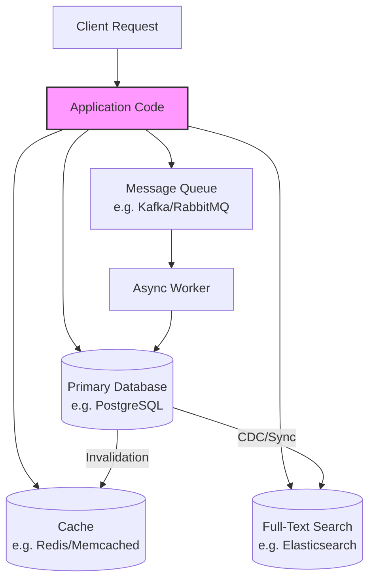
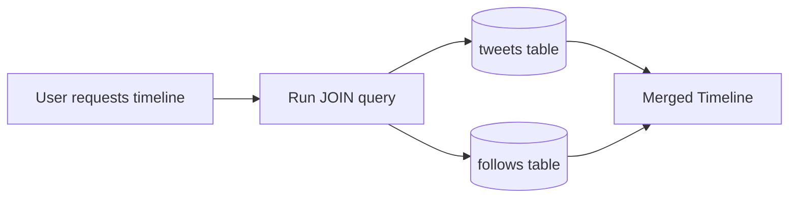
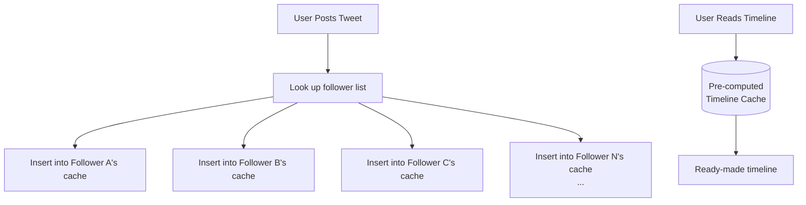
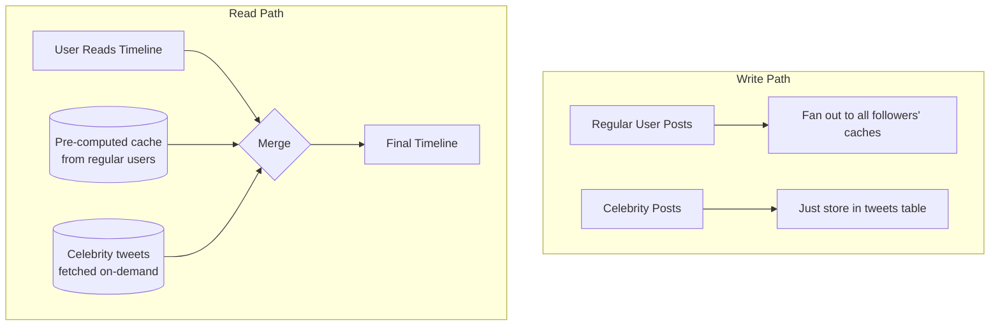
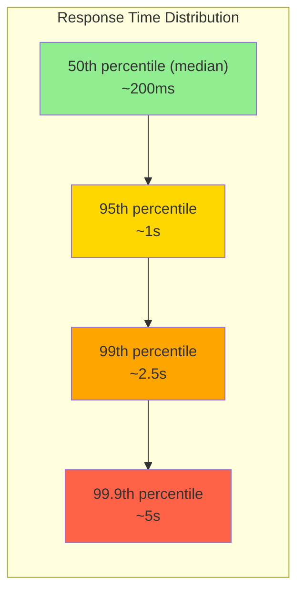

# Chapter 01: Reliability, Scalability & Maintainability

> **Part of Part I: Foundations of Data Systems**  
> *Designing Data-Intensive Applications* by Martin Kleppmann — Comprehensive Technical Reference

---

## Chapter Overview
Explores the fundamental triumvirate of data systems engineering: fault-tolerant reliability, load modeling (Twitter fan-out), percentile-based performance (p99/p999, SLO/SLA), and long-term maintainability.

---

### 1.1 Thinking About Data Systems

Modern applications are **data-intensive** (not compute-intensive). The bottleneck is usually data — amount, complexity, and speed of change.

Why do we lump databases, caches, and message queues together as "data systems"? Because the boundaries are blurring:

- **Redis** is a datastore used as a message queue
- **Apache Kafka** is a message queue with database-like durability guarantees
- **Elasticsearch** is a search engine that acts as a database

> [!IMPORTANT]
> Most applications today are **composite data systems** — they combine several tools to serve a single API. The application code stitches together caching, primary storage, full-text indexes, and more.



When you build such a composite system, **YOU** become the data system designer. Your API hides the internal complexity, but **you** must guarantee:
- Data is **correct** and **complete** (even under faults)
- Data is **performant** (even under load)
- The system is **maintainable** (even as team changes)

Three concerns matter most: **Reliability**, **Scalability**, **Maintainability**.

---

### 1.2 Reliability

> "Continuing to work correctly, even when things go wrong."

**Faults** are things that go wrong. **Failure** is when the system stops providing service. A **fault-tolerant** system anticipates faults and handles them.

> [!NOTE]
> We want to build **fault-tolerant** systems, not **fault-preventing** systems (impossible). The Netflix Chaos Monkey deliberately introduces faults to test resilience.

#### 1.2.1 Hardware Faults

| Component | Typical MTTF |
|-----------|-------------|
| Hard disk | 10–50 years |
| Server (complete failure) | ~2–5 years in large datacenter |
| Network switch | Varies, firmware bugs common |
| Power supply | UPS + diesel generator backup |

**Traditional approach**: Hardware redundancy — RAID for disks, dual power supplies, hot-swap CPUs, diesel generators.

**Modern approach**: Software fault-tolerance via multi-machine redundancy. Cloud platforms like AWS regularly have VM instances die — systems are designed to tolerate losing entire machines. A single-server failure should NOT bring down the service.

**Example**: If you have 10,000 disks with 10-year MTTF, you should expect one disk death per day on average. With RAID alone, you'd lose data eventually; with replication across machines, you survive disk and even machine failures.

#### 1.2.2 Software Faults

Software faults are **systematic** — they tend to be correlated and harder to anticipate:

| Fault Type | Real-World Example |
|-----------|-------------------|
| Bug triggered by unusual input | Linux kernel leap second bug (June 30, 2012) caused machines to hang |
| Runaway process consuming resources | A service consumes all CPU/memory, cascading to dependent services |
| Cascading failure | One slow service causes timeouts in callers, which causes their callers to time out |
| Dependency service returns corrupted data | Silent data corruption propagates through system |

**Mitigations**:
- Process isolation (one bad service doesn't kill others)
- Crash-and-restart philosophy (Erlang/OTP)
- Measure and monitor at every layer
- Thorough testing (including chaos engineering)

#### 1.2.3 Human Errors

> [!WARNING]
> **Configuration errors by operators are the leading cause of outages** — not hardware or software faults. Studies at major internet services show this.

**Mitigations**:
1. **Design APIs that make it hard to do the wrong thing** — good abstractions, sensible defaults
2. **Sandbox environments** — full non-production environments to test safely
3. **Test thoroughly** — unit, integration, end-to-end, manual
4. **Quick rollback** — fast roll back of config/code changes, gradual rollouts (canary deployments)
5. **Detailed monitoring** (telemetry) — performance metrics, error rates to detect problems early
6. **Good management practices and training**

---

### 1.3 Scalability

> "As the system grows (in data volume, traffic, or complexity), there should be reasonable ways of dealing with that growth."

Scalability is NOT a one-dimensional label ("X is scalable"). It means: **If the system grows in a specific way, what are our options for coping?**

#### 1.3.1 Describing Load

You must first describe the **current load** using **load parameters**:
- Requests per second to a web server
- Ratio of reads to writes in a database
- Hit rate on a cache
- Number of simultaneously active users in a chat room
- etc.

##### The Twitter Fan-Out Example (Full Detail)

Twitter (circa 2012) had two main operations:
1. **Post tweet**: User publishes a new tweet (avg **12,000 writes/sec**, peak **~12,000/sec**)
2. **Home timeline**: User views tweets from people they follow (**300,000 reads/sec**)

The challenge: each user follows many people, and each user is followed by many people.

**Approach 1: Fan-out on read (pull model)**

```sql
-- Query at read time: join tweets with follows
SELECT tweets.*, users.*
FROM tweets
JOIN follows ON follows.followee_id = tweets.sender_id
WHERE follows.follower_id = :current_user
ORDER BY tweets.timestamp DESC
LIMIT 100;
```



**Problem**: With 300,000 timeline reads/sec, this JOIN is extremely expensive. Each read scans many rows.

**Approach 2: Fan-out on write (push model)**

Maintain a **pre-computed timeline cache** for each user. When someone posts a tweet, the system looks up all their followers and inserts the tweet into each follower's timeline cache.



**Problem**: When a celebrity with **30+ million followers** posts a tweet, a single write triggers 30 million cache inserts! This is a massive write amplification.

**Approach 3: Hybrid (Twitter's actual solution)**

- For **regular users** (< ~X followers): use fan-out on write (pre-compute timelines)
- For **celebrities** (millions of followers): DON'T fan out. Instead, fetch their tweets at read time and merge with the pre-computed timeline.



> [!TIP]
> **Key insight**: The distribution of followers per user is the KEY load parameter. The fan-out approach works for most users but breaks down for the heavy tail. This is why you must understand your specific load characteristics.

#### 1.3.2 Describing Performance

Once you describe load, ask: **What happens when load increases?**
- Keep resources fixed → how does performance change?
- Keep performance fixed → how much resource do you need to add?

**Two key metrics:**
- **Throughput**: Number of records processed per second (batch systems)
- **Response time**: Time between client sending request and receiving response (online systems)

> [!IMPORTANT]
> **Latency ≠ Response Time**
> - **Response time** = network round trip + service time + queueing
> - **Latency** = the time a request is waiting, not being served
> - Response time includes latency

##### Percentiles — The Right Way to Measure

Don't use **averages** — they hide the distribution! Use **percentiles**:

| Percentile | Meaning | Typical Use |
|-----------|---------|-------------|
| **p50** (median) | Half of requests faster, half slower | "Typical" user experience |
| **p95** | 95% of requests faster than this | SLO target for most services |
| **p99** | 99% faster | Premium SLO target |
| **p999** (99.9th) | Only 1 in 1000 requests slower | Amazon-level; these are often your most valuable customers |



**Amazon found**: 100ms increase in response time → 1% decrease in sales. Even small latency matters for high-value users.

##### Tail Latency Amplification

In a microservices architecture, a single user request may fan out to **multiple backend services**. The overall response time = **slowest** backend call.

If each backend has a 1% chance of being slow (p99), and you make 5 parallel calls:
- P(all fast) = 0.99^5 = 95%
- P(at least one slow) = **5%** of requests hit the tail

With 100 parallel calls: P(at least one slow) = **63%!**

##### SLOs and SLAs

- **SLO (Service Level Objective)**: Internal target (e.g., "p99 < 200ms")
- **SLA (Service Level Agreement)**: Contract with customers (e.g., "99.9% uptime or refund")

#### 1.3.3 Approaches for Coping with Load

| Strategy | Description | When to Use |
|----------|-------------|-------------|
| **Scaling up (vertical)** | Bigger machine (more CPU, RAM, disk) | Simpler; works up to a point |
| **Scaling out (horizontal)** | More machines (shared-nothing) | Beyond single-machine limits |
| **Elastic scaling** | Automatically add machines when load increases | Unpredictable load patterns |
| **Manual scaling** | Human provisions new machines | Simpler, fewer surprises |

> [!TIP]
> **Pragmatic wisdom**: Keep things on a single node until you're forced to distribute. Distributed systems add enormous complexity. Scale up first, then out.

There's no "one-size-fits-all" scalable architecture. An architecture for 100K requests/sec (each 1KB) is very different from one for 3 requests/min (each 2GB).

---

### 1.4 Maintainability

Most of the cost of software is NOT initial development — it's **ongoing maintenance**: fixing bugs, keeping systems running, adapting to new requirements, paying tech debt.

Three design principles:

#### 1.4.1 Operability — Making Life Easy for Ops

A good operations team:
- Monitors system health, quickly restores service
- Tracks down causes of problems (degradations, failures)
- Keeps software and platforms up to date (security patches)
- Keeps tabs on how systems affect each other (capacity planning)
- Establishes good practices for deployment, config management
- Performs complex maintenance tasks (e.g., rolling upgrades)
- Maintains institutional knowledge as people come and go
- Preserves system security

**Good software helps ops by**: providing good monitoring/dashboards, supporting automation, avoiding dependency on individual machines, providing good documentation, giving predictable behavior, self-healing with manual override.

#### 1.4.2 Simplicity — Managing Complexity

**Accidental complexity** = complexity not inherent in the problem, but arising from the implementation (tangled state, tight coupling, inconsistent naming, hacks for performance).

**Essential complexity** = complexity inherent in the problem domain itself.

**The best tool for removing accidental complexity is ABSTRACTION.**

Examples of great abstractions:
- SQL hides the complexity of on-disk data structures, concurrent access, replication
- High-level programming languages hide machine code, CPU registers, syscalls
- TCP hides packet retransmission, flow control, reordering

#### 1.4.3 Evolvability — Making Change Easy

System requirements change constantly. Agile development gives a framework for adapting:
- TDD (test-driven development)
- Refactoring
- Small, frequent releases

At the data system level, **evolvability** is about making it easy to modify the system: change schemas, add new features, change data processing approaches — which Chapter 4 (Encoding and Evolution) addresses in detail.

---
