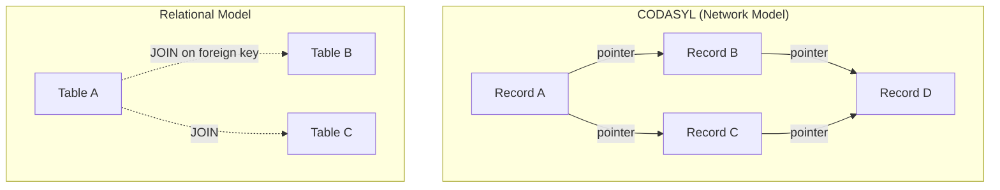
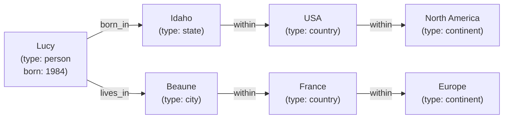
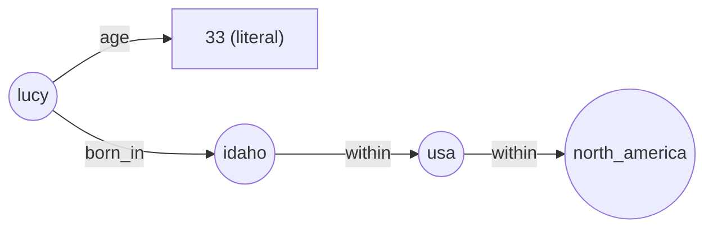

# Chapter 02: Data Models & Query Languages

> **Part of Part I: Foundations of Data Systems**  
> *Designing Data-Intensive Applications* by Martin Kleppmann — Comprehensive Technical Reference

---

## Chapter Overview
Deep architectural comparison of Relational, Document (NoSQL), Network (CODASYL), and Graph data models (Property Graphs, Cypher, Triple Stores, SPARQL, Datalog), alongside Declarative vs Imperative query paradigms.

---

### 2.1 Relational Model vs Document Model

#### The Birth of NoSQL

"NoSQL" emerged around 2009 driven by:
- Need for **greater scalability** (very large datasets, very high write throughput)
- **Frustration with restrictive relational schemas**
- **Specialized query operations** not well supported by SQL
- Desire for more **dynamic and expressive** data models

> [!NOTE]
> The term **Polyglot Persistence** describes using different datastores for different purposes within the same application — rather than forcing everything into a relational database.

#### Object-Relational Mismatch (Impedance Mismatch)

If you store data in relational tables but your application uses object-oriented code, there's a clumsy translation layer needed. ORMs (ActiveRecord, Hibernate) reduce but don't eliminate this.

##### The LinkedIn Résumé Example

A résumé has a one-to-many structure: one person has multiple jobs, multiple education entries, multiple contact info entries.

**Relational representation** (normalized):

```mermaid
erDiagram
    USERS {
        int user_id PK
        string first_name
        string last_name
        int region_id FK
        int industry_id FK
    }
    POSITIONS {
        int position_id PK
        int user_id FK
        string job_title
        string company
        date start_date
        date end_date
    }
    EDUCATION {
        int edu_id PK
        int user_id FK
        string school_name
        date start_date
        date end_date
    }
    CONTACT_INFO {
        int contact_id PK
        int user_id FK
        string type
        string value
    }
    REGIONS {
        int region_id PK
        string name
    }
    INDUSTRIES {
        int industry_id PK
        string name
    }

    USERS ||--o{ POSITIONS : has
    USERS ||--o{ EDUCATION : has
    USERS ||--o{ CONTACT_INFO : has
    USERS }o--|""| REGIONS : "lives in"
    USERS }o--|""| INDUSTRIES : "works in"
```

**Document representation** (JSON — much closer to how an app uses it):

```json
{
  "user_id": 251,
  "first_name": "Bill",
  "last_name": "Gates",
  "summary": "Co-chair of the Bill & Melinda Gates Foundation...",
  "region_id": "us:91",
  "industry_id": 131,
  "positions": [
    {
      "job_title": "Co-chair",
      "organization": "Bill & Melinda Gates Foundation"
    },
    {
      "job_title": "Co-founder, Chairman",
      "organization": "Microsoft"
    }
  ],
  "education": [
    {
      "school_name": "Harvard University",
      "start": 1973,
      "end": 1975
    }
  ],
  "contact_info": {
    "twitter": "@BillGates",
    "blog": "https://www.gatesnotes.com"
  }
}
```

The JSON representation has **better data locality** — one query retrieves the whole profile. The relational version requires multiple JOINs or multiple queries.

#### Many-to-One and Many-to-Many Relationships

**Why use IDs instead of free text?**

Instead of storing `region: "Greater Seattle Area"` as a string, store `region_id: 91` pointing to a `regions` table:

1. **Consistent style/spelling** — the name is defined in exactly one place
2. **Easy updates** — if the region name changes, update one row
3. **Localization** — can show different names in different languages
4. **Better search** — IDs let you link to a canonical concept

This is **normalization** — removing duplication. Normalization requires **many-to-one** relationships, which requires **joins**.

> [!WARNING]
> Document databases initially had poor join support. If your data has many-to-many relationships (e.g., an organization mentioned in many résumés), document databases require application-level joins — more complexity and slower than database-level joins.

#### Document Model Advantages

| Advantage | Explanation |
|-----------|-------------|
| Schema flexibility | No upfront schema declaration; schema-on-read |
| Data locality | Related data stored together; fewer disk seeks |
| Closer to application objects | JSON maps naturally to objects in code |
| Simpler for one-to-many | Tree structure natural for nested data |

#### Relational Model Advantages

| Advantage | Explanation |
|-----------|-------------|
| Joins | Efficient support for many-to-many, many-to-one |
| Normalization | Eliminates duplication |
| Query flexibility | SQL handles diverse ad-hoc queries well |
| Mature ecosystem | Decades of optimization, tooling, knowledge |

#### Convergence

- PostgreSQL, MySQL now support **JSON columns** with indexing and querying
- RethinkDB supported **relational-like joins** on documents
- MongoDB added **$lookup** for server-side joins

The gap between relational and document models is shrinking.

---

### 2.2 Are Document Databases Repeating History?

The debate isn't new. In the 1960s-70s, the same battle played out:

#### The Hierarchical Model (IMS)

IBM's Information Management System (IMS, 1968) used a **tree structure** — very similar to document databases today. It was great for one-to-many but terrible for many-to-many relationships.

#### The Network Model (CODASYL)

CODASYL was a generalization of hierarchical: records could have **multiple parents** (many-to-many). But navigation required following **access paths** — manual pointer chasing through the database. Changing the structure required rewriting access path code.



#### How the Relational Model Won

- **Declarative queries** (SQL) vs manual access paths (CODASYL)
- The **query optimizer** figures out the best execution plan — not the programmer
- Adding a new index doesn't require changing application code
- Much easier to add new queries for new features

---

### 2.3 Relational vs Document Databases Today

#### Schema-on-Read vs Schema-on-Write

| Approach | Schema-on-Write (Relational) | Schema-on-Read (Document) |
|----------|------------------------------|---------------------------|
| Analogy | Static typing | Dynamic typing |
| Schema enforcement | At write time (INSERT/UPDATE checked) | At read time (application code checks) |
| Schema change | `ALTER TABLE` — may lock table for minutes/hours on large tables | Just start writing new format; app handles both old and new |
| Best when | All records have same structure | Records have heterogeneous structure |

**Real example of ALTER TABLE pain:**

```sql
-- MySQL ALTER TABLE copies the entire table (for some operations)
-- On a table with millions of rows, this can take hours and lock writes!
ALTER TABLE users ADD COLUMN email_verified BOOLEAN DEFAULT FALSE;

-- Workaround: online migration with a staging table or pt-online-schema-change
```

Document approach: just start including `email_verified` in new documents. Handle its absence in reads:

```javascript
// Schema-on-read: handle missing field gracefully
let verified = doc.email_verified ?? false;
```

#### Data Locality

When you need the whole document (e.g., render a profile page), document storage has better **locality** — one seek retrieves everything vs multiple table reads and joins.

Relational databases have tried to match this:
- **Google Spanner**: Interleaved tables (parent-child co-located)
- **Oracle**: Multi-table index cluster tables
- **Bigtable/HBase**: Column family co-location

> [!TIP]
> Locality only helps if you need most of the document. If you only need a small part of a large document, the database still loads the whole thing — wasteful.

---

### 2.4 Query Languages for Data

#### Declarative vs Imperative

**Imperative** (CODASYL/IMS style): You tell the computer exactly HOW to find data — step by step.

```javascript
// Imperative: find all sharks in animals array
function getSharks() {
    var sharks = [];
    for (var i = 0; i < animals.length; i++) {
        if (animals[i].family === "Sharks") {
            sharks.push(animals[i]);
        }
    }
    return sharks;
}
```

**Declarative** (SQL): You tell the computer WHAT you want — it decides how.

```sql
SELECT * FROM animals WHERE family = 'Sharks';
```

**Why declarative wins:**
1. Query optimizer can choose the best execution plan
2. Adding an index transparently improves performance
3. Can parallelize across multiple cores/machines
4. Hides implementation details

**CSS as Analogy**: CSS is declarative (describe what you want), not imperative (don't specify how to paint pixels):

```css
/* Declarative — GOOD */
li.selected > p {
    background-color: blue;
}
```

```javascript
// Imperative equivalent — BAD (fragile, doesn't auto-update)
var liElements = document.getElementsByTagName("li");
for (var i = 0; i < liElements.length; i++) {
    if (liElements[i].className === "selected") {
        var children = liElements[i].childNodes;
        for (var j = 0; j < children.length; j++) {
            if (children[j].nodeType === Node.ELEMENT_NODE && children[j].tagName === "P") {
                children[j].setAttribute("style", "background-color: blue");
            }
        }
    }
}
```

#### MapReduce Querying

MapReduce is **neither declarative nor imperative** — it's somewhere in between. Used by MongoDB for aggregation.

**Example**: Count shark observations per month from a marine biology database.

```javascript
// MongoDB MapReduce
db.observations.mapReduce(
    function map() {
        // Called for each document matching the query
        var year = this.observationTimestamp.getFullYear();
        var month = this.observationTimestamp.getMonth() + 1;
        emit(year + "-" + month, this.numAnimals);
    },
    function reduce(key, values) {
        // Called for each unique key with all its values
        return Array.sum(values);
    },
    {
        query: { family: "Sharks" },
        out: "monthlySharkReport"
    }
);
```

**Aggregation Pipeline** (MongoDB's newer, more declarative approach):

```javascript
db.observations.aggregate([
    { $match: { family: "Sharks" } },
    { $group: {
        _id: {
            year: { $year: "$observationTimestamp" },
            month: { $month: "$observationTimestamp" }
        },
        totalAnimals: { $sum: "$numAnimals" }
    }}
]);
```

---

### 2.5 Graph-Like Data Models

When **many-to-many relationships** are the dominant pattern, graph models shine.

#### Property Graphs

Each vertex has:
- A unique identifier
- A set of outgoing edges
- A set of incoming edges
- A collection of properties (key-value pairs)

Each edge has:
- A unique identifier
- The tail vertex (start)
- The head vertex (end)
- A label (type of relationship)
- A collection of properties



SQL tables for property graph:

```sql
CREATE TABLE vertices (
    vertex_id  INTEGER PRIMARY KEY,
    properties JSON
);

CREATE TABLE edges (
    edge_id    INTEGER PRIMARY KEY,
    tail_vertex INTEGER REFERENCES vertices(vertex_id),
    head_vertex INTEGER REFERENCES vertices(vertex_id),
    label      TEXT,
    properties JSON
);
```

#### Cypher Query Language

Find all people who emigrated from the US to Europe:

```cypher
MATCH
    (person) -[:BORN_IN]->  () -[:WITHIN*0..]-> (us:Location {name: 'United States'}),
    (person) -[:LIVES_IN]-> () -[:WITHIN*0..]-> (eu:Location {name: 'Europe'})
RETURN person.name
```

The `WITHIN*0..` means "follow a chain of WITHIN edges, zero or more times" — handling the recursive structure (city → state → country → continent).

#### Graph Queries in SQL

Possible with **recursive CTEs** but extremely verbose:

```sql
WITH RECURSIVE
    in_usa(vertex_id) AS (
        SELECT vertex_id FROM vertices WHERE properties->>'name' = 'United States'
        UNION
        SELECT edges.tail_vertex FROM edges JOIN in_usa ON edges.head_vertex = in_usa.vertex_id
        WHERE edges.label = 'within'
    ),
    in_europe(vertex_id) AS (
        SELECT vertex_id FROM vertices WHERE properties->>'name' = 'Europe'
        UNION
        SELECT edges.tail_vertex FROM edges JOIN in_europe ON edges.head_vertex = in_europe.vertex_id
        WHERE edges.label = 'within'
    )
SELECT vertices.properties->>'name'
FROM vertices
JOIN edges AS born_in ON vertices.vertex_id = born_in.tail_vertex
JOIN edges AS lives_in ON vertices.vertex_id = lives_in.tail_vertex
WHERE born_in.label = 'born_in' AND born_in.head_vertex IN (SELECT vertex_id FROM in_usa)
  AND lives_in.label = 'lives_in' AND lives_in.head_vertex IN (SELECT vertex_id FROM in_europe);
```

#### Triple Stores and SPARQL

In a triple store, all data is stored as **(subject, predicate, object)** triples:

```
(lucy, born_in, idaho)
(idaho, within, usa)
(usa, within, north_america)
(lucy, age, 33)
```



**RDF** is a standard for triple stores. **SPARQL** is the query language for RDF:

```sparql
SELECT ?personName WHERE {
    ?person :bornIn / :within* ?location .
    ?location :name "United States" .
    ?person :livesIn / :within* ?euLocation .
    ?euLocation :name "Europe" .
    ?person :name ?personName .
}
```

#### Datalog

Datalog is the oldest of these languages, defining data as **predicate(subject, object)** facts:

```prolog
% Facts
born_in(lucy, idaho).
within(idaho, usa).
within(usa, north_america).

% Rule (recursive)
lives_in_region(Person, Region) :- lives_in(Person, Region).
lives_in_region(Person, Region) :- lives_in(Person, Place), within(Place, Region).
```

Datalog uses **bottom-up evaluation**: repeatedly apply rules until no new facts are derived.

---
