# Chapter 03: Storage & Retrieval - Engines, Indexes & Compaction

> **Part of Part I: Foundations of Data Systems**  
> *Designing Data-Intensive Applications* by Martin Kleppmann — Comprehensive Technical Reference

---

## Chapter Overview
Internal mechanics of database storage: Hash indexes (Bitcask), SSTables, B-Trees vs LSM-Trees, Column-oriented analytical engines (OLAP, Bitmap compression, Vectorized SIMD), and an exhaustive Deep Dive into production LSM-trees (RocksDB, Cassandra).

---

> "A database needs to do two things: store data when you give it, and give data back when you ask for it."

### 3.1 Data Structures That Power Your Database

#### The World's Simplest Database

```bash
#!/bin/bash
db_set() { echo "$1,$2" >> database; }
db_get() { grep "^$1," database | sed "s/^$1,//" | tail -n 1; }
```

- **Write**: O(1) — just append to file
- **Read**: O(n) — must scan entire file to find key

Every real database faces this tradeoff: **writing is cheap (append), reading requires an index to be fast**.

> [!IMPORTANT]
> An index is an **additional structure** derived from the primary data. It speeds up reads but slows down writes (every write must also update the index). This is a fundamental tradeoff in storage systems.

#### Hash Indexes (Bitcask)

The simplest indexing strategy: keep an **in-memory hash map** where every key maps to a **byte offset** in the data file.

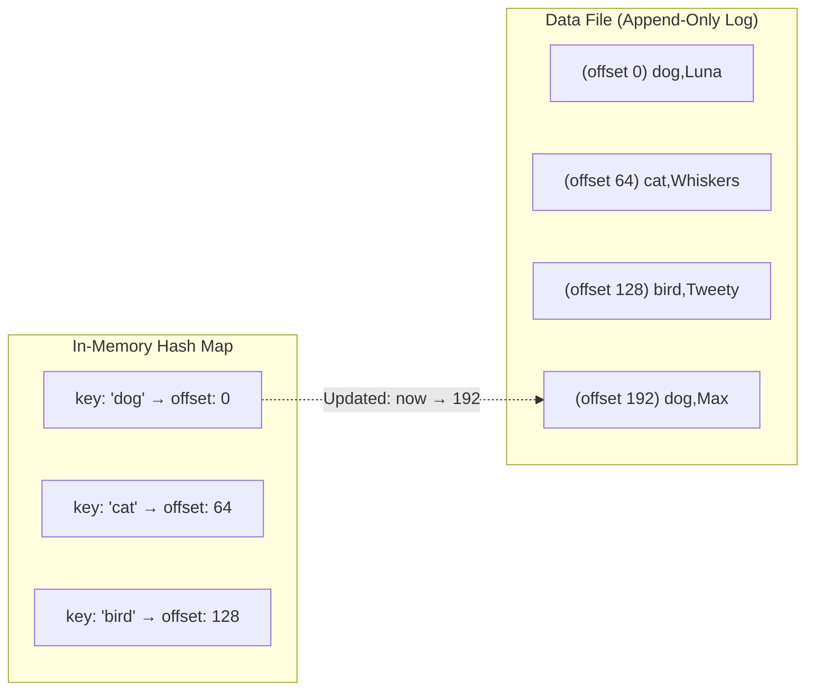

**Compaction and Segment Merging**: The log grows forever, so periodically:
1. Close the current segment, start a new one
2. **Compact** old segments: discard old values for overwritten keys
3. **Merge** multiple compacted segments into one

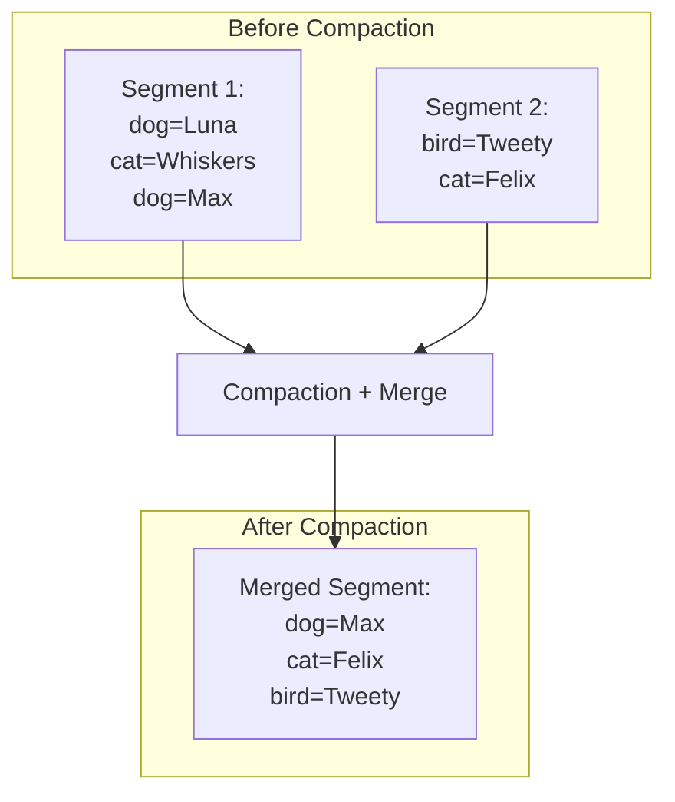

**Why append-only is brilliant:**
- **Sequential writes** are much faster than random writes (especially on HDD, even SSD benefits)
- **Crash recovery** is simpler — if crash during append, just truncate the partial record
- **Concurrency**: one writer thread, many reader threads — no need for complex locking
- **Segment merging** prevents fragmentation

**Crash recovery optimization**: Instead of rebuilding the hash map by reading the entire file on restart, **save a snapshot of the hash map to disk** periodically and load that on startup.

**Limitations:**
- Hash table must **fit in memory** — if you have billions of keys, you run out of RAM
- **Range queries** are inefficient — you can't scan all keys between "kitty00000" and "kitty99999" without looking up each one

---

### 3.2 SSTables and LSM-Trees

#### Sorted String Tables (SSTables)

Same as hash index segments, but with one key change: **keys are sorted within each segment**.

**Advantages over hash-indexed segments:**

1. **Merging is efficient**: Like mergesort — read multiple segments in parallel, output sorted result, keep newest value for duplicate keys

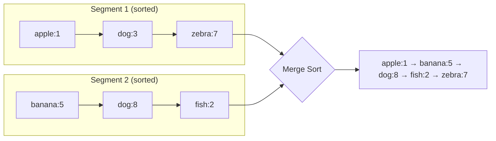

2. **Sparse index**: You don't need every key in memory. If you know "handbag" is at offset 1000 and "handsome" is at offset 2000, you know "handler" is somewhere between — just scan that small range.

3. **Block compression**: Group records into blocks before writing to disk — saves space and reduces I/O.

#### Constructing SSTables from Memtables

How do you get data sorted on disk if writes arrive in random order? Use an **in-memory balanced tree** (red-black tree or AVL tree) called a **memtable**.

**The LSM-Tree Write Path:**

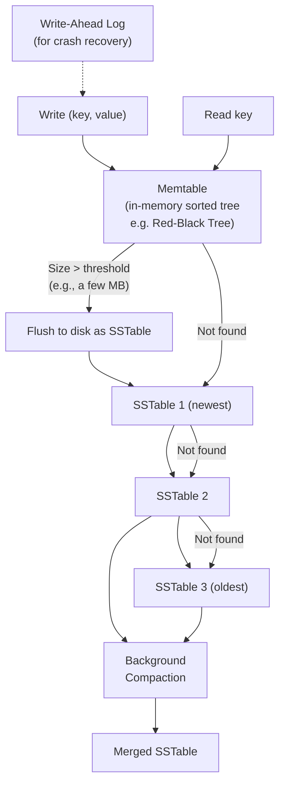

**Step-by-step:**
1. Write arrives → add to **memtable** (in-memory sorted tree) + append to **WAL** (for crash recovery)
2. When memtable exceeds threshold (~few MB) → freeze it, create new memtable for new writes
3. **Flush** frozen memtable to disk as a sorted SSTable
4. On **read**: check memtable first → then SSTables newest-to-oldest
5. **Background compaction**: periodically merge and compact SSTables

#### Performance Optimizations

**Bloom Filters**: When reading a key that doesn't exist, you waste time checking all SSTables. A Bloom filter is a memory-efficient probabilistic data structure that can tell you "definitely not here" or "maybe here" — avoiding unnecessary disk reads.

**Compaction Strategies:**

| Strategy | How it Works | Pros | Cons | Used By |
|----------|-------------|------|------|---------|
| **Size-tiered** | Newer, smaller SSTables are successively merged into older, larger ones | Higher write throughput | Temporary space usage during compaction, can have many unmerged segments | HBase, Cassandra (default) |
| **Leveled** | Key range split into smaller SSTables organized into levels; each level is 10x larger | Better read performance, less space amplification | Higher write amplification | LevelDB, RocksDB, Cassandra (option) |

**Real systems using LSM-Trees:**
- **LevelDB** (Google) → embedded database
- **RocksDB** (Facebook) → fork of LevelDB, widely used as embedded engine
- **Cassandra** → distributed NoSQL using LSM-Trees
- **HBase** → Hadoop-based, LSM-Trees
- **Lucene** → full-text search (term dictionary is SSTable-like)

---

### 3.3 B-Trees

The most widely used index structure in databases. Used by nearly all relational databases and many non-relational ones.

**Structure:**
- Data organized in **fixed-size pages/blocks** (traditionally **4KB**, matching disk page size)
- Each page contains keys and references (pointers) to child pages
- **Branching factor**: number of children per page (typically **~500**)
- **Leaf pages** contain values (or pointers to values)

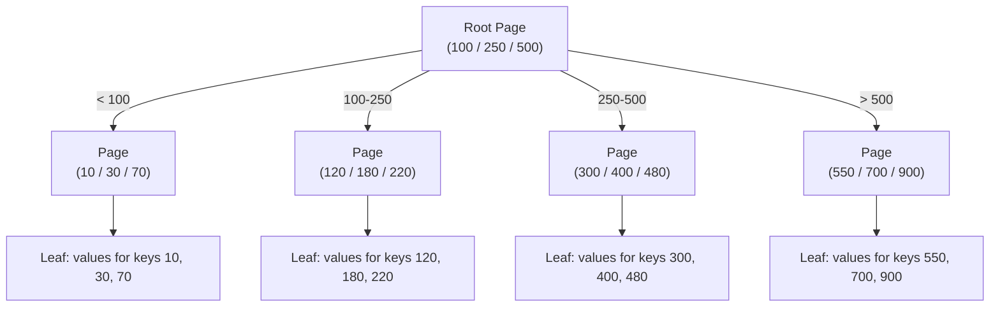

**Capacity calculation:**
- Branching factor = 500
- 4 levels deep → 500^4 = **256 TB** of data addressable!
- With a branching factor of 500, a 4-level tree covers most databases

**Lookup algorithm:**
1. Start at root page
2. Binary search within page to find which child pointer to follow
3. Descend to next page
4. Repeat until leaf page found

**Update algorithm:**
1. Find the leaf page containing the key
2. Overwrite the value in-place
3. If page is full and needs to split → split page, update parent pointer

#### Making B-Trees Reliable

**Write-Ahead Log (WAL / Redo Log):**
When modifying a B-tree page, write the modification to an append-only WAL **first**, then modify the actual page. On crash, replay the WAL to restore consistent state.

**Latches (lightweight locks):**
For concurrent access, use latches on individual pages. Reader threads acquire shared latches; writer threads acquire exclusive latches.

#### B-Tree Optimizations

| Optimization | Description |
|-------------|-------------|
| **Copy-on-write** | Instead of overwriting pages + WAL, write modified pages to new location (LMDB, Boltdb). Good for snapshots. |
| **Abbreviated keys** | Store only enough of the key to determine boundaries, not the full key → higher branching factor |
| **Sequential leaf layout** | Lay out leaf pages in sequential order on disk for range scan performance |
| **Sibling pointers** | Each leaf page has pointer to its left/right neighbor → efficient range scans without going back to parent |
| **Fractal trees** | Borrow log-structured ideas — buffer writes at each level |

---

### 3.4 Comparing B-Trees and LSM-Trees

| Criterion | B-Trees | LSM-Trees |
|-----------|---------|-----------|
| **Write performance** | Slower (random I/O, write page + WAL) | Faster (sequential writes, no random I/O) |
| **Read performance** | Faster (one path through tree) | Slower (check memtable + multiple SSTables) |
| **Write amplification** | Moderate (page write + WAL = 2x) | Can be high (compaction rewrites data multiple times) |
| **Space usage** | Pages partially empty (fragmentation) | More compact with leveled compaction |
| **Predictable latency** | More predictable | Compaction can cause latency spikes at p99 |
| **Concurrency** | Fine-grained latches | Compaction may compete for disk bandwidth |

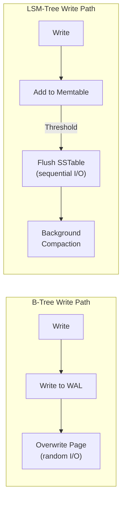

> [!WARNING]
> **LSM-Tree compaction can interfere with performance**: At high write throughput, compaction may not keep up, causing the number of SSTables to grow, which slows reads. At the extreme, disk bandwidth is shared between incoming writes and compaction, creating a "compaction death spiral."

---

### 3.5 Other Indexing Structures

#### Storing Values Within the Index

- **Heap file**: Index stores pointer to row in a separate file → requires an extra hop
- **Clustered index**: Stores the actual row data within the index (e.g., MySQL InnoDB primary key). No extra hop.
- **Covering index** (index with included columns): Stores a few extra columns in the index to "cover" common queries without going to the heap file

#### Multi-Column Indexes

**Concatenated index**: Multiple keys combined into one, sorted first by first column, then by second. Like a phone directory (last name, first name).

```sql
-- Good for: WHERE last_name = 'Smith' AND first_name = 'John'
-- Good for: WHERE last_name = 'Smith' (just first column)
-- Bad for: WHERE first_name = 'John' (skips first column)
CREATE INDEX idx ON people (last_name, first_name);
```

**R-trees**: For geospatial queries (latitude + longitude). Used by PostGIS.

```sql
-- Find all restaurants within a bounding box
SELECT * FROM restaurants
WHERE location && ST_MakeEnvelope(lng1, lat1, lng2, lat2);
-- Uses R-tree index for efficient 2D search
```

#### Full-Text Search and Fuzzy Indexes

Lucene uses an SSTable-like structure for its **term dictionary**. But for fuzzy search (misspellings), it uses a **finite state automaton** (Levenshtein automaton) that can efficiently find all words within an **edit distance** of the search term.

#### In-Memory Databases

| Database | Type | Notes |
|----------|------|-------|
| Memcached | Cache only | Lost on restart |
| Redis | Data structure store | Optional disk persistence (RDB/AOF) |
| VoltDB | Relational, ACID | In-memory, serialized single-thread execution |
| MemSQL | Relational | In-memory with disk backup |
| RAMCloud | Key-value | Durability via replicated in-memory storage |

> [!NOTE]
> In-memory databases are faster NOT primarily because they avoid disk reads (the OS page cache already handles that). They're faster because they avoid the **overhead of encoding data in a disk-oriented format**. They can use data structures that are more efficient in memory (trees, hash tables, queues) without worrying about how to serialize them to disk.

**Anti-caching**: Some in-memory databases (like MemSQL, VoltDB) can evict least-recently-used data to disk when running out of memory, then load it back when accessed — like a virtual memory system managed by the database.

---

### 3.6 Transaction Processing vs Analytics (OLTP vs OLAP)

| Property | OLTP | OLAP |
|----------|------|------|
| **Read pattern** | Small number of records per query, fetched by key | Aggregate over large number of records |
| **Write pattern** | Random-access, low-latency, user input | Bulk import (ETL) or event stream |
| **Primary users** | End user via web application | Internal analyst for decision support |
| **Data represents** | Latest state of data (current point in time) | History of events over time |
| **Dataset size** | GB to TB | TB to PB |
| **Bottleneck** | Disk seek time (random I/O) | Disk bandwidth (sequential scan) |

#### Data Warehousing

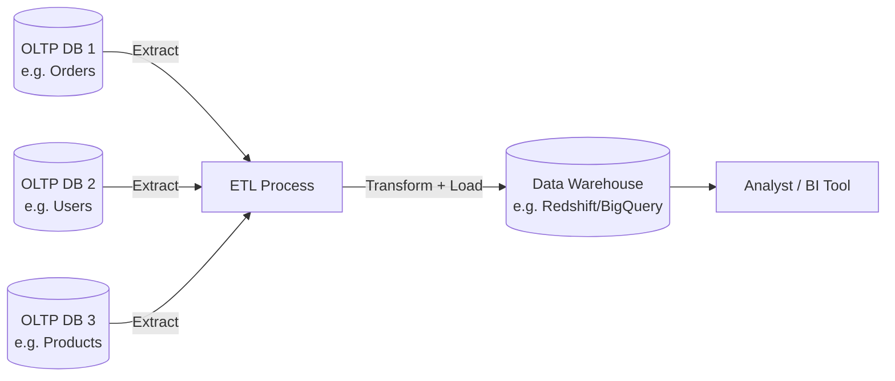

**Examples of data warehouse products**: Teradata, Vertica, SAP HANA, Amazon Redshift, Google BigQuery, Apache Hive, Spark SQL, Apache Presto/Trino, Apache Drill

#### Stars and Snowflakes: Schemas for Analytics

**Star Schema**: Central **fact table** surrounded by **dimension tables**.

```mermaid
erDiagram
    fact_sales {
        int sale_id PK
        date date_key FK
        int product_key FK
        int store_key FK
        int customer_key FK
        int quantity
        decimal total_price
    }
    dim_date {
        int date_key PK
        date full_date
        int year
        int quarter
        int month
        string day_of_week
        boolean is_holiday
    }
    dim_product {
        int product_key PK
        string name
        string category
        string brand
        string manufacturer
    }
    dim_store {
        int store_key PK
        string name
        string city
        string state
        string country
    }
    dim_customer {
        int customer_key PK
        string name
        string segment
        string city
    }

    fact_sales }o--|""| dim_date : "date"
    fact_sales }o--|""| dim_product : "product"
    fact_sales }o--|""| dim_store : "store"
    fact_sales }o--|""| dim_customer : "customer"
```

**Snowflake Schema**: Like star, but dimension tables are further normalized (e.g., `dim_product` has a foreign key to `dim_brand`). More normalized = more joins = slower queries, so star is preferred for analytics.

> [!TIP]
> Fact tables can be ENORMOUS — petabytes with trillions of rows. Dimension tables are much smaller (millions of rows). This is why column-oriented storage was invented.

---

### 3.7 Column-Oriented Storage

**Problem with row storage for analytics**: A typical analytic query only uses 4-5 columns out of 100+, but row storage reads ALL columns from disk.

```sql
-- This query only needs date, product_key, and total_price
-- But row storage reads ALL 100+ columns of every matching row
SELECT dim_date.year, dim_product.category, SUM(total_price)
FROM fact_sales
JOIN dim_date ON fact_sales.date_key = dim_date.date_key
JOIN dim_product ON fact_sales.product_key = dim_product.product_key
WHERE dim_date.year = 2023
GROUP BY dim_date.year, dim_product.category;
```

**Column-oriented storage**: Store all values of each column together.

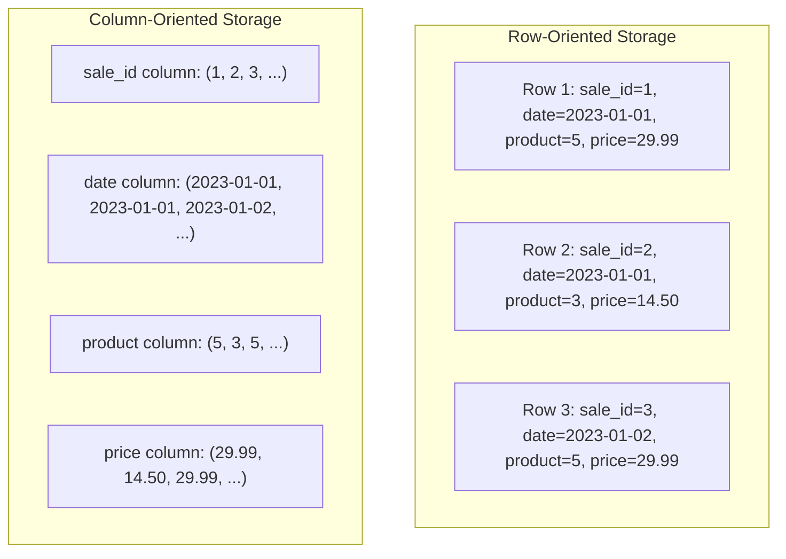

#### Column Compression

**Bitmap encoding**: For columns with few distinct values (e.g., `product_key` has ~100,000 products but billions of rows), create a bitmap for each distinct value.

```
product_key column values: [69, 69, 30, 69, 68, 65, ...]

product_key = 69: [1, 1, 0, 1, 0, 0, ...]   ← bitmap
product_key = 30: [0, 0, 1, 0, 0, 0, ...]
product_key = 68: [0, 0, 0, 0, 1, 0, ...]

WHERE product_key IN (30, 68):
  → OR the bitmaps: [0, 0, 1, 0, 1, 0, ...]
```

Further compress with **run-length encoding**: `[1,1,0,1,0,0]` → `2 ones, 1 zero, 1 one, 2 zeros`.

#### Memory Bandwidth and Vectorized Processing

Column storage enables:
- **CPU L1 cache efficiency**: Process a column of values in tight loop → fits in cache
- **SIMD (Single Instruction, Multiple Data)**: Process 128/256 bits of column data in one CPU instruction
- **Vectorized processing**: Operate on batches of column values rather than row-by-row

#### Sort Order in Column Storage

Choose **sort keys** based on common queries:
- Sort by `date` then `product_key` → queries filtering by date are fast
- Sorting also improves compression: sorted columns have long runs of repeated values → better run-length encoding

**Multiple sort orders**: Vertica stores the same data sorted in multiple ways (like multiple indexes). Redundant storage, but enables different query patterns.

#### Writing to Column Storage

Column storage makes writes harder — you can't just append to one column. Solution: use **LSM-trees**: write to an in-memory row-oriented buffer (memtable), then flush to column-oriented files on disk, and merge via compaction.

#### Data Cubes and Materialized Views

A **materialized view** pre-computes and stores query results. A **data cube** (OLAP cube) is a grid of aggregates across 2+ dimensions:

```
         Product A  Product B  Product C  Total
Jan 2023    1000      500        750       2250
Feb 2023    1200      600        800       2600
Mar 2023     900      550        700       2150
Total       3100     1650       2250       7000
```

> [!WARNING]
> Data cubes make certain queries very fast (just look up the pre-computed value), but they are **inflexible** — they can only answer queries that were anticipated when the cube was defined. Most data warehouses keep raw data and use cubes as a performance optimization for common queries.

---

---

## 3.8 Deep Dive: Log-Structured Merge-Trees (LSM-Trees) in Production

While Martin Kleppmann introduces the foundational concepts of SSTables and LSM-trees in Chapter 3, modern production engines (such as **RocksDB**, **LevelDB**, **Apache Cassandra**, **ScyllaDB**, and **ClickHouse MergeTree**) rely on advanced engineering mechanics to balance read, write, and space amplification. This section provides an exhaustive, production-grade examination of LSM storage engines.

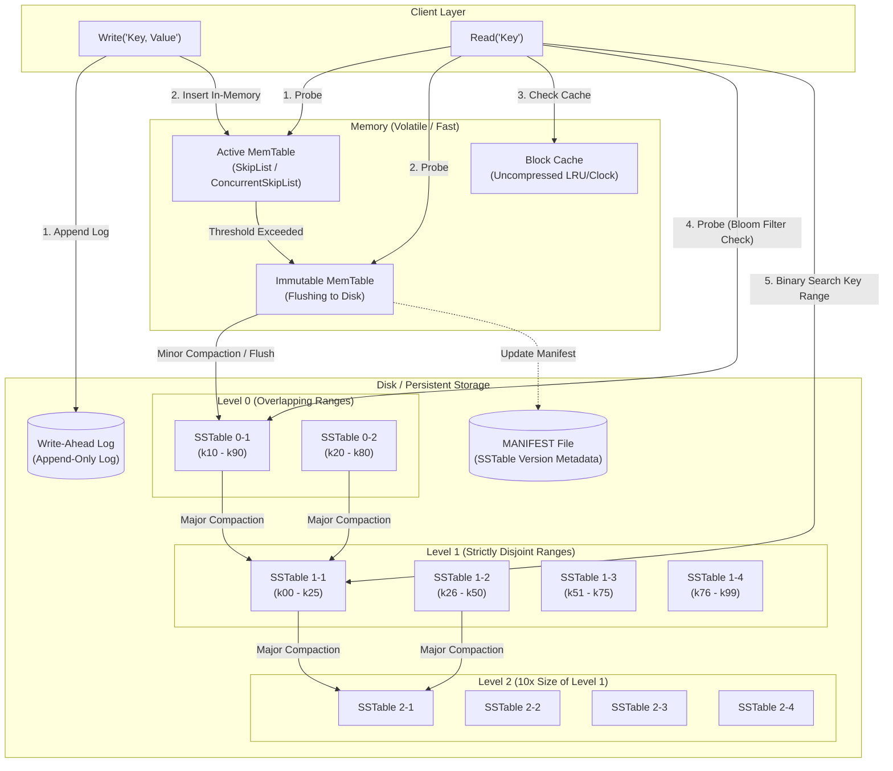

---

### 3.8.1 The Storage Bottleneck: Sequential vs. Random I/O

The core architectural justification for LSM-trees over traditional in-place B-Trees is the physical asymmetry between **sequential** and **random disk I/O**:

| Storage Medium | Sequential Throughput | Random I/O (IOPS / Latency) | Random Penalty Factor |
| :--- | :--- | :--- | :--- |
| **Rotational HDD** | ~150 – 250 MB/s | ~75 – 150 IOPS (~10 ms seek) | **~10,000x** slower than sequential |
| **SATA SSD** | ~500 – 550 MB/s | ~50,000 – 90,000 IOPS (~50-100 µs) | **~50x – 100x** slower than sequential |
| **NVMe Gen4 SSD** | ~5,000 – 7,500 MB/s | ~500,000 – 1,000,000 IOPS (~10-20 µs)| **~10x – 20x** slower + Flash Wear |

In flash memory (SSDs), random in-place updates trigger **Flash Translation Layer (FTL)** garbage collection. When a 4KB B-Tree page is modified in place, the SSD must copy an entire **Erase Block** (typically 2MB to 8MB), erase the flash block, and rewrite it. This causes severe **hardware write amplification** and wears out flash drive P/E (Program/Erase) cycles.

LSM-trees completely eliminate random writes on the write path by converting all mutations (inserts, updates, and deletes) into **sequential append operations**.

---

### 3.8.2 MemTable Internals & Memory Architecture

The **MemTable** is an in-memory, write-buffered index that keeps written keys sorted in lexicographical order.

#### Why SkipLists Dominate in Production (LevelDB, RocksDB)
While standard balanced binary search trees (Red-Black trees, AVL trees) provide $O(\log n)$ search and insertion, they perform poorly under highly concurrent multi-threaded workloads:
1. **Rebalancing Overhead**: Rebalancing a Red-Black tree requires tree rotations that modify pointers across multiple tree levels, requiring broad coarse-grained locks or complex lock coupling.
2. **SkipList Lock-Free Concurrency**: SkipLists use probabilistic balancing with linked lists at multiple heights. Inserting a new node requires only local pointer updates (CAS - Compare-And-Swap) at each level without structural tree rotations. This allows lock-free or read-lock-free concurrent reads and writes.
3. **Cache Friendliness with Arena Allocators**: Production LSM engines allocate nodes in pre-allocated memory arenas (`ArenaAllocator`). This prevents heap fragmentation and keeps SkipList nodes close together in virtual memory to maximize CPU L2/L3 cache line hits.

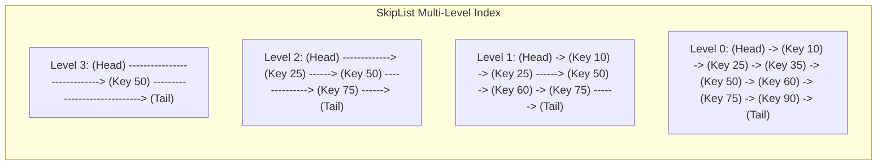

#### MemTable Flush Protocol
1. When the active MemTable reaches `write_buffer_size` (typically 64MB – 256MB), it is converted to a read-only **Immutable MemTable** (`immem`).
2. A new active MemTable and a new WAL file are opened immediately to avoid stalling client writes.
3. A background **Flush Thread** serializes the `immem` to disk as a sorted **Level 0 SSTable**.
4. Once written and `fsync`ed to disk:
   - The version set and **MANIFEST** file are updated atomically with the new SSTable metadata.
   - The old WAL associated with the flushed MemTable is safely unlinked/deleted.
   - The memory occupied by the `immem` is reclaimed by the arena allocator.

---

### 3.8.3 The Write-Ahead Log (WAL) & Durability Semantics

Because the MemTable resides in volatile RAM, unexpected power loss or process crashes would destroy unflushed writes. Durability is maintained by appending every mutation to the **Write-Ahead Log (WAL)** before updating the MemTable.

#### WAL Physical Record Format
A WAL file is broken down into contiguous **32KB blocks** to align with disk page boundaries. Records do not span across non-contiguous fragments arbitrarily; they use structured framing:

```
+----------------+----------------+----------------+--------------------+
|  CRC32 (4B)    |  Length (2B)   | Record Type(1B)|  Payload (VarLen)  |
+----------------+----------------+----------------+--------------------+
```

- **CRC32**: Checksum over payload and record type to detect bit rot or partial torn writes.
- **Length**: Size of payload (up to 32,767 bytes).
- **Record Type**:
  - `0x01 (FULL)`: The record fits entirely inside the current 32KB block.
  - `0x02 (FIRST)`: The first fragment of a record spanning multiple 32KB blocks.
  - `0x03 (MIDDLE)`: An intermediate fragment of a multi-block record.
  - `0x04 (LAST)`: The terminating fragment of a multi-block record.

#### Group Commit & fsync Latency
Calling `fsync()` on every single write drops throughput to a few hundred operations per second (limited by storage rotational/flash sync latency). Production engines use **Group Commit**:
- Multiple concurrent client threads append their writes into an in-memory queue.
- One thread becomes the **Leader**, while the others wait as **Followers**.
- The Leader batches all queued writes, executes a single sequential write to the WAL, issues a single `fsync()`, and wakes up the follower threads.
- This amortizes the $O(1)$ disk sync cost across dozens or hundreds of client requests.

---

### 3.8.4 SSTable Physical Format: Deep Dive

An SSTable (Sorted String Table) is an immutable, sequentially written file consisting of sorted key-value pairs broken into blocks.

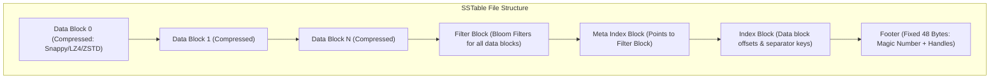

#### Detailed Anatomy of an SSTable
1. **Data Blocks (typically 4KB – 64KB)**:
   - Contains sorted sequence of key-value pairs.
   - **Delta Encoding / Prefix Compression**: Because keys are sorted, consecutive keys often share common prefixes (e.g., `user:1001:email`, `user:1001:name`). Keys store:
     - Shared key prefix length (Varint)
     - Unshared key suffix length (Varint)
     - Value length (Varint)
     - Key delta bytes + Value bytes
   - **Restart Points**: Every $K$ keys (e.g., $K=16$), prefix compression is reset to a full uncompressed key. The end of the block contains an array of 32-bit offsets to these restart points. Binary search within a data block evaluates restart points first, avoiding sequential decompression of the entire block!

2. **Index Block**:
   - Contains one entry per data block.
   - Stores a **Separator Key** (a key lexicographically $\ge$ the last key of block $i$ and $<$ the first key of block $i+1$) and a **Block Handle** (offset and size on disk).

3. **Filter Block (Bloom Filter)**:
   - Contains serialized bit vectors used to probe key membership without touching the data blocks.

4. **Footer (Fixed 48 Bytes)**:
   - Stored at the very end of the file.
   - Contains:
     - Block Handle pointing to the **Index Block** (Offset + Size).
     - Block Handle pointing to the **Meta Index Block** (Offset + Size).
     - Fixed **Magic Number** (`0xdb4775248b80fb57` in LevelDB/RocksDB) for corruption detection.
   - When an engine opens an SSTable, it reads the last 48 bytes first, locates the Index and Filter blocks, loads them into memory, and is immediately ready to route lookups.

---

### 3.8.5 Bloom Filter Mathematics & Sizing

A **Bloom Filter** is a space-efficient probabilistic data structure that tests whether an element is a member of a set.
- **False Negative**: Impossible ($0\%$). If the filter says the key does not exist, it **definitely** does not exist.
- **False Positive**: Possible ($p > 0$). If the filter says the key exists, it **might** exist, or it might be a collision.

#### The Mathematical Foundation
Given:
- $n$ = number of keys inserted into the SSTable.
- $m$ = size of the bit array in bits.
- $k$ = number of independent hash functions.

The probability $p$ of a false positive after inserting $n$ keys is:
$$p pprox \left(1 - e^{-kn/m}
ight)^k$$

To minimize the false positive rate for a given ratio of bits per key ($rac{m}{n}$), the optimal number of hash functions $k$ is:
$$k = rac{m}{n} \ln 2 pprox 0.693 \cdot rac{m}{n}$$

Substituting optimal $k$ back into the formula gives:
$$p = 2^{-k} pprox (0.6185)^{m/n}$$

Solving for required bits per key given a target error rate $p$:
$$rac{m}{n} = -rac{\ln p}{(\ln 2)^2} pprox -2.08 \cdot \log_2(p)$$

#### Engineering Tradeoff Table
| Target False Positive Rate ($p$) | Required Bits per Key ($m/n$) | Optimal Hashes ($k$) | Memory for 1 Billion Keys |
| :--- | :--- | :--- | :--- |
| **$10\%$** | ~4.8 bits | 3 | ~572 MB |
| **$1\%$ (Production Default)** | **~9.6 bits (~10 bits)** | **7** | **~1.14 GB** |
| **$0.1\%$** | ~14.4 bits | 10 | ~1.71 GB |
| **$0.01\%$** | ~19.2 bits | 14 | ~2.28 GB |

#### Double-Hashing Optimization (Kirsch-Mitzenmacher Technique)
Computing $k$ independent cryptographic hashes per key is CPU-intensive. Production LSM engines use two 64-bit hash values ($h_1(x)$ and $h_2(x)$, often produced by a single MurmurHash3 or XXHash run) to simulate $k$ hash functions:
$$g_i(x) = h_1(x) + i \cdot h_2(x) \pmod m \quad 	ext{for } 0 \le i < k$$
This achieves identical asymptotic randomness with near-zero CPU overhead.

---

### 3.8.6 Compaction Strategies: Algorithmic Comparison

Because SSTables are immutable, updates and deletes accumulate across files. **Compaction** is the background reconciliation process that reads multiple SSTables, performs a merge-sort, discards obsolete versions and tombstones, and writes new, consolidated SSTables.

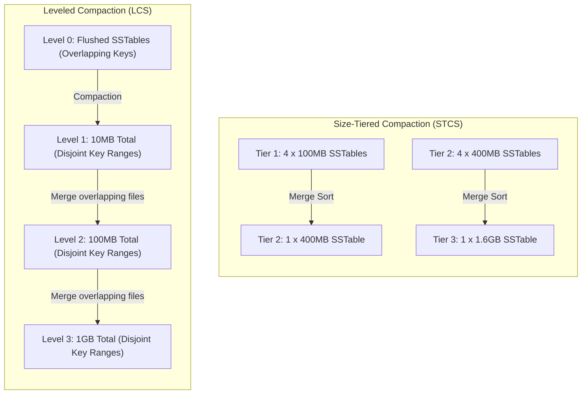

#### 1. Size-Tiered Compaction Strategy (STCS)
- **Mechanism**: Triggered when a set number of SSTables of approximately the same size (e.g., 4 tables of ~100MB) accumulate in a tier. They are merged into a single larger table (~400MB).
- **Pros**: Low write amplification during initial ingest; simple background scheduling.
- **Cons**:
  - **Massive Space Amplification**: During the compaction of the largest tier, the engine must simultaneously store the old SSTables and write the new merged SSTable. This requires up to **$50\%$ free disk space headroom**! If a disk is at $60\%$ capacity, a large compaction will run out of disk and crash the node.
  - **High Read Amplification**: A key could reside in any of the tiers. Point lookups must check SSTables across every tier.

#### 2. Leveled Compaction Strategy (LCS)
- **Mechanism**:
  - Organizes disk files into distinct levels ($L_0, L_1, L_2, \dots, L_{max}$).
  - $L_0$ contains direct flushes from MemTable; key ranges in $L_0$ overlap.
  - Levels $L_1$ and higher are strictly **partitioned into non-overlapping key ranges**. Each level has a fixed aggregate size capacity (typically $L_1 = 10	ext{MB}$, $L_2 = 100	ext{MB}$, $L_3 = 1	ext{GB}$, scaling by a factor of 10).
  - **Compaction Algorithm**:
    1. When level $L_i$ exceeds its size limit, pick one file $F$ from $L_i$.
    2. Find all files in $L_{i+1}$ whose key ranges overlap with $F$.
    3. Stream and merge-sort $F$ with the overlapping $L_{i+1}$ files.
    4. Write out new non-overlapping 64MB SSTable chunks directly into $L_{i+1}$.
    5. Delete the old inputs from $L_i$ and $L_{i+1}$.
- **Pros**:
  - **Bounded Read Amplification**: Because $L_1$ through $L_{max}$ have non-overlapping key ranges, a key can reside in **at most one SSTable per level**! Point lookup reads at most $|L_0| + (L_{max} - 1)$ SSTables.
  - **Low Space Amplification**: Requires only ~10% temporary disk headroom because compactions operate on small 64MB increments rather than whole tiers.
- **Cons**: High Write Amplification. A single byte may be rewritten up to 10 times per level as it descends through the hierarchy.

#### 3. Time-Window Compaction Strategy (TWCS)
- **Mechanism**: Designed specifically for append-only time-series data with a fixed TTL (Time-To-Live). Partitions SSTables into time windows based on the event timestamp. Compaction only merges SSTables belonging to the same time window.
- **Pros**: Once a window closes, its SSTables are never rewritten. When the TTL expires, the engine drops the entire SSTable file directly from the filesystem ($O(1)$ disk unlink) without any merge-compaction overhead!

#### Strategy Tradeoff Matrix
| Metric | Size-Tiered (STCS) | Leveled (LCS) | Time-Window (TWCS) |
| :--- | :--- | :--- | :--- |
| **Write Amplification (WA)** | **Low** (~5 – 15) | **High** (~15 – 40) | **Lowest** (~2 – 5) |
| **Read Amplification (RA)** | **High** (checks all tiers) | **Low** (1 file per level) | Moderate (within active window) |
| **Space Amplification (SA)**| **High** (~100% overhead) | **Low** (~10–15% overhead) | **Lowest** (~5% overhead) |
| **Best Workload** | Heavy write / Bulk ingest | Read-heavy / Balanced OLTP | Time-series / Metrics / Logs with TTL |

---

### 3.8.7 The RUM Conjecture & Amplification Math

Storage engine design is governed by the **RUM Conjecture** (Athanassoulis et al., Harvard/BU): *You cannot optimize Read overhead, Update/Write overhead, and Memory/Space overhead simultaneously. Optimizing two always degrades the third.*

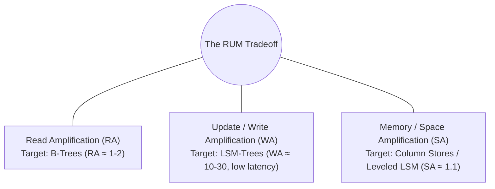

#### Exact Mathematical Definitions:
1. **Write Amplification (WA)**:
   $$	ext{WA} = rac{	ext{Total Bytes Written to Storage Media}}{	ext{Logical Bytes Ingested via Client Requests}}$$
   *Example*: If a client writes 1KB, and across WAL, flush, and leveled compaction passes the SSD writes 25KB, $	ext{WA} = 25$.

2. **Read Amplification (RA)**:
   $$	ext{RA} = rac{	ext{Total Bytes Read from Storage Media}}{	ext{Logical Bytes Returned to Client}}$$
   *Example*: To read a 100-byte value, if the engine reads a 4KB uncompressed block from Level 2 and an 8KB index block, $	ext{RA} = rac{12288}{100} pprox 122.8$.

3. **Space Amplification (SA)**:
   $$	ext{SA} = rac{	ext{Total Physical Disk Space Occupied by Database}}{	ext{Logical Size of De-duplicated, Current Data}}$$
   *Example*: If valid live data is 100GB, but tombstones, obsolete versions, and compaction buffers consume 180GB on disk, $	ext{SA} = 1.8$.

---

### 3.8.8 Deletions and the Tombstone Lifecycle

In an append-only engine, deleting a record cannot immediately erase data on disk. Deletions are implemented as **Tombstone markers** (a special record with a tombstone bit flag and deletion timestamp).

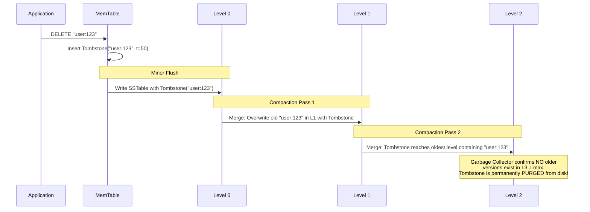

#### The "Tombstone Overwhelm" Hazard
If an application performs massive range deletions or updates millions of keys, SSTables become filled with millions of tombstones.
- When an application executes a range scan (`SELECT * FROM table WHERE id BETWEEN 1000 AND 2000`), the engine must scan and evaluate **every tombstone**.
- If 99.9% of rows are deleted, the storage engine reads thousands of disk blocks just skipping tombstones. In Apache Cassandra, scanning more than 100,000 tombstones in a single query triggers a `TombstoneOverwhelmingException` to avoid crashing the JVM with an Out-of-Memory (OOM) error!

---

### 3.8.9 End-to-End Walkthrough: Production Write & Read Path

#### The Complete Write Path
1. **Client Request**: Client sends `PUT("k99", "v99")`.
2. **Lock-Free Append to WAL**: Mutex or group commit leader writes record to WAL on disk. If sync mode is active, calls `fdatasync()`.
3. **MemTable Insertion**: Key is inserted into active SkipList MemTable. Memory counter increments.
4. **Capacity Check**: If MemTable size $>$ threshold:
   - Atomic pointer swap: Active MemTable $	o$ Immutable MemTable.
   - Allocate fresh active MemTable and new WAL file.
   - Signal background flush worker thread via condition variable.
5. **Acknowledge Client**: Return success to client ($O(1)$ latency, zero disk seeks).

#### The Complete Read Path
1. **Probe Active MemTable**: Search current SkipList. If key found (or tombstone found), return immediately.
2. **Probe Immutable MemTables**: Search any read-only MemTables awaiting disk flush.
3. **Probe Level 0 SSTables**:
   - Because $L_0$ files have overlapping key ranges, **all** $L_0$ SSTables whose metadata key range spans the target key must be evaluated.
   - Check Bloom Filter for each candidate $L_0$ SSTable. If filter returns 0, skip file entirely!
   - If filter returns 1: Check Block Cache for index block $	o$ binary search index $	o$ load data block from Block Cache (or disk) $	o$ extract value.
4. **Probe Levels $L_1$ to $L_{max}$**:
   - At each level, perform binary search across the level's SSTable key ranges (because ranges are strictly disjoint, **at most one** SSTable per level can contain the key).
   - Check Bloom Filter of that SSTable. If 1: search index block, fetch data block, return value.
5. **Merge & Return**: Return the newest version found (highest sequence number / timestamp).

---

### 3.8.10 Production Engine Implementations

#### 1. RocksDB (Meta / Facebook)
- Written in C++ as an evolution of LevelDB. Powers core backends at Meta, LinkedIn, Uber, and storage engines for **CockroachDB**, **TiKV**, **MySQL (MyRocks)**, and **Kafka Streams**.
- **Key Enhancements**:
  - **Column Families**: Logically partition a single database into independent key namespaces sharing a common WAL, with distinct MemTables, Bloom Filters, and compaction policies.
  - **Dynamic Level Base Sizing**: Automatically recalculates level target sizes based on actual dataset volume to prevent $L_1$ starvation.
  - **Write Stalls & Rate Limiting**: Automatically throttles client write bandwidth when background compaction threads lag behind, preventing disk space exhaustion.

#### 2. Apache Cassandra & ScyllaDB
- Distributed, leaderless NoSQL systems utilizing LSM-trees for partition storage on every node.
- **Key Mechanics**:
  - Partition Key determines the distributed cluster node; Clustering Key determines the internal SSTable sort order within that partition.
  - Employs **Key Cache** and **Row Cache** ahead of the operating system page cache.
  - Uses Size-Tiered Compaction by default for write-heavy workloads, with Leveled Compaction available for read-heavy tables.

---
