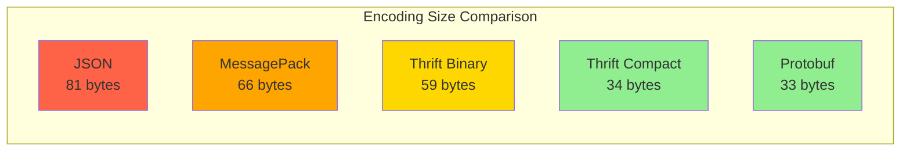
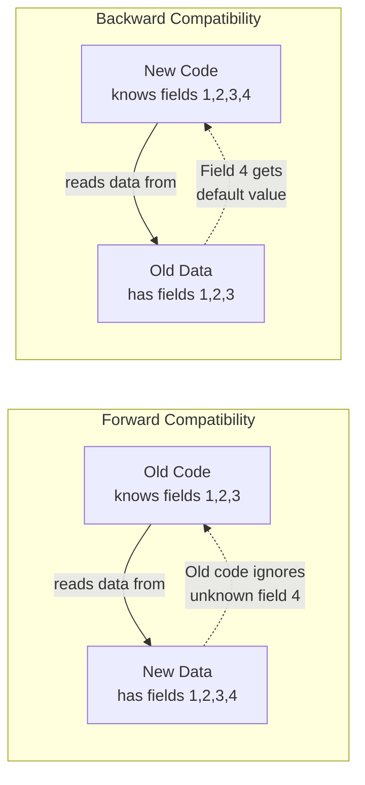
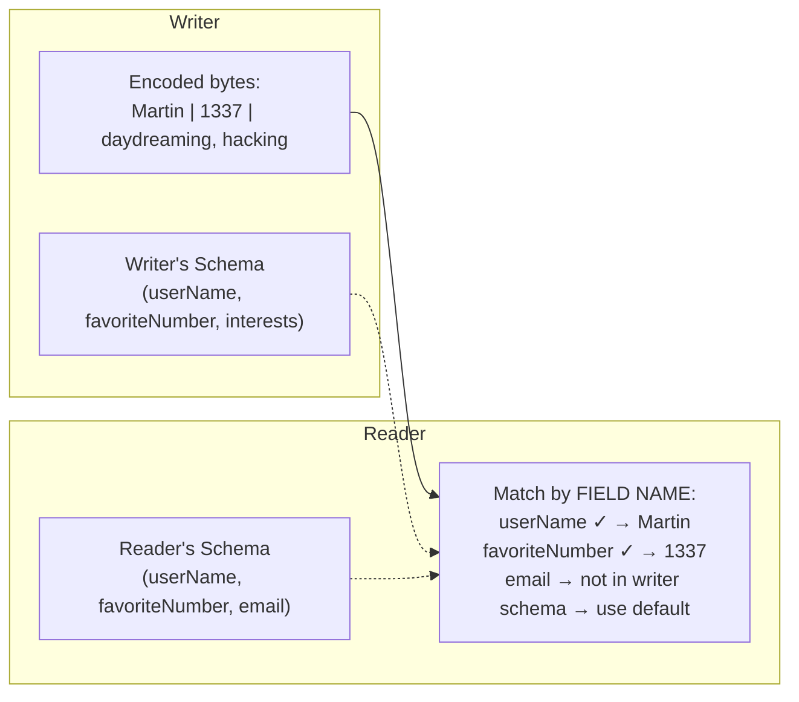
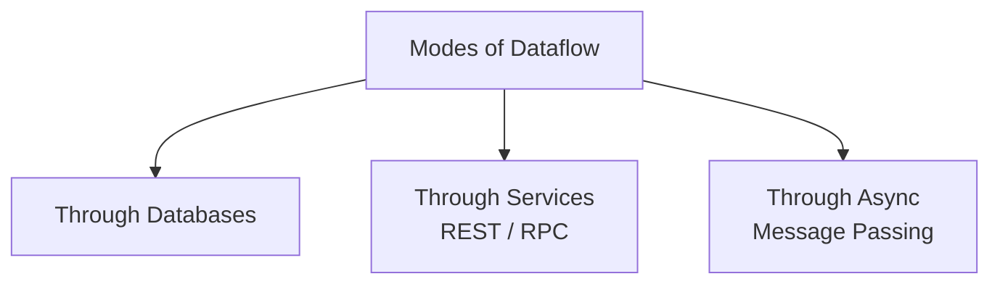
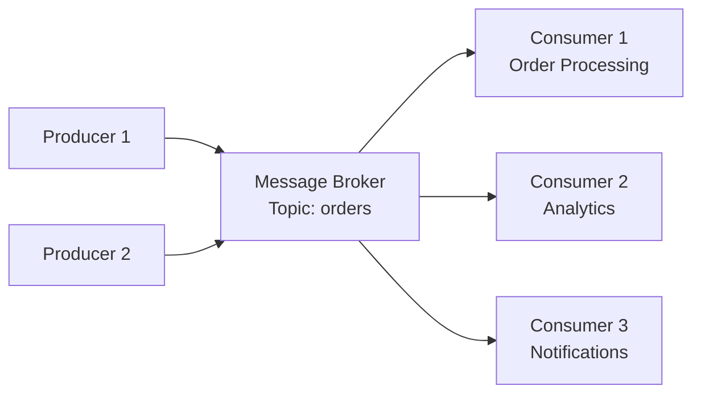

# Chapter 04: Encoding & Evolution - Formats & Protocols

> **Part of Part I: Foundations of Data Systems**  
> *Designing Data-Intensive Applications* by Martin Kleppmann — Comprehensive Technical Reference

---

## Chapter Overview
Binary serialization formats (JSON, MessagePack, Protocol Buffers, Apache Thrift, Apache Avro), forward/backward schema compatibility rules, and distributed dataflow modes (Databases, REST/RPC, and Asynchronous Message Brokers).

---

### 4.1 Formats for Encoding Data

Programs work with data in (at least) two representations:
1. **In memory**: Objects, structs, lists, hash tables, trees — optimized for CPU access
2. **On disk/network**: Byte sequence — must be self-contained

The translation from in-memory to bytes is called **encoding** (serialization/marshalling). Reverse = **decoding** (deserialization/unmarshalling).

#### Language-Specific Formats

| Format | Language | Problems |
|--------|----------|----------|
| `java.io.Serializable` | Java | Security vulnerabilities (deserialization attacks), Java-only, versioning hard, slow |
| `pickle` | Python | Python-only, arbitrary code execution risk, no schema |
| `Marshal` | Ruby | Ruby-only |

> [!CAUTION]
> **NEVER** use language-specific serialization for storing data or communication between services. They lock you into one language and have security vulnerabilities.

#### JSON, XML, CSV

Problems:
- **Numbers**: JSON can't distinguish integers from floats. JavaScript uses IEEE 754 doubles — integers > 2^53 lose precision. Twitter API returns tweet IDs as both number AND string for this reason.
- **Binary strings**: JSON/XML don't support raw binary. Must base64-encode (33% larger).
- **Schemas**: JSON Schema and XML Schema exist but are complex and not widely used.
- **CSV**: No schema at all, ambiguous parsing (commas in values, newlines in quoted strings).

#### Binary Encoding: MessagePack

**Example object:**
```json
{
    "userName": "Martin",
    "favoriteNumber": 1337,
    "interests": ["daydreaming", "hacking"]
}
```

**JSON** = 81 bytes (with whitespace removed)
**MessagePack (binary JSON)** = 66 bytes (saves 18% but still includes field names as strings)

MessagePack saves space by using compact type indicators instead of JSON syntax characters, but **field names are still included in every record** — limits compression.

---

### 4.2 Thrift and Protocol Buffers

Both use a **schema** with numbered field tags:

**Thrift:**
```thrift
struct Person {
    1: required string userName,
    2: optional i64 favoriteNumber,
    3: optional list<string> interests
}
```

**Protocol Buffers:**
```protobuf
message Person {
    required string user_name = 1;
    optional int64 favorite_number = 2;
    repeated string interests = 3;
}
```

**Key difference from JSON/MessagePack**: Field names are replaced by **field tags** (numbers). The encoded binary only contains tag numbers, not names → much more compact.

**Thrift BinaryProtocol**: Each field encoded as (type, tag number, value). The example object = 59 bytes.

**Thrift CompactProtocol**: Packs type + tag delta into single byte, uses variable-length integers. Same object = 34 bytes.

**Protocol Buffers**: Similar to CompactProtocol. Same object = 33 bytes.



#### Schema Evolution — Forward and Backward Compatibility



**Rules:**
- **Adding a new field**: Must be `optional` or have a default value (backward compatible). Old code ignores unknown tags (forward compatible).
- **Removing a field**: Can only remove `optional` fields. Never reuse the removed tag number.
- **Changing datatypes**: Possible but risky (e.g., int32 → int64: new code reads fine, but old code may truncate).

**Thrift `list` vs Protobuf `repeated`:**
- Protobuf `repeated` = multi-valued field. Can change `optional` to `repeated` (old code sees last element).
- Thrift has explicit `list` type — can't convert from single-value to multi-value.

---

### 4.3 Avro

Avro takes a different approach: **no field tags in the encoding at all**. The data is encoded by simply concatenating values in the schema order.

**Writer's schema** (used when writing):
```json
{
    "type": "record",
    "name": "Person",
    "fields": [
        {"name": "userName", "type": "string"},
        {"name": "favoriteNumber", "type": ["null", "long"], "default": null},
        {"name": "interests", "type": {"type": "array", "items": "string"}}
    ]
}
```

The binary contains NO field identifiers — just values concatenated. The reader uses its own schema (reader's schema) to decode.



**Schema resolution**: Match fields by **name** (not position or tag number):
- Field in writer but not reader → ignored
- Field in reader but not writer → filled with default value
- Names changed? Use **aliases** in schema

**How does the reader get the writer's schema?**
- **Large files (Avro data files)**: Include the schema at the beginning of the file
- **Database with individually written records**: Store schema version number with each record, look up schema in registry
- **Network connection (Avro RPC)**: Negotiate schema on connection setup

> [!TIP]
> **Avro's killer feature: dynamically generated schemas.** If you want to export a relational database table to a file, Avro can generate a schema from the SQL schema automatically — no manual field tag assignment needed. When the database schema changes (add/remove column), generate a new Avro schema and the reader handles both old and new.

---

### 4.4 Modes of Dataflow

How does data flow between processes?



#### 4.4.1 Dataflow Through Databases

A database is a way of sending data to your **future self**. The process that writes to the database **encodes** the data; the process that reads it later **decodes** it.

> [!IMPORTANT]
> In a database, you need **both** forward AND backward compatibility at the same time. Old application code (not yet upgraded) may read data written by new code (forward compat), and new code may read data written by old code (backward compat). Data **outlives code** — data written 5 years ago with an old schema must still be readable.

**Danger**: If an old version of the application reads a record (written by new code), adds a field to it, and writes it back — the new fields might be silently dropped. Application code must preserve unknown fields when rewriting records.

#### 4.4.2 Dataflow Through Services: REST and RPC

**SOA / Microservices**: Break a monolith into services that communicate over the network. Each service exposes an API.

**REST**: Uses HTTP methods, URLs, JSON. Good for public APIs. Key design principles: statelessness, cacheability, uniform interface.

**SOAP**: XML-based, uses WSDL for schema. Complex but formally specified. Falling out of favor.

**RPC (Remote Procedure Call)**: Make a network call look like a local function call.

**Problems with RPC** (why it's fundamentally flawed):

| Problem | Explanation |
|---------|-------------|
| **Network is unpredictable** | Local call either succeeds or fails; network call may timeout (did it succeed or not?) |
| **Timeouts** | No good way to know if request was delivered |
| **Retries need idempotency** | Retrying a failed call might execute the operation twice |
| **Latency varies wildly** | Local call: nanoseconds. Network call: microseconds to seconds |
| **Different languages** | Client and server may use different programming languages — data type mapping issues |
| **Reference passing** | Can't pass pointers/references across the network |

**Modern RPC frameworks**:
- **gRPC** (Google): Uses Protocol Buffers, HTTP/2, streaming
- **Finagle** (Twitter): Uses Thrift
- **Rest.li** (LinkedIn): Uses JSON over HTTP

**Evolvability**: Assume servers are updated before clients. Servers must handle old client requests. RPCs need backward/forward compatible encoding.

#### 4.4.3 Dataflow Through Asynchronous Message Passing

A **message broker** (message queue) is an intermediary: producer sends messages to a topic, consumers read from the topic.

**Advantages over direct RPC:**
- **Buffer**: Broker queues messages if consumer is slow or unavailable
- **Redelivery**: Broker can redeliver if consumer crashes
- **Decoupling**: Producer doesn't need to know about consumers
- **Fan-out**: One message delivered to multiple consumers

**Message brokers**: RabbitMQ, ActiveMQ, Apache Kafka, Amazon SQS, Google Cloud Pub/Sub



**Actor Model**: A programming model for concurrency where **actors** communicate via async messages. Each actor is a single-threaded unit processing messages one at a time.

- **Akka** (Scala/Java): Can run distributed actors across machines
- **Orleans** (Microsoft): Virtual actors, automatically manages lifecycle
- **Erlang OTP**: Language built around the actor model, legendary fault tolerance (telecom switches with 99.9999999% uptime)

> [!WARNING]
> **Distributed actor frameworks** (Akka Cluster, Orleans, Erlang) require careful encoding: messages are persisted and forwarded across nodes. You need forward/backward compatible encoding — not language-specific serialization.
