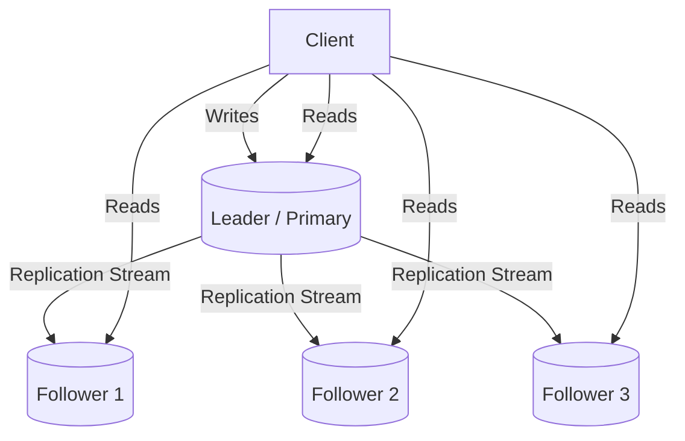
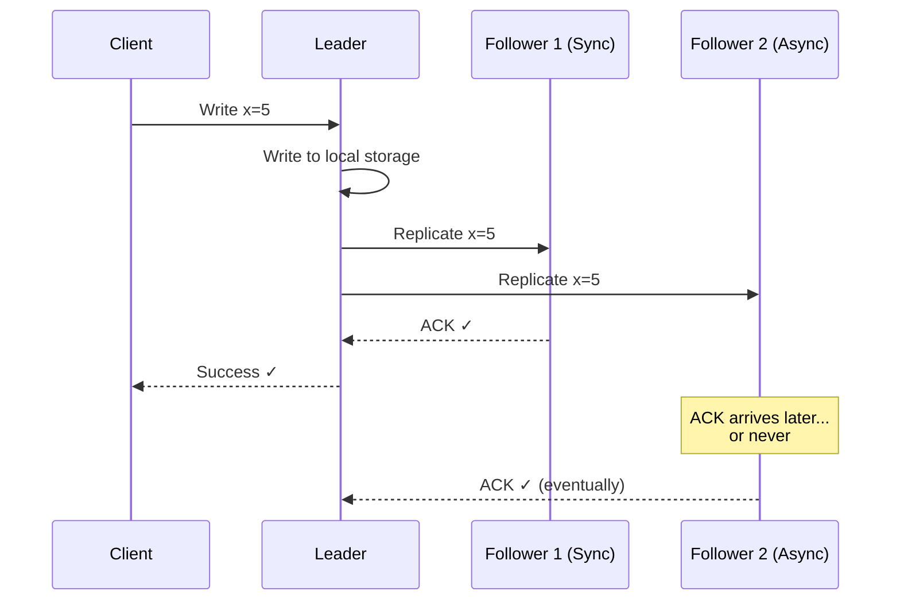
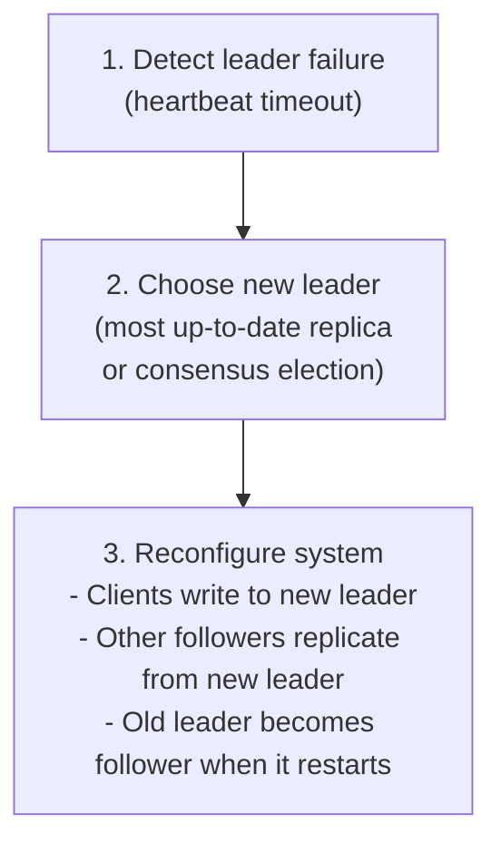
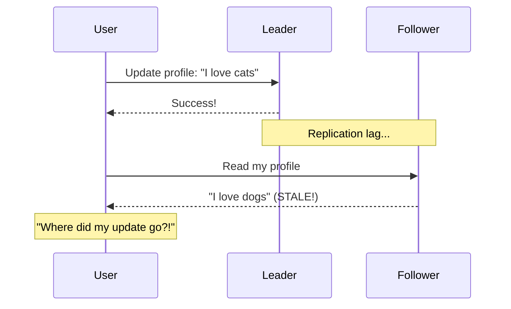
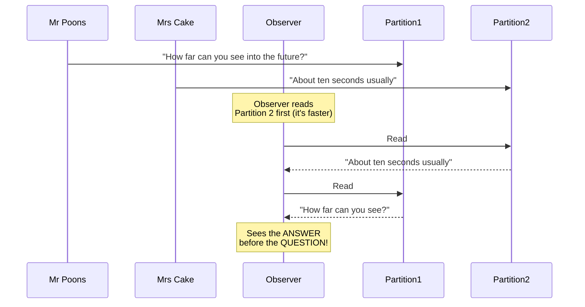
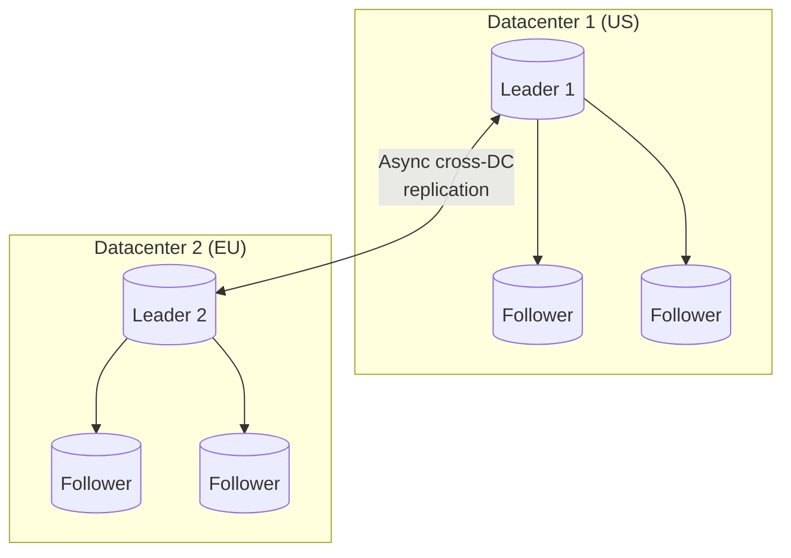
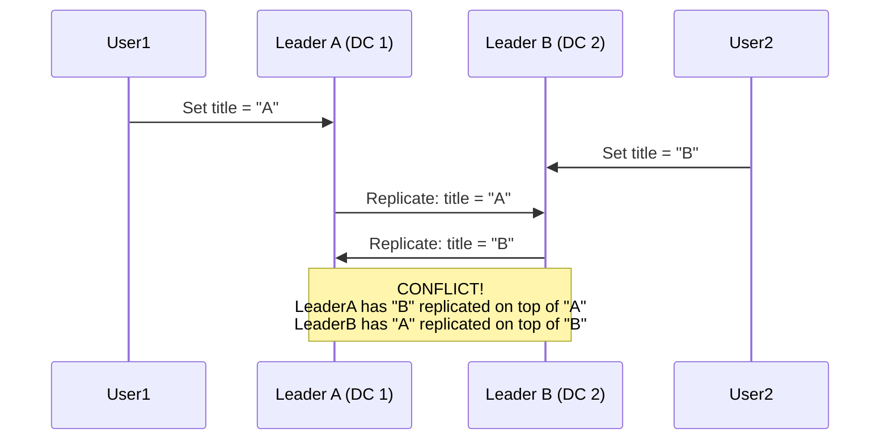
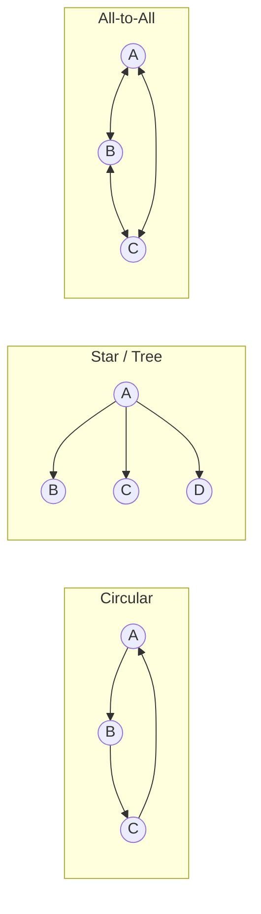
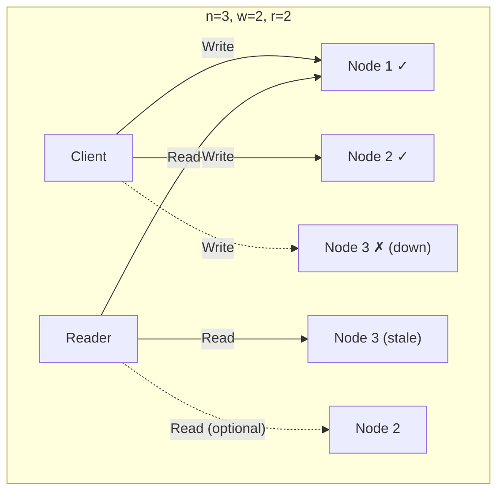
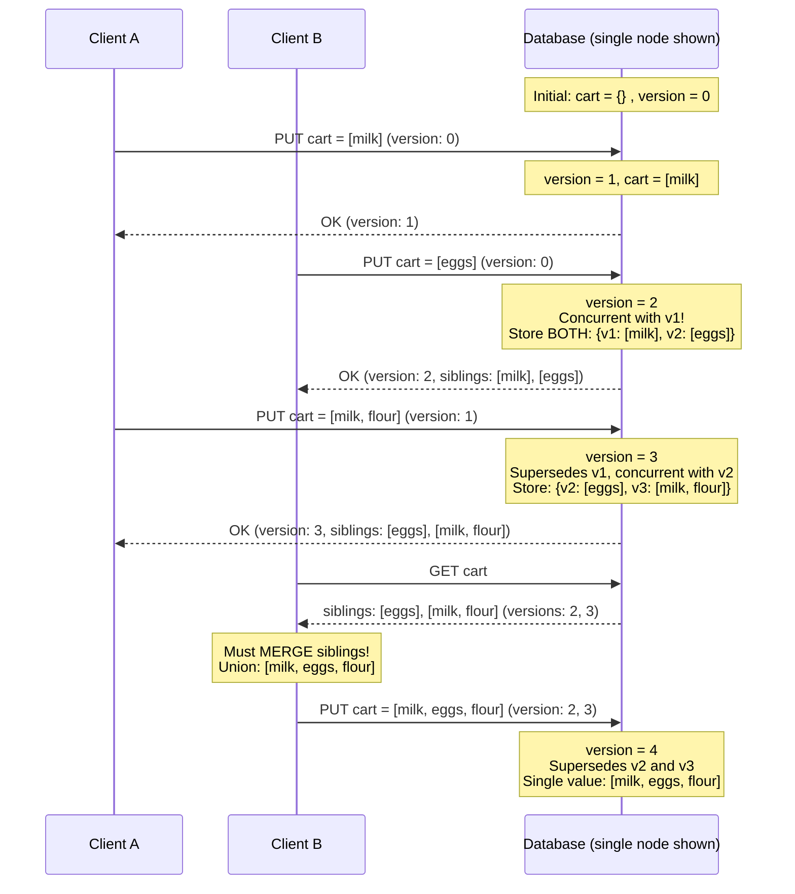

# Chapter 05: Replication - Single-Leader, Multi-Leader & Quorums

> **Part of Part II: Distributed Data**  
> *Designing Data-Intensive Applications* by Martin Kleppmann — Comprehensive Technical Reference

---

## Chapter Overview
Distributed replication topologies: Single-leader failover, replication logs, replication lag anomalies (read-your-writes, monotonic reads, consistent prefix reads), Multi-leader conflicts, and Leaderless Dynamo quorums with Version Vectors.

---

### 5.1 Leaders and Followers

The most common replication approach: **single-leader (master-slave) replication**.



**How it works:**
1. One replica is the **leader** (master/primary). All writes go through the leader.
2. Other replicas are **followers** (slaves/read replicas/secondaries).
3. When leader processes a write, it sends a **replication log** (change stream) to all followers.
4. Each follower applies the changes in the same order as the leader.
5. Reads can go to any replica (leader or follower).

#### 5.1.1 Synchronous vs Asynchronous Replication



| Mode | Guarantee | Downside |
|------|-----------|----------|
| **Fully synchronous** | All followers have latest data | One slow/dead follower blocks ALL writes |
| **Fully asynchronous** | Leader never blocks on followers | If leader fails before replication, writes are LOST |
| **Semi-synchronous** | At least ONE follower is synchronous, rest async | Practical compromise: if sync follower is slow, another follower is promoted to synchronous |

> [!IMPORTANT]
> **In practice, most leader-based replication is fully asynchronous.** This means if the leader fails and is unrecoverable, any writes not yet replicated are LOST. This may seem like a poor guarantee, but it's widely used because synchronous replication is too slow.

#### 5.1.2 Setting Up New Followers

You can't just copy the data files — they're constantly changing. The process:

1. Take a **consistent snapshot** of the leader's database (without locking if possible — many databases support this: MySQL `innobackupex`, PostgreSQL `pg_basebackup`)
2. Copy the snapshot to the new follower node
3. Follower connects to the leader and requests all changes **since the snapshot** using the log sequence number (PostgreSQL) / binlog coordinates (MySQL)
4. When follower has processed the backlog, it's caught up — **"in sync"**

#### 5.1.3 Handling Node Outages

**Follower failure — Catch-up recovery:**
The follower knows the last transaction it processed. It connects to the leader and requests all changes since that point. Simple.

**Leader failure — Failover:**



**Problems with failover:**

| Problem | Explanation |
|---------|-------------|
| **Data loss** | If async replication, new leader may be behind. Old leader's unreplicated writes are lost. If old leader rejoins, what to do with those writes? Typically discard — violates durability. |
| **Split-brain** | Two nodes both think they are leader → both accept writes → data divergence and corruption. Need to ensure old leader is definitely dead (STONITH: Shoot The Other Node In The Head). |
| **Wrong timeout** | Too short → unnecessary failovers during temporary load spikes. Too long → longer recovery time. |
| **GitHub incident (2012)** | MySQL follower promoted to leader, but had out-of-date auto-increment counters. New primary keys collided with keys in Redis (which still had old data). Private data was exposed to wrong users. |

#### 5.1.4 Implementation of Replication Logs

| Method | How It Works | Pros | Cons | Used By |
|--------|-------------|------|------|---------|
| **Statement-based** | Log every SQL statement (`INSERT`, `UPDATE`) | Simple | `NOW()`, `RAND()`, auto-increment, triggers don't work deterministically | MySQL (older versions) |
| **WAL shipping** | Send raw write-ahead log (byte-level changes) | Exact copy | Tightly coupled to storage engine version — can't run different DB versions on leader/follower | PostgreSQL, Oracle |
| **Logical (row-based)** | Log logical row changes: inserts include all column values, deletes include PK, updates include changed columns | Decoupled from storage engine, great for CDC (Change Data Capture) | More complex | MySQL binlog (row-based), PostgreSQL logical replication |
| **Trigger-based** | Application-level: triggers fire on write, log changes to a separate table | Most flexible — can replicate subset, transform data | Higher overhead, more bugs | Oracle GoldenGate, Bucardo |

---

### 5.2 Problems with Replication Lag

With async replication, followers can be **seconds, minutes, or even hours behind**. "Eventually consistent" means: if you stop writing, all replicas will *eventually* converge. But "eventually" might be a long time.

#### 5.2.1 Reading Your Own Writes

**Problem**: User writes something, then reads from a stale follower and doesn't see their own write!



**Solutions for read-after-write consistency:**

1. **Read from leader for user's own data**: If the user is viewing their own profile, read from leader. Otherwise, read from follower.
2. **Timestamp-based**: Track when the user last wrote. For 1 minute after any write, read from leader. Or: tell follower "give me data at least as fresh as timestamp T" — follower waits if necessary.
3. **Cross-device**: User writes on phone, reads on laptop. Can't use device-local timestamps. Must use centralized metadata tracking.

#### 5.2.2 Monotonic Reads

**Problem**: User reads from Follower A (which has caught up) and sees a comment. Then reads from Follower B (which is behind) and the comment has DISAPPEARED. Time goes backward!

**Solution**: **Sticky sessions** — route each user to the same replica (e.g., hash of user ID to choose replica).

#### 5.2.3 Consistent Prefix Reads

**Problem** (primarily in partitioned databases):



**Solution**: Causally related writes must go to the same partition, or use mechanisms that track causal dependencies.

---

### 5.3 Multi-Leader Replication

Each datacenter has its own leader. Writes can go to ANY leader.

#### Use Cases

| Use Case | How it Works |
|----------|-------------|
| **Multi-datacenter** | Each DC has a leader. Cross-DC replication is async. Tolerates entire DC going offline. |
| **Clients with offline operation** | Each device (phone, laptop) has a local database acting as a "leader." Syncs when back online. CouchDB designed for this. |
| **Collaborative editing** | Google Docs: each user's editing session is like a "leader." Changes merged in real-time. |



#### 5.3.1 Handling Write Conflicts

The biggest problem with multi-leader: **concurrent writes to the same data at different leaders**.



**Conflict resolution approaches:**

| Approach | How | Problems |
|----------|-----|----------|
| **Conflict avoidance** | Route all writes for a given record to the same leader | Best approach. But what if that DC fails? |
| **Last Write Wins (LWW)** | Attach a timestamp to each write, keep the "latest" | DATA LOSS — silently drops concurrent writes. Cassandra uses this. |
| **Merge values** | Concatenate or union conflicting values (e.g., "A/B") | Application must handle merged values |
| **Record conflict** | Save both versions, let user resolve later | More complex but safest. CouchDB does this. |
| **Custom on-write handler** | Application callback on conflict (Bucardo) | Complex code, runs in critical path |
| **Custom on-read handler** | Save all versions, prompt user on next read (CouchDB) | Delay resolution until read time |

#### 5.3.2 Multi-Leader Replication Topologies



| Topology | Problem |
|----------|---------|
| **Circular** | If one node fails, replication stops for all downstream nodes |
| **Star** | Central node is single point of failure |
| **All-to-all** | Messages may arrive out of order (causality violation: update may arrive before the insert it depends on). Need version vectors or logical timestamps. |

---

### 5.4 Leaderless Replication

No leader — any replica can accept writes directly. **Dynamo-style**: Amazon's original Dynamo paper, now used by Riak, Cassandra, Voldemort.

#### Read Repair and Anti-Entropy

How do stale replicas catch up?

1. **Read repair**: When client reads from multiple replicas and detects stale data, it writes the newest value back to the stale replica.
2. **Anti-entropy process**: Background daemon compares data across replicas and copies missing data (uses Merkle trees for efficiency). No guaranteed ordering.

#### 5.4.1 Quorums



**The quorum condition**: **w + r > n** ensures at least one node in the read set has the latest write.

- **n** = total replicas
- **w** = number of nodes that must acknowledge a write
- **r** = number of nodes that must respond to a read

Common choices: n=3, w=2, r=2 → tolerates 1 unavailable node.

**But quorums can still be violated:**

| Edge Case | Why |
|-----------|-----|
| **Sloppy quorum** | If designated nodes are down, writes go to OTHER nodes (hinted handoff). w+r>n on the "right" nodes is not guaranteed. |
| **Concurrent writes** | Two writes to same key at same time — unclear ordering |
| **Write concurrent with read** | Write on some replicas but not others — read may or may not see it |
| **Write succeeded on some replicas, failed on others** | Write not rolled back on successful nodes → reads inconsistent |
| **Node with new value fails, restored from stale replica** | Number of replicas with new value falls below w |

> [!WARNING]
> Even with w + r > n, you do NOT get linearizability (strong consistency). Dynamo-style databases provide **eventual consistency** — you might read stale data.

**Sloppy Quorums and Hinted Handoff:**
If the designated "home" nodes for a key are unreachable, writes are temporarily accepted by other nodes with a "hint" — when the home node recovers, the data is sent back. This increases write availability but weakens the quorum guarantee.

#### 5.4.2 Detecting Concurrent Writes — Version Vectors

The most important algorithm in leaderless replication. Let's trace a full example:

**Shopping cart example with two clients and three replicas:**



**With multiple replicas**, each replica has its own version → **version vector** = collection of version numbers from all replicas.

```
Version vector: {Node_A: 3, Node_B: 2, Node_C: 1}
```

**Rules:**
- Version vector X **dominates** Y if every component of X ≥ corresponding component of Y → Y is an ancestor, X supersedes it
- If neither dominates → they are **concurrent** → need merge (siblings)

**Dotted Version Vectors**: An optimization used by Riak to reduce sibling explosion by tracking which specific event a value is associated with.

---
