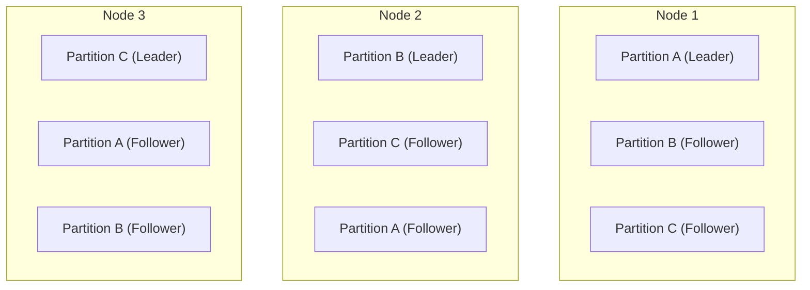
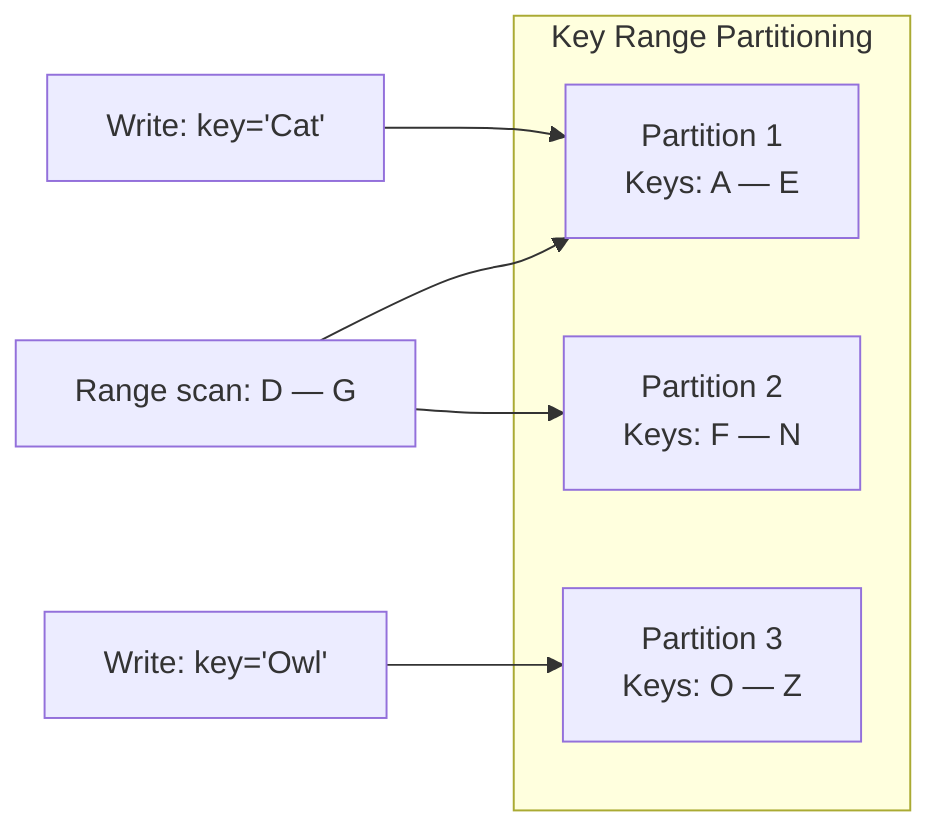
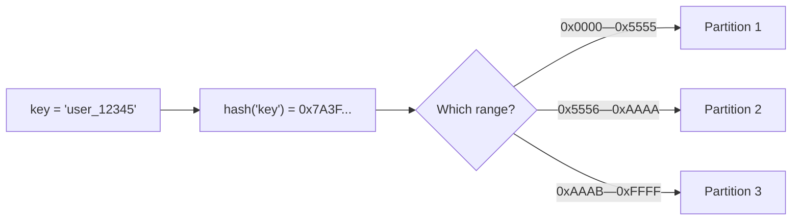
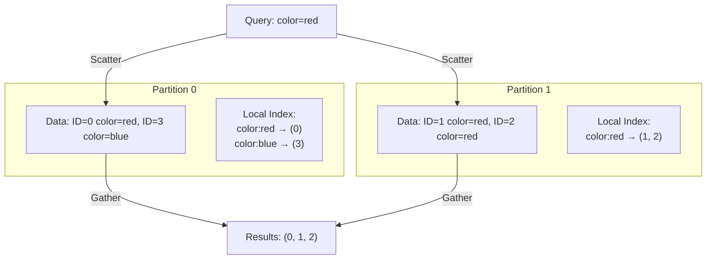
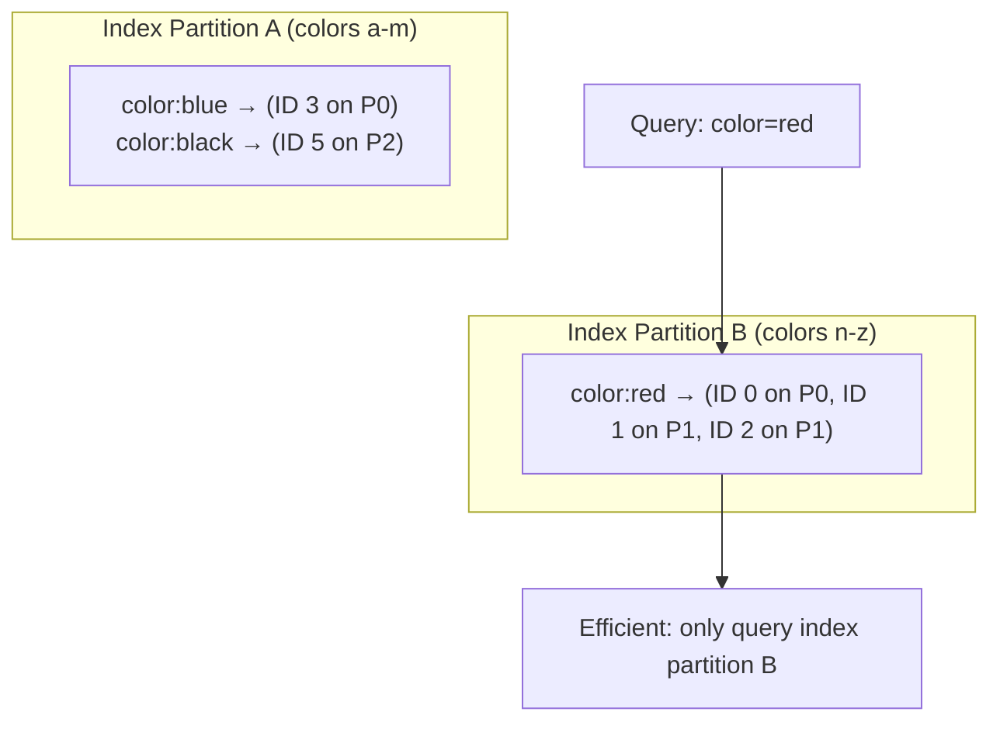
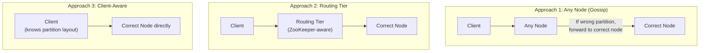

# Chapter 06: Partitioning - Strategies, Secondary Indexes & Skew

> **Part of Part II: Distributed Data**  
> *Designing Data-Intensive Applications* by Martin Kleppmann — Comprehensive Technical Reference

---

## Chapter Overview
Horizontal sharding strategies: Key-range vs Hash partitioning, relieving hot spots, Document-partitioned (local) vs Term-partitioned (global) secondary indexes, partition rebalancing (Fixed vs Dynamic), and service discovery routing.

---

### 6.1 Partitioning and Replication

Each partition is replicated across multiple nodes for fault tolerance. A node can store multiple partitions, and can be leader for some partitions and follower for others.



---

### 6.2 Partitioning of Key-Value Data

**Goal**: Distribute data and query load evenly. **Skew** = some partitions have more data/queries than others. A partition with disproportionately high load = **hot spot**.

#### Key Range Partitioning

Assign a contiguous range of keys to each partition (like encyclopedia volumes A-C, D-F, ...).



**Advantage**: Efficient range scans (e.g., all records for January 2024).

**Danger — Hot spots with timestamp keys:**
If key = timestamp, all writes for "today" go to the SAME partition → massive hot spot.

**Solution**: Compound key — prefix with sensor name, then timestamp:
```
Key = sensor_name + timestamp
Partition by sensor_name, sort within partition by timestamp
→ Writes spread across partitions, range scans within one sensor are efficient
```

#### Hash Partitioning

Use a hash function to determine which partition a key belongs to.



**Note on "consistent hashing"**: The book avoids this term because it has specific meanings in CDN/caching literature. It uses "hash partitioning" instead.

**Cassandra compromise — compound primary key:**
```sql
CREATE TABLE events (
    sensor_id TEXT,
    timestamp TIMESTAMP,
    reading DOUBLE,
    PRIMARY KEY (sensor_id, timestamp)
);
-- First part (sensor_id) → hashed for partition selection
-- Second part (timestamp) → used for sorting within partition
-- Can efficiently scan: all readings for sensor X between time T1 and T2
```

#### Skewed Workloads and Relieving Hot Spots

Hash partitioning reduces skew but doesn't eliminate it. If ONE key is extremely hot (e.g., a celebrity's user ID during a viral event), all requests hash to the same partition.

**Application-level solution**: Append a random 2-digit number (00-99) to hot keys → spreads writes across 100 partitions.

**Tradeoff**: Reads for that key must now query all 100 partitions and combine results.

> [!NOTE]
> Most databases today don't auto-handle hot-key splitting. It requires application-level logic. You also need a way to know WHICH keys are hot.

---

### 6.3 Partitioning and Secondary Indexes

#### 6.3.1 Document-Partitioned Index (Local Index)

Each partition maintains its own secondary index covering ONLY the data in that partition.



**Problem — Scatter/gather**: Queries on secondary index must go to ALL partitions. Expensive and prone to tail latency amplification.

**Used by**: MongoDB, Riak, Cassandra, Elasticsearch, SolrCloud, VoltDB.

#### 6.3.2 Term-Partitioned Index (Global Index)

A global index covers ALL data, but the index itself is partitioned (differently from the primary data).



**Advantage**: Reads touch only one index partition.
**Disadvantage**: Writes are slower — a write may update indexes on multiple partitions. Updates are typically **async** (DynamoDB: up to fractions of a second).

---

### 6.4 Rebalancing Partitions

When nodes are added/removed, data must move. Goal: after rebalancing, load is shared fairly.

| Strategy | How | Pros | Cons | Used By |
|----------|-----|------|------|---------|
| **hash mod N** | partition = hash(key) mod N | Simple | If N changes, almost ALL data moves! | **DON'T USE** |
| **Fixed partitions** | Create many more partitions than nodes (e.g., 1000 partitions for 10 nodes). Move whole partitions. | Simple, proportional data movement | Hard to choose right number upfront. Too many = overhead, too few = limits future growth | Riak, Elasticsearch, Couchbase, Voldemort |
| **Dynamic partitions** | Split partitions when they exceed a size threshold, merge when they shrink | Adapts to data size automatically | Empty database starts with 1 partition → initially no parallelism (pre-splitting helps) | HBase, RethinkDB, MongoDB |
| **Proportional to nodes** | Fixed number of partitions per node. When new node joins, randomly split some partitions | Partition count grows with cluster | Random split can produce unfair splits | Cassandra |

> [!WARNING]
> **Fully automatic rebalancing is dangerous**: If a node is overloaded (slow to respond), automatic rebalancing may decide it's dead and start moving data away — adding even MORE load and potentially cascading. Many production systems require a human to initiate rebalancing.

---

### 6.5 Request Routing

**The service discovery problem**: How does a client know which node holds the partition for a given key?



| Approach | How routing info propagated | Used By |
|----------|---------------------------|---------|
| **Gossip protocol** | Nodes gossip partition assignments to each other; any node can answer or forward | Cassandra, Riak |
| **Coordination service** | Separate service (ZooKeeper) tracks partition-to-node mapping. Routing tier or clients subscribe to updates. | HBase, SolrCloud, Kafka (use ZooKeeper) |
| **Client library** | Client embeds partition-aware logic | Some Kafka clients, custom solutions |

---
