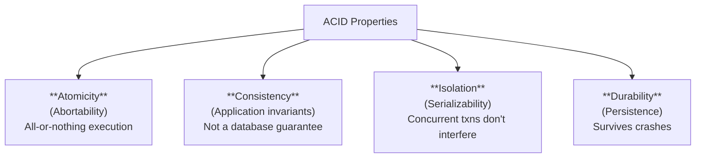
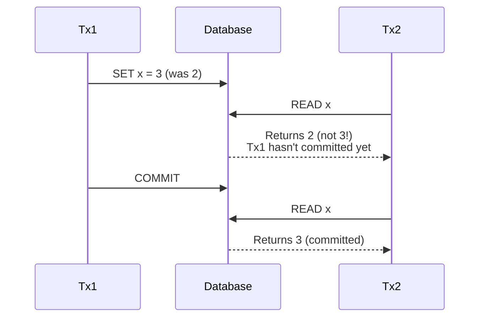
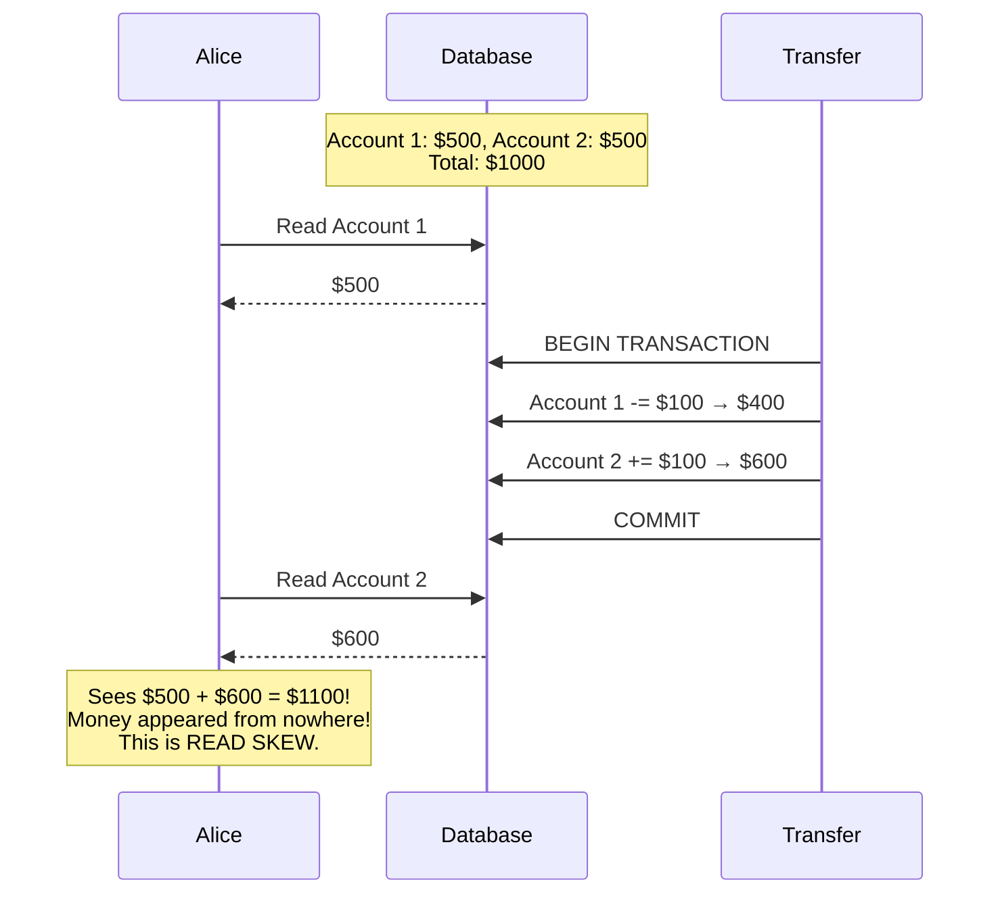
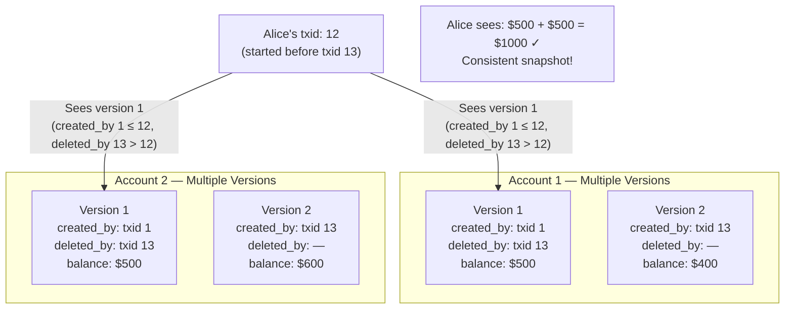
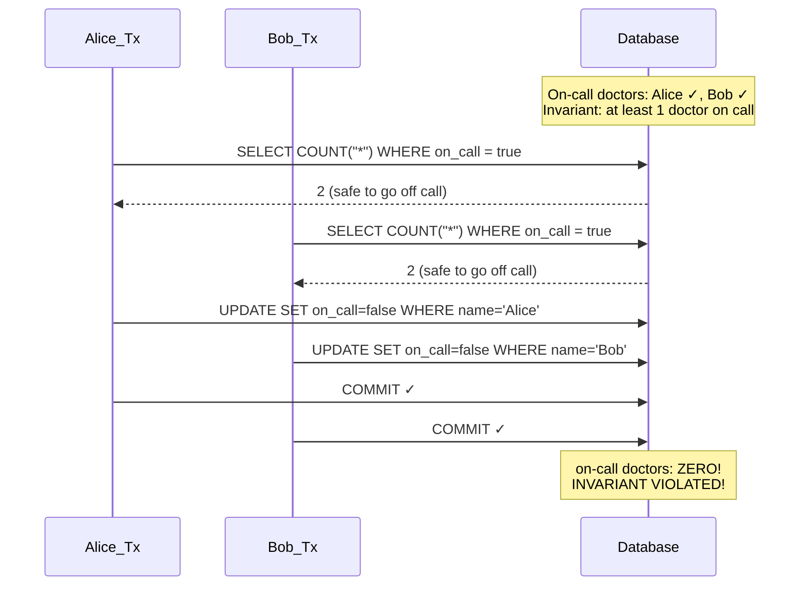
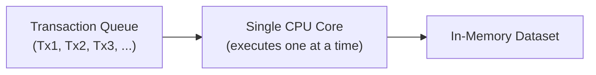
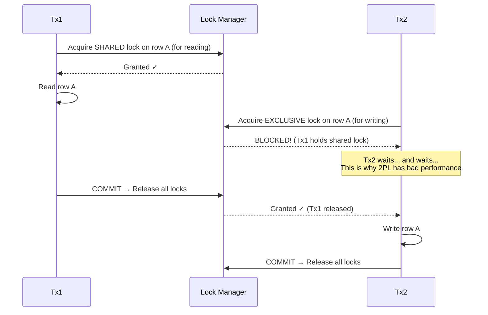
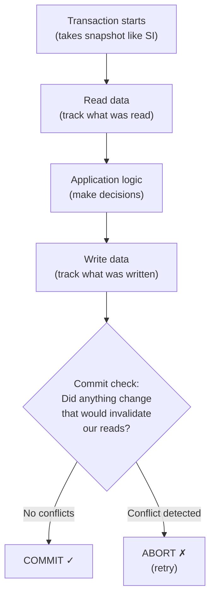

# Chapter 07: Transactions - ACID, Isolation Levels & Anomalies

> **Part of Part II: Distributed Data**  
> *Designing Data-Intensive Applications* by Martin Kleppmann — Comprehensive Technical Reference

---

## Chapter Overview
The true meaning of ACID, weak isolation levels (Read Committed, Snapshot Isolation / MVCC), race conditions and anomalies (Dirty Reads, Read Skew, Lost Updates, Write Skew, Phantoms), and Serializability (Serial Execution, 2PL, SSI).

---

### 7.1 The Slippery Concept of a Transaction

#### ACID Explained In Depth



| Property | What people think | What it actually means |
|----------|------------------|----------------------|
| **Atomicity** | Something about concurrency | **Abortability**: If a transaction fails halfway, ALL changes are rolled back. Nothing partial is visible. NOT about multi-threading atomicity. |
| **Consistency** | The database ensures consistency | **NOT a database property** — it's an application-level concern. The application defines invariants (e.g., "account balance ≥ 0"). The database merely provides tools (atomicity, isolation) to help maintain them. |
| **Isolation** | Transactions are isolated | Concurrently running transactions cannot interfere with each other. The strongest form is **serializability**: the result is the same as if transactions ran serially (one at a time). |
| **Durability** | Data is safe forever | Data written by a committed transaction survives hardware faults. Implemented via WAL + writing to disk. With replication: written to multiple nodes. **But no perfect guarantee**: all disks can fail, all replicas can be corrupted simultaneously. |

> [!NOTE]
> **BASE** (Basically Available, Soft state, Eventually consistent) is the opposite of ACID — coined by non-relational database advocates. It's vague and mostly used as marketing.

#### Error Handling and Retry

Retrying aborted transactions seems simple but has pitfalls:

| Pitfall | Explanation |
|---------|-------------|
| **Network timeout** | Transaction succeeded but response was lost → retry causes DUPLICATE execution (need idempotency) |
| **Overload-induced error** | If the error is due to overload, retrying makes it WORSE (need exponential backoff) |
| **Permanent errors** | Constraint violation won't be fixed by retrying — waste of resources |
| **Side effects** | If transaction sends an email, retry sends ANOTHER email. Side effects need separate mechanisms (outbox pattern). |
| **Client crashes** | If client fails after server commits, the data never gets retried to write to client's local state |

---

### 7.2 Weak Isolation Levels

Serializable isolation has a performance cost. Most databases use weaker isolation for performance.

#### 7.2.1 Read Committed

**Two guarantees:**
1. **No dirty reads**: You only see committed data
2. **No dirty writes**: You only overwrite committed data



**Implementation:**
- **Dirty writes prevented** by: row-level locks. Transaction must acquire lock before writing; holds it until commit/abort.
- **Dirty reads prevented** by: database remembers BOTH the old committed value and the new uncommitted value. Readers see old value until commit. (NOT by read locks — that would be too slow.)

**Default level in**: Oracle 11g, PostgreSQL, SQL Server 2012+.

#### 7.2.2 Snapshot Isolation and Repeatable Read

**Read committed is NOT enough!** It allows **read skew** (non-repeatable read):

##### Alice's Bank Transfer Example



Alice sees an **inconsistent state** — $1,100 total instead of $1,000. In read-committed isolation, both reads were valid (reading committed data), but together they're inconsistent.

**Where this matters:**
- **Backups**: If backup reads inconsistent data, the backup is corrupted
- **Analytic queries**: Long-running queries that scan millions of rows — must see a consistent snapshot
- **Integrity checks**: `SELECT SUM(balance) FROM accounts` might be wrong

##### MVCC (Multi-Version Concurrency Control)

**Solution**: Each transaction sees a **consistent snapshot** of the database — the state at the moment the transaction started, regardless of subsequent changes by other transactions.

**Implementation — Transaction IDs:**

Each transaction gets a unique, always-increasing **txid**. Each row has:
- `created_by`: txid of the transaction that inserted this row
- `deleted_by`: txid of the transaction that deleted/updated this row (updates = delete + insert)



**Visibility rules** (for a transaction with txid = T):
A row version is visible if ALL of:
1. `created_by` ≤ T (created by a finished or current transaction)
2. The creating transaction had committed at the time T started
3. `deleted_by` is NULL or `deleted_by` > T or the deleting transaction hadn't committed when T started

> [!TIP]
> **Naming confusion**: Different databases call this different things.
> - PostgreSQL, MySQL/InnoDB: "REPEATABLE READ"
> - Oracle: "SERIALIZABLE" (but it's actually snapshot isolation!)
> - SQL standard defines "REPEATABLE READ" but doesn't define snapshot isolation
>
> These are NOT the same thing, even though databases conflate them.

---

### 7.3 Preventing Lost Updates

**The problem**: Two transactions read the same value, modify it, and write it back — one modification is lost.

**Example**: Two users increment a counter simultaneously:
```
Counter = 42
User A reads 42, computes 43, writes 43
User B reads 42, computes 43, writes 43
Result: 43 (should be 44!) — User A's increment was LOST
```

**Solutions:**

| Solution | How | Availability |
|----------|-----|-------------|
| **Atomic read-modify-write** | `UPDATE counters SET val = val + 1 WHERE key = 'X'` | All databases |
| **Explicit locking** | `SELECT ... FOR UPDATE` — lock the row | All databases |
| **Automatic detection** | Database detects lost updates and aborts the offending transaction | PostgreSQL SI ✓, Oracle SI ✓, **MySQL/InnoDB: NO** |
| **Compare-and-set** | `UPDATE wiki SET content = 'new' WHERE content = 'old'` — only update if value hasn't changed | Many databases (but unsafe if reading from stale replica!) |
| **Conflict resolution (replicated)** | Commutative operations (CRDTs), or LWW (but LWW loses updates!) | Riak, Cassandra |

---

### 7.4 Write Skew and Phantoms

**Write skew**: A generalization of lost updates. Two transactions read the same data, make decisions based on it, then write different records that together violate an invariant.

##### Doctors On-Call Example



**Pattern**: Read → decide → write that invalidates the premise of the read.

**More write skew examples:**
- **Meeting room booking**: Two people check room is free, both book it → double-booked
- **Multiplayer game**: Two players move to same position simultaneously
- **Username registration**: Two users register same username at same time
- **Double-spending**: Two transactions spend from the same account concurrently

**Phantoms**: The write in one transaction creates or removes rows that would have affected the read query of another transaction. The rows that appear/disappear are called **phantoms**.

**Materializing conflicts**: Create artificial lock rows. For meeting rooms: create a row for every room + time slot combination, then `SELECT FOR UPDATE` on that row before booking. **Last resort** — ugly and error-prone.

---

### 7.5 Serializability

The strongest isolation level — guarantees that concurrent transactions produce the same result as if they had executed one at a time, serially.

Three implementation approaches:

#### 7.5.1 Actual Serial Execution

Just run all transactions on a **single thread**, one at a time.



**Why is this feasible now?** (Not feasible before ~2007)
1. **RAM is cheap** — entire dataset can fit in memory (no disk I/O waits)
2. **Stored procedures** — entire transaction logic sent to database in one round trip (no back-and-forth with client)
3. **Some workloads are short enough** — each transaction takes microseconds

**Stored procedures — advantages and disadvantages:**

| Aspect | Detail |
|--------|--------|
| Pro | Eliminates network round trips between client and database |
| Pro | Deterministic — can be replayed on replicas |
| Con | Traditionally terrible languages (PL/SQL), bad debugging, hard to test |
| Modern | VoltDB uses Java/Groovy, Redis uses Lua, Datomic uses Java/Clojure |

**Partitioning for throughput**: If data can be partitioned and each transaction touches only one partition, run a separate serial execution thread PER PARTITION. Cross-partition transactions are possible but require coordination and are much slower.

**Used by**: VoltDB, Redis, Datomic

#### 7.5.2 Two-Phase Locking (2PL)

> [!WARNING]
> Two-Phase Locking (2PL) ≠ Two-Phase Commit (2PC)! Completely different concepts.

**Rule**: Multiple transactions can read the same object concurrently (shared lock), but as soon as anyone wants to WRITE, exclusive access is required.

**Key difference from snapshot isolation**: In SI, readers never block writers and writers never block readers. In 2PL, **readers block writers AND writers block readers**.



**Deadlocks** happen frequently in 2PL (Tx1 waits for Tx2's lock, Tx2 waits for Tx1's lock). Database detects and aborts one transaction.

**Predicate Locks**: Lock on all rows matching a condition (e.g., `WHERE room = 123 AND time BETWEEN 12:00 AND 13:00`). Prevents phantoms. But checking all active predicate locks is slow.

**Index-Range Locks** (practical approximation): Instead of locking exactly the predicate, lock a larger range via the index. E.g., lock all bookings for room 123 (any time), or all bookings between 12:00-13:00 (any room). Coarser but faster.

**Performance**: 2PL is very slow — reduced concurrency, frequent deadlocks, unstable latencies at high percentiles.

#### 7.5.3 Serializable Snapshot Isolation (SSI)

**The best of both worlds**: Full serializability with performance competitive with snapshot isolation.

**Key idea**: **Optimistic concurrency control** — don't block, but detect conflicts at commit time and abort if necessary.



**Two types of conflicts detected:**

1. **Stale MVCC reads**: Transaction T read a value, then another committed transaction changed it before T commits.
   - Track: remember which rows each transaction read
   - At commit: check if any of those rows were modified by another committed transaction

2. **Writes affecting prior reads**: Transaction T read some rows (e.g., `SELECT COUNT(*) WHERE on_call = true`), then another transaction writes to a row that matches the same condition.
   - Uses index-range tracking (similar to index-range locks, but NON-BLOCKING)
   - At commit: check if any relevant writes happened

**Comparison:**

| Feature | Serial Execution | 2PL | SSI |
|---------|-----------------|-----|-----|
| Concurrency | None (single-threaded) | Pessimistic (locks block) | Optimistic (detect at commit) |
| Read-write blocking | N/A | Yes — readers block writers | No — reads never block |
| Performance | Good if workload fits | Poor — unstable tail latency | Good — similar to snapshot isolation |
| Abort rate | Never (single-threaded) | On deadlock | On conflict (must retry) |
| Multi-core | No (unless partitioned) | Yes | Yes |
| Cross-partition | Slow (coordination needed) | Works (with distributed locks) | Works (minimal coordination) |

**Used by**: PostgreSQL 9.1+ (Serializable), FoundationDB (SSI-like)

---
