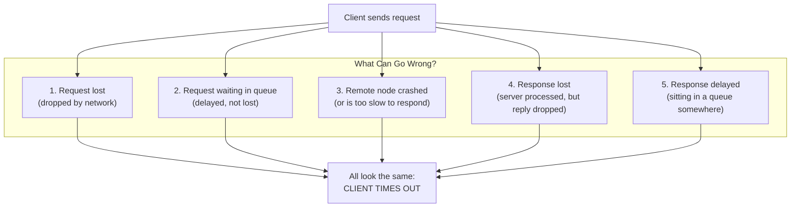
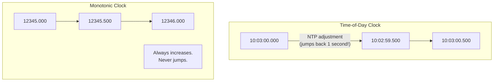
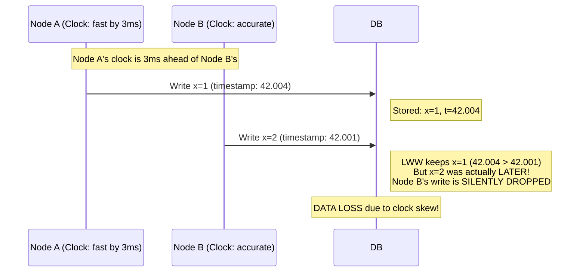
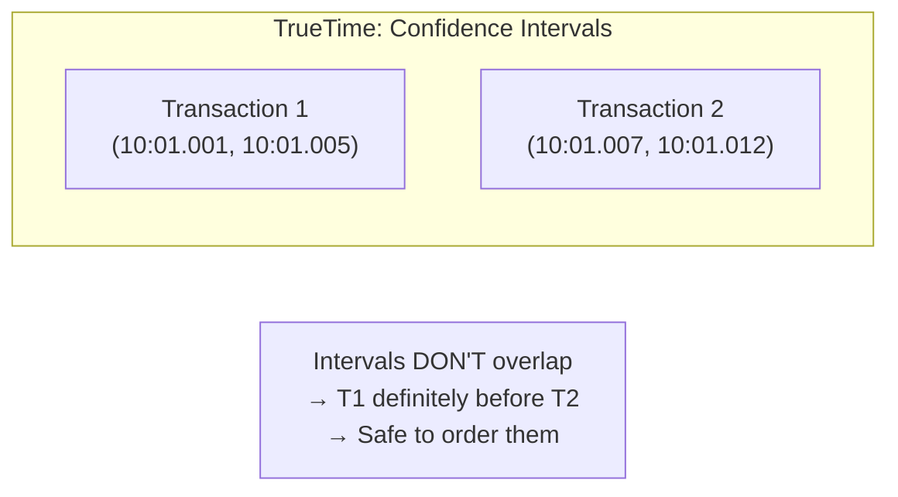
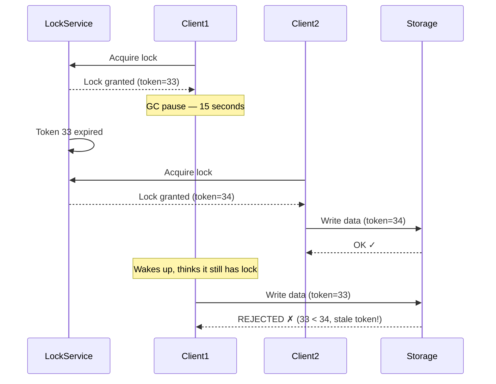

# Chapter 08: The Trouble with Distributed Systems

> **Part of Part II: Distributed Data**  
> *Designing Data-Intensive Applications* by Martin Kleppmann — Comprehensive Technical Reference

---

## Chapter Overview
The physical realities of distributed computing: Unreliable networks (unbounded packet delays, timeouts), Unreliable physical clocks (NTP drift, LWW data loss, Google TrueTime), Process pauses (GC pauses), Quorum truths, Fencing tokens, and Byzantine fault models.

---

### 8.1 Faults and Partial Failures

**Single computer**: Deterministic — either works perfectly or crashes completely. A single hardware fault usually causes total system failure.

**Distributed system**: **Partial failures** are the norm — some parts work, others don't, and you may not even know which. The system must continue working despite partial failures.

| Philosophy | Approach | Example |
|-----------|----------|---------|
| **HPC** | Treat cluster as single computer. Checkpoint state, crash everything on failure, restart from checkpoint. | Supercomputer simulations |
| **Cloud / Internet** | Embrace partial failures. Build reliability from unreliable components. No global state. | Web services, databases |

---

### 8.2 Unreliable Networks

Distributed systems use **shared-nothing** architecture communicating over the **network**. The network is the source of most problems.

**When a timeout occurs, you don't know whether:**
- The request was never delivered
- The request is sitting in a queue
- The server processed it but the response was lost
- The server is slow and will eventually respond

This ambiguity is the fundamental problem of distributed systems.

#### Timeouts and Unbounded Delays

**No correct timeout value exists.** Networks have unbounded delays due to:

| Source of Delay | Explanation |
|----------------|-------------|
| **Network congestion** | Switch buffers full, packets queued or dropped |
| **TCP flow control** | Receiver tells sender to slow down, backpressure |
| **Noisy neighbors** | Multi-tenant cloud: other VMs consume bandwidth |
| **TCP retransmission** | Lost packet → TCP retransmits after timeout (seconds) |
| **Head-of-line blocking** | One slow packet in a TCP stream delays all subsequent packets |

#### Synchronous vs Asynchronous Networks

**Telephone network** (circuit-switched): A call establishes a **reserved circuit** with guaranteed bandwidth end-to-end. Bounded delay, guaranteed quality. BUT wastes bandwidth when silent.

**Internet** (packet-switched): No reserved bandwidth. **Statistical multiplexing** — share bandwidth among all users. Much more efficient for bursty traffic, but **unbounded delays**.

> [!NOTE]
> We chose the internet over circuit-switched networks because TCP/IP is far more efficient for bursty traffic patterns (web browsing, email, file transfer). The tradeoff is living with unbounded delays.

---

### 8.3 Unreliable Clocks

Each machine has its own clock (quartz oscillator). Clocks drift apart. NTP can synchronize them, but only approximately.

#### Two Types of Clocks

| Type | Purpose | Behavior | Example |
|------|---------|----------|---------|
| **Time-of-day clock** | "What time is it now?" | May jump forward/backward on NTP sync. Resolution varies. Not suitable for measuring durations. | `System.currentTimeMillis()`, `clock_gettime(CLOCK_REALTIME)` |
| **Monotonic clock** | "How much time has elapsed?" | Always moves forward. Only meaningful on the same machine. Different machines have different origins. | `System.nanoTime()`, `clock_gettime(CLOCK_MONOTONIC)` |

#### Clock Synchronization Problems

| Problem | Magnitude |
|---------|-----------|
| NTP over internet | ~35ms accuracy |
| NTP on LAN | ~1ms accuracy |
| Quartz drift | ~200ppm → 17 seconds per day |
| Leap seconds | Clock may jump ±1 second (has crashed systems) |
| VM clock | Paused during live migration or host overload |
| Mobile devices | May not have reliable NTP, user can manually change time |
| GPS receivers | Microsecond accuracy but expensive, antenna issues |

#### Timestamps for Ordering Events — The LWW Problem

> [!CAUTION]
> **LWW (Last Write Wins) with timestamps is fundamentally broken** when clocks are not perfectly synchronized. Cassandra, Riak, and other leaderless databases use LWW by default — they can silently lose data.

#### Google's TrueTime API

Google's solution: don't pretend clocks are precise. Instead, expose the **uncertainty**.

**Spanner's commit wait**: After committing, wait until the confidence interval has passed before reporting success. This guarantees that if two transactions' intervals don't overlap, the database knows their ordering.

#### Process Pauses

A thread may be paused for an **arbitrarily long time** at any point:

| Cause | Duration |
|-------|----------|
| GC pause (full GC) | Tens of milliseconds to tens of seconds (Java, .NET) |
| VM live migration | Seconds of pause |
| OS context switch | Milliseconds |
| Disk I/O (swapping/paging) | Milliseconds to seconds |
| `SIGSTOP` / debugger | Minutes |

**Example attack**: Thread acquires a lease/lock, gets paused by GC, lease expires, another thread acquires the lock. First thread wakes up thinking it still holds the lock → **UNSAFE WRITES**.

---

### 8.4 Knowledge, Truth, and Lies

#### The Truth Is Defined by the Majority

A node cannot trust its own judgment ("I'm alive, I hold the lock"). Only a **quorum** (majority of nodes) can make decisions.

**Fencing tokens** prevent stale locks:

#### Byzantine Faults

What if a node doesn't just crash but **lies** — sends incorrect or malicious responses?

- **Aerospace**: Hardware errors (cosmic rays flipping bits) → need BFT
- **Blockchain**: Nodes may be adversaries → need BFT
- **Datacenter**: Nodes are controlled by same organization → BFT usually NOT needed

**Weak Byzantine fault tolerance** (common even in non-Byzantine systems):
- Checksums to detect corrupted data
- Input validation (NTP client sanity-checks server responses)
- Multiple NTP servers to detect outliers

#### System Models

| Timing Model | Assumptions |
|-------------|-------------|
| **Synchronous** | Bounded network delay, bounded clock error, bounded process pause. Unrealistic. |
| **Partially synchronous** | Usually behaves like synchronous, but SOMETIMES exceeds bounds. **Realistic.** |
| **Asynchronous** | No timing assumptions at all. Very restrictive; most algorithms can't work here. |

| Failure Model | Assumptions |
|-------------|-------------|
| **Crash-stop** | Node can crash, never comes back. |
| **Crash-recovery** | Node can crash, may come back later with durable storage intact. **Realistic.** |
| **Byzantine** | Node can do absolutely anything, including lying. Most expensive to handle. |

**Safety vs Liveness:**
- **Safety**: "Nothing bad happens" (e.g., no data corruption, no two nodes think they're leader)
- **Liveness**: "Something good eventually happens" (e.g., a request eventually gets a response)

Algorithms must guarantee safety **always** (even under faults) and liveness **eventually** (assuming faults are eventually resolved).

---
