# Chapter 09: Consistency & Consensus - Linearizability to Raft

> **Part of Part II: Distributed Data**  
> *Designing Data-Intensive Applications* by Martin Kleppmann — Comprehensive Technical Reference

---

## Chapter Overview
Linearizability vs Serializability, the real CAP theorem, Total Order Broadcast, Two-Phase Commit (2PC) blocking hazards, and an exhaustive production Deep Dive into the Raft Consensus Algorithm (etcd, Kubernetes, KRaft).

---

### 9.1 Consistency Guarantees

**Eventual consistency** (the weakest useful guarantee): If you stop writing and wait long enough, all replicas will eventually converge. "Eventually" could be milliseconds or hours — no guarantee on when.

This is too weak for many applications. We need stronger guarantees.

---

### 9.2 Linearizability

**The strongest single-object consistency model**: A system behaves as if there is only ONE copy of the data, and all operations are atomic.

**Formally**: Once any read returns a new value, ALL subsequent reads (from ANY client) must also return the new value.

```mermaid
sequenceDiagram
    participant ClientA
    participant ClientB
    participant ClientC
    participant Register

    ClientA->>Register: write("x=1")
    Note over Register: ← Linearization point →
    Register-->>ClientA: OK

    ClientB->>Register: read("x")
    Register-->>ClientB: x=1 ✓

    ClientC->>Register: read("x")
    Register-->>ClientC: x=1 ✓ (MUST return 1, not 0)

    Note over Register: Once ANY read returns 1,<br/>ALL subsequent reads MUST return 1
```

#### Linearizability vs Serializability

| Concept | What it is | Scope |
|---------|-----------|-------|
| **Serializability** | Transaction isolation — result is same as some serial ordering | Multiple objects, entire transactions |
| **Linearizability** | Recency guarantee — reads see most recent write | Single object operations |
| **Strict serializability** | Both combined: serializable AND linearizable | Best of both; used by some systems |

#### Where Linearizability is Needed

1. **Leader election**: ZooKeeper, etcd use linearizable locks. If the lock is NOT linearizable, you could have two leaders (split-brain).

2. **Uniqueness constraints**: Usernames, file paths, bank account numbers must be globally unique. Requires a linearizable compare-and-set.

3. **Cross-channel timing dependencies**:

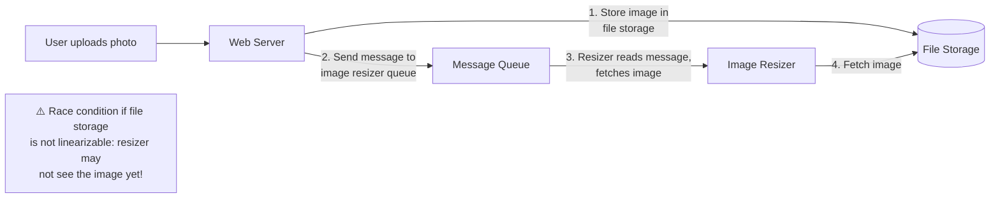

#### Implementing Linearizability

| Approach | Linearizable? | Notes |
|----------|--------------|-------|
| **Single-leader (reads from leader)** | Potentially ✓ | Only if reads go to leader; not if reads from async followers |
| **Consensus algorithms (ZooKeeper, etcd)** | ✓ | By design |
| **Multi-leader** | ✗ | Concurrent writes at different leaders → conflicts |
| **Leaderless (Dynamo-style)** | Probably ✗ | Even with quorums: sloppy quorums, read repair timing |

#### The Cost of Linearizability — CAP Theorem

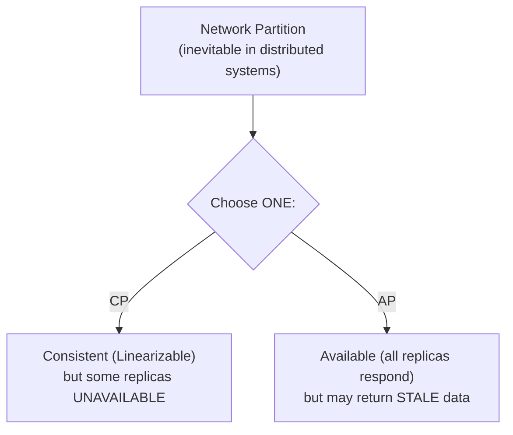

> [!IMPORTANT]
> **Better way to think about CAP**: It's not really about choosing 2 of 3. It's about: **when a network partition occurs**, do you choose consistency or availability? Without partitions, you can have both.
>
> But even without partitions, linearizability has a performance cost. Many systems choose NOT to be linearizable for **performance reasons**, not fault tolerance.

---

### 9.3 Ordering Guarantees

#### Causality

**Causal ordering** is a **partial order**: some events are ordered (one caused the other), others are **concurrent** (independent, no causal link).

**Linearizability implies causal consistency** (total order implies partial order), but causal consistency is WEAKER than linearizability — and has better performance properties.

> [!TIP]
> **Causal consistency is the strongest consistency model that doesn't sacrifice performance for network delays.** It's a sweet spot between eventual consistency and linearizability.

#### Lamport Timestamps

Every node has a counter. Each operation increments it. When nodes communicate, they sync counters: `max(local, received) + 1`.

Result: a **total order** — for any two operations, one has a greater Lamport timestamp.

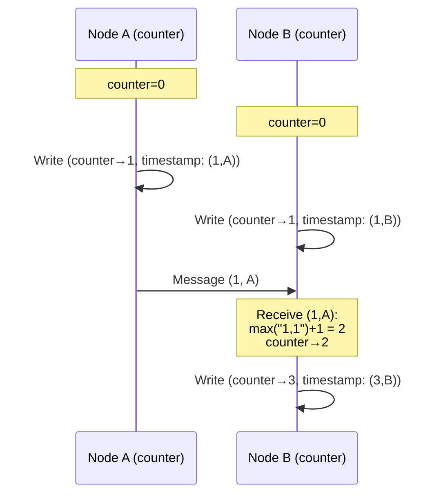

**Problem with Lamport timestamps**: They provide total order but you can only determine the order **after the fact**. You can't use them for **real-time decisions** like "check if this username is taken" — by the time you check, another node may have claimed it.

#### Total Order Broadcast

A protocol guaranteeing:
1. **Reliable delivery**: If a message is delivered to one node, it's delivered to ALL nodes
2. **Totally ordered delivery**: All nodes receive messages in the SAME order

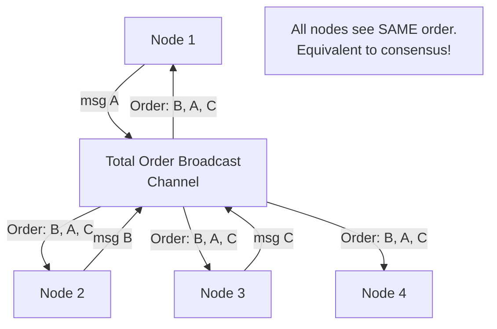

**Total order broadcast ↔ Consensus ↔ Linearizable register**: These are all **equivalent problems**. Solving one solves the others.

**Used by**: ZooKeeper (Zab protocol), etcd (Raft), Kafka (within a partition).

---

### 9.4 Distributed Transactions and Consensus

**Consensus = all nodes agree on a value.** The FLP impossibility result proves that **no deterministic algorithm can guarantee consensus in an asynchronous system with even one possible crash.** BUT practical algorithms work by using **timeouts** (partially synchronous model).

#### 9.4.1 Two-Phase Commit (2PC)

Guarantees **atomic commit** across multiple nodes — either ALL nodes commit or ALL abort.

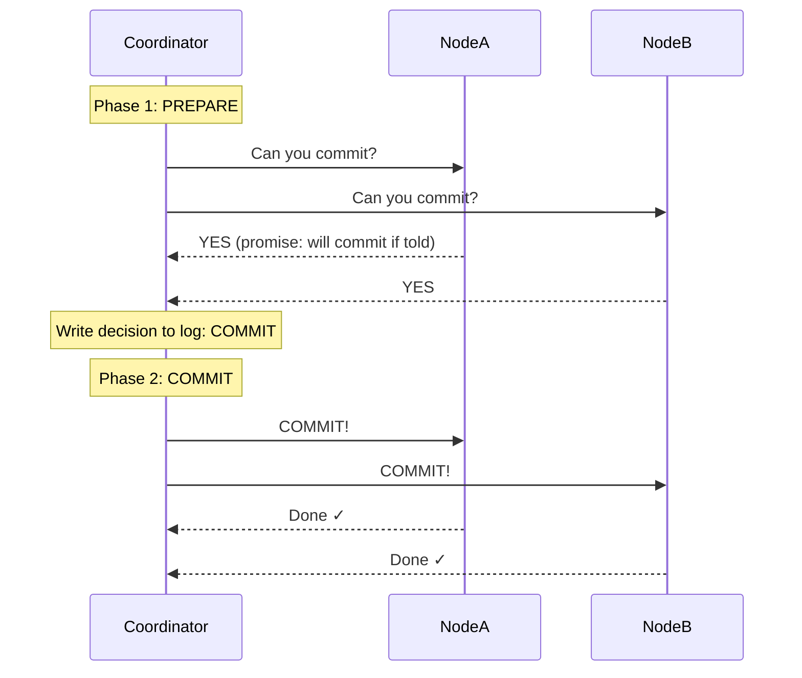

**The blocking problem — coordinator failure:**

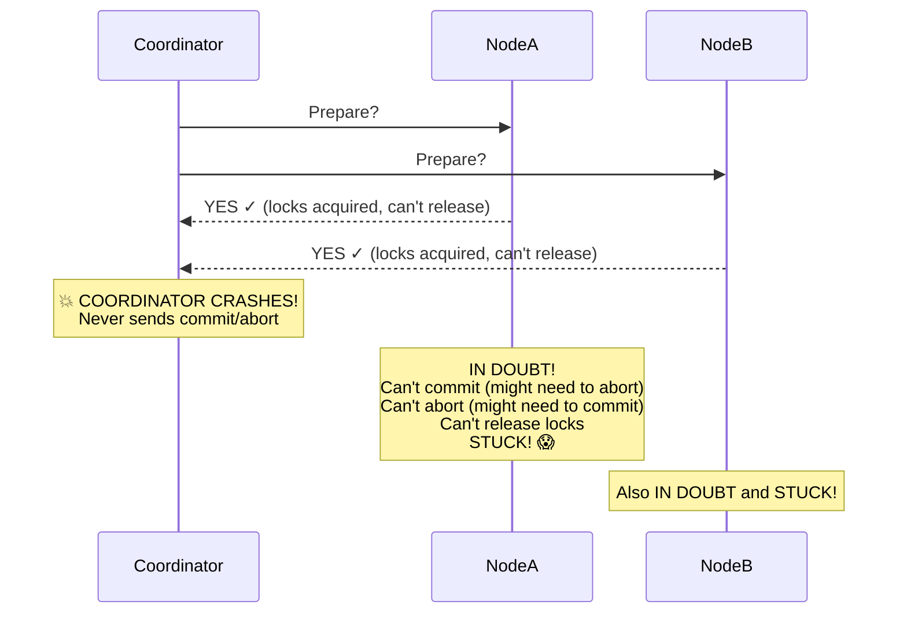

The only way to resolve: wait for the coordinator to recover and read its decision log. This could take minutes or hours if the coordinator's disk needs to be repaired.

**Three-phase commit (3PC)**: Theoretically avoids blocking, but assumes bounded network delays — impractical in real networks.

#### 9.4.2 XA Transactions

**X/Open XA** is a standard for distributed transactions across heterogeneous systems.

Supported by: PostgreSQL, MySQL, Oracle, SQL Server, ActiveMQ, MSMQ.

**Problems with XA:**
- Coordinator's log is a critical system — if lost, participants are stuck
- Locks held during "in doubt" state → blocks other transactions → kills performance
- Doesn't work across heterogeneous technologies (e.g., can't do XA between PostgreSQL and Elasticsearch)

#### 9.4.3 Fault-Tolerant Consensus

Algorithms: **Viewstamped Replication (VSR)**, **Paxos**, **Raft**, **Zab**

**Properties:**
1. **Uniform agreement**: All nodes decide the same value
2. **Integrity**: No node decides twice
3. **Validity**: The decided value was proposed by some node
4. **Termination**: Every non-crashed node eventually decides (liveness)

**How they work** (simplified):

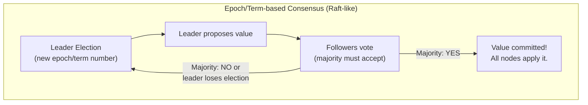

**The leader sends a proposal to all nodes. If a quorum (majority) accepts, the value is committed.** If the leader fails, a new election produces a new leader with a higher epoch number. Nodes reject proposals from old epochs.

**Limitations of consensus:**
- **Performance**: Synchronous replication within quorum → latency
- **Minimum 3 nodes** to tolerate 1 failure (5 to tolerate 2)
- **Stable leader needed**: Frequent leader elections degrade performance
- **Network-sensitive**: Bad network causes frequent timeouts → frequent elections → instability

#### 9.4.4 Membership and Coordination Services

**ZooKeeper** and **etcd** are NOT general-purpose databases. They are **coordination services** providing:

| Feature | What it enables |
|---------|-----------------|
| **Linearizable atomic operations** | Compare-and-set for leader election, locking |
| **Total ordering of operations** | Fencing tokens, consistent ordering |
| **Failure detection** | Ephemeral nodes: heartbeat-based session, node auto-deleted on crash |
| **Change notifications (watches)** | Clients subscribe to changes, get notified immediately |

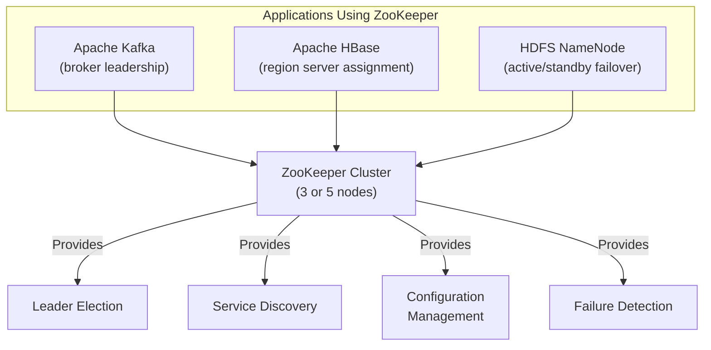

**ZooKeeper is NOT a database**: It's designed for small amounts of data that change infrequently but require strong consistency. It holds metadata about which node is the leader, what the cluster membership is, what the configuration is — NOT application data.

**Use cases for coordination services:**
1. **Leader election**: Only one node is the leader at any time
2. **Service discovery**: Which nodes are alive and serving which partitions?
3. **Membership**: Which nodes are in the cluster?
4. **Work allocation**: Which worker node should process which partition/job?

---

## 9.5 Deep Dive: The Raft Consensus Algorithm in Depth

Chapter 9 establishes that consensus is the foundational primitive of distributed systems: solving consensus solves linearizable registers, total order broadcast, atomic commit, and leader election. While Martin Kleppmann surveys consensus families (Paxos, Raft, Zab, VSR), production cloud-native infrastructure—most notably **Kubernetes (etcd)**, **HashiCorp Consul**, **CockroachDB**, and **Apache Kafka (KRaft)**—relies on **Raft**.

This section provides an exhaustive, production-grade examination of the Raft consensus algorithm, its mathematical safety invariants, wire RPC specifications, edge-case failure modes, and linearizable read protocols.

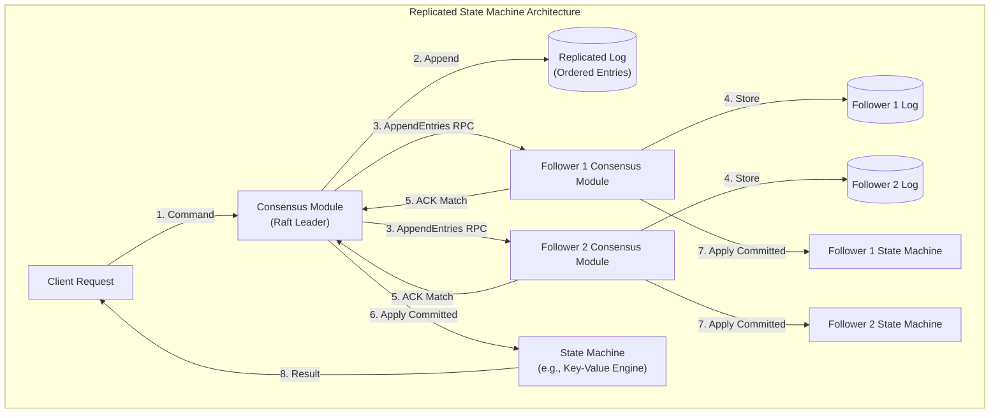

---

### 9.5.1 Historical Context: Why Raft Was Needed

For over two decades, **Paxos** (Leslie Lamport, 1998) was synonymous with distributed consensus. However, Paxos suffered from severe practical liabilities:
1. **Extreme Opacity**: Paxos is notoriously difficult to understand, reason about, and teach.
2. **Implementation Gaps**: Classic Paxos defines consensus on a single value (Single-Decree Paxos). Extending it to an ordered log (Multi-Paxos) leaves enormous architectural gaps. In Google's seminal paper *"Paxos Made Live — An Engineering Perspective"* (Chandra et al., 2007), the engineers noted:
   > *"There are significant gaps between the description of the Paxos algorithm and the needs of a real-world system... The final system will be based on an unproven protocol."*

In 2014, Diego Ongaro and John Ousterhout (Stanford University) published *"In Search of an Understandable Consensus Algorithm"*, introducing **Raft**. Raft was designed with **understandability** as an explicit design goal, achieved by decomposing consensus into three strictly independent subproblems:
1. **Leader Election**: Selecting a single leader among nodes when the current leader fails.
2. **Log Replication**: The leader accepts log entries from clients and forces followers' logs to match its own.
3. **Safety**: Enforcing state machine invariants to guarantee that no node ever applies a conflicting log entry at the same index.

---

### 9.5.2 Server Roles, Term Numbers, and State Transitions

At any given moment, every server in a Raft cluster exists in exactly one of three states:

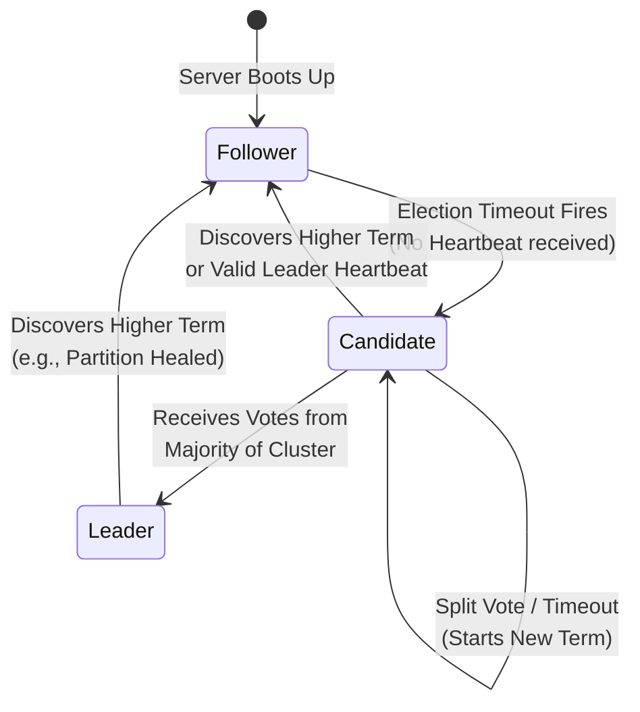

| Role | Responsibilities |
| :--- | :--- |
| **Follower** | Completely passive. Does not issue requests on its own; responds to incoming `AppendEntries` (from Leaders) and `RequestVote` (from Candidates). If it receives no communication within its election timeout, it assumes the leader is dead and transitions to Candidate. |
| **Candidate** | Active during an election. Increments the term counter, votes for itself, and broadcasts `RequestVote` RPCs to all peers. Stays in Candidate state until it wins the election, another server wins, or a timeout occurs with no winner. |
| **Leader** | Handles all client requests. Appends commands to its local log and coordinates replication across followers via `AppendEntries` RPCs. Sends periodic empty heartbeats to maintain authority and prevent elections. |

#### Term Numbers as Logical Clocks
Time in Raft is partitioned into arbitrary-length **Terms**, identified by contiguous, monotonically increasing integers ($T_1, T_2, T_3, \dots$).
- Terms act as **Lamport logical clocks**, enabling nodes to detect obsolete information:
  - If a server receives a message with a term number **greater** than its current term, it immediately updates its current term and reverts to **Follower** state (even if it was a Leader!).
  - If a server receives a message with a term number **smaller** than its current term, it immediately rejects the message as stale.

#### Randomized Election Timeouts
If multiple followers timeout simultaneously, they become candidates at the exact same moment, vote for themselves, split the remaining votes evenly, and trigger a **split-vote livelock**.

Raft eliminates split votes using **Randomized Election Timeouts**:
- Election timeouts are chosen randomly from a fixed range (typically **150ms – 300ms**).
- Because timeouts are randomized, one node will almost always time out before its peers.
- That node increments its term, broadcasts `RequestVote` RPCs, and collects a majority of votes before any other node's timer expires.
- **Timing Requirement**:
  $$\text{Broadcast Time (0.5–20ms)} \ll \text{Election Timeout (150–300ms)} \ll \text{Mean Time Between Failures (Months)}$$

---

### 9.5.3 The Five Essential Raft Safety Invariants

The mathematical correctness of Raft rests on five inviolable safety properties:

| Safety Invariant | Formal Guarantee |
| :--- | :--- |
| **1. Election Safety** | At most one leader can be elected in any given term. |
| **2. Leader Append-Only** | A leader never overwrites or truncates its own log entries; it only appends new entries. |
| **3. Log Matching Property** | If two logs contain an entry with the same index and term, then they are identical in all entries up to that index. |
| **4. Leader Completeness** | If a log entry is committed in a given term, that entry is guaranteed to be present in the logs of the leaders for all higher-numbered terms. |
| **5. State Machine Safety** | If a server has applied a log entry at a given index to its state machine, no other server will ever apply a different log entry for that index. |

---

### 9.5.4 Full Wire Protocol & RPC Specifications

Raft nodes communicate using two primary Remote Procedure Calls (RPCs), plus an auxiliary snapshot RPC:

#### 1. `RequestVote RPC`
Invoked by Candidates to gather votes during an election.

**Arguments:**
- `term`: Candidate’s current term.
- `candidateId`: Identifier of candidate requesting vote.
- `lastLogIndex`: Index of candidate’s last log entry.
- `lastLogTerm`: Term of candidate’s last log entry.

**Results:**
- `term`: Current term of receiver, for candidate to update itself.
- `voteGranted`: Boolean flag (`true` if vote granted, `false` otherwise).

**Receiver Implementation Rules:**
1. **Term Check**: If `term < currentTerm`, return `(currentTerm, false)`.
2. **Vote Eligibility**: If `votedFor` is `null` or matches `candidateId`, AND candidate's log is **at least as up-to-date** as receiver’s log, grant vote:
   - *Log Up-to-Date Test*:
     - If candidate and receiver have different `lastLogTerm`, the one with the **larger term** is more up-to-date.
     - If both logs end with the same term, the log with the **larger `lastLogIndex`** (longer log) is more up-to-date.
     - If receiver's log is strictly more up-to-date, deny vote (`false`).

---

#### 2. `AppendEntries RPC`
Invoked by the Leader to replicate log entries and periodically send empty heartbeats.

**Arguments:**
- `term`: Leader’s current term.
- `leaderId`: Leader's identifier (so followers can redirect clients).
- `prevLogIndex`: Index of log entry immediately preceding new ones.
- `prevLogTerm`: Term of entry at `prevLogIndex`.
- `entries[]`: Log entries to store (empty for heartbeat; may send multiple for replication).
- `leaderCommit`: Leader’s current `commitIndex`.

**Results:**
- `term`: Current term of receiver, for leader to update itself.
- `success`: Boolean flag (`true` if follower contained entry matching `prevLogIndex` and `prevLogTerm`).
- `matchIndex`: (Optimization) The index of the highest entry confirmed written on follower.

**Receiver Implementation Rules:**
1. **Term Check**: If `term < currentTerm`, return `(currentTerm, false)`.
2. **Consistency Check**: If receiver's log doesn't contain an entry at `prevLogIndex` matching `prevLogTerm`, return `(currentTerm, false)`. (This enforces the Log Matching Property!).
3. **Conflict Resolution**: If an existing entry conflicts with a new entry (same index but different terms), **truncate the existing log** from that index onward to delete all conflicting entries!
4. **Append New Entries**: Append any new entries not already in the log.
5. **Update Commit Index**: If `leaderCommit > commitIndex`:
   $$\text{commitIndex} = \min(\text{leaderCommit}, \text{index of last new entry})$$
   Apply newly committed entries to the state machine in log order!

---

#### 3. `InstallSnapshot RPC`
Invoked by the Leader to send chunks of a state machine snapshot to a follower that has fallen too far behind.

**Arguments:**
- `term`: Leader's term.
- `leaderId`: Leader's ID.
- `lastIncludedIndex`: The snapshot replaces all entries up to and including this index.
- `lastIncludedTerm`: Term of `lastIncludedIndex`.
- `offset`: Byte offset where chunk is positioned in snapshot file.
- `data[]`: Raw binary bytes of snapshot chunk.
- `done`: `true` if this is the final chunk.

**Results:**
- `term`: Current term of receiver.

---

### 9.5.5 Log Replication Mechanics & The Figure 8 Anomaly

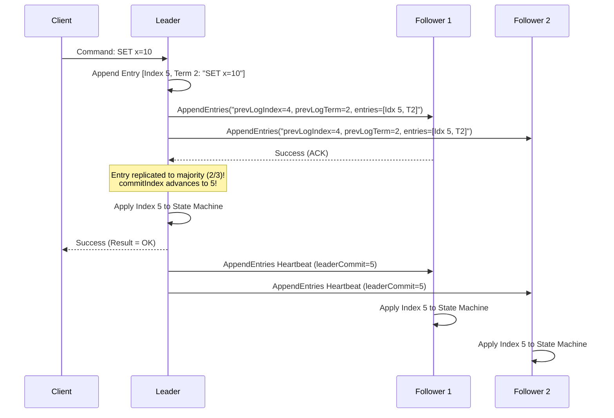

#### Log Repair Protocol
A leader maintains two state variables for each follower:
- `nextIndex[peer]`: Index of the next log entry the leader will send to that follower (initialized to `leader's lastLogIndex + 1`).
- `matchIndex[peer]`: Highest known index replicated on that follower (initialized to 0).

If a follower's log is inconsistent with the leader:
1. The leader sends `AppendEntries` with `prevLogIndex = nextIndex[peer] - 1`.
2. The follower rejects the RPC because the entry at `prevLogIndex` does not match `prevLogTerm`.
3. The leader decrements `nextIndex[peer]` by 1 and retries `AppendEntries`.
4. This decrements backwards until reaching an index where the follower's log and leader's log match.
5. The follower accepts the RPC, overwrites all subsequent conflicting entries with the leader's entries, and returns `success = true`.
6. The leader updates `matchIndex[peer] = prevLogIndex + len(entries)` and advances `nextIndex[peer]`.

#### The Critical Safety Rule: Figure 8 in Ongaro & Ousterhout

A fundamental subtlety in Raft involves committing log entries from *prior terms*:

> [!CAUTION]
> **The Prior-Term Commitment Rule**:
> A leader **CANNOT** mark an entry from a *previous term* as committed simply by counting that it has reached a majority of servers! A leader may only advance its `commitIndex` for an entry from its **current term** by counting replicas.

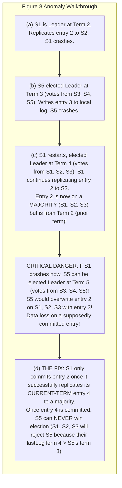

**Why this rule is essential**:
If a leader could commit a prior-term entry simply by observing that it resides on a majority of nodes, an older candidate with a higher term could still win an election (because its log might be considered "more up-to-date" under the voting rules) and overwrite the supposedly committed entry!

**The Raft Invariant**:
- An entry from a previous term is committed **indirectly**: the leader commits an entry from its *current term*, which transitively commits all preceding entries by virtue of the **Log Matching Property**.

---

### 9.5.6 Cluster Membership Changes & Joint Consensus

In real systems, cluster membership changes (adding a node, decommissioning a node, replacing a failed disk). If nodes switch configurations at different times, the cluster risks forming **two independent majorities** during the transition, leading to split-brain.

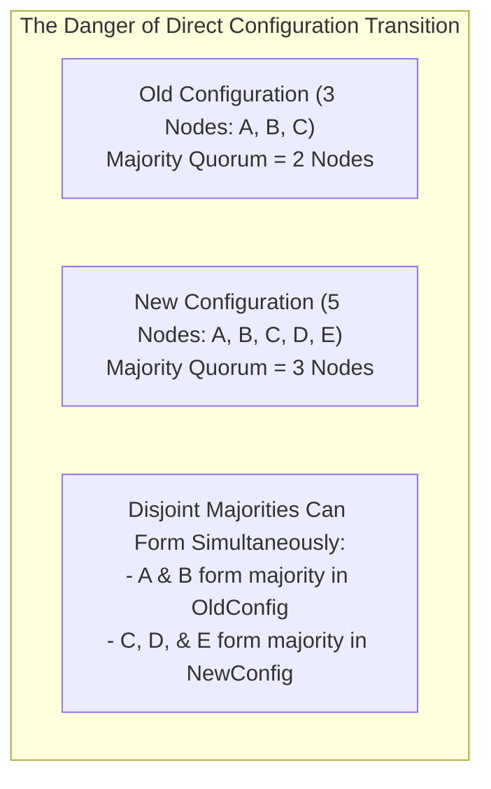

To prevent this, Raft supports two configuration change mechanisms:

#### 1. Joint Consensus ($C_{\text{old,new}}$)
Raft transitions through an intermediate phase called **Joint Consensus**:
1. Leader receives request to change configuration from $C_{\text{old}}$ to $C_{\text{new}}$.
2. Leader appends a configuration entry for $C_{\text{old,new}}$ to its log and replicates it.
3. While $C_{\text{old,new}}$ is active, **any decision (elections, log commitment) requires independent majorities from BOTH $C_{\text{old}}$ AND $C_{\text{new}}$**.
4. Once $C_{\text{old,new}}$ is committed to a majority of both configurations:
   - The leader creates and replicates a $C_{\text{new}}$ configuration entry.
   - Once $C_{\text{new}}$ is committed, old nodes not in $C_{\text{new}}$ can be safely shut down.

#### 2. Single-Server Membership Changes
An optimization introduced by Ongaro in his PhD thesis:
- Restrict cluster membership changes to **adding or removing one server at a time**.
- Because the cluster size changes by at most $\pm 1$, it is mathematically impossible for any two majorities of $C_n$ and $C_{n+1}$ to be disjoint!
- This eliminates the need for Joint Consensus in standard scale-up/scale-down operations.

---

### 9.5.7 Log Compaction & Memory Snapshots

As a system runs, an append-only log grows indefinitely, eventually exhausting disk space and making recovery replay painfully slow.

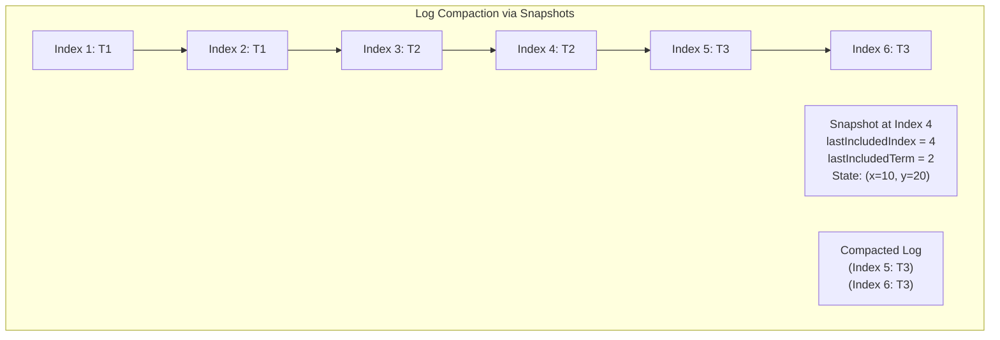

#### Snapshot Protocol:
1. The deterministic State Machine writes its in-memory state to an immutable snapshot file on disk.
2. The snapshot records two critical metadata values:
   - `lastIncludedIndex`: The highest log index applied to the state machine at the snapshot cutoff.
   - `lastIncludedTerm`: The term of the log entry at `lastIncludedIndex`.
3. Once the snapshot is persisted, the Raft consensus module safely discards all log entries from index 1 through `lastIncludedIndex`.
4. If a follower crashes and stays down for days, the leader may have already discarded the log entries needed to bring that follower up to date. In this scenario, the leader invokes `InstallSnapshot RPC`, streaming the snapshot directly to the follower to bring it immediately to `lastIncludedIndex`.

---

### 9.5.8 Linearizable Read Semantics in Raft

Client reads must be **linearizable**: a read must return the state as of a point in time after the read request was issued. If client reads simply queried the local state machine of the current leader, the system could return **stale data** under a network partition:

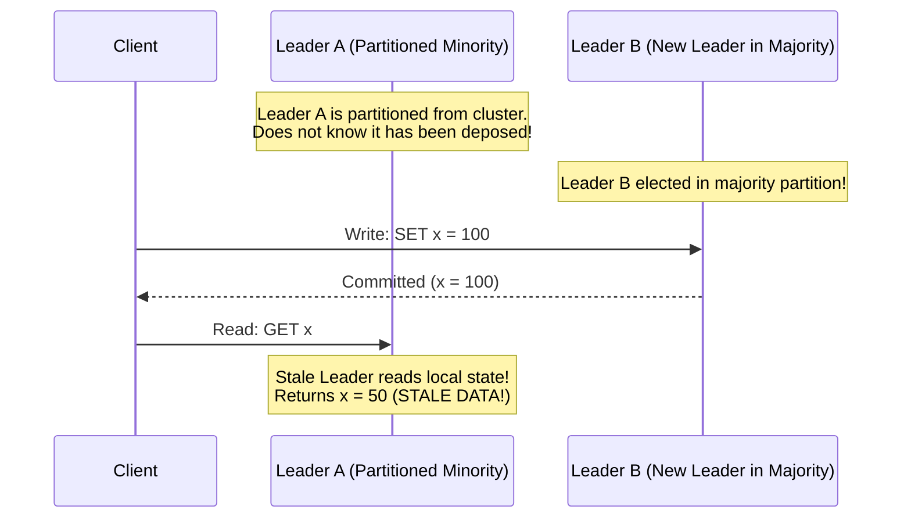

To prevent returning stale reads without routing every read through the disk write-log, Raft provides three linearizable read protocols:

#### 1. Log-Backed Reads (Naive)
- The read request is appended as a dummy no-op entry into the Raft log.
- It is replicated to a quorum and committed before returning the value.
- **Verdict**: Strictly linearizable, but imposes severe disk I/O and network overhead on read-heavy workloads.

#### 2. The Read-Index Protocol (Production Standard in etcd)
1. When a read arrives, the leader records its current `commitIndex` as `readIndex`.
2. The leader broadcasts an empty heartbeat (`AppendEntries`) to a majority of the cluster to confirm that it is still the legitimate leader.
3. Once the majority acknowledges the heartbeat, the leader knows it was still leader at the time of the read request.
4. The leader waits until its state machine has applied all log entries up to `readIndex`.
5. The leader queries its local state machine and returns the result to the client.
6. **Verdict**: Zero disk I/O; linearizable; requires only a single network round-trip of lightweight heartbeats.

#### 3. Lease Reads (Clock-Bound Optimization)
- The leader assumes it remains the valid leader for a bounded duration (the **Election Timeout Lease**) after successfully sending heartbeats to a majority.
- During this lease, the leader serves reads directly from its local state machine without issuing network heartbeats.
- **Verdict**: Blazing fast ($0$ network round trips).
- **Hazard**: Relies on bounded physical clock drift. If the leader's clock runs slow or suffers a VM hypervisor pause, the lease may have expired on peer nodes while the leader still believes it is valid, violating linearizability.

#### 4. Follower Reads (Read Scaling)
- Clients can send reads to any follower.
- The follower requests the current `readIndex` from the leader.
- The follower waits until its local state machine applies entries up to that `readIndex`, and then serves the read locally.
- **Verdict**: Offloads read throughput across the entire cluster while maintaining strict linearizability!

---

### 9.5.9 Consensus Comparison & Production Landscape

| Dimension | Raft | Multi-Paxos | Zab (ZooKeeper) | Viewstamped Replication (VSR) |
| :--- | :--- | :--- | :--- | :--- |
| **Primary Architecture** | Strong Leader with Append-Only Log | Leader-driven with recovery phase | Primary-Backup with FIFO order | Primary-Backup with View Changes |
| **Understandability** | High (decomposed subproblems) | Low (subtle theoretical invariants) | Moderate (custom protocol) | Moderate (academic specification) |
| **Log Holes** | Disallowed (dense log, no gaps) | Allowed (can commit out of order) | Disallowed (strict incremental zxid)| Disallowed (dense log) |
| **Leader Election** | Candidacy with log freshness check | Prepare phase selects leader | Fast Leader Election (ZAB FLE) | View Change protocol |
| **Production Implementations**| **etcd, Consul, CockroachDB, TiKV, Kafka KRaft** | Google Chubby, Spanner, Megastore | Apache ZooKeeper | MIT Harp, Boxwood |

#### Notable Production Implementations:
1. **etcd (Go)**:
   - The distributed key-value store underpinning **Kubernetes**.
   - Implements Raft as a pure, deterministic state machine library (`go.etcd.io/etcd/raft`), decoupling networking and disk I/O from consensus logic.
   - Employs Read-Index to serve millions of Kubernetes API server watch queries per second.

2. **CockroachDB (Multi-Raft Architecture)**:
   - Instead of a single cluster-wide Raft group, CockroachDB divides the entire relational dataset into **64MB Ranges**.
   - Each Range is an independent 3-node or 5-node Raft consensus group.
   - A single machine may participate in tens of thousands of distinct Raft groups simultaneously, achieving massive horizontal scale.

3. **Apache Kafka (KRaft Mode - KIP-500)**:
   - Replaced Apache ZooKeeper with an event-driven internal Raft metadata quorum (KRaft).
   - Unifies Kafka’s streaming architecture by running metadata management directly on Kafka brokers, scaling cluster topic partition limits from $200,000$ to **over $2,000,000$**.

---
