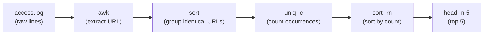
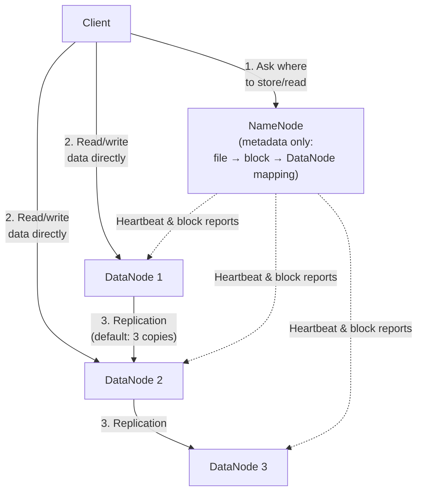
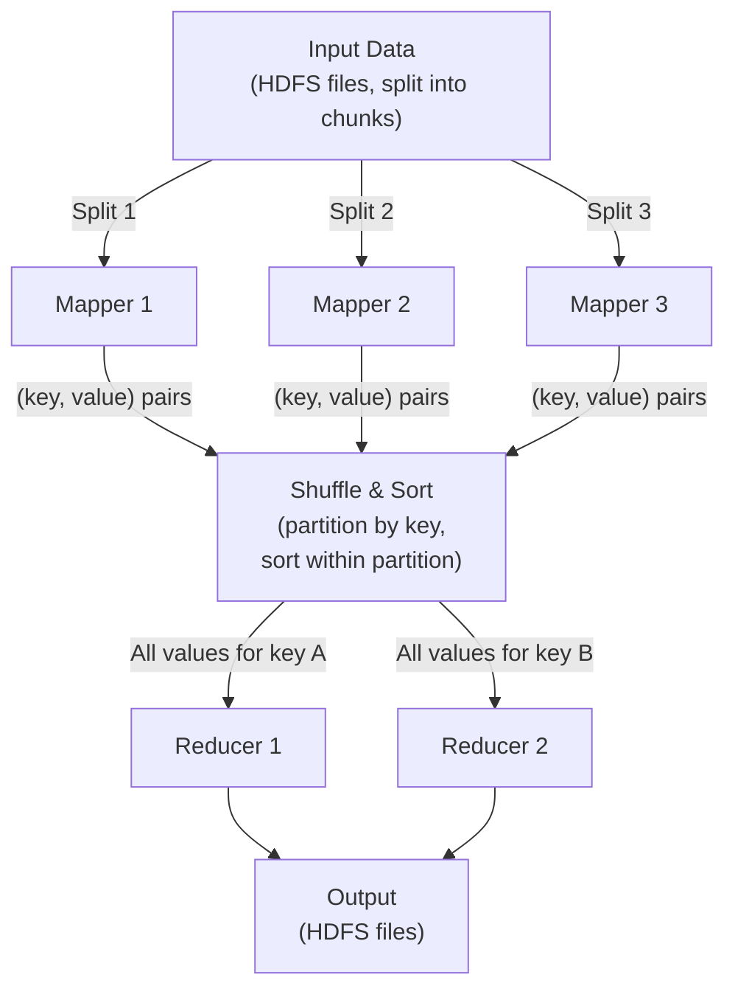
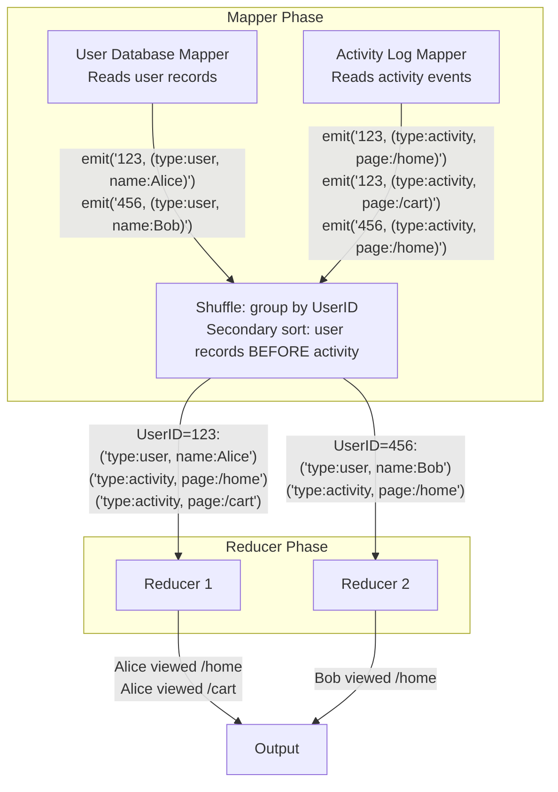
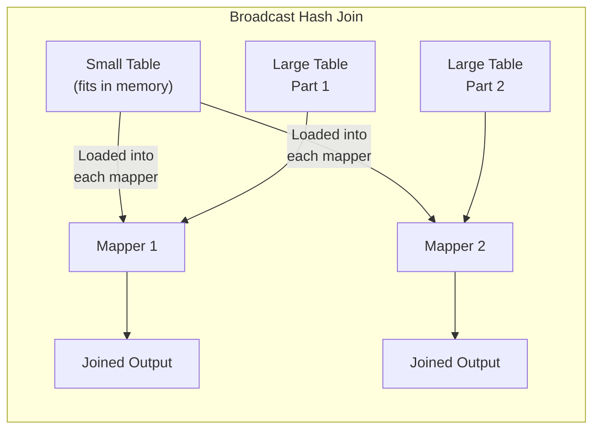
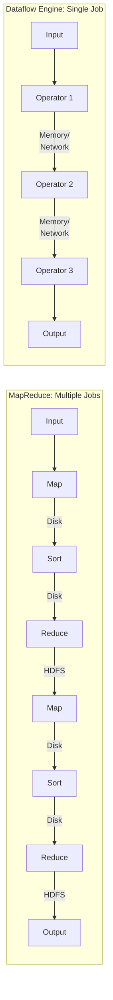
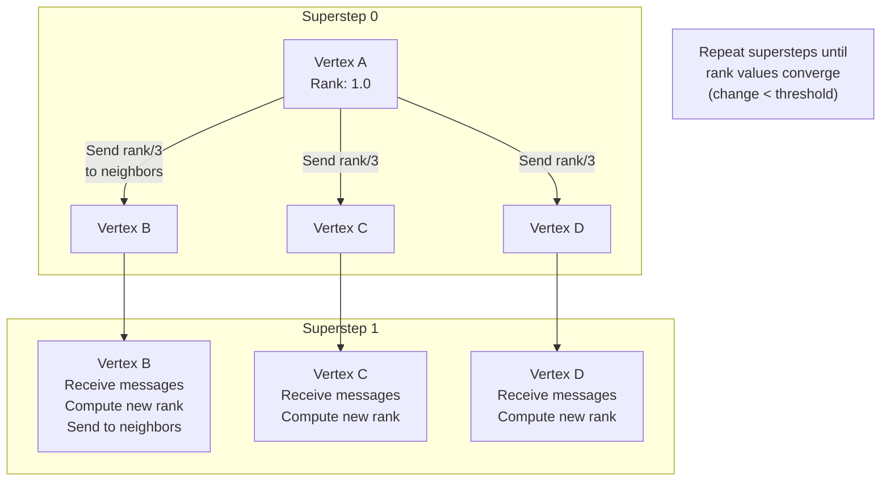

# Chapter 10: Batch Processing - MapReduce, Dataflow & Joins

> **Part of Part III: Derived Data**  
> *Designing Data-Intensive Applications* by Martin Kleppmann — Comprehensive Technical Reference

---

## Chapter Overview
Offline distributed computing: Unix pipeline composability, HDFS architecture, MapReduce execution mechanics, distributed join algorithms (Sort-merge, Broadcast hash, Partitioned hash), Hadoop vs MPP, Dataflow DAG engines (Spark, Flink), and Pregel BSP graph processing.

---

Three types of systems:
1. **Services (online)**: Wait for request → process → send response. Response time matters.
2. **Batch processing (offline)**: Take large input → process → produce output. Throughput matters.
3. **Stream processing (near-real-time)**: Like batch but processes events shortly after they occur.

---

### 10.1 Batch Processing with Unix Tools

#### The Log Analysis Example

Goal: Find the 5 most popular URLs in an nginx access log.

**Unix pipeline approach:**
```bash
cat /var/log/nginx/access.log |
    awk '{print $7}' |         # Extract URL (7th field)
    sort |                      # Sort alphabetically (groups identical URLs)
    uniq -c |                   # Count consecutive identical lines
    sort -rn |                  # Sort by count (descending)
    head -n 5                   # Top 5
```



**Equivalent custom program approach:**
```ruby
counts = Hash.new(0)
File.open('/var/log/nginx/access.log') do |file|
  file.each_line do |line|
    url = line.split[6]
    counts[url] += 1
  end
end
top5 = counts.sort_by { |url, count| -count }.first(5)
top5.each { |url, count| puts "#{count} #{url}" }
```

**Key difference**: The custom program uses an **in-memory hash table** (fast but limited by RAM). Unix `sort` uses **external merge sort** — handles datasets larger than memory by writing temporary files to disk.

#### The Unix Philosophy (Doug McIlroy, 1978)

1. **Make each program do one thing well.** To do a new job, build afresh rather than complicating old programs.
2. **Expect the output of every program to become the input to another.** Don't clutter output with extraneous information.
3. **Design and build software to be tried early, ideally within weeks.** Don't hesitate to throw away the clumsy parts and rebuild them.
4. **Use tools in preference to unskilled help** to lighten a programming task.

**Uniform interface**: Files are sequences of bytes. Every program reads from stdin, writes to stdout. This means ANY program can be connected to ANY other program.

**Separation of logic and wiring**: Programs don't know where their input comes from or output goes to. The shell handles "wiring" via pipes and redirects. Programs focus only on the transformation.

**Transparency and experimentation**: You can inspect intermediate output at any point (`| less`), you can re-run part of the pipeline, you can add/remove stages without modifying other stages.

**Limitation**: Single machine only. Can't scale beyond the throughput or storage of one computer.

---

### 10.2 MapReduce and Distributed Filesystems

MapReduce is the Unix philosophy scaled to thousands of machines.

#### HDFS (Hadoop Distributed File System)

Based on Google's GFS paper. **Shared-nothing architecture** — commodity machines with local disks.



- **NameNode**: Stores metadata (which files exist, which blocks they consist of, which DataNodes have copies). Single point of failure (HA NameNode mitigates this).
- **DataNode**: Stores actual data blocks. Each block replicated to 3 nodes (different racks for fault tolerance).
- **Block size**: 128MB (much larger than filesystem blocks — minimizes metadata overhead, maximizes sequential throughput).

#### MapReduce Job Execution



**Detailed example — Word Count:**

Input file (3 lines split across 3 mappers):
```
"the cat sat on the mat"
"the dog sat on the log"
"the cat on the dog"
```

**Mapper** (pure function — each mapper processes its split independently):
```python
def map(line):
    for word in line.split():
        emit(word, 1)
# Mapper 1 output: (the, 1), (cat, 1), (sat, 1), (on, 1), (the, 1), (mat, 1)
# Mapper 2 output: (the, 1), (dog, 1), (sat, 1), (on, 1), (the, 1), (log, 1)
# Mapper 3 output: (the, 1), (cat, 1), (on, 1), (the, 1), (dog, 1)
```

**Shuffle & Sort** (framework does this automatically):
Groups all values by key:
```
cat:  [1, 1]
dog:  [1, 1]
log:  [1]
mat:  [1]
on:   [1, 1, 1]
sat:  [1, 1]
the:  [1, 1, 1, 1, 1, 1]
```

**Reducer** (pure function):
```python
def reduce(key, values):
    emit(key, sum(values))
# Output: cat:2, dog:2, log:1, mat:1, on:3, sat:2, the:6
```

> [!IMPORTANT]
> **Data locality**: The MapReduce framework tries to schedule each mapper on the same node that stores its input data block — avoiding network transfer entirely. This is the key performance optimization.

**MapReduce workflows**: Complex analytics require **chaining multiple MapReduce jobs** (output of one job is input of the next). Hadoop has no built-in workflow support — use tools like **Oozie, Azkaban, Airflow, Luigi**.

---

### 10.3 Reduce-Side Joins and Grouping

#### Sort-Merge Joins (Detailed Example)

**Scenario**: Join user activity events with user profile database.

Input datasets:
```
# User Database (one mapper reads this)
UserID=123, name="Alice", city="NYC"
UserID=456, name="Bob", city="London"

# Activity Log (another mapper reads this)
UserID=123, page="/home", time="10:01"
UserID=123, page="/cart", time="10:05"
UserID=456, page="/home", time="10:02"
```



**Secondary sort trick**: Configure the sort so that user records arrive at the reducer BEFORE activity records. The reducer buffers the user record, then iterates through all activity records, emitting joined results.

#### Handling Skew (Hot Keys)

If a celebrity has millions of activity events, ONE reducer gets overwhelmed.

| Technique | How |
|-----------|-----|
| **Pig Skewed Join** | Sample the key space to identify hot keys. For hot keys, replicate the user record to multiple reducers and randomly distribute activity events among them. |
| **Hive Map-Side Bucketed Join** | If tables are pre-bucketed by join key, each mapper joins corresponding buckets (no hot-key problem if buckets are sized appropriately). |
| **Salted key** | Append random number (0-99) to hot key → spreads across 100 reducers. Must union results from all 100 on read. |

---

### 10.4 Map-Side Joins

Joins performed entirely in the mapper — no shuffle, no reducer needed. Much faster but require specific preconditions.



| Join Type | Preconditions | How |
|-----------|--------------|-----|
| **Broadcast hash join** | One table fits in memory | Load small table into hash map in each mapper. Stream large table, look up join key in hash map. |
| **Partitioned hash join** | Both tables partitioned by same key, same number of partitions | Each mapper loads ONE partition of small table, processes corresponding partition of large table. |
| **Map-side merge join** | Both tables partitioned AND sorted by same key | Mapper does merge join — reads both files incrementally (like merge step of merge sort). Most efficient but strictest precondition. |

**Frameworks**: Pig (`REPLICATED`, `SKEWED`, `MERGE`), Hive (`MAPJOIN`), Cascading, Crunch.

---

### 10.5 The Output of Batch Workflows

#### Building Search Indexes

Full-text search indexes (e.g., Lucene) can be built by MapReduce:
- Mappers partition documents by search term
- Reducers build the index segment for their partition of the term space
- Output: a set of immutable index segment files, copied to the search servers

#### Building Key-Value Stores

Voldemort (LinkedIn) uses MapReduce to build read-only database files:
- MapReduce produces sorted key-value files
- Files are bulk-loaded into Voldemort servers
- Servers serve read-only traffic from these files
- When new data is available, rebuild files and swap atomically

> [!TIP]
> **Philosophy of batch output — immutability**: MapReduce never modifies its input. Output is entirely NEW files. If the code has a bug, fix it and re-run. The input is unchanged — you get **human fault tolerance**. This is the same principle as functional programming: no side effects.

---

### 10.6 Comparing Hadoop to Distributed Databases

| Feature | MapReduce / Hadoop | MPP Databases (Teradata, Vertica) |
|---------|-------------------|----------------------------------|
| **Storage** | HDFS — raw files, any format (data lake) | Structured, schema-on-write |
| **Schema** | Schema-on-read (interpret data at processing time) | Schema-on-write (enforce at insert) |
| **Processing** | Arbitrary code: SQL, ML, NLP, image processing | Primarily SQL queries |
| **Fault tolerance** | Fine-grained: restart individual failed tasks | Coarse: restart entire query on failure |
| **Intermediate state** | Written to disk (HDFS) between stages | Pipelined in memory between operators |
| **Performance** | Slower (disk I/O heavy) | Faster (in-memory, optimized) |
| **Multi-tenant** | Good (preemption — can kill/restart tasks) | Poor (one query owns resources) |

#### 10.6.1 Beyond MapReduce — Dataflow Engines

**Criticism of MapReduce:**
1. **Too low-level**: Every step must be expressed as map + reduce
2. **Too many disk writes**: Every intermediate result materialized to HDFS
3. **Too many stages**: Simple query may require many chained MapReduce jobs
4. **Unnecessary sorting**: MapReduce always sorts between map and reduce, even when not needed

**Dataflow Engines** (Spark, Tez, Flink): Model the entire computation as a **directed acyclic graph (DAG) of operators**.



**Advantages of dataflow engines:**
- Operators **pipeline** data — no unnecessary materializations
- Sort only when actually needed
- Operators can start before predecessors finish
- Can use different **join strategies** (broadcast, partition, sort) per operator
- JVM/process **reused** across operators (no startup overhead per task)

**Fault tolerance:**
- **Spark**: Tracks lineage (RDDs) — recomputes lost partitions from source data or checkpoint
- **Flink**: Periodic checkpoints of operator state

#### 10.6.2 Graphs and Iterative Processing — Pregel/BSP

Algorithms like PageRank require **iterative** processing: repeat computation until convergence.

**Pregel model (Bulk Synchronous Parallel):**
Each vertex is a computational unit. Processing happens in **supersteps**:



1. **Each vertex** processes messages received from the previous superstep
2. **Each vertex** can update its own state and send messages along its edges
3. **Barrier sync** between supersteps — all vertices finish before next superstep starts
4. **Converge** when no more messages are sent (or changes are below threshold)

**Frameworks**: Apache Giraph, Spark GraphX, Flink Gelly, Google Pregel.

#### 10.6.3 High-Level APIs

| Tool | Language | Compiles To |
|------|----------|-------------|
| Pig | Pig Latin | MapReduce or Spark or Tez |
| Hive | HiveQL (SQL-like) | MapReduce or Spark or Tez |
| Cascading | Java API | MapReduce or Tez |
| Crunch / FlumeJava | Java API | MapReduce or Spark |
| Spark SQL | SQL + DataFrame API | Spark engine |

These high-level APIs enable **query optimization**: the framework chooses join strategies, column pruning, and predicate pushdown — similar to MPP database query optimizers.

---
