# Chapter 11: Stream Processing - Event Sourcing, CDC & State

> **Part of Part III: Derived Data**  
> *Designing Data-Intensive Applications* by Martin Kleppmann — Comprehensive Technical Reference

---

## Chapter Overview
Near-real-time unbounded data streams: Traditional vs Log-based message brokers (Kafka), the dual-writes hazard, Change Data Capture (CDC), Event Sourcing, Windowing semantics (Tumbling, Hopping, Sliding, Session), Watermarks, Stream Joins, and Chandy-Lamport checkpointing.

---

### 11.1 Transmitting Event Streams

An **event** is a small, self-contained, immutable record — something that happened at a point in time. A **producer** (publisher) generates events. A **consumer** (subscriber) processes them. Events are grouped into **topics** (streams).

#### Direct Messaging Systems

| System | How | Durability | Use Case |
|--------|-----|-----------|----------|
| UDP multicast | Broadcast to network | None — lost if not received | Financial market data (low-latency) |
| ZeroMQ | Library-based TCP messaging | None | High-throughput direct messaging |
| Webhooks | HTTP POST callback | Depends on receiver | Service-to-service notifications |

**Problem**: If consumer is down or slow, messages are lost. No replay capability.

#### Traditional Message Brokers (RabbitMQ, ActiveMQ, TIBCO)

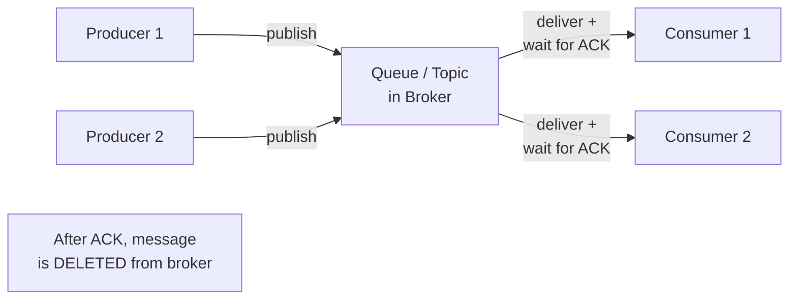

| Feature | Behavior |
|---------|----------|
| **Delivery** | Push to consumers |
| **Ordering** | Per-queue (not globally) |
| **After ACK** | Message DELETED from broker |
| **Consumer patterns** | Fan-out (all consumers get all messages) OR load-balancing (each message to one consumer) |
| **Retention** | None — messages are transient |

#### Log-Based Message Brokers (Kafka, Amazon Kinesis, Twitter DistributedLog)

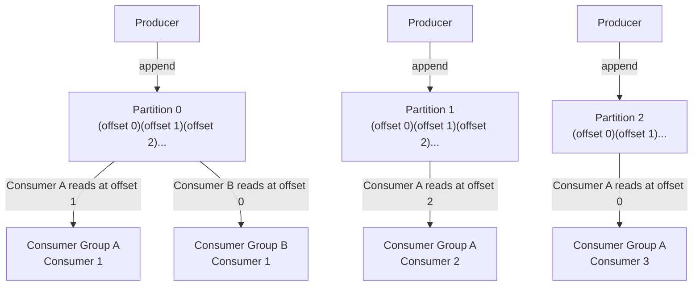

| Feature | Behavior |
|---------|----------|
| **Storage** | Append-only log, partitioned |
| **Ordering** | Total order WITHIN a partition |
| **After consumption** | Message RETAINED (configurable: time-based or size-based, or forever with compaction) |
| **Consumer model** | Pull — consumers read at their own pace, tracking offset |
| **Replay** | Yes! Seek to any offset and re-read |
| **Throughput** | Millions of messages/sec (sequential disk I/O) |

> [!TIP]
> **When to use which:**
> - **Traditional broker** (RabbitMQ): Expensive per-message processing (order fulfillment, email sending), message-level acknowledgment needed, complex routing patterns
> - **Log-based broker** (Kafka): High throughput, replay needed, event sourcing, stream processing pipelines, CDC

**Consumer groups**: Within a consumer group, each partition is assigned to exactly one consumer. This is how load balancing works — add more consumers (up to number of partitions) for parallel processing.

**Log compaction**: Keep only the LATEST value for each key (like LSM-tree compaction). Enables using Kafka as a durable key-value store — new consumers can read the compacted log to get the current state of all keys.

---

### 11.2 Databases and Streams

#### The Dual Writes Problem

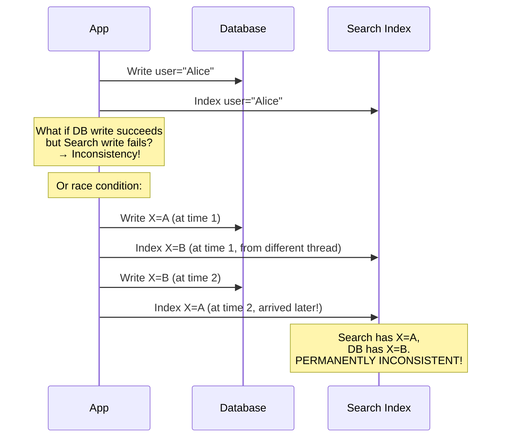

**Dual writes** (writing to two systems independently) is fundamentally broken:
1. One write may fail while the other succeeds → inconsistency
2. Race conditions on concurrent writes → permanently divergent values
3. No atomic transaction across different systems

**Solution**: **Change Data Capture (CDC)** — use one system as the source of truth and derive all others from its change stream.

#### Change Data Capture (CDC)

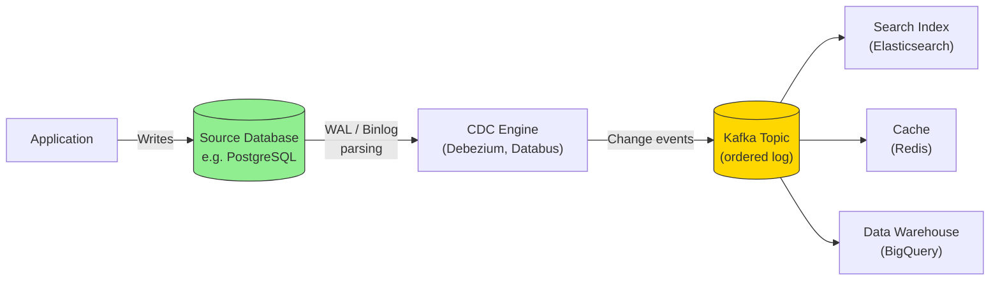

**Implementation approaches:**

| Tool | Database | Method |
|------|----------|--------|
| **Debezium** | PostgreSQL, MySQL, MongoDB, SQL Server | Parse WAL / binlog / oplog |
| **LinkedIn Databus** | Oracle, MySQL | Read replication log |
| **Facebook Wormhole** | MySQL | Binlog parsing |
| **Maxwell** | MySQL | Binlog parsing |

**Process:**
1. Take an **initial snapshot** of the entire database
2. Record the log position at which the snapshot was taken
3. Start streaming all changes from that log position forward
4. Apply changes to derived systems in order

**Log compaction for CDC**: Kafka's log compaction keeps the latest value for each key → a new consumer can read the compacted log to get the **full current state** of the database (without needing a separate snapshot).

#### Event Sourcing

A domain-driven design (DDD) pattern. Instead of storing current state, store a log of **domain events** that happened.

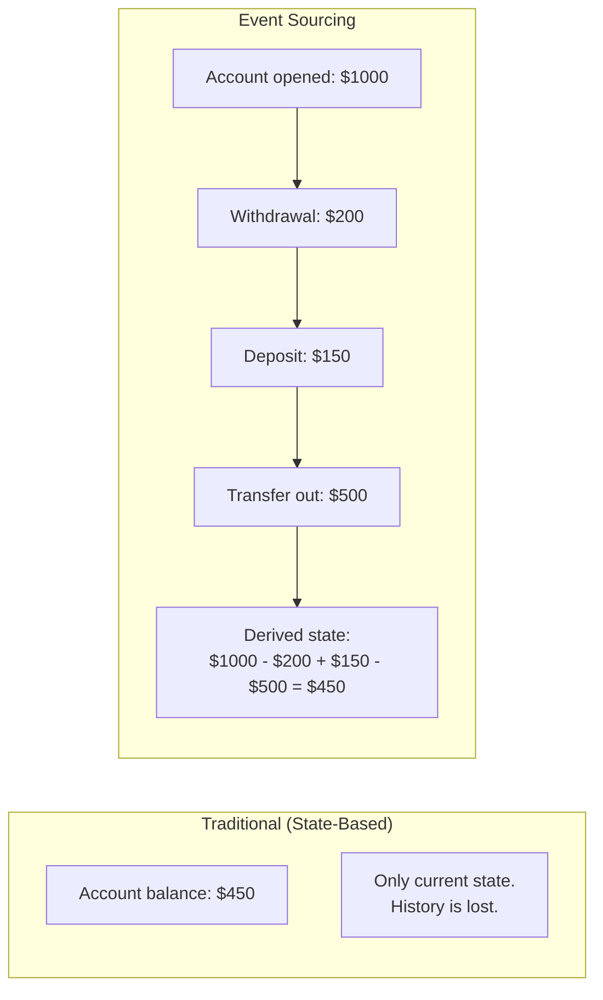

| Aspect | CDC | Event Sourcing |
|--------|-----|----------------|
| Level | Low-level (physical: row inserts/updates/deletes) | High-level (domain: "user placed order") |
| Source | Database's internal log | Application-level events |
| Design | Retrofit onto existing database | Architecture from the ground up |
| Events | Derived from database writes | The primary write model |

**Commands vs Events:**
- A **command** is a request that may be rejected (e.g., "reserve seat 42" might fail if taken)
- An **event** is a fact that has already happened (e.g., "seat 42 was reserved")

The application validates the command, and if accepted, writes an event to the log. Events are immutable facts.

#### State, Streams, and Immutability

> [!NOTE]
> **Accountants have always done this.** The transaction log (journal) is the source of truth. The balance sheet is a derived view. If an error is found, you don't erase the journal entry — you add a new compensating transaction. The log is append-only and immutable.

**Advantages of immutable event logs:**
1. **Audit trail**: Complete history of everything that happened
2. **Debugging**: Replay events to reproduce bugs
3. **Multiple views**: Derive search index, analytics view, API cache — all from the same log
4. **Temporal queries**: "What was the state on March 15?"
5. **Undo**: Record a compensating event

**Limitations:**
- Event log grows forever → need **compaction** or **snapshotting**
- **GDPR right to erasure**: Can't truly delete personal data from an append-only log without rewriting the entire log (crypto-shredding is one approach: encrypt per-user, delete the key)

---

### 11.3 Processing Streams

| Use Case | Description | Tools |
|----------|-------------|-------|
| **Complex Event Processing (CEP)** | Pattern matching over event streams (e.g., "alert if 3 failed logins in 5 minutes from same IP") | ESPER, IBM InfoSphere Streams, Apama |
| **Stream Analytics** | Aggregate metrics over time windows (e.g., "average response time per minute") | Apache Storm, Spark Streaming, Flink, Kafka Streams |
| **Materialized View Maintenance** | Keep derived views up-to-date as source data changes | Kafka Streams, Flink, Samza |
| **Search on Streams** | Run stored queries against incoming documents (reverse of normal search) | Elasticsearch Percolator |
| **Message Passing / Actor Model** | Communication between actors/services | Akka, Orleans, Erlang OTP |

---

### 11.4 Reasoning About Time

> [!WARNING]
> **Event time ≠ Processing time.** An event may occur at 10:00:01 but arrive at the stream processor at 10:00:30 due to network delays, consumer lag, or mobile device coming back online. If you use processing time for windowing, your results will be wrong.

#### Window Types

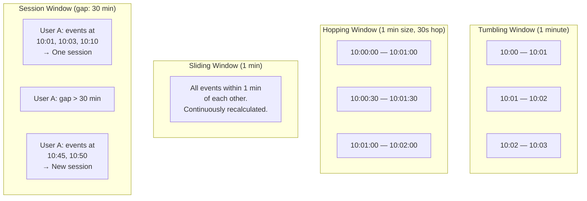

| Window | Description | Example |
|--------|-------------|---------|
| **Tumbling** | Fixed-size, non-overlapping | Count events per 1-minute block |
| **Hopping** | Fixed-size, overlapping (advance by hop interval) | 1-min average, computed every 30s |
| **Sliding** | All events within a fixed interval of each other | "All events within 5 minutes" (no fixed boundaries) |
| **Session** | Group events by same user/entity, separated by inactivity gap | Web sessions: 30-min inactivity timeout |

#### Watermarks and Late Events

A **watermark** is an estimate: "we believe all events with timestamp ≤ T have now arrived."

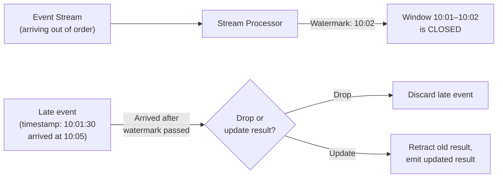

**Used by**: Flink (event-time processing with watermarks), Google Cloud Dataflow/Beam.

---

### 11.5 Stream Joins

Three types of joins in stream processing:

#### Stream-Stream Join (Window Join)

**Example**: Match search queries with subsequent clicks (within 1 hour).

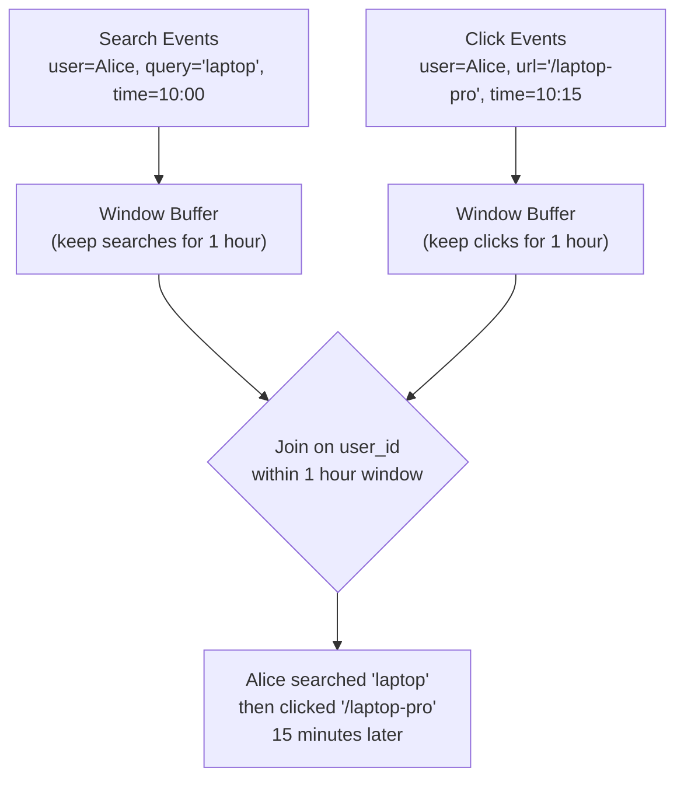

Both streams must be buffered. For each event on one side, look up matching events on the other side within the time window.

#### Stream-Table Join (Enrichment)

**Example**: Enrich click events with user profile information.

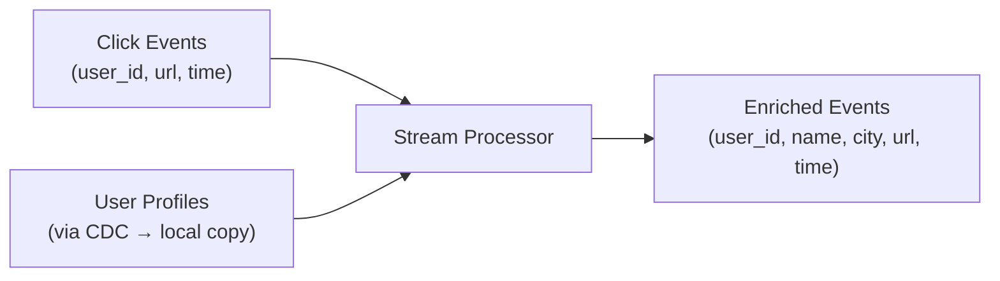

The processor maintains a **local copy** of the user database (kept up-to-date via CDC from Kafka). For each click event, it looks up the user in the local copy — no network round trip to the database.

#### Table-Table Join (Materialized View)

**Example**: Twitter timeline maintenance.

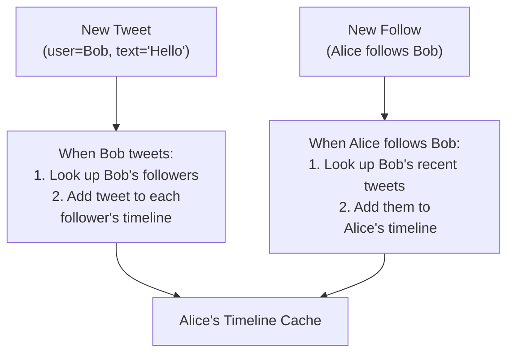

Both the tweets table and follows table are represented as streams of changes. The join result (timelines) is a materialized view that's incrementally maintained.

#### Slowly Changing Dimension (SCD) Problem

If the user profile changes over time, which version do you join against? A click at 10:00 should be enriched with the user's profile as it was at 10:00 — not the profile after a later update.

**Solution**: Use a **versioned** local copy of the table, keyed by (entity_id, timestamp).

---

### 11.6 Fault Tolerance

Batch processing is simple: if a task fails, re-run it (inputs are immutable). Stream processing is harder because the input is infinite and state is continuously maintained.

#### Microbatching (Spark Streaming)

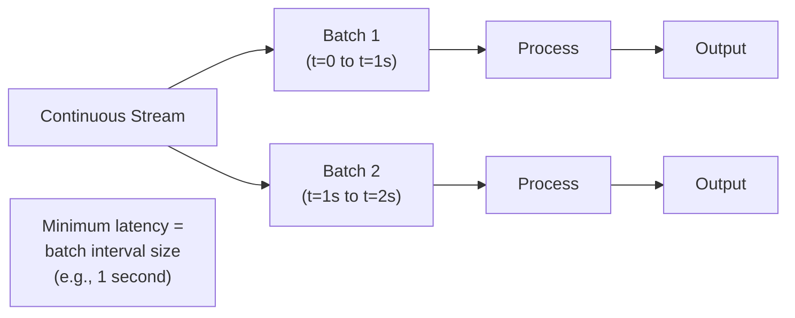

Break the stream into small batches. Each batch is processed like a batch job. If it fails, replay the batch.

**Tradeoff**: Minimum latency equals the batch interval. For sub-second latency, batches must be tiny → overhead increases.

#### Checkpointing (Flink)

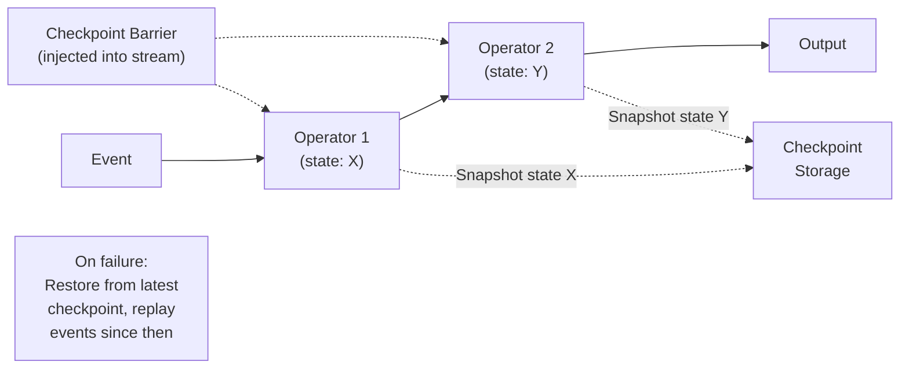

Flink uses **Chandy-Lamport algorithm**: inject checkpoint barriers into the stream. When an operator receives a barrier, it snapshots its state. The snapshot is a consistent cut across all operators.

**Result**: Exactly-once processing **within Flink's boundaries**.

#### Other Approaches

| Approach | How | Used By |
|----------|-----|---------|
| **Atomic commit** | Kafka transactions: read-process-write atomically | Kafka Streams |
| **Idempotency** | Include the stream offset in the output. On retry, the output store recognizes the duplicate and ignores it. | Custom implementations |
| **State rebuild** | Store operator state in local RocksDB + changelog to Kafka topic. On failure, replay changelog to rebuild state. | Kafka Streams, Flink |

> [!IMPORTANT]
> **Exactly-once vs effectively-once**: True exactly-once processing across heterogeneous systems (e.g., writing to both Kafka and a database) requires distributed transactions. Most systems achieve **effectively-once** via idempotency — the operation may be attempted multiple times but the effect is as if it happened once.

---
