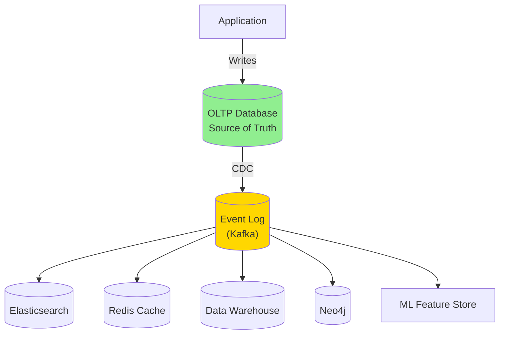
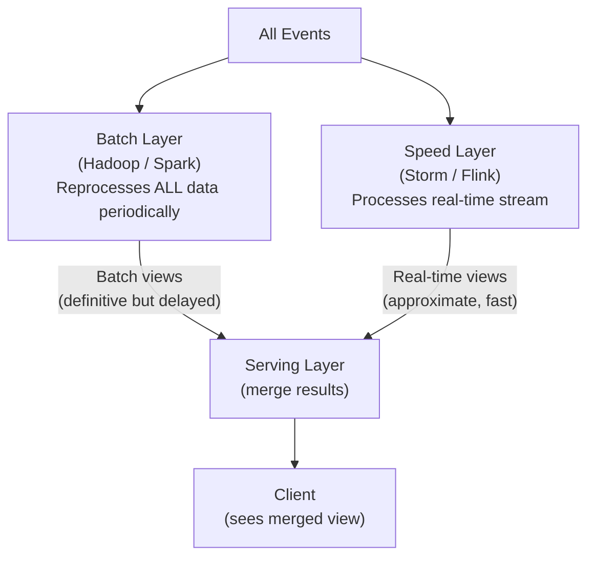
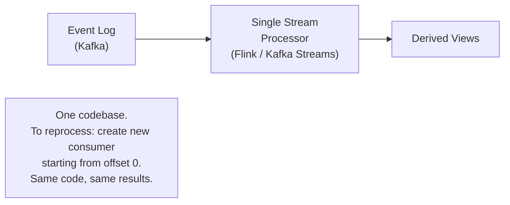
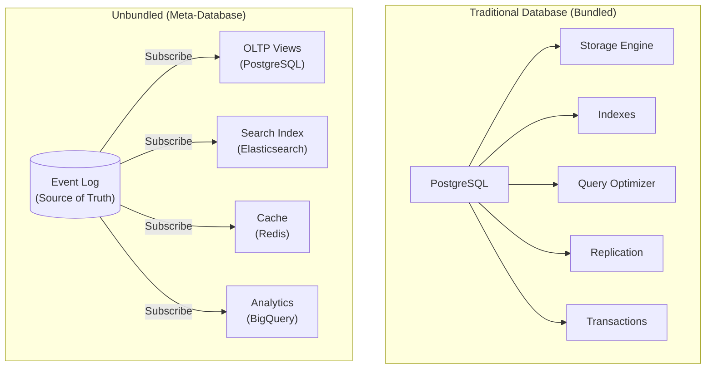
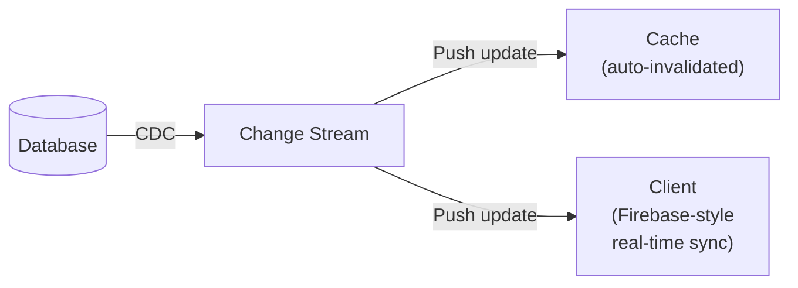
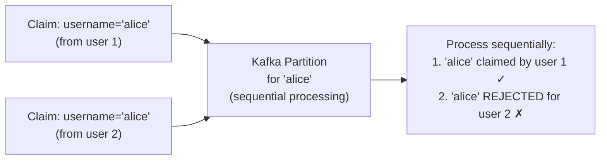

# Chapter 12: The Future of Data Systems - Unbundled Databases

> **Part of Part III: Derived Data**  
> *Designing Data-Intensive Applications* by Martin Kleppmann — Comprehensive Technical Reference

---

## Chapter Overview
Architectural convergence: Unbundling databases into Unix-like composable systems, the Meta-Database, Lambda vs Kappa unified streaming, Timeliness vs Integrity guarantees, End-to-end correctness, and ethical responsibilities of data systems engineers.

---

### 12.1 Data Integration

**No single database can do everything well.** Complex applications need multiple specialized systems: OLTP database, search index, cache, analytics warehouse, graph database.

**The key insight**: Use an **event log** (Kafka) as the central backbone. All other systems are **derived views** of the log.

#### Derived Data vs Distributed Transactions

Two approaches to keeping systems in sync:

| Approach | How | Properties |
|----------|-----|-----------|
| **XA distributed transactions** | Lock all systems, prepare, commit atomically | Pessimistic, holds locks, slow, fragile coordinator |
| **Log-based derived data** | Write to log, consumers apply changes asynchronously with deterministic retry | Optimistic, no locks, eventual consistency, more robust |

> [!TIP]
> Log-based derivation is the **practical winner** for most systems. It's more robust, allows each consumer to fail and recover independently, and doesn't require all systems to support the same transaction protocol.

#### Limits of Total Ordering

- Within a **single Kafka partition**: total order ✓
- Across partitions: **no defined order** (need application-level coordination)
- Multi-leader / leaderless: **no global order** (need version vectors, conflict resolution)
- For **uniqueness constraints** (e.g., usernames): need consensus, not just ordering

---

### 12.2 Batch and Stream Processing

#### Lambda Architecture

**Problems with Lambda:**
1. Must maintain TWO codepaths (batch + stream) for same logic
2. Complex merging logic in serving layer
3. Batch reprocessing has high latency (hours/days)

#### Kappa Architecture (Unifying Batch and Stream)

**Treat batch as a special case of stream** — a stream that has a beginning and end (bounded).

**Flink, Kafka Streams, Beam** all support unified batch+stream processing.

---

### 12.3 Unbundling Databases

**Insight**: A database is a bundle of features: storage, indexing, query engine, replication, transactions. What if we **unbundle** these and use the best tool for each?

**The analogy**: Creating an index in a database = setting up a new CDC consumer = creating a new materialized view = adding a new follower replica. They're ALL the same operation: derive a new representation from the source of truth.

#### Materialized Views and Caching

**Push-based updates**: Instead of clients polling, subscribe to changes and push updates.

**Firebase, CouchDB, RethinkDB**: Push changes to connected clients in real-time.

**Stateful offline-first clients**: The client holds local state (like a database replica). When offline, works from local state. When online, syncs bidirectionally. This is essentially **multi-leader replication** with the client as one leader.

---

### 12.4 Aiming for Correctness

#### Exactly-Once / Effectively-Once

**Combination of:**
1. **Deterministic derivation**: Given the same input events in the same order, produce the same output
2. **Idempotent operations**: Applying the same operation twice has the same effect as once (include event ID/offset in output to detect duplicates)

#### Uniqueness Constraints in Log-Based Systems

**Problem**: How to enforce "usernames must be unique" in an asynchronous log-based system?

**Solution**: Partition by the value that must be unique (e.g., hash of username → single partition). That partition is the **single authority** for that username. Process claims sequentially within the partition.

#### Timeliness vs Integrity

| Property | Meaning | How Achieved |
|----------|---------|-------------|
| **Timeliness** | Users read the most recent writes (low staleness) | Synchronous replication, read-your-writes consistency |
| **Integrity** | No data corruption, no loss, no contradictions | Atomicity, correct fault handling, idempotent retry |

- **ACID transactions** provide BOTH timeliness and integrity
- **Event-based systems** provide integrity more easily (deterministic derivation + idempotency), but timeliness requires additional work (read-your-writes patterns)

> [!TIP]
> In many applications, **integrity is more important than timeliness**. It's acceptable to show slightly stale data (timeliness violation), but NOT acceptable to lose or corrupt data (integrity violation).

#### Trust but Verify

Even with fault-tolerant algorithms, bugs happen. **End-to-end verification:**

| Technique | What It Checks |
|-----------|----------------|
| **Audit log** | Compare derived data against source of truth periodically |
| **Checksums** | Detect data corruption in transit or at rest |
| **Merkle trees** | Efficiently verify that two replicas have the same data |
| **Cryptographic proofs** | Blockchain-inspired: hash chain of events prevents tampering |

---

### 12.5 Doing the Right Thing

> [!CAUTION]
> The technical decisions we make as engineers have **real consequences for real people**. This section is about ethical responsibilities.

#### Predictive Analytics and Bias

Machine learning models trained on historical data perpetuate and amplify existing biases:
- Criminal justice: biased arrest data → biased risk predictions → more arrests of same groups
- Hiring: biased hiring history → biased screening → discrimination
- Credit scoring: historical redlining → biased credit models → continued discrimination

#### Data as Surveillance

- Every click, purchase, location is recorded and analyzed
- "Data is the new oil" — but it's also the new **surveillance infrastructure**
- Data is a **liability**, not just an asset (data breaches, misuse, regulatory fines)

#### Privacy and GDPR

| GDPR Principle | What It Means |
|---------------|---------------|
| **Purpose limitation** | Data collected for one purpose can't be used for another |
| **Data minimization** | Only collect data that's necessary |
| **Right to erasure** | Users can request deletion of their data |
| **Data portability** | Users can export their data in a standard format |
| **Consent** | Must have explicit, informed consent for data processing |
| **Privacy by design** | Build privacy protections into systems from the start |

**Practical implications for data engineers:**
- Design systems that CAN delete specific user data (append-only logs make this hard → crypto-shredding)
- Minimize data collection (don't collect "just in case")
- Separate identity from analytics data
- Use end-to-end encryption where possible
- Local computation over server-side when privacy matters

#### Responsibility

> [!IMPORTANT]
> "Just because you CAN collect and analyze data doesn't mean you SHOULD."
>
> We as engineers must think about:
> - Who could be harmed by this system?
> - What happens if this data is breached?
> - Are we enabling surveillance or discrimination?
> - Would we be comfortable if this system were used on us?
