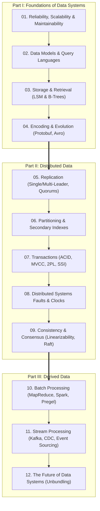
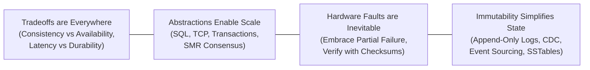

# Designing Data-Intensive Applications (DDIA) — Complete Engineering Reference

> **An exhaustive, production-grade deep dive into all 3 parts, 12 chapters, and core distributed systems algorithms from Martin Kleppmann's definitive work.**

---

## 🏛️ Book Architecture & Visual Sitemap

---

## 📑 Complete Chapter Index

### Part I: Foundations of Data Systems
Storage engine internals, query paradigms, hardware failure models, and data evolution.

| Chapter | Title | Focus Topics | Deep Dives & Algorithms |
| :--- | :--- | :--- | :--- |
| **01** | [**Reliability, Scalability & Maintainability**](./Part-1-Foundations-of-Data-Systems/01.%20Reliability,%20Scalability%20%26%20Maintainability.md) | Faults vs Failures, MTTF, Load modeling, Tail Latency Amplification | Twitter Fan-Out (push vs pull vs hybrid), Response time percentiles (p50/p95/p99/p999), SLOs vs SLAs |
| **02** | [**Data Models & Query Languages**](./Part-1-Foundations-of-Data-Systems/02.%20Data%20Models%20%26%20Query%20Languages.md) | Relational vs Document vs Graph, Schema-on-read vs Schema-on-write | LinkedIn résumé schema, CODASYL vs SQL, Cypher, SPARQL, Datalog |
| **03** | [**Storage & Retrieval**](./Part-1-Foundations-of-Data-Systems/03.%20Storage%20%26%20Retrieval%20-%20Engines,%20Indexes%20%26%20Compaction.md) | Hash Indexes (Bitcask), SSTables, B-Trees, Column-oriented storage (OLAP) | **Full Deep Dive: LSM-Trees in Production** (SkipLists, WAL group commit, Bloom Filter math, STCS vs LCS vs TWCS, RUM conjecture, RocksDB & Cassandra) |
| **04** | [**Encoding & Evolution**](./Part-1-Foundations-of-Data-Systems/04.%20Encoding%20%26%20Evolution%20-%20Formats%20%26%20Protocols.md) | Binary serialization, Backward/Forward compatibility, RPC pitfalls | Protobuf vs Thrift vs Avro schema resolution, Dataflow through DBs, REST vs gRPC, Actor model |

---

### Part II: Distributed Data
The challenges of distribution across multiple machines: network partitions, clock skew, replication lag, and distributed consensus.

| Chapter | Title | Focus Topics | Deep Dives & Algorithms |
| :--- | :--- | :--- | :--- |
| **05** | [**Replication**](./Part-2-Distributed-Data/05.%20Replication%20-%20Single-Leader,%20Multi-Leader%20%26%20Quorums.md) | Leader-Follower, Sync vs Async, Multi-Leader topologies, Dynamo Quorums | Read-after-write consistency, Monotonic reads, Consistent prefix reads, LWW hazards, Version Vectors |
| **06** | [**Partitioning**](./Part-2-Distributed-Data/06.%20Partitioning%20-%20Strategies,%20Secondary%20Indexes%20%26%20Skew.md) | Key-range vs Hash sharding, Relieving hot spots, Request routing | Document-partitioned (local scatter/gather) vs Term-partitioned (global) secondary indexes, Rebalancing strategies |
| **07** | [**Transactions**](./Part-2-Distributed-Data/07.%20Transactions%20-%20ACID,%20Isolation%20Levels%20%26%20Anomalies.md) | ACID meaning, Read Committed, Snapshot Isolation, Lost Updates, Write Skew | MVCC visibility rules, Alice's bank transfer, Doctors on-call, 2PL vs SSI (Serializable Snapshot Isolation) |
| **08** | [**The Trouble with Distributed Systems**](./Part-2-Distributed-Data/08.%20The%20Trouble%20with%20Distributed%20Systems.md) | Unreliable networks, Clock drift & jumps, Process pauses (GC), Truth by quorum | LWW data loss, Google TrueTime API intervals, Fencing tokens, Byzantine faults, System timing models |
| **09** | [**Consistency & Consensus**](./Part-2-Distributed-Data/09.%20Consistency%20%26%20Consensus%20-%20Linearizability%20to%20Raft.md) | Linearizability, CAP Theorem, Total Order Broadcast, 2PC blocking | **Full Deep Dive: The Raft Consensus Algorithm** (Wire RPC specs, Election safety, Figure 8 commitment rule, Joint Consensus, Read-Index, etcd & KRaft) |

---

### Part III: Derived Data
Heterogeneous data integration, batch pipelines, event-driven streaming, and composable architectures.

| Chapter | Title | Focus Topics | Deep Dives & Algorithms |
| :--- | :--- | :--- | :--- |
| **10** | [**Batch Processing**](./Part-3-Derived-Data/10.%20Batch%20Processing%20-%20MapReduce,%20Dataflow%20%26%20Joins.md) | Unix philosophy, HDFS, MapReduce execution, Hadoop vs MPP databases | Sort-merge joins, Broadcast vs Partitioned hash joins, Spark DAG lineage, Pregel BSP graph processing |
| **11** | [**Stream Processing**](./Part-3-Derived-Data/11.%20Stream%20Processing%20-%20Event%20Sourcing,%20CDC%20%26%20State.md) | Traditional vs Log-based brokers (Kafka), Dual writes hazard, Event Sourcing, CDC | Tumbling / Hopping / Sliding / Session windows, Watermarks, Stream-stream & Stream-table joins, Chandy-Lamport checkpointing |
| **12** | [**The Future of Data Systems**](./Part-3-Derived-Data/12.%20The%20Future%20of%20Data%20Systems%20-%20Unbundled%20Databases.md) | Data integration, Unbundled Meta-Database, Lambda vs Kappa architecture | Timeliness vs Integrity, Idempotence & deterministic replay, End-to-end correctness, Privacy & GDPR ethics |

---

## 🔬 Core Special Topic Deep Dives

### 1. Log-Structured Merge-Trees (LSM-Trees) in Production
Located in **[Chapter 03](./Part-1-Foundations-of-Data-Systems/03.%20Storage%20%26%20Retrieval%20-%20Engines,%20Indexes%20%26%20Compaction.md#38-deep-dive-log-structured-merge-trees-lsm-trees-in-production)**:
- **Mechanical Sympathy**: Sequential vs Random I/O economics on HDDs, SATA SSDs, and NVMe Flash.
- **MemTable Architecture**: Why SkipLists with lock-free CAS and arena allocators outperform balanced BSTs.
- **Write-Ahead Log (WAL)**: 32KB block framing, CRC32, and group commit fsync batching.
- **SSTable File Layout**: Data blocks with prefix delta compression, restart points, index blocks, and trailing 48-byte footers.
- **Bloom Filter Mathematics**: Derivation of optimal hash functions ($k = rac{m}{n} \ln 2$), bit budgets, and double-hashing.
- **Compaction Strategies**: Algorithmic comparison of **Size-Tiered (STCS)**, **Leveled (LCS)**, and **Time-Window (TWCS)**.
- **The RUM Conjecture**: Exact mathematical formulas for Read Amplification (RA), Write Amplification (WA), and Space Amplification (SA).
- **Tombstones**: Deletion lifecycle, garbage collection boundaries, and avoiding tombstone scan overwhelm.

### 2. The Raft Consensus Algorithm in Depth
Located in **[Chapter 09](./Part-2-Distributed-Data/09.%20Consistency%20%26%20Consensus%20-%20Linearizability%20to%20Raft.md#95-deep-dive-the-raft-consensus-algorithm-in-depth)**:
- **State Machine Replication (SMR)**: Consensus modules, write-ahead logs, and deterministic state execution.
- **Server Roles & State Transitions**: Follower, Candidate, Leader, and term numbers as Lamport logical clocks.
- **Randomized Election Timeouts**: Preventing split-vote livelocks (150ms–300ms window).
- **The Five Core Safety Invariants**: Election Safety, Leader Append-Only, Log Matching, Leader Completeness, and State Machine Safety.
- **Wire RPC Specifications**: Exact receiver verification logic for `RequestVote`, `AppendEntries`, and `InstallSnapshot`.
- **The Prior-Term Commitment Rule (Figure 8)**: Mathematical proof of why leaders cannot commit prior-term entries by replica counting alone.
- **Cluster Membership Changes**: Joint Consensus ($C_{\text{old,new}}$) and Single-Server configuration changes.
- **Linearizable Read Protocols**: Solving the phantom leader problem via the **Read-Index protocol**, bounded **Lease reads**, and **Follower reads**.
- **Production Systems**: Architectural analysis of **etcd (Kubernetes)**, **CockroachDB (Multi-Raft)**, and **Apache Kafka (KRaft)**.

---

## 🎯 Recurring Architectural Principles

1. **No Silver Bullets**: Every database architecture is an explicit compromise (e.g., B-Trees optimize reads; LSM-Trees optimize writes; Leveled Compaction optimizes space at the expense of write amplification).
2. **Immutability and Derived Views**: Treating primary writes as immutable event streams allows building arbitrary, specialized derived views (caches, search indexes, analytics) with verifiable integrity.
3. **End-to-End Correctness**: Low-level database guarantees are necessary but insufficient; true correctness requires application-level idempotency, deduplication tokens, and end-to-end auditability.
