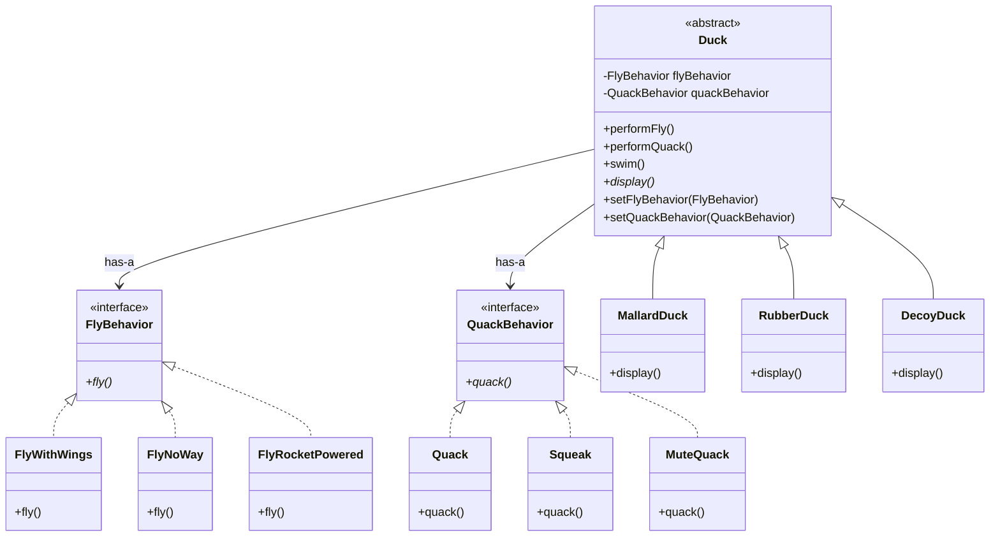

# Strategy Pattern

## Problem Statement

> [!info] Head First Chapter 1 — SimUDuck

**The SimUDuck App**: Joe works at a company that makes a duck pond simulation game. The game shows a variety of duck species swimming and quacking. The initial design used standard OO techniques — a `Duck` superclass from which all duck types inherit.

```
Initial Design (BROKEN):
Duck (superclass)
├── quack()
├── swim()
├── display()  ← abstract
│
├── MallardDuck extends Duck
├── RedheadDuck extends Duck
└── RubberDuck extends Duck  ← Problem! Rubber ducks don't fly!
```

**The Change Request**: The executives want the ducks to **fly**. Joe adds `fly()` to the `Duck` superclass. But now **rubber ducks fly**, and **decoy ducks quack**.

**Why Inheritance Fails Here**:
- Adding behavior to the superclass gives it to ALL subclasses — even those that shouldn't have it
- Overriding in every subclass creates code duplication
- Hard to know the runtime behavior by looking at the superclass
- Changes to the superclass unintentionally affect subclasses (fragile base class problem)

**Why Interfaces Alone Also Fail**:
- Making `Flyable` and `Quackable` interfaces destroys code reuse
- Every flying duck must re-implement `fly()` — if 48 duck types fly, you have 48 copies
- Changing the flying behavior means editing all 48 classes

---

## Key Idea / Design Principle

> [!tip] Design Principle
> **Identify the aspects of your application that vary and separate them from what stays the same.**

> [!tip] Design Principle
> **Program to an interface (supertype), not an implementation.**

> [!tip] Design Principle
> **Favor composition over inheritance.**

### The Strategy Pattern (GoF Definition)

> **The Strategy Pattern** defines a family of algorithms, encapsulates each one, and makes them interchangeable. Strategy lets the algorithm vary independently from clients that use it.

**In plain English**: Instead of hardcoding a behavior, you extract it into a separate class and "plug it in" to the object that needs it. The object delegates the behavior to the strategy. You can swap strategies at runtime.

---

## When to Use This Pattern

- You have multiple algorithms/behaviors for a specific task and want to switch between them
- You have a class with a lot of conditional statements (if/else, switch) selecting behaviors
- You want to isolate business logic from the details of algorithms
- Related classes differ only in their behavior — use Strategy to configure them with different behaviors
- You need to swap algorithm at runtime (e.g., payment methods, sorting strategies, discount rules)

---

## UML Class Diagram



---

## Python Implementation

```python
from abc import ABC, abstractmethod


# ──── Strategy Interfaces ────

class FlyBehavior(ABC):
    @abstractmethod
    def fly(self) -> str:
        pass


class QuackBehavior(ABC):
    @abstractmethod
    def quack(self) -> str:
        pass


# ──── Concrete Fly Strategies ────

class FlyWithWings(FlyBehavior):
    def fly(self) -> str:
        return "I'm flying with wings!"


class FlyNoWay(FlyBehavior):
    def fly(self) -> str:
        return "I can't fly."


class FlyRocketPowered(FlyBehavior):
    def fly(self) -> str:
        return "I'm flying with a ROCKET! 🚀"


# ──── Concrete Quack Strategies ────

class QuackSound(QuackBehavior):
    def quack(self) -> str:
        return "Quack!"


class Squeak(QuackBehavior):
    def quack(self) -> str:
        return "Squeak!"


class MuteQuack(QuackBehavior):
    def quack(self) -> str:
        return "<< Silence >>"


# ──── Context (Duck) ────

class Duck(ABC):
    def __init__(self, fly_behavior: FlyBehavior, quack_behavior: QuackBehavior):
        self._fly_behavior = fly_behavior
        self._quack_behavior = quack_behavior

    def perform_fly(self) -> str:
        return self._fly_behavior.fly()

    def perform_quack(self) -> str:
        return self._quack_behavior.quack()

    def swim(self) -> str:
        return "All ducks float, even decoys!"

    # Runtime strategy swapping
    def set_fly_behavior(self, fb: FlyBehavior):
        self._fly_behavior = fb

    def set_quack_behavior(self, qb: QuackBehavior):
        self._quack_behavior = qb

    @abstractmethod
    def display(self) -> str:
        pass


# ──── Concrete Ducks ────

class MallardDuck(Duck):
    def __init__(self):
        super().__init__(FlyWithWings(), QuackSound())

    def display(self) -> str:
        return "I'm a real Mallard duck"


class RubberDuck(Duck):
    def __init__(self):
        super().__init__(FlyNoWay(), Squeak())

    def display(self) -> str:
        return "I'm a rubber duckie"


class DecoyDuck(Duck):
    def __init__(self):
        super().__init__(FlyNoWay(), MuteQuack())

    def display(self) -> str:
        return "I'm a decoy duck"


# ──── Client Code ────

if __name__ == "__main__":
    mallard = MallardDuck()
    print(mallard.display())         # I'm a real Mallard duck
    print(mallard.perform_fly())     # I'm flying with wings!
    print(mallard.perform_quack())   # Quack!

    rubber = RubberDuck()
    print(rubber.display())          # I'm a rubber duckie
    print(rubber.perform_fly())      # I can't fly.
    print(rubber.perform_quack())    # Squeak!

    # Dynamic behavior change at RUNTIME
    rubber.set_fly_behavior(FlyRocketPowered())
    print(rubber.perform_fly())      # I'm flying with a ROCKET! 🚀
```

---

## Java Implementation

```java
// ──── Strategy Interfaces ────

public interface FlyBehavior {
    String fly();
}

public interface QuackBehavior {
    String quack();
}

// ──── Concrete Fly Strategies ────

public class FlyWithWings implements FlyBehavior {
    @Override
    public String fly() { return "I'm flying with wings!"; }
}

public class FlyNoWay implements FlyBehavior {
    @Override
    public String fly() { return "I can't fly."; }
}

public class FlyRocketPowered implements FlyBehavior {
    @Override
    public String fly() { return "I'm flying with a ROCKET! 🚀"; }
}

// ──── Concrete Quack Strategies ────

public class Quack implements QuackBehavior {
    @Override
    public String quack() { return "Quack!"; }
}

public class Squeak implements QuackBehavior {
    @Override
    public String quack() { return "Squeak!"; }
}

public class MuteQuack implements QuackBehavior {
    @Override
    public String quack() { return "<< Silence >>"; }
}

// ──── Context (Duck) ────

public abstract class Duck {
    protected FlyBehavior flyBehavior;
    protected QuackBehavior quackBehavior;

    public Duck(FlyBehavior flyBehavior, QuackBehavior quackBehavior) {
        this.flyBehavior = flyBehavior;
        this.quackBehavior = quackBehavior;
    }

    public String performFly() { return flyBehavior.fly(); }
    public String performQuack() { return quackBehavior.quack(); }
    public String swim() { return "All ducks float, even decoys!"; }

    // Runtime strategy swapping
    public void setFlyBehavior(FlyBehavior fb) { this.flyBehavior = fb; }
    public void setQuackBehavior(QuackBehavior qb) { this.quackBehavior = qb; }

    public abstract String display();
}

// ──── Concrete Ducks ────

public class MallardDuck extends Duck {
    public MallardDuck() { super(new FlyWithWings(), new Quack()); }

    @Override
    public String display() { return "I'm a real Mallard duck"; }
}

public class RubberDuck extends Duck {
    public RubberDuck() { super(new FlyNoWay(), new Squeak()); }

    @Override
    public String display() { return "I'm a rubber duckie"; }
}

// ──── Client ────

public class MiniDuckSimulator {
    public static void main(String[] args) {
        Duck mallard = new MallardDuck();
        System.out.println(mallard.display());
        System.out.println(mallard.performFly());
        System.out.println(mallard.performQuack());

        Duck rubber = new RubberDuck();
        System.out.println(rubber.performFly());   // I can't fly.

        // Dynamic behavior change at RUNTIME
        rubber.setFlyBehavior(new FlyRocketPowered());
        System.out.println(rubber.performFly());   // I'm flying with a ROCKET!
    }
}
```

---

## Real-World Examples

| Where | Usage |
|-------|-------|
| **Java `Collections.sort()`** | Takes a `Comparator` strategy for custom sorting |
| **Java `javax.servlet.Filter`** | Different filter strategies for HTTP requests |
| **Spring Framework** | `AuthenticationStrategy`, `ResourceLoaderStrategy` |
| **Python `sorted(key=...)`** | The `key` function is a strategy |
| **Payment Gateways** | `CreditCardPayment`, `PayPalPayment`, `CryptoPayment` strategies |
| **Compression** | `GzipCompression`, `ZipCompression`, `Brotli` strategies |
| **Validation** | Different validation strategies for different form fields |

---

## Common Pitfalls

> [!warning] Pitfalls to Avoid
> 1. **Over-engineering**: Don't use Strategy when a simple `if/else` is sufficient. If behavior doesn't change at runtime and there are only 2 options, YAGNI.
> 2. **Too many strategies**: If you have 50 strategies, consider whether they can be parameterized and combined.
> 3. **Client awareness**: The client must know about all strategy implementations to select one — use a Factory to abstract this away.
> 4. **Increased class count**: Every new behavior is a new class. This is the trade-off for flexibility.

---

## Strategy vs State Pattern

| Aspect | Strategy | State |
|--------|----------|-------|
| **Intent** | Swap algorithms | Change behavior with state |
| **Who decides?** | Client chooses the strategy | State transitions are internal |
| **Awareness** | Client knows about strategies | Object doesn't know its state class |
| **Replacement** | Strategy is set once (or occasionally) | State changes frequently |

→ See: [[13 - State Pattern]]

---

## Interview Tips

> [!example] How to Discuss in Interviews
> 1. **Recognize the signal**: "Multiple algorithms for the same task" or "conditional behavior selection"
> 2. **Name the principle**: "I'd apply the Strategy pattern here — encapsulate what varies"
> 3. **Draw the diagram**: Context → Strategy interface → ConcreteStrategy A/B/C
> 4. **Mention runtime flexibility**: "We can swap strategies at runtime without modifying the context"
> 5. **Connect to SOLID**: "This follows the Open-Closed Principle — we add new strategies without changing existing code"

---

## Summary Cheat Sheet

```
Strategy Pattern:
  Problem:  Inheritance causes behavior explosion
  Solution: Extract varying behavior into strategy objects
  Key:      Composition > Inheritance
  Structure:
    Context   ──has-a──▶ Strategy (interface)
                              │
                    ┌─────────┴─────────┐
              ConcreteA           ConcreteB
  Benefits:
    ✓ Open-Closed Principle
    ✓ Runtime behavior swapping
    ✓ Eliminates conditional statements
    ✓ Easy to test (mock strategies)
  Costs:
    ✗ More classes
    ✗ Client must know available strategies
```

---

**Related Patterns:** [[13 - State Pattern]] | [[10 - Template Method Pattern]] | [[03 - Decorator Pattern]] | [[04 - Factory Method Pattern]]
