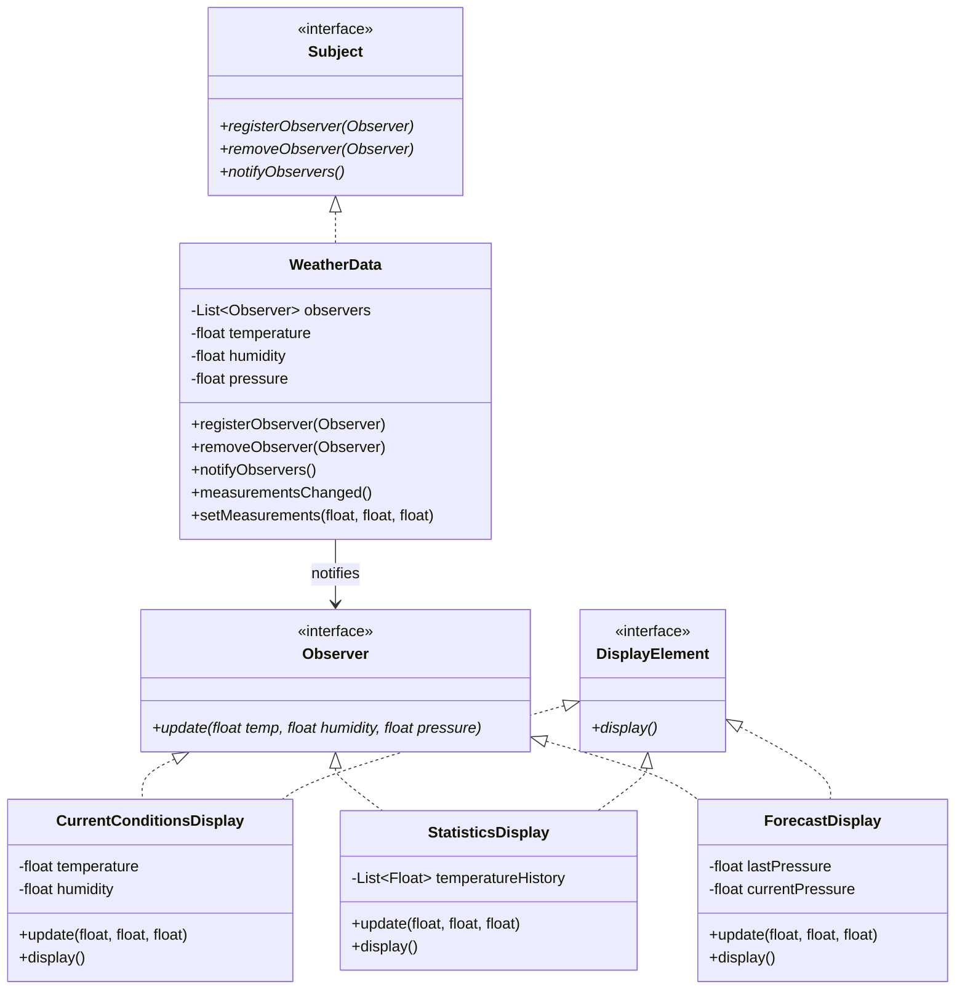

# Observer Pattern

## Problem Statement

> [!info] Head First Chapter 2 — Weather-O-Rama

**The Weather Monitoring Application**: You're hired by Weather-O-Rama to build a weather monitoring app. The system has a `WeatherData` object that tracks current conditions (temperature, humidity, pressure). You need to build **three display elements**: current conditions, statistics, and a forecast display. They all need to update in real-time whenever the `WeatherData` changes.

**The Naive Design (BROKEN)**:

```
// Inside WeatherData class
public void measurementsChanged() {
    float temp = getTemperature();
    float humidity = getHumidity();
    float pressure = getPressure();

    // HARDCODED displays — violates every principle
    currentConditionsDisplay.update(temp, humidity, pressure);
    statisticsDisplay.update(temp, humidity, pressure);
    forecastDisplay.update(temp, humidity, pressure);
}
```

**Why This Fails**:
- We're coding to concrete implementations, not interfaces
- Adding/removing a display requires modifying `WeatherData`
- We can't add new displays at runtime
- `WeatherData` has no way to know which displays exist
- Violates Open-Closed Principle — every new display = code change in `WeatherData`

---

## Key Idea / Design Principle

> [!tip] Design Principle
> **Strive for loosely coupled designs between objects that interact.**

### The Observer Pattern (GoF Definition)

> **The Observer Pattern** defines a one-to-many dependency between objects so that when one object changes state, all its dependents are notified and updated automatically.

**Analogy**: Think of a newspaper subscription. The publisher (Subject) keeps a list of subscribers (Observers). When a new edition is published, all subscribers get it automatically. You can subscribe or unsubscribe at any time.

---

## When to Use This Pattern

- When changes to one object require changing others, and you don't know how many objects need to change
- Event-driven systems (GUI events, message brokers, stock tickers)
- When an object should notify other objects without knowing who they are
- Implementing distributed event handling systems
- MVC architecture — Model notifies Views on state change

---

## UML Class Diagram



---

## Python Implementation

```python
from abc import ABC, abstractmethod
from typing import List


# ──── Subject Interface ────

class Subject(ABC):
    @abstractmethod
    def register_observer(self, observer: 'Observer'):
        pass

    @abstractmethod
    def remove_observer(self, observer: 'Observer'):
        pass

    @abstractmethod
    def notify_observers(self):
        pass


# ──── Observer Interface ────

class Observer(ABC):
    @abstractmethod
    def update(self, temperature: float, humidity: float, pressure: float):
        pass


class DisplayElement(ABC):
    @abstractmethod
    def display(self) -> str:
        pass


# ──── Concrete Subject ────

class WeatherData(Subject):
    def __init__(self):
        self._observers: List[Observer] = []
        self._temperature: float = 0.0
        self._humidity: float = 0.0
        self._pressure: float = 0.0

    def register_observer(self, observer: Observer):
        self._observers.append(observer)

    def remove_observer(self, observer: Observer):
        self._observers.remove(observer)

    def notify_observers(self):
        for observer in self._observers:
            observer.update(self._temperature, self._humidity, self._pressure)

    def measurements_changed(self):
        self.notify_observers()

    def set_measurements(self, temperature: float, humidity: float, pressure: float):
        self._temperature = temperature
        self._humidity = humidity
        self._pressure = pressure
        self.measurements_changed()


# ──── Concrete Observers ────

class CurrentConditionsDisplay(Observer, DisplayElement):
    def __init__(self, weather_data: WeatherData):
        self._temperature: float = 0.0
        self._humidity: float = 0.0
        self._weather_data = weather_data
        weather_data.register_observer(self)

    def update(self, temperature: float, humidity: float, pressure: float):
        self._temperature = temperature
        self._humidity = humidity
        self.display()

    def display(self) -> str:
        msg = f"Current conditions: {self._temperature}°F and {self._humidity}% humidity"
        print(msg)
        return msg


class StatisticsDisplay(Observer, DisplayElement):
    def __init__(self, weather_data: WeatherData):
        self._temperatures: List[float] = []
        self._weather_data = weather_data
        weather_data.register_observer(self)

    def update(self, temperature: float, humidity: float, pressure: float):
        self._temperatures.append(temperature)
        self.display()

    def display(self) -> str:
        avg = sum(self._temperatures) / len(self._temperatures)
        max_t = max(self._temperatures)
        min_t = min(self._temperatures)
        msg = f"Avg/Max/Min temperature = {avg:.1f}/{max_t:.1f}/{min_t:.1f}"
        print(msg)
        return msg


class ForecastDisplay(Observer, DisplayElement):
    def __init__(self, weather_data: WeatherData):
        self._current_pressure: float = 29.92
        self._last_pressure: float = 0.0
        self._weather_data = weather_data
        weather_data.register_observer(self)

    def update(self, temperature: float, humidity: float, pressure: float):
        self._last_pressure = self._current_pressure
        self._current_pressure = pressure
        self.display()

    def display(self) -> str:
        if self._current_pressure > self._last_pressure:
            forecast = "Improving weather on the way!"
        elif self._current_pressure == self._last_pressure:
            forecast = "More of the same"
        else:
            forecast = "Watch out for cooler, rainy weather"
        msg = f"Forecast: {forecast}"
        print(msg)
        return msg


# ──── Client Code ────

if __name__ == "__main__":
    weather_data = WeatherData()

    current = CurrentConditionsDisplay(weather_data)
    stats = StatisticsDisplay(weather_data)
    forecast = ForecastDisplay(weather_data)

    # Simulating new weather measurements
    weather_data.set_measurements(80, 65, 30.4)
    print("---")
    weather_data.set_measurements(82, 70, 29.2)
    print("---")

    # Unsubscribe forecast display
    weather_data.remove_observer(forecast)
    weather_data.set_measurements(78, 90, 29.4)  # forecast won't update
```

---

## Java Implementation

```java
import java.util.ArrayList;
import java.util.List;

// ──── Subject Interface ────

public interface Subject {
    void registerObserver(Observer o);
    void removeObserver(Observer o);
    void notifyObservers();
}

// ──── Observer Interface ────

public interface Observer {
    void update(float temp, float humidity, float pressure);
}

public interface DisplayElement {
    String display();
}

// ──── Concrete Subject ────

public class WeatherData implements Subject {
    private final List<Observer> observers = new ArrayList<>();
    private float temperature;
    private float humidity;
    private float pressure;

    @Override
    public void registerObserver(Observer o) {
        observers.add(o);
    }

    @Override
    public void removeObserver(Observer o) {
        observers.remove(o);
    }

    @Override
    public void notifyObservers() {
        for (Observer observer : observers) {
            observer.update(temperature, humidity, pressure);
        }
    }

    public void measurementsChanged() {
        notifyObservers();
    }

    public void setMeasurements(float temperature, float humidity, float pressure) {
        this.temperature = temperature;
        this.humidity = humidity;
        this.pressure = pressure;
        measurementsChanged();
    }
}

// ──── Concrete Observer ────

public class CurrentConditionsDisplay implements Observer, DisplayElement {
    private float temperature;
    private float humidity;

    public CurrentConditionsDisplay(WeatherData weatherData) {
        weatherData.registerObserver(this);
    }

    @Override
    public void update(float temp, float humidity, float pressure) {
        this.temperature = temp;
        this.humidity = humidity;
        display();
    }

    @Override
    public String display() {
        String msg = "Current conditions: " + temperature + "°F and " + humidity + "% humidity";
        System.out.println(msg);
        return msg;
    }
}

public class StatisticsDisplay implements Observer, DisplayElement {
    private final List<Float> temperatures = new ArrayList<>();

    public StatisticsDisplay(WeatherData weatherData) {
        weatherData.registerObserver(this);
    }

    @Override
    public void update(float temp, float humidity, float pressure) {
        temperatures.add(temp);
        display();
    }

    @Override
    public String display() {
        float sum = 0;
        float max = Float.MIN_VALUE, min = Float.MAX_VALUE;
        for (float t : temperatures) {
            sum += t;
            max = Math.max(max, t);
            min = Math.min(min, t);
        }
        float avg = sum / temperatures.size();
        String msg = String.format("Avg/Max/Min temperature = %.1f/%.1f/%.1f", avg, max, min);
        System.out.println(msg);
        return msg;
    }
}

// ──── Client ────

public class WeatherStation {
    public static void main(String[] args) {
        WeatherData weatherData = new WeatherData();

        CurrentConditionsDisplay current = new CurrentConditionsDisplay(weatherData);
        StatisticsDisplay stats = new StatisticsDisplay(weatherData);

        weatherData.setMeasurements(80, 65, 30.4f);
        weatherData.setMeasurements(82, 70, 29.2f);
    }
}
```

---

## Push vs Pull Model

| Aspect | Push | Pull |
|--------|------|------|
| **How** | Subject sends data to observers in `update()` | Subject notifies; observers pull what they need |
| **Coupling** | Higher — observer's `update()` signature tied to subject's data | Lower — observers decide what to fetch |
| **Efficiency** | May send unneeded data | Observers fetch only what they need |
| **Head First** | Uses push model | Mentions pull as alternative |
| **Java built-in** | `java.util.Observable` used pull | Deprecated in Java 9 |

> [!tip] Recommendation
> Use **pull model** in production. It keeps the Observer interface clean and allows subjects to change their data without updating all observer signatures.

---

## Real-World Examples

| Where | Usage |
|-------|-------|
| **Java Swing / JavaFX** | `ActionListener`, `ChangeListener` — UI event handling |
| **JavaScript** | `addEventListener` — DOM event model |
| **React** | `useState` / `useEffect` — component re-renders on state change |
| **RxJava / RxPython** | Reactive streams are observer pattern on steroids |
| **Kafka / RabbitMQ** | Pub-Sub model for distributed systems |
| **Spring Events** | `ApplicationEventPublisher` / `@EventListener` |
| **Python** | `signal` / `slot` in Qt, Django signals |

---

## Common Pitfalls

> [!warning] Pitfalls to Avoid
> 1. **Memory leaks**: If observers don't unsubscribe, they're held in memory by the subject. Use `WeakReference` in Java or weak refs in Python.
> 2. **Notification order**: Don't depend on observer notification order — it's undefined.
> 3. **Cascade updates**: Observer A updates, triggers Observer B, which triggers A again → infinite loop.
> 4. **Thread safety**: In multithreaded apps, the observer list can be modified during notification. Use `CopyOnWriteArrayList` in Java.
> 5. **Java `Observable`**: Deprecated since Java 9. It was a class (not interface), limiting inheritance.

---

## Interview Tips

> [!example] How to Discuss in Interviews
> 1. **Recognize the signal**: "One object changes, many need to know" → Observer
> 2. **Name the components**: Subject (publisher), Observer (subscriber), notify mechanism
> 3. **Mention loose coupling**: "The subject doesn't know the concrete observer types"
> 4. **Discuss push vs pull**: Show you understand both models
> 5. **Real-world analogy**: "Like a YouTube channel — subscribe and get notified of new videos"
> 6. **Threading concern**: "In multi-threaded scenarios, I'd use a thread-safe collection for observers"

---

## Summary Cheat Sheet

```
Observer Pattern:
  Problem:  One object changes, many need to update
  Solution: Subject maintains observer list, notifies on change
  Key:      Loose coupling — subject doesn't know observer types
  Structure:
    Subject ──notifies──▶ Observer (interface)
      │                       │
      │               ┌───────┴──────┐
    WeatherData    DisplayA     DisplayB
  Benefits:
    ✓ Loose coupling (OCP)
    ✓ Dynamic subscription/unsubscription
    ✓ Broadcast communication
  Costs:
    ✗ Unexpected updates
    ✗ Memory leak risk
    ✗ Notification ordering undefined
```

---

**Related Patterns:** [[01 - Strategy Pattern]] | [[07 - Command Pattern]] | [[13 - State Pattern]]
