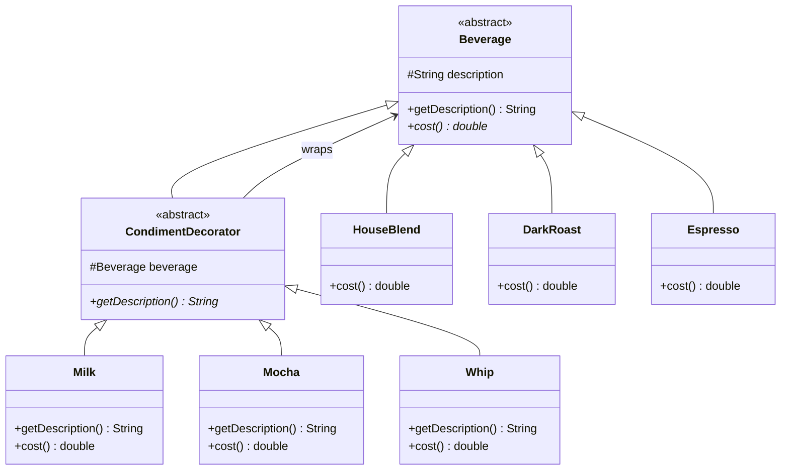

# Decorator Pattern

## Problem Statement

> [!info] Head First Chapter 3 — Starbuzz Coffee

**The Starbuzz Coffee Ordering System**: Starbuzz Coffee has an ordering system with a beverage base class. Each beverage has a `description` and a `cost()` method.

**The Problem**: There are many condiments (milk, soy, mocha, whip). Customers can add multiple condiments to any beverage. The original design tried to create subclasses for every combination:

```
Inheritance Explosion:
├── HouseBlend
├── HouseBlendWithMilk
├── HouseBlendWithSoy
├── HouseBlendWithMocha
├── HouseBlendWithMilkAndMocha      ← Combinatorial explosion!
├── HouseBlendWithMilkAndSoyAndMocha
├── DarkRoast
├── DarkRoastWithMilk
├── ...  (hundreds of subclasses!)
```

**Why This Fails**:
- **Class explosion**: N beverages × 2^M condiment combinations = absurd number of classes
- **Price changes**: If milk price changes, modify dozens of classes
- **New condiment**: Adding caramel means creating new classes for every beverage combination
- **Boolean flag approach (also bad)**: Putting `hasMilk`, `hasSoy` flags in the superclass violates OCP — every new condiment modifies the base class

---

## Key Idea / Design Principle

> [!tip] Design Principle
> **Classes should be open for extension, but closed for modification (Open-Closed Principle).**

### The Decorator Pattern (GoF Definition)

> **The Decorator Pattern** attaches additional responsibilities to an object dynamically. Decorators provide a flexible alternative to subclassing for extending functionality.

**Analogy**: Think of a gift wrapping station. You start with a plain box (component). You can wrap it with ribbon (decorator 1), then with glitter paper (decorator 2), then with a bow (decorator 3). Each wrapper adds something but the box is still a box.

---

## When to Use This Pattern

- When you need to add responsibilities to individual objects dynamically and transparently
- When extension by subclassing is impractical (too many combinations)
- When you want to add behavior without altering existing code
- Wrapper/middleware chains (HTTP middleware, I/O streams, logging decorators)
- When responsibilities can be withdrawn (remove a decorator)

---

## UML Class Diagram



> [!note] Key Insight
> The decorator **IS-A** Beverage (same type) and **HAS-A** Beverage (wraps one). This is what allows stacking: `Whip(Mocha(Mocha(DarkRoast())))`.

---

## Python Implementation

```python
from abc import ABC, abstractmethod


# ──── Component ────

class Beverage(ABC):
    def __init__(self):
        self._description = "Unknown Beverage"

    def get_description(self) -> str:
        return self._description

    @abstractmethod
    def cost(self) -> float:
        pass


# ──── Concrete Components ────

class HouseBlend(Beverage):
    def __init__(self):
        super().__init__()
        self._description = "House Blend Coffee"

    def cost(self) -> float:
        return 0.89


class DarkRoast(Beverage):
    def __init__(self):
        super().__init__()
        self._description = "Dark Roast Coffee"

    def cost(self) -> float:
        return 0.99


class Espresso(Beverage):
    def __init__(self):
        super().__init__()
        self._description = "Espresso"

    def cost(self) -> float:
        return 1.99


class Decaf(Beverage):
    def __init__(self):
        super().__init__()
        self._description = "Decaf Coffee"

    def cost(self) -> float:
        return 1.05


# ──── Decorator Base ────

class CondimentDecorator(Beverage, ABC):
    def __init__(self, beverage: Beverage):
        super().__init__()
        self._beverage = beverage

    @abstractmethod
    def get_description(self) -> str:
        pass


# ──── Concrete Decorators ────

class Milk(CondimentDecorator):
    def get_description(self) -> str:
        return self._beverage.get_description() + ", Milk"

    def cost(self) -> float:
        return self._beverage.cost() + 0.10


class Mocha(CondimentDecorator):
    def get_description(self) -> str:
        return self._beverage.get_description() + ", Mocha"

    def cost(self) -> float:
        return self._beverage.cost() + 0.20


class Soy(CondimentDecorator):
    def get_description(self) -> str:
        return self._beverage.get_description() + ", Soy"

    def cost(self) -> float:
        return self._beverage.cost() + 0.15


class Whip(CondimentDecorator):
    def get_description(self) -> str:
        return self._beverage.get_description() + ", Whip"

    def cost(self) -> float:
        return self._beverage.cost() + 0.10


# ──── Client Code ────

if __name__ == "__main__":
    # Espresso, no condiments
    beverage = Espresso()
    print(f"{beverage.get_description()} ${beverage.cost():.2f}")
    # Espresso $1.99

    # Dark Roast with double Mocha and Whip
    beverage2 = DarkRoast()
    beverage2 = Mocha(beverage2)    # wrap with mocha
    beverage2 = Mocha(beverage2)    # wrap with another mocha
    beverage2 = Whip(beverage2)     # wrap with whip
    print(f"{beverage2.get_description()} ${beverage2.cost():.2f}")
    # Dark Roast Coffee, Mocha, Mocha, Whip $1.49

    # House Blend with Soy, Mocha, Whip
    beverage3 = Whip(Mocha(Soy(HouseBlend())))
    print(f"{beverage3.get_description()} ${beverage3.cost():.2f}")
    # House Blend Coffee, Soy, Mocha, Whip $1.34
```

---

## Java Implementation

```java
// ──── Component ────

public abstract class Beverage {
    protected String description = "Unknown Beverage";

    public String getDescription() { return description; }
    public abstract double cost();
}

// ──── Concrete Components ────

public class HouseBlend extends Beverage {
    public HouseBlend() { description = "House Blend Coffee"; }

    @Override
    public double cost() { return 0.89; }
}

public class DarkRoast extends Beverage {
    public DarkRoast() { description = "Dark Roast Coffee"; }

    @Override
    public double cost() { return 0.99; }
}

public class Espresso extends Beverage {
    public Espresso() { description = "Espresso"; }

    @Override
    public double cost() { return 1.99; }
}

// ──── Decorator Base ────

public abstract class CondimentDecorator extends Beverage {
    protected Beverage beverage;

    public CondimentDecorator(Beverage beverage) {
        this.beverage = beverage;
    }

    @Override
    public abstract String getDescription();
}

// ──── Concrete Decorators ────

public class Milk extends CondimentDecorator {
    public Milk(Beverage beverage) { super(beverage); }

    @Override
    public String getDescription() { return beverage.getDescription() + ", Milk"; }

    @Override
    public double cost() { return beverage.cost() + 0.10; }
}

public class Mocha extends CondimentDecorator {
    public Mocha(Beverage beverage) { super(beverage); }

    @Override
    public String getDescription() { return beverage.getDescription() + ", Mocha"; }

    @Override
    public double cost() { return beverage.cost() + 0.20; }
}

public class Whip extends CondimentDecorator {
    public Whip(Beverage beverage) { super(beverage); }

    @Override
    public String getDescription() { return beverage.getDescription() + ", Whip"; }

    @Override
    public double cost() { return beverage.cost() + 0.10; }
}

// ──── Client ────

public class StarbuzzCoffee {
    public static void main(String[] args) {
        Beverage espresso = new Espresso();
        System.out.println(espresso.getDescription() + " $" + espresso.cost());

        Beverage darkRoast = new DarkRoast();
        darkRoast = new Mocha(darkRoast);
        darkRoast = new Mocha(darkRoast);
        darkRoast = new Whip(darkRoast);
        System.out.println(darkRoast.getDescription() + " $" + darkRoast.cost());
    }
}
```

---

## Real-World Examples

| Where | Usage |
|-------|-------|
| **Java I/O Streams** | `BufferedInputStream(FileInputStream(file))` — classic decorator chain |
| **Python `functools.wraps`** | Function decorators (different from GoF but same spirit) |
| **Django Middleware** | Each middleware wraps the next, adding behavior (auth, logging, CORS) |
| **Express.js Middleware** | `app.use(cors())`, `app.use(json())` — middleware chain |
| **Spring AOP** | Proxies wrap beans to add cross-cutting concerns |
| **gRPC Interceptors** | Chain of interceptors wrapping the handler |

---

## Decorator vs Other Patterns

| vs | Decorator | Other |
|----|-----------|-------|
| **Strategy** | Wraps to *add* behavior | *Replaces* behavior entirely |
| **Adapter** | Same interface, adds features | Different interface, compatibility |
| **Proxy** | Same interface, controls access | Same interface, controls access (very similar!) |
| **Composite** | Wraps ONE object, adds behavior | Tree of objects, uniform treatment |

> [!warning] Decorator vs Python Decorators
> Python's `@decorator` syntax is **not** the same as the GoF Decorator Pattern. Python decorators are a language feature for wrapping functions. The GoF pattern wraps objects with additional behavior using the same interface.

---

## Common Pitfalls

> [!warning] Pitfalls to Avoid
> 1. **Too many small decorators**: Can make code hard to debug — `Whip(Mocha(Soy(Milk(DarkRoast()))))` is hard to trace.
> 2. **Order matters**: `Encrypt(Compress(data))` ≠ `Compress(Encrypt(data))`.
> 3. **Identity checks fail**: `darkRoast instanceof DarkRoast` is `false` after wrapping with Mocha.
> 4. **Cannot unwrap**: No easy way to remove a specific decorator from the middle of a chain.

---

## Interview Tips

> [!example] How to Discuss in Interviews
> 1. **Recognize the signal**: "Add features dynamically without subclassing" or "middleware chain"
> 2. **Draw the wrapping**: Show how decorators wrap the component layer by layer
> 3. **Mention Java I/O**: The canonical real-world example everyone knows
> 4. **OCP connection**: "New condiments = new decorator class, existing code untouched"
> 5. **Distinguish from Proxy**: "Both wrap objects, but Decorator adds behavior while Proxy controls access"

---

## Summary Cheat Sheet

```
Decorator Pattern:
  Problem:  Class explosion from subclass combinations
  Solution: Wrap objects with decorators that add behavior
  Key:      Same interface as component — allows stacking
  Structure:
    Component  ◄── ConcreteComponent
        ▲
        │
    Decorator  ◄── ConcreteDecorator
     (wraps a Component)
  Benefits:
    ✓ Open-Closed Principle
    ✓ Combine behaviors dynamically
    ✓ Alternative to multiple inheritance
  Costs:
    ✗ Many small objects
    ✗ Hard to debug deep chains
    ✗ Order-dependent
```

---

**Related Patterns:** [[01 - Strategy Pattern]] | [[08 - Adapter Pattern]] | [[09 - Facade Pattern]] | [[14 - Proxy Pattern]]
