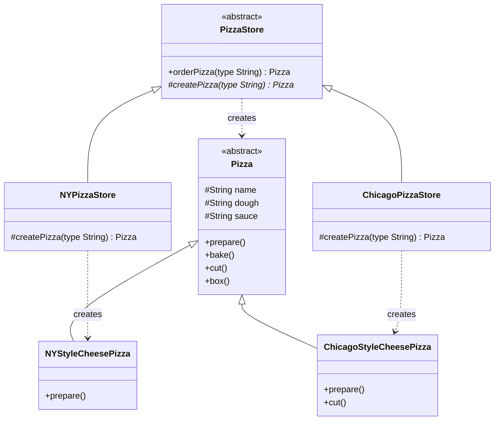

# Factory Method Pattern

## Problem Statement

> [!info] Head First Chapter 4 — Pizza Store

**The Pizza Store**: You run a pizza business. The original code creates pizzas directly:

```python
def order_pizza(pizza_type: str) -> Pizza:
    if pizza_type == "cheese":
        pizza = CheesePizza()
    elif pizza_type == "pepperoni":
        pizza = PepperoniPizza()
    elif pizza_type == "veggie":
        pizza = VeggiePizza()
    # Adding new pizza types means modifying this code!

    pizza.prepare()
    pizza.bake()
    pizza.cut()
    pizza.box()
    return pizza
```

**The Expansion**: Now you want franchise stores (NY, Chicago) each with region-specific pizzas. NYStyleCheesePizza has thin crust; ChicagoStyleCheesePizza has deep dish. The `if/else` chain grows uncontrollably.

**Why Direct Instantiation Fails**:
- Every new pizza type or new region = modify the `order_pizza` method
- Violates Open-Closed Principle — the method is a growing `if/else` mess
- The creation logic and the ordering logic are mixed together
- Can't test `order_pizza` without creating real pizza objects

---

## Key Idea / Design Principle

> [!tip] Design Principle
> **Depend upon abstractions. Do not depend upon concrete classes (Dependency Inversion Principle).**

### The Factory Method Pattern (GoF Definition)

> **The Factory Method Pattern** defines an interface for creating an object, but lets subclasses decide which class to instantiate. Factory Method lets a class defer instantiation to subclasses.

**In plain English**: Instead of the client calling `new ConcreteProduct()`, a factory method in a creator class makes the object. Subclasses override this method to create different products.

---

## When to Use This Pattern

- When a class can't anticipate which class of objects it must create
- When a class wants its subclasses to specify the objects it creates
- When you want to localize creation logic (separate creation from usage)
- When you have a family of related objects and want to minimize direct `new` calls
- Framework code that creates objects but lets user code specify the exact type

---

## UML Class Diagram



---

## Python Implementation

```python
from abc import ABC, abstractmethod
from typing import List


# ──── Product ────

class Pizza(ABC):
    def __init__(self):
        self.name: str = ""
        self.dough: str = ""
        self.sauce: str = ""
        self.toppings: List[str] = []

    def prepare(self) -> str:
        lines = [
            f"Preparing {self.name}",
            f"Tossing {self.dough} dough...",
            f"Adding {self.sauce} sauce...",
            f"Adding toppings: {', '.join(self.toppings)}"
        ]
        result = "\n".join(lines)
        print(result)
        return result

    def bake(self) -> str:
        msg = "Bake for 25 minutes at 350°F"
        print(msg)
        return msg

    def cut(self) -> str:
        msg = "Cutting the pizza into diagonal slices"
        print(msg)
        return msg

    def box(self) -> str:
        msg = "Place pizza in official PizzaStore box"
        print(msg)
        return msg

    def __str__(self):
        return self.name


# ──── Concrete Products (NY Style) ────

class NYStyleCheesePizza(Pizza):
    def __init__(self):
        super().__init__()
        self.name = "NY Style Sauce and Cheese Pizza"
        self.dough = "Thin Crust"
        self.sauce = "Marinara"
        self.toppings = ["Grated Reggiano Cheese"]


class NYStylePepperoniPizza(Pizza):
    def __init__(self):
        super().__init__()
        self.name = "NY Style Pepperoni Pizza"
        self.dough = "Thin Crust"
        self.sauce = "Marinara"
        self.toppings = ["Grated Reggiano Cheese", "Pepperoni"]


# ──── Concrete Products (Chicago Style) ────

class ChicagoStyleCheesePizza(Pizza):
    def __init__(self):
        super().__init__()
        self.name = "Chicago Style Deep Dish Cheese Pizza"
        self.dough = "Extra Thick Crust"
        self.sauce = "Plum Tomato"
        self.toppings = ["Shredded Mozzarella Cheese"]

    def cut(self) -> str:
        msg = "Cutting the pizza into square slices"  # Chicago cuts differently!
        print(msg)
        return msg


# ──── Creator ────

class PizzaStore(ABC):
    def order_pizza(self, pizza_type: str) -> Pizza:
        """Template method — uses the factory method create_pizza()"""
        pizza = self.create_pizza(pizza_type)
        pizza.prepare()
        pizza.bake()
        pizza.cut()
        pizza.box()
        return pizza

    @abstractmethod
    def create_pizza(self, pizza_type: str) -> Pizza:
        """Factory method — subclasses decide which Pizza to create"""
        pass


# ──── Concrete Creators ────

class NYPizzaStore(PizzaStore):
    def create_pizza(self, pizza_type: str) -> Pizza:
        if pizza_type == "cheese":
            return NYStyleCheesePizza()
        elif pizza_type == "pepperoni":
            return NYStylePepperoniPizza()
        else:
            raise ValueError(f"Unknown pizza type: {pizza_type}")


class ChicagoPizzaStore(PizzaStore):
    def create_pizza(self, pizza_type: str) -> Pizza:
        if pizza_type == "cheese":
            return ChicagoStyleCheesePizza()
        else:
            raise ValueError(f"Unknown pizza type: {pizza_type}")


# ──── Client Code ────

if __name__ == "__main__":
    ny_store = NYPizzaStore()
    chicago_store = ChicagoPizzaStore()

    pizza = ny_store.order_pizza("cheese")
    print(f"Ethan ordered a {pizza}\n")

    pizza = chicago_store.order_pizza("cheese")
    print(f"Joel ordered a {pizza}\n")
```

---

## Java Implementation

```java
import java.util.ArrayList;
import java.util.List;

// ──── Product ────

public abstract class Pizza {
    protected String name;
    protected String dough;
    protected String sauce;
    protected List<String> toppings = new ArrayList<>();

    public void prepare() {
        System.out.println("Preparing " + name);
        System.out.println("Tossing " + dough + " dough...");
        System.out.println("Adding " + sauce + " sauce...");
        System.out.println("Adding toppings: " + String.join(", ", toppings));
    }

    public void bake() { System.out.println("Bake for 25 minutes at 350°F"); }
    public void cut() { System.out.println("Cutting the pizza into diagonal slices"); }
    public void box() { System.out.println("Place pizza in official PizzaStore box"); }

    @Override
    public String toString() { return name; }
}

// ──── Concrete Products ────

public class NYStyleCheesePizza extends Pizza {
    public NYStyleCheesePizza() {
        name = "NY Style Sauce and Cheese Pizza";
        dough = "Thin Crust";
        sauce = "Marinara";
        toppings.add("Grated Reggiano Cheese");
    }
}

public class ChicagoStyleCheesePizza extends Pizza {
    public ChicagoStyleCheesePizza() {
        name = "Chicago Style Deep Dish Cheese Pizza";
        dough = "Extra Thick Crust";
        sauce = "Plum Tomato";
        toppings.add("Shredded Mozzarella Cheese");
    }

    @Override
    public void cut() {
        System.out.println("Cutting the pizza into square slices");
    }
}

// ──── Creator ────

public abstract class PizzaStore {
    public Pizza orderPizza(String type) {
        Pizza pizza = createPizza(type);    // Factory Method
        pizza.prepare();
        pizza.bake();
        pizza.cut();
        pizza.box();
        return pizza;
    }

    // Factory method — subclasses decide
    protected abstract Pizza createPizza(String type);
}

// ──── Concrete Creators ────

public class NYPizzaStore extends PizzaStore {
    @Override
    protected Pizza createPizza(String type) {
        return switch (type) {
            case "cheese" -> new NYStyleCheesePizza();
            default -> throw new IllegalArgumentException("Unknown: " + type);
        };
    }
}

public class ChicagoPizzaStore extends PizzaStore {
    @Override
    protected Pizza createPizza(String type) {
        return switch (type) {
            case "cheese" -> new ChicagoStyleCheesePizza();
            default -> throw new IllegalArgumentException("Unknown: " + type);
        };
    }
}

// ──── Client ────

public class PizzaTestDrive {
    public static void main(String[] args) {
        PizzaStore nyStore = new NYPizzaStore();
        PizzaStore chicagoStore = new ChicagoPizzaStore();

        Pizza pizza = nyStore.orderPizza("cheese");
        System.out.println("Ethan ordered a " + pizza + "\n");

        pizza = chicagoStore.orderPizza("cheese");
        System.out.println("Joel ordered a " + pizza + "\n");
    }
}
```

---

## Simple Factory vs Factory Method

| Aspect | Simple Factory | Factory Method |
|--------|---------------|----------------|
| **Type** | Not a real pattern (idiom) | GoF design pattern |
| **How** | One class with a static method | Abstract method in a creator class |
| **Flexibility** | One factory for all products | Subclasses decide products |
| **Extension** | Modify the factory (violates OCP) | Add new subclass (follows OCP) |
| **When** | Simple cases, few product types | Frameworks, multiple product families |

---

## Real-World Examples

| Where | Usage |
|-------|-------|
| **Java `Calendar.getInstance()`** | Returns locale-specific `Calendar` subclass |
| **Java `NumberFormat.getInstance()`** | Returns locale-specific number formatter |
| **Spring BeanFactory** | Creates beans based on configuration |
| **Python `pathlib.Path()`** | Returns `PosixPath` or `WindowsPath` based on OS |
| **JDBC `DriverManager.getConnection()`** | Returns driver-specific `Connection` |
| **Python `collections.abc` + `__init_subclass__`** | Framework for custom collections |

---

## Common Pitfalls

> [!warning] Pitfalls to Avoid
> 1. **Over-engineering**: If you only have one type of product and don't expect more, just use `new`.
> 2. **String-based type selection**: Using strings like `"cheese"` is fragile. Prefer enums.
> 3. **Confusing with Abstract Factory**: Factory Method creates ONE product via inheritance. Abstract Factory creates a FAMILY of related products via composition.
> 4. **Forgetting to use the factory**: Client code that bypasses the factory and calls `new` directly.

---

## Interview Tips

> [!example] How to Discuss in Interviews
> 1. **Recognize the signal**: "Multiple types of objects, chosen at runtime" → Factory
> 2. **Distinguish the three**: Simple Factory (static method), Factory Method (subclass decides), Abstract Factory (family of products)
> 3. **Connect to DIP**: "We depend on the abstract `Pizza`, not on `NYStyleCheesePizza`"
> 4. **Template Method connection**: `orderPizza()` IS a template method — it calls the factory method as a step

---

## Summary Cheat Sheet

```
Factory Method Pattern:
  Problem:  Direct instantiation ties code to concrete classes
  Solution: Define factory method; let subclasses decide what to create
  Key:      Dependency Inversion — depend on abstractions
  Structure:
    Creator (abstract)         Product (abstract)
      │                            │
    ConcreteCreator ──creates──▶ ConcreteProduct
  Benefits:
    ✓ Open-Closed Principle
    ✓ Decouples creation from usage
    ✓ Each creator encapsulates product creation logic
  Costs:
    ✗ More classes (one creator per product family)
    ✗ Must subclass to create new product types
```

---

**Related Patterns:** [[05 - Abstract Factory Pattern]] | [[06 - Singleton Pattern]] | [[10 - Template Method Pattern]]
