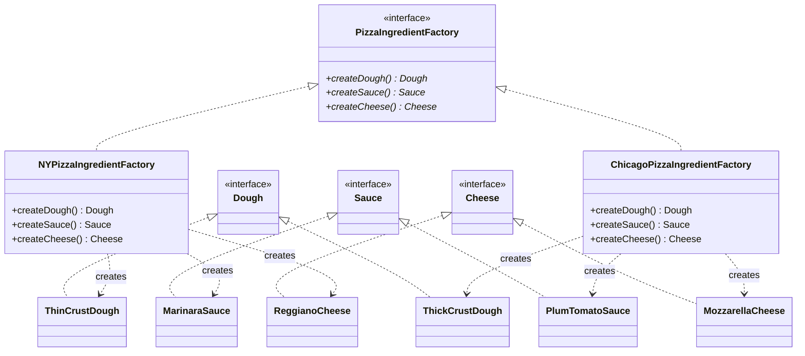

# Abstract Factory Pattern

## Problem Statement

> [!info] Head First Chapter 4 — Pizza Ingredient Factories

**The Pizza Ingredient Problem**: The pizza stores from [[04 - Factory Method Pattern]] each need region-specific **ingredients**. NY uses thin crust dough, marinara sauce, reggiano cheese. Chicago uses thick crust, plum tomato sauce, mozzarella. We need to ensure each region uses the right *family* of ingredients together.

**Why Factory Method isn't enough here**: Factory Method creates ONE product. Here we need to create a **family of related products** (dough + sauce + cheese + veggies + pepperoni + clams) that must be used together. We can't mix NY dough with Chicago sauce.

---

## Key Idea / Design Principle

> **The Abstract Factory Pattern** provides an interface for creating families of related or dependent objects without specifying their concrete classes.

**In plain English**: An abstract factory is a "factory of factories." It creates a set of related objects (an ingredient family) ensuring they're all compatible.

---

## When to Use This Pattern

- When you need to create families of related objects that must be used together
- When the system should be independent of how its products are created
- When you want to enforce constraints on which objects can be combined
- Cross-platform UI toolkits (Windows button + Windows scrollbar vs Mac button + Mac scrollbar)
- Database access layers (MySQLConnection + MySQLCommand vs PostgreSQLConnection + PostgreSQLCommand)

---

## UML Class Diagram



---

## Python Implementation

```python
from abc import ABC, abstractmethod


# ──── Abstract Products ────

class Dough(ABC):
    @abstractmethod
    def __str__(self) -> str: pass

class Sauce(ABC):
    @abstractmethod
    def __str__(self) -> str: pass

class Cheese(ABC):
    @abstractmethod
    def __str__(self) -> str: pass

class Clams(ABC):
    @abstractmethod
    def __str__(self) -> str: pass


# ──── Concrete Products (NY Family) ────

class ThinCrustDough(Dough):
    def __str__(self): return "Thin Crust Dough"

class MarinaraSauce(Sauce):
    def __str__(self): return "Marinara Sauce"

class ReggianoCheese(Cheese):
    def __str__(self): return "Reggiano Cheese"

class FreshClams(Clams):
    def __str__(self): return "Fresh Clams from Long Island Sound"


# ──── Concrete Products (Chicago Family) ────

class ThickCrustDough(Dough):
    def __str__(self): return "Extra Thick Crust Dough"

class PlumTomatoSauce(Sauce):
    def __str__(self): return "Plum Tomato Sauce"

class MozzarellaCheese(Cheese):
    def __str__(self): return "Shredded Mozzarella"

class FrozenClams(Clams):
    def __str__(self): return "Frozen Clams from Chesapeake Bay"


# ──── Abstract Factory ────

class PizzaIngredientFactory(ABC):
    @abstractmethod
    def create_dough(self) -> Dough: pass

    @abstractmethod
    def create_sauce(self) -> Sauce: pass

    @abstractmethod
    def create_cheese(self) -> Cheese: pass

    @abstractmethod
    def create_clams(self) -> Clams: pass


# ──── Concrete Factories ────

class NYPizzaIngredientFactory(PizzaIngredientFactory):
    def create_dough(self) -> Dough: return ThinCrustDough()
    def create_sauce(self) -> Sauce: return MarinaraSauce()
    def create_cheese(self) -> Cheese: return ReggianoCheese()
    def create_clams(self) -> Clams: return FreshClams()


class ChicagoPizzaIngredientFactory(PizzaIngredientFactory):
    def create_dough(self) -> Dough: return ThickCrustDough()
    def create_sauce(self) -> Sauce: return PlumTomatoSauce()
    def create_cheese(self) -> Cheese: return MozzarellaCheese()
    def create_clams(self) -> Clams: return FrozenClams()


# ──── Pizza (uses the factory) ────

class Pizza(ABC):
    def __init__(self):
        self.name = ""
        self.dough: Dough = None
        self.sauce: Sauce = None
        self.cheese: Cheese = None

    @abstractmethod
    def prepare(self): pass

    def bake(self): print("Bake for 25 minutes at 350°F")
    def cut(self): print("Cutting the pizza into diagonal slices")
    def box(self): print("Place pizza in official PizzaStore box")
    def __str__(self): return self.name


class CheesePizza(Pizza):
    def __init__(self, ingredient_factory: PizzaIngredientFactory):
        super().__init__()
        self._factory = ingredient_factory

    def prepare(self):
        print(f"Preparing {self.name}")
        self.dough = self._factory.create_dough()
        self.sauce = self._factory.create_sauce()
        self.cheese = self._factory.create_cheese()
        print(f"  Dough: {self.dough}")
        print(f"  Sauce: {self.sauce}")
        print(f"  Cheese: {self.cheese}")


class ClamPizza(Pizza):
    def __init__(self, ingredient_factory: PizzaIngredientFactory):
        super().__init__()
        self._factory = ingredient_factory

    def prepare(self):
        print(f"Preparing {self.name}")
        self.dough = self._factory.create_dough()
        self.sauce = self._factory.create_sauce()
        self.cheese = self._factory.create_cheese()
        clams = self._factory.create_clams()
        print(f"  Dough: {self.dough}")
        print(f"  Sauce: {self.sauce}")
        print(f"  Cheese: {self.cheese}")
        print(f"  Clams: {clams}")


# ──── Client ────

if __name__ == "__main__":
    # NY cheese pizza
    ny_factory = NYPizzaIngredientFactory()
    pizza = CheesePizza(ny_factory)
    pizza.name = "NY Style Cheese Pizza"
    pizza.prepare()  # Uses NY ingredients

    print("---")

    # Chicago clam pizza
    chicago_factory = ChicagoPizzaIngredientFactory()
    pizza2 = ClamPizza(chicago_factory)
    pizza2.name = "Chicago Style Clam Pizza"
    pizza2.prepare()  # Uses Chicago ingredients
```

---

## Java Implementation

```java
// ──── Abstract Products ────

public interface Dough { String toString(); }
public interface Sauce { String toString(); }
public interface Cheese { String toString(); }

// ──── Concrete Products ────

public class ThinCrustDough implements Dough {
    public String toString() { return "Thin Crust Dough"; }
}
public class ThickCrustDough implements Dough {
    public String toString() { return "Extra Thick Crust Dough"; }
}
public class MarinaraSauce implements Sauce {
    public String toString() { return "Marinara Sauce"; }
}
public class MozzarellaCheese implements Cheese {
    public String toString() { return "Shredded Mozzarella"; }
}

// ──── Abstract Factory ────

public interface PizzaIngredientFactory {
    Dough createDough();
    Sauce createSauce();
    Cheese createCheese();
}

// ──── Concrete Factories ────

public class NYPizzaIngredientFactory implements PizzaIngredientFactory {
    public Dough createDough() { return new ThinCrustDough(); }
    public Sauce createSauce() { return new MarinaraSauce(); }
    public Cheese createCheese() { return new ReggianoCheese(); }
}

public class ChicagoPizzaIngredientFactory implements PizzaIngredientFactory {
    public Dough createDough() { return new ThickCrustDough(); }
    public Sauce createSauce() { return new PlumTomatoSauce(); }
    public Cheese createCheese() { return new MozzarellaCheese(); }
}

// ──── Pizza (uses the factory) ────

public abstract class Pizza {
    protected String name;
    protected Dough dough;
    protected Sauce sauce;
    protected Cheese cheese;

    public abstract void prepare();
    public void bake() { System.out.println("Bake for 25 minutes at 350°F"); }
    public void cut() { System.out.println("Cutting into diagonal slices"); }
    public void box() { System.out.println("Place in PizzaStore box"); }
    public String toString() { return name; }
}

public class CheesePizza extends Pizza {
    private final PizzaIngredientFactory ingredientFactory;

    public CheesePizza(PizzaIngredientFactory factory) {
        this.ingredientFactory = factory;
    }

    @Override
    public void prepare() {
        System.out.println("Preparing " + name);
        dough = ingredientFactory.createDough();
        sauce = ingredientFactory.createSauce();
        cheese = ingredientFactory.createCheese();
    }
}
```

---

## Factory Method vs Abstract Factory

| Aspect | Factory Method | Abstract Factory |
|--------|---------------|-----------------|
| **Creates** | ONE product | Family of related products |
| **Mechanism** | Inheritance (subclass overrides) | Composition (inject factory) |
| **Extension** | Add new creator subclass | Add new factory implementing interface |
| **Complexity** | Lower | Higher |
| **Use When** | Single product varies | Multiple related products must be consistent |

---

## Real-World Examples

| Where | Usage |
|-------|-------|
| **Java AWT / Swing** | `createButton()`, `createDialog()` — platform-specific UI components |
| **JDBC** | `Connection` factory creates related `Statement`, `ResultSet` objects |
| **Spring** | `AbstractFactoryBean` for creating families of beans |
| **Cross-platform apps** | Windows/Mac/Linux UI component factories |
| **Game engines** | `createEnemy()`, `createWeapon()`, `createPowerUp()` per game level |

---

## Interview Tips

> [!example] How to Discuss in Interviews
> 1. **Recognize the signal**: "Create FAMILIES of related objects" → Abstract Factory
> 2. **Distinguish clearly**: "Factory Method = one product via inheritance; Abstract Factory = product family via composition"
> 3. **Real example**: "Like JDBC — a connection factory creates compatible statements, result sets, and metadata objects for a specific database"
> 4. **Draw the diagram**: Show the factory interface with multiple `create()` methods

---

## Summary Cheat Sheet

```
Abstract Factory Pattern:
  Problem:  Need families of related objects, must not mix
  Solution: Factory interface with multiple create methods
  Key:      Ensures product compatibility within a family
  Structure:
    AbstractFactory ──creates──▶ ProductA, ProductB, ProductC
         │
    ConcreteFactory1  → ProductA1, ProductB1, ProductC1
    ConcreteFactory2  → ProductA2, ProductB2, ProductC2
  Benefits:
    ✓ Enforces product family consistency
    ✓ Easy to swap entire product families
    ✓ Isolates concrete classes
  Costs:
    ✗ Adding new products requires changing every factory
    ✗ Many classes
```

---

**Related Patterns:** [[04 - Factory Method Pattern]] | [[06 - Singleton Pattern]] | [[01 - Strategy Pattern]]
