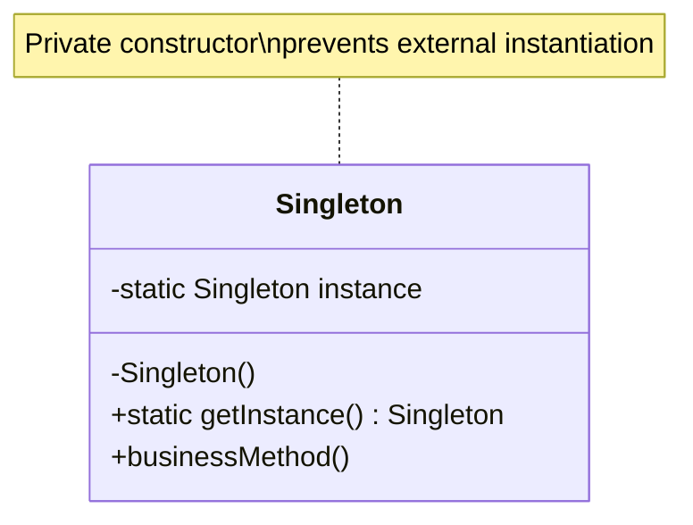

# Singleton Pattern

## Problem Statement

> [!info] Head First Chapter 5 — Chocolate Boiler

**The Chocolate Boiler**: A chocolate factory has a computer-controlled chocolate boiler. If you create more than one `ChocolateBoiler` object, two objects could be managing the same boiler — one might fill it while the other drains it. The boiler could overflow, run empty, or mix in raw ingredients.

**Why Multiple Instances Fail**:
- Multiple objects for a shared resource → race conditions and inconsistent state
- Database connection pools, thread pools, caches, loggers — there should be exactly ONE
- Global variables are worse — no access control, no lazy initialization, pollute namespace

---

## Key Idea / Design Principle

> **The Singleton Pattern** ensures a class has only one instance and provides a global point of access to it.

> [!warning] Controversial Pattern
> Singleton is the most debated pattern. It's useful for managing shared resources but is often **overused** and can make code hard to test. Modern best practice: use Dependency Injection instead of Singleton in most cases.

---

## When to Use This Pattern

- Managing access to a shared resource (database connection, file system, hardware interface)
- When exactly one object is needed to coordinate actions across the system
- Configuration managers, logging frameworks, caches
- Thread pools, print spoolers
- **Counter-indication**: If you're using Singleton "to avoid passing parameters," that's a code smell

---

## UML Class Diagram



---

## Python Implementation

```python
import threading


# ──── Method 1: Classic Thread-Safe Singleton (with lock) ────

class ChocolateBoiler:
    _instance = None
    _lock = threading.Lock()

    def __new__(cls):
        if cls._instance is None:
            with cls._lock:
                # Double-checked locking
                if cls._instance is None:
                    cls._instance = super().__new__(cls)
                    cls._instance._initialized = False
        return cls._instance

    def __init__(self):
        if self._initialized:
            return
        self._initialized = True
        self._empty = True
        self._boiled = False
        print("ChocolateBoiler initialized")

    def fill(self):
        if self.is_empty():
            self._empty = False
            self._boiled = False
            print("Filling the boiler with chocolate/milk mixture")

    def drain(self):
        if not self.is_empty() and self.is_boiled():
            self._empty = True
            print("Draining the boiled chocolate")

    def boil(self):
        if not self.is_empty() and not self.is_boiled():
            self._boiled = True
            print("Boiling the contents")

    def is_empty(self) -> bool:
        return self._empty

    def is_boiled(self) -> bool:
        return self._boiled


# ──── Method 2: Python Module-Level Singleton (Pythonic) ────
# Simply put the instance in a module — Python modules are singletons by default
# config.py:
#   _config = {"debug": False, "db_url": "..."}
#   def get_config(): return _config


# ──── Method 3: Metaclass Singleton ────

class SingletonMeta(type):
    _instances = {}
    _lock = threading.Lock()

    def __call__(cls, *args, **kwargs):
        if cls not in cls._instances:
            with cls._lock:
                if cls not in cls._instances:
                    instance = super().__call__(*args, **kwargs)
                    cls._instances[cls] = instance
        return cls._instances[cls]


class Logger(metaclass=SingletonMeta):
    def __init__(self):
        self._log = []

    def log(self, message: str):
        self._log.append(message)
        print(f"[LOG] {message}")

    def get_logs(self):
        return self._log.copy()


# ──── Client Code ────

if __name__ == "__main__":
    # Both variables reference the SAME instance
    boiler1 = ChocolateBoiler()
    boiler2 = ChocolateBoiler()
    print(f"Same instance? {boiler1 is boiler2}")  # True

    boiler1.fill()
    boiler1.boil()
    boiler1.drain()

    # Logger singleton
    logger1 = Logger()
    logger2 = Logger()
    print(f"Same logger? {logger1 is logger2}")  # True
    logger1.log("Application started")
    logger2.log("User logged in")  # Same instance
    print(f"All logs: {logger1.get_logs()}")
```

---

## Java Implementation

```java
// ──── Method 1: Double-Checked Locking (Thread-Safe, Lazy) ────

public class ChocolateBoiler {
    private volatile static ChocolateBoiler instance;
    private boolean empty;
    private boolean boiled;

    // Private constructor
    private ChocolateBoiler() {
        empty = true;
        boiled = false;
    }

    public static ChocolateBoiler getInstance() {
        if (instance == null) {                    // First check (no locking)
            synchronized (ChocolateBoiler.class) {
                if (instance == null) {            // Second check (with lock)
                    instance = new ChocolateBoiler();
                }
            }
        }
        return instance;
    }

    public void fill() {
        if (isEmpty()) {
            empty = false;
            boiled = false;
            System.out.println("Filling the boiler");
        }
    }

    public void drain() {
        if (!isEmpty() && isBoiled()) {
            empty = true;
            System.out.println("Draining the boiled chocolate");
        }
    }

    public void boil() {
        if (!isEmpty() && !isBoiled()) {
            boiled = true;
            System.out.println("Boiling the contents");
        }
    }

    public boolean isEmpty() { return empty; }
    public boolean isBoiled() { return boiled; }
}


// ──── Method 2: Enum Singleton (BEST in Java — Joshua Bloch) ────

public enum Logger {
    INSTANCE;

    private final List<String> logs = new ArrayList<>();

    public void log(String message) {
        logs.add(message);
        System.out.println("[LOG] " + message);
    }

    public List<String> getLogs() {
        return Collections.unmodifiableList(logs);
    }
}

// Usage: Logger.INSTANCE.log("Started");


// ──── Method 3: Static Inner Class (Bill Pugh Singleton) ────

public class DatabasePool {
    private DatabasePool() {
        System.out.println("Pool initialized");
    }

    // Inner class is not loaded until getInstance() is called
    private static class Holder {
        private static final DatabasePool INSTANCE = new DatabasePool();
    }

    public static DatabasePool getInstance() {
        return Holder.INSTANCE;
    }
}
```

---

## Singleton Implementations Compared

| Method | Thread-Safe | Lazy | Reflection-Safe | Serialization-Safe | Recommended |
|--------|------------|------|-----------------|-------------------|-------------|
| **Eager init** | ✅ | ❌ | ❌ | ❌ | Simple apps |
| **Synchronized method** | ✅ | ✅ | ❌ | ❌ | ❌ Slow |
| **Double-checked locking** | ✅ | ✅ | ❌ | ❌ | Common |
| **Bill Pugh (static inner class)** | ✅ | ✅ | ❌ | ❌ | Good |
| **Enum (Java)** | ✅ | ✅ | ✅ | ✅ | ✅ Best (Java) |
| **Metaclass (Python)** | ✅ (with lock) | ✅ | N/A | N/A | ✅ Best (Python) |
| **Module-level (Python)** | ✅ | ❌ | N/A | N/A | ✅ Pythonic |

> [!tip] Interview Answer
> In Java: "I'd use the **enum singleton** as recommended by Joshua Bloch in *Effective Java*. It handles serialization, reflection, and thread safety for free."
> In Python: "I'd use a **module-level instance** (Pythonic) or a **metaclass** for more control."

---

## Why Singleton is Controversial

| Issue | Problem |
|-------|---------|
| **Global state** | Acts like a global variable — hard to reason about |
| **Testing** | Hard to mock — can't replace with a test double easily |
| **Tight coupling** | Classes depend on the Singleton directly, not an interface |
| **Concurrency** | Shared mutable state → thread safety issues |
| **Violates SRP** | Manages its own lifecycle AND does business logic |
| **Hidden dependencies** | Callers don't declare they need the singleton in their constructor |

> [!tip] Modern Alternative
> **Use Dependency Injection (DI)** instead. Configure a DI container (Spring, Guice, Python's `dependency-injector`) to create a single instance and inject it where needed. This gives you single-instance behavior WITH testability.

---

## Real-World Examples

| Where | Usage |
|-------|-------|
| **Java `Runtime.getRuntime()`** | Single runtime per JVM |
| **Python `logging.getLogger(name)`** | Returns same logger for same name |
| **Spring Beans** | Default scope is singleton |
| **Database connection pools** | HikariCP, c3p0 — shared pool |
| **Python `None`, `True`, `False`** | Language-level singletons |
| **Thread pools** | `Executors.newFixedThreadPool()` — often a singleton |

---

## Interview Tips

> [!example] How to Discuss in Interviews
> 1. **Know all approaches**: Eager, lazy, double-checked, enum, Bill Pugh
> 2. **Mention `volatile`**: "In Java's double-checked locking, the field MUST be `volatile` to prevent instruction reordering"
> 3. **Know the controversy**: "Singletons are essentially global state. I prefer DI containers for managing single instances"
> 4. **Enum advantage**: "Enum singletons are reflection-safe and serialization-safe for free"
> 5. **Thread safety**: Always discuss how to make it thread-safe

---

## Summary Cheat Sheet

```
Singleton Pattern:
  Problem:  Need exactly one instance of a class
  Solution: Private constructor + static getInstance()
  Key:      One instance, global access, lazy init
  Best Approach:
    Java:   Enum singleton (Effective Java)
    Python: Module-level or Metaclass
  Benefits:
    ✓ Controlled access to single instance
    ✓ Lazy initialization possible
    ✓ Reduced namespace pollution vs globals
  Costs:
    ✗ Global state (hard to test)
    ✗ Tight coupling
    ✗ Thread safety complexity
    ✗ Violates SRP
  Modern Alternative: Dependency Injection
```

---

**Related Patterns:** [[04 - Factory Method Pattern]] | [[05 - Abstract Factory Pattern]]
