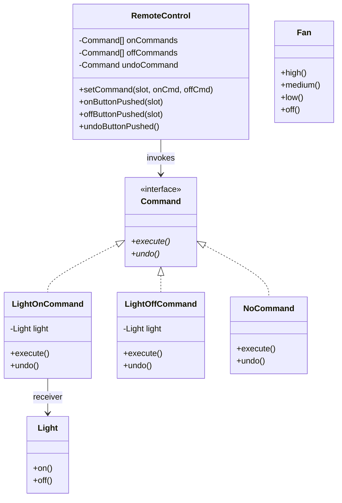

# Command Pattern

## Problem Statement

> [!info] Head First Chapter 6 — Home Automation Remote Control

**The Remote Control**: You're designing a programmable remote control with 7 slots. Each slot can be assigned to control different home automation devices (lights, fans, garage doors, stereos). Each device has different APIs — lights have `on()/off()`, fans have `high()/medium()/low()/off()`, garage doors have `up()/down()`.

**Why Direct Coupling Fails**: If the remote directly calls device methods, it needs to know every device's API. Adding a new device (hot tub, sprinkler) means modifying the remote code. The remote shouldn't know the difference between a light and a stereo.

---

## Key Idea / Design Principle

> **The Command Pattern** encapsulates a request as an object, thereby letting you parameterize other objects with different requests, queue or log requests, and support undoable operations.

**Analogy**: A restaurant order slip. The customer (Client) tells the waitress (Invoker) what they want. The waitress writes it on a slip (Command) and hands it to the cook (Receiver). The slip encapsulates all the info needed to prepare the meal. The waitress doesn't need to know how to cook.

---

## When to Use This Pattern

- Parameterize objects with an action to perform (callbacks as objects)
- Queue operations, schedule execution, or execute remotely
- Support **undo/redo** functionality
- Support **logging** and **transaction** replay
- Macro commands (execute a sequence of commands)
- Decouple the object that invokes the operation from the one that performs it

---

## UML Class Diagram



---

## Python Implementation

```python
from abc import ABC, abstractmethod
from typing import List


# ──── Command Interface ────

class Command(ABC):
    @abstractmethod
    def execute(self):
        pass

    @abstractmethod
    def undo(self):
        pass


# ──── Null Object (avoids null checks) ────

class NoCommand(Command):
    def execute(self): pass
    def undo(self): pass


# ──── Receivers ────

class Light:
    def __init__(self, location: str):
        self.location = location

    def on(self):
        print(f"{self.location} light is ON")

    def off(self):
        print(f"{self.location} light is OFF")


class CeilingFan:
    HIGH = 3
    MEDIUM = 2
    LOW = 1
    OFF = 0

    def __init__(self, location: str):
        self.location = location
        self.speed = CeilingFan.OFF

    def high(self):
        self.speed = CeilingFan.HIGH
        print(f"{self.location} fan is on HIGH")

    def medium(self):
        self.speed = CeilingFan.MEDIUM
        print(f"{self.location} fan is on MEDIUM")

    def low(self):
        self.speed = CeilingFan.LOW
        print(f"{self.location} fan is on LOW")

    def off(self):
        self.speed = CeilingFan.OFF
        print(f"{self.location} fan is OFF")


class Stereo:
    def __init__(self, location: str):
        self.location = location

    def on(self):
        print(f"{self.location} stereo is ON")

    def set_cd(self):
        print(f"{self.location} stereo is set for CD input")

    def set_volume(self, volume: int):
        print(f"{self.location} stereo volume set to {volume}")

    def off(self):
        print(f"{self.location} stereo is OFF")


# ──── Concrete Commands ────

class LightOnCommand(Command):
    def __init__(self, light: Light):
        self._light = light

    def execute(self):
        self._light.on()

    def undo(self):
        self._light.off()


class LightOffCommand(Command):
    def __init__(self, light: Light):
        self._light = light

    def execute(self):
        self._light.off()

    def undo(self):
        self._light.on()


class CeilingFanHighCommand(Command):
    def __init__(self, fan: CeilingFan):
        self._fan = fan
        self._prev_speed = CeilingFan.OFF

    def execute(self):
        self._prev_speed = self._fan.speed  # Save for undo
        self._fan.high()

    def undo(self):
        self._restore_speed()

    def _restore_speed(self):
        if self._prev_speed == CeilingFan.HIGH:
            self._fan.high()
        elif self._prev_speed == CeilingFan.MEDIUM:
            self._fan.medium()
        elif self._prev_speed == CeilingFan.LOW:
            self._fan.low()
        else:
            self._fan.off()


class StereoOnWithCDCommand(Command):
    def __init__(self, stereo: Stereo):
        self._stereo = stereo

    def execute(self):
        self._stereo.on()
        self._stereo.set_cd()
        self._stereo.set_volume(11)

    def undo(self):
        self._stereo.off()


# ──── Macro Command ────

class MacroCommand(Command):
    def __init__(self, commands: List[Command]):
        self._commands = commands

    def execute(self):
        for cmd in self._commands:
            cmd.execute()

    def undo(self):
        for cmd in reversed(self._commands):
            cmd.undo()


# ──── Invoker (Remote Control) ────

class RemoteControl:
    def __init__(self):
        no_cmd = NoCommand()
        self._on_commands: List[Command] = [no_cmd] * 7
        self._off_commands: List[Command] = [no_cmd] * 7
        self._undo_command: Command = no_cmd

    def set_command(self, slot: int, on_cmd: Command, off_cmd: Command):
        self._on_commands[slot] = on_cmd
        self._off_commands[slot] = off_cmd

    def on_button_pushed(self, slot: int):
        self._on_commands[slot].execute()
        self._undo_command = self._on_commands[slot]

    def off_button_pushed(self, slot: int):
        self._off_commands[slot].execute()
        self._undo_command = self._off_commands[slot]

    def undo_button_pushed(self):
        print("--- UNDO ---")
        self._undo_command.undo()


# ──── Client Code ────

if __name__ == "__main__":
    remote = RemoteControl()

    # Set up devices
    living_room_light = Light("Living Room")
    kitchen_light = Light("Kitchen")
    ceiling_fan = CeilingFan("Living Room")
    stereo = Stereo("Living Room")

    # Assign commands to slots
    remote.set_command(0, LightOnCommand(living_room_light), LightOffCommand(living_room_light))
    remote.set_command(1, LightOnCommand(kitchen_light), LightOffCommand(kitchen_light))
    remote.set_command(2, CeilingFanHighCommand(ceiling_fan), NoCommand())
    remote.set_command(3, StereoOnWithCDCommand(stereo), NoCommand())

    # Use remote
    remote.on_button_pushed(0)   # Living Room light is ON
    remote.off_button_pushed(0)  # Living Room light is OFF
    remote.undo_button_pushed()  # UNDO → Living Room light is ON

    # Macro command (party mode!)
    party_on = MacroCommand([
        LightOnCommand(living_room_light),
        StereoOnWithCDCommand(stereo),
        CeilingFanHighCommand(ceiling_fan),
    ])
    remote.set_command(4, party_on, NoCommand())
    print("\n--- Party Mode ON ---")
    remote.on_button_pushed(4)
    print("\n--- Party Mode UNDO ---")
    remote.undo_button_pushed()
```

---

## Java Implementation

```java
// ──── Command Interface ────

public interface Command {
    void execute();
    void undo();
}

// ──── Null Object ────

public class NoCommand implements Command {
    public void execute() {}
    public void undo() {}
}

// ──── Receiver ────

public class Light {
    private final String location;
    public Light(String location) { this.location = location; }
    public void on() { System.out.println(location + " light is ON"); }
    public void off() { System.out.println(location + " light is OFF"); }
}

// ──── Concrete Commands ────

public class LightOnCommand implements Command {
    private final Light light;
    public LightOnCommand(Light light) { this.light = light; }
    public void execute() { light.on(); }
    public void undo() { light.off(); }
}

public class LightOffCommand implements Command {
    private final Light light;
    public LightOffCommand(Light light) { this.light = light; }
    public void execute() { light.off(); }
    public void undo() { light.on(); }
}

// ──── Macro Command ────

public class MacroCommand implements Command {
    private final Command[] commands;
    public MacroCommand(Command[] commands) { this.commands = commands; }

    public void execute() {
        for (Command cmd : commands) cmd.execute();
    }

    public void undo() {
        for (int i = commands.length - 1; i >= 0; i--) {
            commands[i].undo();
        }
    }
}

// ──── Invoker ────

public class RemoteControl {
    private final Command[] onCommands;
    private final Command[] offCommands;
    private Command undoCommand;

    public RemoteControl() {
        onCommands = new Command[7];
        offCommands = new Command[7];
        Command noCommand = new NoCommand();
        for (int i = 0; i < 7; i++) {
            onCommands[i] = noCommand;
            offCommands[i] = noCommand;
        }
        undoCommand = noCommand;
    }

    public void setCommand(int slot, Command onCommand, Command offCommand) {
        onCommands[slot] = onCommand;
        offCommands[slot] = offCommand;
    }

    public void onButtonPushed(int slot) {
        onCommands[slot].execute();
        undoCommand = onCommands[slot];
    }

    public void offButtonPushed(int slot) {
        offCommands[slot].execute();
        undoCommand = offCommands[slot];
    }

    public void undoButtonPushed() {
        System.out.println("--- UNDO ---");
        undoCommand.undo();
    }
}
```

---

## Real-World Examples

| Where | Usage |
|-------|-------|
| **Java `Runnable` / `Callable`** | Commands passed to thread pools |
| **GUI Buttons** | Each button holds a command object — `actionPerformed()` |
| **Text Editors** | Undo/Redo stack of command objects |
| **Database transactions** | Commands that can be committed or rolled back |
| **Task queues (Celery, SQS)** | Serialized command objects in a queue |
| **Git** | Each commit is a command that can be reverted |

---

## Interview Tips

> [!example] How to Discuss in Interviews
> 1. **Recognize the signal**: "Undo/redo", "queue operations", "decouple sender from receiver"
> 2. **Four roles**: Client, Command, Invoker, Receiver
> 3. **Undo mechanism**: "Each command stores previous state to reverse itself"
> 4. **Macro commands**: "Group commands into a composite for batch execution"
> 5. **Null Object**: "NoCommand avoids null checks — Null Object Pattern"

---

## Summary Cheat Sheet

```
Command Pattern:
  Problem:  Decouple requester from executor; support undo
  Solution: Encapsulate actions as command objects
  Key:      Invoker → Command → Receiver (decoupled chain)
  Structure:
    Client creates ConcreteCommand(Receiver)
    Client gives Command to Invoker
    Invoker calls command.execute()
    Command calls receiver.action()
  Benefits:
    ✓ Decouples invoker from receiver
    ✓ Supports undo/redo
    ✓ Supports queueing and logging
    ✓ Supports macro commands
  Costs:
    ✗ More classes (one per command)
```

---

**Related Patterns:** [[01 - Strategy Pattern]] | [[13 - State Pattern]] | [[02 - Observer Pattern]]
