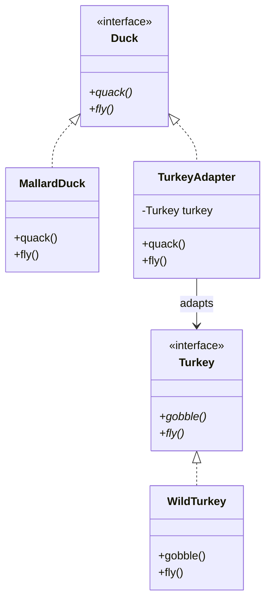

# Adapter Pattern

## Problem Statement

> [!info] Head First Chapter 7 — Turkey Adapter

**The Duck Problem**: You have a system that works with `Duck` objects. A vendor gives you a `Turkey` class that has a different interface (`gobble()` instead of `quack()`, `fly()` that only goes short distances). You need to use turkeys where ducks are expected without changing existing code.

---

## Key Idea / Design Principle

> **The Adapter Pattern** converts the interface of a class into another interface the client expects. Adapter lets classes work together that couldn't otherwise because of incompatible interfaces.

**Analogy**: A power plug adapter. European plugs don't fit American sockets. An adapter sits between them, converting one interface to another. The adapter doesn't change the plug or the socket — it bridges them.

---

## When to Use This Pattern

- When you want to use an existing class but its interface doesn't match what you need
- When you want to create a reusable class that cooperates with classes that don't have compatible interfaces
- Legacy code integration — wrapping old APIs to work with new code
- Third-party library adaptation

---

## UML Class Diagram



---

## Python Implementation

```python
from abc import ABC, abstractmethod


# ──── Target Interface ────

class Duck(ABC):
    @abstractmethod
    def quack(self): pass

    @abstractmethod
    def fly(self): pass


# ──── Adaptee ────

class Turkey(ABC):
    @abstractmethod
    def gobble(self): pass

    @abstractmethod
    def fly(self): pass  # turkeys fly short distances


class WildTurkey(Turkey):
    def gobble(self):
        print("Gobble gobble")

    def fly(self):
        print("I'm flying a short distance")


# ──── Concrete Target ────

class MallardDuck(Duck):
    def quack(self):
        print("Quack!")

    def fly(self):
        print("I'm flying!")


# ──── Object Adapter ────

class TurkeyAdapter(Duck):
    """Adapts a Turkey to work as a Duck"""
    def __init__(self, turkey: Turkey):
        self._turkey = turkey

    def quack(self):
        # Translate quack → gobble
        self._turkey.gobble()

    def fly(self):
        # Turkey flies short distances, call 5x to match duck
        for _ in range(5):
            self._turkey.fly()


# ──── Client Code ────

def test_duck(duck: Duck):
    """Client code that works with Ducks"""
    duck.quack()
    duck.fly()


if __name__ == "__main__":
    duck = MallardDuck()
    turkey = WildTurkey()
    turkey_adapter = TurkeyAdapter(turkey)

    print("The Turkey says:")
    turkey.gobble()
    turkey.fly()

    print("\nThe Duck says:")
    test_duck(duck)

    print("\nThe TurkeyAdapter says:")
    test_duck(turkey_adapter)  # Works! Turkey acts like a Duck
```

---

## Java Implementation

```java
// ──── Target Interface ────

public interface Duck {
    void quack();
    void fly();
}

// ──── Adaptee ────

public interface Turkey {
    void gobble();
    void fly();
}

public class WildTurkey implements Turkey {
    public void gobble() { System.out.println("Gobble gobble"); }
    public void fly() { System.out.println("I'm flying a short distance"); }
}

// ──── Object Adapter ────

public class TurkeyAdapter implements Duck {
    private final Turkey turkey;

    public TurkeyAdapter(Turkey turkey) {
        this.turkey = turkey;
    }

    @Override
    public void quack() {
        turkey.gobble();
    }

    @Override
    public void fly() {
        for (int i = 0; i < 5; i++) {
            turkey.fly();
        }
    }
}

// ──── Client ────

public class DuckTestDrive {
    public static void testDuck(Duck duck) {
        duck.quack();
        duck.fly();
    }

    public static void main(String[] args) {
        Duck duck = new MallardDuck();
        Turkey turkey = new WildTurkey();
        Duck turkeyAdapter = new TurkeyAdapter(turkey);

        System.out.println("The Duck:");
        testDuck(duck);

        System.out.println("\nThe TurkeyAdapter:");
        testDuck(turkeyAdapter);
    }
}
```

---

## Object Adapter vs Class Adapter

| Aspect | Object Adapter | Class Adapter |
|--------|---------------|---------------|
| **Mechanism** | Composition (wraps adaptee) | Multiple inheritance |
| **Flexibility** | Can adapt any subclass of adaptee | Adapts only one specific class |
| **Override** | Cannot override adaptee behavior | Can override adaptee behavior |
| **Java** | ✅ Supported | ❌ No multiple inheritance |
| **Python** | ✅ Recommended | ✅ Possible with multiple inheritance |
| **C++** | ✅ Both possible | ✅ Both possible |

> [!tip] Recommendation
> Always prefer **Object Adapter** (composition). It's more flexible, works in all languages, and follows "favor composition over inheritance."

---

## Adapter vs Facade vs Decorator

| Pattern | Intent | Changes Interface? | Adds Behavior? |
|---------|--------|-------------------|----------------|
| **Adapter** | Makes incompatible interfaces compatible | ✅ Yes, converts | ❌ No |
| **Facade** | Simplifies a complex subsystem | ✅ Yes, simplifies | ❌ No |
| **Decorator** | Adds responsibilities dynamically | ❌ Same interface | ✅ Yes |

---

## Real-World Examples

| Where | Usage |
|-------|-------|
| **Java `Arrays.asList()`** | Adapts array to `List` interface |
| **Java `InputStreamReader`** | Adapts `InputStream` (bytes) to `Reader` (chars) |
| **Python `__iter__` protocol** | Any class can be adapted to be iterable |
| **JDBC drivers** | Adapt vendor-specific DB protocols to standard JDBC interface |
| **Spring MVC** | `HandlerAdapter` adapts different handler types to a common interface |
| **React** | Higher-Order Components (HOCs) adapt component props |

---

## Interview Tips

> [!example] How to Discuss in Interviews
> 1. **Recognize the signal**: "Incompatible interfaces", "legacy integration", "third-party library"
> 2. **Draw the wrapper**: Adapter wraps adaptee, presents target interface
> 3. **Distinguish patterns**: "Adapter converts, Decorator adds, Facade simplifies"
> 4. **Prefer composition**: "I'd use object adapter over class adapter for flexibility"

---

## Summary Cheat Sheet

```
Adapter Pattern:
  Problem:  Incompatible interfaces
  Solution: Wrapper that converts one interface to another
  Key:      Client → Adapter → Adaptee
  Structure:
    Client ──uses──▶ Target Interface
                        ▲
                    Adapter ──wraps──▶ Adaptee
  Benefits:
    ✓ Single Responsibility (separation of interface conversion)
    ✓ Open-Closed (new adapters without changing existing code)
    ✓ Works with legacy code
  Costs:
    ✗ Extra indirection layer
    ✗ Sometimes simpler to just modify the service class
```

---

**Related Patterns:** [[09 - Facade Pattern]] | [[03 - Decorator Pattern]] | [[14 - Proxy Pattern]]
