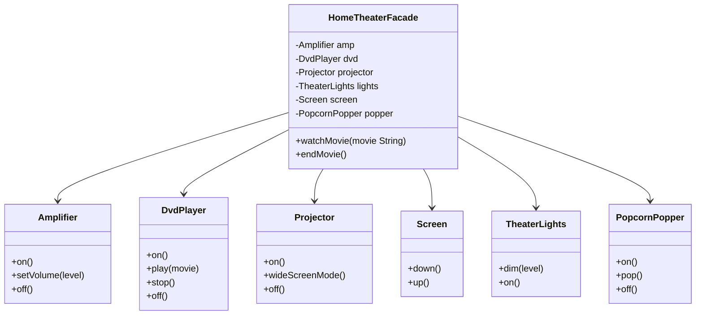

# Facade Pattern

## Problem Statement

> [!info] Head First Chapter 7 — Home Theater Facade

**The Home Theater System**: You have a complex home theater with a projector, amplifier, DVD player, screen, lights, and popcorn popper. To watch a movie, you must: turn on the popper, pop popcorn, dim lights, lower screen, turn on projector, set input, turn on amplifier, set volume, turn on DVD player, press play. That's 10+ steps across 6 objects. To turn off, reverse all steps.

**Why Direct Interaction Fails**: The client needs to know every subsystem class and their correct invocation order. Adding a new component (Blu-ray player) means updating the client. The client is tightly coupled to the subsystem.

---

## Key Idea / Design Principle

> [!tip] Design Principle
> **Principle of Least Knowledge (Law of Demeter)** — talk only to your immediate friends. Don't call methods on objects returned by other methods.

> **The Facade Pattern** provides a unified interface to a set of interfaces in a subsystem. Facade defines a higher-level interface that makes the subsystem easier to use.

**Analogy**: A hotel concierge. Instead of calling the restaurant, taxi, spa, and tour operator yourself, you tell the concierge what you want. The concierge handles all the coordination.

---

## When to Use This Pattern

- When you want to provide a simple interface to a complex subsystem
- When there are many dependencies between clients and implementation classes
- When you want to layer your subsystems (facade per layer)
- Simplifying library/framework APIs for common use cases
- Providing a clean API while keeping full power accessible for advanced users

---

## UML Class Diagram



---

## Python Implementation

```python
# ──── Subsystem Classes ────

class Amplifier:
    def on(self): print("Amplifier on")
    def set_volume(self, level: int): print(f"Amplifier volume set to {level}")
    def off(self): print("Amplifier off")

class DvdPlayer:
    def on(self): print("DVD Player on")
    def play(self, movie: str): print(f"DVD Player playing '{movie}'")
    def stop(self): print("DVD Player stopped")
    def off(self): print("DVD Player off")

class Projector:
    def on(self): print("Projector on")
    def wide_screen_mode(self): print("Projector in widescreen mode (16x9)")
    def off(self): print("Projector off")

class Screen:
    def down(self): print("Screen going down")
    def up(self): print("Screen going up")

class TheaterLights:
    def dim(self, level: int): print(f"Theater lights dimming to {level}%")
    def on(self): print("Theater lights on")

class PopcornPopper:
    def on(self): print("Popcorn Popper on")
    def pop(self): print("Popcorn Popper popping popcorn!")
    def off(self): print("Popcorn Popper off")


# ──── Facade ────

class HomeTheaterFacade:
    def __init__(self, amp: Amplifier, dvd: DvdPlayer, projector: Projector,
                 screen: Screen, lights: TheaterLights, popper: PopcornPopper):
        self._amp = amp
        self._dvd = dvd
        self._projector = projector
        self._screen = screen
        self._lights = lights
        self._popper = popper

    def watch_movie(self, movie: str):
        print(f"\n🎬 Get ready to watch '{movie}'...")
        self._popper.on()
        self._popper.pop()
        self._lights.dim(10)
        self._screen.down()
        self._projector.on()
        self._projector.wide_screen_mode()
        self._amp.on()
        self._amp.set_volume(5)
        self._dvd.on()
        self._dvd.play(movie)

    def end_movie(self):
        print("\n🛑 Shutting movie theater down...")
        self._popper.off()
        self._lights.on()
        self._screen.up()
        self._projector.off()
        self._amp.off()
        self._dvd.stop()
        self._dvd.off()


# ──── Client Code ────

if __name__ == "__main__":
    # Create subsystem components
    amp = Amplifier()
    dvd = DvdPlayer()
    projector = Projector()
    screen = Screen()
    lights = TheaterLights()
    popper = PopcornPopper()

    # Create facade
    home_theater = HomeTheaterFacade(amp, dvd, projector, screen, lights, popper)

    # Simple interface!
    home_theater.watch_movie("The Matrix")
    home_theater.end_movie()
```

---

## Java Implementation

```java
// ──── Subsystem Classes ────

public class Amplifier {
    public void on() { System.out.println("Amplifier on"); }
    public void setVolume(int level) { System.out.println("Volume set to " + level); }
    public void off() { System.out.println("Amplifier off"); }
}

public class DvdPlayer {
    public void on() { System.out.println("DVD Player on"); }
    public void play(String movie) { System.out.println("Playing '" + movie + "'"); }
    public void stop() { System.out.println("DVD Player stopped"); }
    public void off() { System.out.println("DVD Player off"); }
}

public class Projector {
    public void on() { System.out.println("Projector on"); }
    public void wideScreenMode() { System.out.println("Widescreen mode (16x9)"); }
    public void off() { System.out.println("Projector off"); }
}

// ──── Facade ────

public class HomeTheaterFacade {
    private final Amplifier amp;
    private final DvdPlayer dvd;
    private final Projector projector;
    private final Screen screen;
    private final TheaterLights lights;
    private final PopcornPopper popper;

    public HomeTheaterFacade(Amplifier amp, DvdPlayer dvd, Projector projector,
                              Screen screen, TheaterLights lights, PopcornPopper popper) {
        this.amp = amp;
        this.dvd = dvd;
        this.projector = projector;
        this.screen = screen;
        this.lights = lights;
        this.popper = popper;
    }

    public void watchMovie(String movie) {
        System.out.println("\n🎬 Get ready to watch '" + movie + "'...");
        popper.on();
        popper.pop();
        lights.dim(10);
        screen.down();
        projector.on();
        projector.wideScreenMode();
        amp.on();
        amp.setVolume(5);
        dvd.on();
        dvd.play(movie);
    }

    public void endMovie() {
        System.out.println("\n🛑 Shutting movie theater down...");
        popper.off();
        lights.on();
        screen.up();
        projector.off();
        amp.off();
        dvd.stop();
        dvd.off();
    }
}
```

---

## Facade vs Adapter

| Aspect | Facade | Adapter |
|--------|--------|---------|
| **Intent** | Simplify a complex subsystem | Make incompatible interfaces work together |
| **Interface** | Creates a NEW simplified interface | Converts to an EXISTING interface |
| **Scope** | Works with many classes | Usually wraps one class |
| **Access** | Doesn't block direct subsystem access | Replaces the adapter interface |

---

## Real-World Examples

| Where | Usage |
|-------|-------|
| **JDBC** | `DriverManager` is a facade over complex driver management |
| **SLF4J** | Facade over different logging frameworks (Logback, Log4j) |
| **jQuery `$()`** | Facade over complex DOM manipulation APIs |
| **Spring `JdbcTemplate`** | Facade over raw JDBC (connection, statement, result set management) |
| **Python `requests`** | Facade over `urllib3`, `http.cookiejar`, etc. |
| **AWS SDK** | High-level clients are facades over low-level API calls |

---

## Interview Tips

> [!example] How to Discuss in Interviews
> 1. **Recognize the signal**: "Simplify complex subsystem" or "provide a clean API"
> 2. **Not restrictive**: "Facade doesn't prevent access to subsystem — it just provides a simpler option"
> 3. **Law of Demeter**: "Facade follows Principle of Least Knowledge — clients only talk to the facade"
> 4. **Layered architecture**: "Each architectural layer can have facades to decouple layers"

---

## Summary Cheat Sheet

```
Facade Pattern:
  Problem:  Complex subsystem with many classes
  Solution: Unified high-level interface
  Key:      Simplify, don't restrict — subsystem still accessible
  Structure:
    Client ──uses──▶ Facade ──coordinates──▶ SubsystemA
                                            SubsystemB
                                            SubsystemC
  Benefits:
    ✓ Simplifies usage
    ✓ Decouples client from subsystem
    ✓ Principle of Least Knowledge
  Costs:
    ✗ Facade can become a "god object" if not careful
```

---

**Related Patterns:** [[08 - Adapter Pattern]] | [[03 - Decorator Pattern]] | [[14 - Proxy Pattern]]
