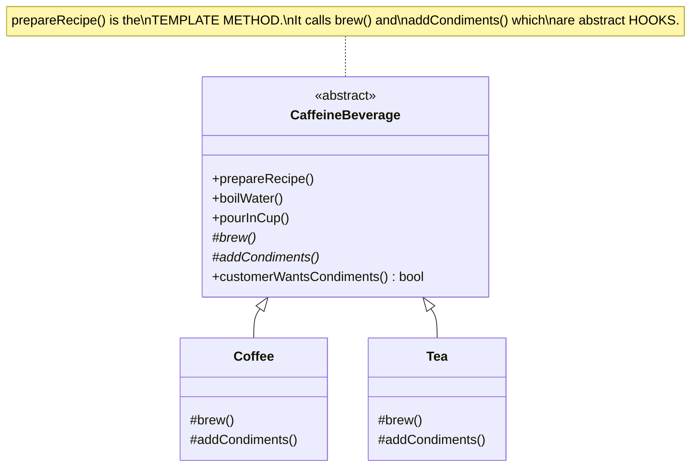

# Template Method Pattern

## Problem Statement

> [!info] Head First Chapter 8 — Coffee and Tea

**The Beverage Preparation Problem**: Making coffee and tea follow almost identical recipes:
- Coffee: boil water → brew coffee grounds → pour → add sugar/milk
- Tea: boil water → steep tea bag → pour → add lemon

Steps 1 and 3 are identical. Steps 2 and 4 differ. The naive approach duplicates the shared steps in both classes.

---

## Key Idea / Design Principle

> [!tip] Design Principle
> **The Hollywood Principle: "Don't call us, we'll call you."** High-level components decide when and how low-level components are called — not the other way around.

> **The Template Method Pattern** defines the skeleton of an algorithm in a method, deferring some steps to subclasses. Template Method lets subclasses redefine certain steps of an algorithm without changing the algorithm's structure.

---

## When to Use This Pattern

- When you have an algorithm with fixed steps but some steps vary between implementations
- When you want to avoid code duplication by moving shared steps to a superclass
- When you want to control the extension points (subclasses can only override specific steps)
- Framework hooks — framework defines the workflow, users fill in the blanks

---

## UML Class Diagram



---

## Python Implementation

```python
from abc import ABC, abstractmethod


# ──── Abstract Class with Template Method ────

class CaffeineBeverage(ABC):
    def prepare_recipe(self):
        """Template method — defines the algorithm skeleton"""
        self.boil_water()
        self.brew()
        self.pour_in_cup()
        if self.customer_wants_condiments():  # Hook!
            self.add_condiments()

    def boil_water(self):
        print("Boiling water")

    def pour_in_cup(self):
        print("Pouring into cup")

    @abstractmethod
    def brew(self):
        """Subclasses MUST implement"""
        pass

    @abstractmethod
    def add_condiments(self):
        """Subclasses MUST implement"""
        pass

    def customer_wants_condiments(self) -> bool:
        """Hook method — subclasses CAN override (optional)"""
        return True


# ──── Concrete Implementations ────

class Coffee(CaffeineBeverage):
    def brew(self):
        print("Dripping coffee through filter")

    def add_condiments(self):
        print("Adding sugar and milk")

    def customer_wants_condiments(self) -> bool:
        answer = input("Would you like milk and sugar? (y/n): ").strip().lower()
        return answer == 'y'


class Tea(CaffeineBeverage):
    def brew(self):
        print("Steeping the tea")

    def add_condiments(self):
        print("Adding lemon")


# ──── Another Example: Data Mining Template ────

class DataMiner(ABC):
    def mine(self, path: str):
        """Template method for data mining pipeline"""
        data = self.extract(path)
        parsed = self.parse(data)
        analyzed = self.analyze(parsed)
        self.report(analyzed)

    @abstractmethod
    def extract(self, path: str) -> str:
        pass

    @abstractmethod
    def parse(self, data: str) -> dict:
        pass

    def analyze(self, parsed: dict) -> dict:
        """Default analysis — can be overridden"""
        return {"count": len(parsed), "data": parsed}

    def report(self, analysis: dict):
        """Default reporting — can be overridden"""
        print(f"Analysis report: {analysis}")


class CSVDataMiner(DataMiner):
    def extract(self, path: str) -> str:
        print(f"Extracting data from CSV: {path}")
        return "csv_raw_data"

    def parse(self, data: str) -> dict:
        print("Parsing CSV data")
        return {"format": "csv", "rows": 100}


class JSONDataMiner(DataMiner):
    def extract(self, path: str) -> str:
        print(f"Extracting data from JSON: {path}")
        return "json_raw_data"

    def parse(self, data: str) -> dict:
        print("Parsing JSON data")
        return {"format": "json", "objects": 50}


# ──── Client Code ────

if __name__ == "__main__":
    print("Making tea:")
    tea = Tea()
    tea.prepare_recipe()

    print("\nMaking coffee:")
    coffee = Coffee()
    coffee.prepare_recipe()

    print("\nMining CSV data:")
    csv_miner = CSVDataMiner()
    csv_miner.mine("data.csv")
```

---

## Java Implementation

```java
// ──── Abstract Class with Template Method ────

public abstract class CaffeineBeverage {

    // TEMPLATE METHOD — final prevents subclasses from changing the algorithm
    public final void prepareRecipe() {
        boilWater();
        brew();
        pourInCup();
        if (customerWantsCondiments()) {
            addCondiments();
        }
    }

    // Concrete methods (shared by all)
    private void boilWater() { System.out.println("Boiling water"); }
    private void pourInCup() { System.out.println("Pouring into cup"); }

    // Abstract methods (subclasses MUST implement)
    protected abstract void brew();
    protected abstract void addCondiments();

    // Hook method (subclasses CAN override)
    protected boolean customerWantsCondiments() { return true; }
}

// ──── Concrete Implementations ────

public class Coffee extends CaffeineBeverage {
    @Override
    protected void brew() {
        System.out.println("Dripping coffee through filter");
    }

    @Override
    protected void addCondiments() {
        System.out.println("Adding sugar and milk");
    }
}

public class Tea extends CaffeineBeverage {
    @Override
    protected void brew() {
        System.out.println("Steeping the tea");
    }

    @Override
    protected void addCondiments() {
        System.out.println("Adding lemon");
    }
}
```

---

## Hook Methods

| Type | Description | Example |
|------|-------------|---------|
| **Abstract method** | Subclass MUST implement | `brew()`, `addCondiments()` |
| **Hook method** | Subclass CAN override (has default) | `customerWantsCondiments()` → default `true` |
| **Concrete method** | Subclass SHOULD NOT override | `boilWater()`, `pourInCup()` |

> [!tip] Use `final` in Java
> Mark the template method as `final` to prevent subclasses from overriding the algorithm structure. Only the steps should be overridable.

---

## Template Method vs Strategy

| Aspect | Template Method | Strategy |
|--------|----------------|----------|
| **Mechanism** | Inheritance | Composition |
| **What varies** | Individual steps of an algorithm | The entire algorithm |
| **Granularity** | Fine-grained (step-level) | Coarse-grained (algorithm-level) |
| **Runtime swap** | ❌ Fixed at compile time | ✅ Can swap at runtime |
| **Control** | Parent controls the flow | Client controls which strategy |

---

## Real-World Examples

| Where | Usage |
|-------|-------|
| **Java `AbstractList`** | `get(index)` is abstract; `iterator()`, `indexOf()` use it |
| **Java `HttpServlet`** | `service()` is template; `doGet()`, `doPost()` are hooks |
| **JUnit** | `setUp()` → test → `tearDown()` lifecycle |
| **Spring `JdbcTemplate`** | Template handles connection/exception; you provide the query |
| **Python `unittest`** | `setUp()` → `test_*()` → `tearDown()` |
| **React class components** | `componentDidMount()` → `render()` → lifecycle hooks |

---

## Summary Cheat Sheet

```
Template Method Pattern:
  Problem:  Same algorithm, different steps
  Solution: Define algorithm skeleton in base, defer steps to subclasses
  Key:      Hollywood Principle — "Don't call us, we'll call you"
  Structure:
    AbstractClass
      │── templateMethod()  [FINAL — the skeleton]
      │── step1()           [concrete — shared]
      │── step2()           [ABSTRACT — must override]
      └── hook()            [optional — can override]
  Benefits:
    ✓ Eliminates code duplication
    ✓ Controls extension points
    ✓ Inversion of control
  Costs:
    ✗ Limited by inheritance (can't swap at runtime)
    ✗ Harder to understand call flow (parent calls child)
```

---

**Related Patterns:** [[01 - Strategy Pattern]] | [[04 - Factory Method Pattern]] | [[07 - Command Pattern]]
