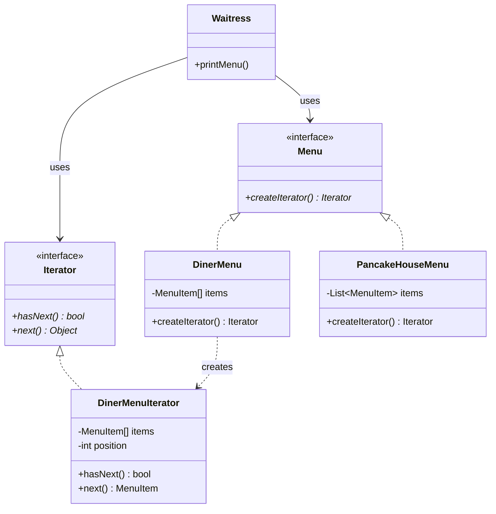

# Iterator Pattern

## Problem Statement

> [!info] Head First Chapter 9 — Diner and Pancake House Menus

**The Menu Merger**: Two restaurants merge. The Pancake House stores menu items in an `ArrayList`. The Diner stores them in an `Array`. A waitress needs to print both menus but has to use different loops for each, and the internal implementation is exposed.

---

## Key Idea / Design Principle

> [!tip] Design Principle
> **Single Responsibility Principle** — A class should have only one reason to change. The collection should manage elements; iteration should be separate.

> **The Iterator Pattern** provides a way to access the elements of an aggregate object sequentially without exposing its underlying representation.

---

## When to Use This Pattern

- When you want to traverse a collection without exposing its internal structure
- When you need multiple traversal strategies (forward, reverse, filtered)
- When you want a uniform interface for traversing different collection types
- When the collection's internal structure may change but clients shouldn't be affected

---

## UML Class Diagram



---

## Python Implementation

```python
from abc import ABC, abstractmethod
from typing import Any, List, Iterator as TypingIterator


# ──── Menu Item ────

class MenuItem:
    def __init__(self, name: str, description: str, vegetarian: bool, price: float):
        self.name = name
        self.description = description
        self.vegetarian = vegetarian
        self.price = price

    def __str__(self):
        veg = "🌱" if self.vegetarian else ""
        return f"{self.name} {veg} — ${self.price:.2f} — {self.description}"


# ──── Iterator Interface ────

class MenuIterator(ABC):
    @abstractmethod
    def has_next(self) -> bool:
        pass

    @abstractmethod
    def next(self) -> MenuItem:
        pass


# ──── Concrete Iterators ────

class DinerMenuIterator(MenuIterator):
    """Iterates over a fixed-size array"""
    def __init__(self, items: list):
        self._items = items
        self._position = 0

    def has_next(self) -> bool:
        return self._position < len(self._items) and self._items[self._position] is not None

    def next(self) -> MenuItem:
        item = self._items[self._position]
        self._position += 1
        return item


class PancakeHouseMenuIterator(MenuIterator):
    """Iterates over a dynamic list"""
    def __init__(self, items: List[MenuItem]):
        self._items = items
        self._position = 0

    def has_next(self) -> bool:
        return self._position < len(self._items)

    def next(self) -> MenuItem:
        item = self._items[self._position]
        self._position += 1
        return item


# ──── Menu Interface ────

class Menu(ABC):
    @abstractmethod
    def create_iterator(self) -> MenuIterator:
        pass


# ──── Concrete Menus ────

class DinerMenu(Menu):
    MAX_ITEMS = 6

    def __init__(self):
        self._items = [None] * self.MAX_ITEMS
        self._count = 0
        self._add_item("Veggie BLT", "Bacon with lettuce & tomato on wheat", True, 2.99)
        self._add_item("BLT", "Bacon with lettuce & tomato on wheat", False, 2.99)
        self._add_item("Hot Dog", "A hot dog with sauerkraut and relish", False, 3.05)

    def _add_item(self, name, desc, veg, price):
        if self._count >= self.MAX_ITEMS:
            print("Menu is full!")
            return
        self._items[self._count] = MenuItem(name, desc, veg, price)
        self._count += 1

    def create_iterator(self) -> MenuIterator:
        return DinerMenuIterator(self._items)


class PancakeHouseMenu(Menu):
    def __init__(self):
        self._items: List[MenuItem] = []
        self._items.append(MenuItem("Pancake Breakfast", "Pancakes with eggs and toast", True, 2.99))
        self._items.append(MenuItem("Blueberry Pancakes", "Pancakes with fresh blueberries", True, 3.49))
        self._items.append(MenuItem("Waffles", "Waffles with choice of topping", True, 3.59))

    def create_iterator(self) -> MenuIterator:
        return PancakeHouseMenuIterator(self._items)


# ──── Client (Waitress) ────

class Waitress:
    def __init__(self, *menus: Menu):
        self._menus = menus

    def print_menu(self):
        for menu in self._menus:
            iterator = menu.create_iterator()
            self._print_items(iterator)
            print()

    def _print_items(self, iterator: MenuIterator):
        while iterator.has_next():
            item = iterator.next()
            print(f"  {item}")


# ──── Pythonic Way (Protocol) ────

class PythonicMenu:
    """In Python, just implement __iter__ and __next__"""
    def __init__(self):
        self._items = [
            MenuItem("Pasta", "Spaghetti with meatballs", False, 6.99),
            MenuItem("Salad", "Fresh garden salad", True, 4.99),
        ]

    def __iter__(self):
        return iter(self._items)


# ──── Client Code ────

if __name__ == "__main__":
    pancake_menu = PancakeHouseMenu()
    diner_menu = DinerMenu()

    waitress = Waitress(pancake_menu, diner_menu)
    print("=== MENU ===")
    waitress.print_menu()

    # Pythonic way
    print("=== Pythonic Iteration ===")
    for item in PythonicMenu():
        print(f"  {item}")
```

---

## Java Implementation

```java
import java.util.*;

// ──── Iterator Interface ────

public interface Iterator<T> {
    boolean hasNext();
    T next();
}

// ──── Menu Interface ────

public interface Menu {
    Iterator<MenuItem> createIterator();
}

// ──── Concrete Iterator ────

public class DinerMenuIterator implements Iterator<MenuItem> {
    private final MenuItem[] items;
    private int position = 0;

    public DinerMenuIterator(MenuItem[] items) { this.items = items; }

    public boolean hasNext() {
        return position < items.length && items[position] != null;
    }

    public MenuItem next() { return items[position++]; }
}

// ──── Waitress (Client) ────

public class Waitress {
    private final List<Menu> menus;

    public Waitress(Menu... menus) { this.menus = Arrays.asList(menus); }

    public void printMenu() {
        for (Menu menu : menus) {
            Iterator<MenuItem> iterator = menu.createIterator();
            while (iterator.hasNext()) {
                MenuItem item = iterator.next();
                System.out.println("  " + item);
            }
            System.out.println();
        }
    }
}
```

> [!note] Java Built-in
> Java already has `java.util.Iterator` and `Iterable`. In practice, implement `Iterable<T>` and use enhanced for-loops. The pattern is baked into the language.

---

## Real-World Examples

| Where | Usage |
|-------|-------|
| **Java `Iterable` / `Iterator`** | Every collection in Java (`ArrayList`, `HashSet`, etc.) |
| **Python `__iter__` / `__next__`** | The iterator protocol; `for` loops use it |
| **Python generators** | `yield` creates lazy iterators |
| **JavaScript `Symbol.iterator`** | Enables `for...of` loops |
| **Database cursors** | JDBC `ResultSet`, Python `cursor.fetchmany()` |
| **File I/O** | Reading lines from a file one at a time |

---

## Summary Cheat Sheet

```
Iterator Pattern:
  Problem:  Different collections, need uniform traversal
  Solution: Extract traversal into an Iterator object
  Key:      Single Responsibility — collection ≠ iteration
  Structure:
    Aggregate ──creates──▶ Iterator
                             │
                      hasNext() / next()
  Benefits:
    ✓ Uniform traversal interface
    ✓ Hides internal structure
    ✓ Multiple iterators on same collection
  Costs:
    ✗ Overkill for simple collections
    ✗ Built into most modern languages
```

---

**Related Patterns:** [[12 - Composite Pattern]] | [[01 - Strategy Pattern]]
