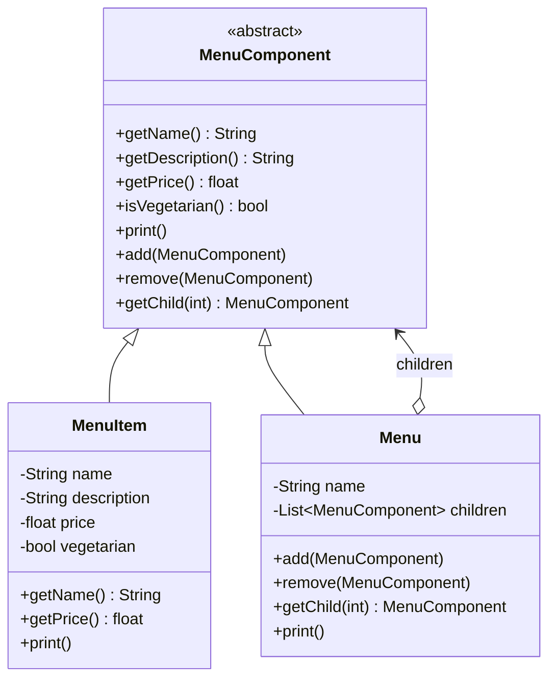

# Composite Pattern

## Problem Statement

> [!info] Head First Chapter 9 — Menu within Menu

**The Nested Menu Problem**: After merging menus with the Iterator Pattern, we now have a dessert submenu within the diner menu. We need menus that can contain other menus — a tree structure. Iterating should work uniformly whether we're dealing with a single item or an entire submenu.

---

## Key Idea / Design Principle

> **The Composite Pattern** composes objects into tree structures to represent part-whole hierarchies. Composite lets clients treat individual objects and compositions of objects uniformly.

**Analogy**: A file system. A `Directory` contains `Files` and other `Directories`. You can call `getSize()` on both — a file returns its size, a directory sums its children's sizes.

---

## When to Use This Pattern

- When you want to represent part-whole hierarchies of objects
- When clients should be able to ignore the difference between compositions and individual objects
- File systems, organizational charts, GUI widget trees, menu systems
- Any recursive tree structure where leaves and composites share an interface

---

## UML Class Diagram



---

## Python Implementation

```python
from abc import ABC, abstractmethod
from typing import List


# ──── Component ────

class MenuComponent(ABC):
    # Leaf operations (default: raise error)
    def get_name(self) -> str:
        raise NotImplementedError

    def get_description(self) -> str:
        raise NotImplementedError

    def get_price(self) -> float:
        raise NotImplementedError

    def is_vegetarian(self) -> bool:
        raise NotImplementedError

    # Composite operations (default: raise error)
    def add(self, component: 'MenuComponent'):
        raise NotImplementedError

    def remove(self, component: 'MenuComponent'):
        raise NotImplementedError

    def get_child(self, index: int) -> 'MenuComponent':
        raise NotImplementedError

    @abstractmethod
    def print_component(self, indent: int = 0):
        pass


# ──── Leaf ────

class MenuItem(MenuComponent):
    def __init__(self, name: str, description: str, vegetarian: bool, price: float):
        self._name = name
        self._description = description
        self._vegetarian = vegetarian
        self._price = price

    def get_name(self) -> str:
        return self._name

    def get_description(self) -> str:
        return self._description

    def get_price(self) -> float:
        return self._price

    def is_vegetarian(self) -> bool:
        return self._vegetarian

    def print_component(self, indent: int = 0):
        prefix = "  " * indent
        veg = " 🌱" if self._vegetarian else ""
        print(f"{prefix}{self._name}{veg}, ${self._price:.2f}")
        print(f"{prefix}  -- {self._description}")


# ──── Composite ────

class Menu(MenuComponent):
    def __init__(self, name: str, description: str):
        self._name = name
        self._description = description
        self._children: List[MenuComponent] = []

    def add(self, component: MenuComponent):
        self._children.append(component)

    def remove(self, component: MenuComponent):
        self._children.remove(component)

    def get_child(self, index: int) -> MenuComponent:
        return self._children[index]

    def get_name(self) -> str:
        return self._name

    def get_description(self) -> str:
        return self._description

    def print_component(self, indent: int = 0):
        prefix = "  " * indent
        print(f"\n{prefix}📁 {self._name} — {self._description}")
        print(f"{prefix}{'-' * 40}")
        for child in self._children:
            child.print_component(indent + 1)


# ──── Another Example: File System ────

class FileSystemComponent(ABC):
    @abstractmethod
    def get_size(self) -> int: pass

    @abstractmethod
    def display(self, indent: int = 0): pass


class File(FileSystemComponent):
    def __init__(self, name: str, size: int):
        self.name = name
        self.size = size

    def get_size(self) -> int:
        return self.size

    def display(self, indent: int = 0):
        print(f"{'  ' * indent}📄 {self.name} ({self.size} bytes)")


class Directory(FileSystemComponent):
    def __init__(self, name: str):
        self.name = name
        self._children: List[FileSystemComponent] = []

    def add(self, component: FileSystemComponent):
        self._children.append(component)

    def get_size(self) -> int:
        return sum(child.get_size() for child in self._children)

    def display(self, indent: int = 0):
        print(f"{'  ' * indent}📁 {self.name}/ ({self.get_size()} bytes)")
        for child in self._children:
            child.display(indent + 1)


# ──── Client Code ────

if __name__ == "__main__":
    # Menu example
    all_menus = Menu("ALL MENUS", "All menus combined")

    pancake = Menu("PANCAKE HOUSE", "Breakfast")
    pancake.add(MenuItem("Pancake Breakfast", "Pancakes with eggs", True, 2.99))
    pancake.add(MenuItem("Waffles", "With blueberries", True, 3.59))

    diner = Menu("DINER", "Lunch")
    diner.add(MenuItem("BLT", "Bacon, lettuce & tomato", False, 2.99))
    diner.add(MenuItem("Soup of the Day", "With side salad", False, 3.29))

    dessert = Menu("DESSERT", "Have some dessert!")
    dessert.add(MenuItem("Apple Pie", "Flaky crust with apples", True, 1.59))
    dessert.add(MenuItem("Ice Cream", "Vanilla scoop", True, 1.99))
    diner.add(dessert)  # Nested menu!

    all_menus.add(pancake)
    all_menus.add(diner)
    all_menus.print_component()

    # File system example
    print("\n\n=== File System ===")
    root = Directory("root")
    src = Directory("src")
    src.add(File("main.py", 1500))
    src.add(File("utils.py", 800))
    tests = Directory("tests")
    tests.add(File("test_main.py", 600))
    root.add(src)
    root.add(tests)
    root.add(File("README.md", 200))
    root.display()
    print(f"Total size: {root.get_size()} bytes")
```

---

## Java Implementation

```java
import java.util.ArrayList;
import java.util.List;

// ──── Component ────

public abstract class MenuComponent {
    // Leaf operations
    public String getName() { throw new UnsupportedOperationException(); }
    public double getPrice() { throw new UnsupportedOperationException(); }
    public boolean isVegetarian() { throw new UnsupportedOperationException(); }

    // Composite operations
    public void add(MenuComponent component) { throw new UnsupportedOperationException(); }
    public void remove(MenuComponent component) { throw new UnsupportedOperationException(); }
    public MenuComponent getChild(int i) { throw new UnsupportedOperationException(); }

    public abstract void print(int indent);
}

// ──── Leaf ────

public class MenuItem extends MenuComponent {
    private final String name;
    private final String description;
    private final boolean vegetarian;
    private final double price;

    public MenuItem(String name, String desc, boolean veg, double price) {
        this.name = name; this.description = desc;
        this.vegetarian = veg; this.price = price;
    }

    public String getName() { return name; }
    public double getPrice() { return price; }
    public boolean isVegetarian() { return vegetarian; }

    public void print(int indent) {
        String pad = " ".repeat(indent * 2);
        System.out.printf("%s%s%s, $%.2f%n", pad, name, vegetarian ? " 🌱" : "", price);
    }
}

// ──── Composite ────

public class Menu extends MenuComponent {
    private final List<MenuComponent> children = new ArrayList<>();
    private final String name;

    public Menu(String name, String description) {
        this.name = name;
    }

    public void add(MenuComponent c) { children.add(c); }
    public void remove(MenuComponent c) { children.remove(c); }
    public MenuComponent getChild(int i) { return children.get(i); }

    public void print(int indent) {
        String pad = " ".repeat(indent * 2);
        System.out.println(pad + "📁 " + name);
        for (MenuComponent child : children) {
            child.print(indent + 1);
        }
    }
}
```

---

## Transparency vs Safety Trade-off

| Approach | Description | Head First Choice |
|----------|-------------|-------------------|
| **Transparency** | All operations in the Component (some throw exceptions) | ✅ Used here |
| **Safety** | Only relevant operations per type (Leaf has no `add()`) | More type-safe |

> [!warning] The Composite Pattern intentionally violates the Single Responsibility Principle
> The Component interface has BOTH leaf and composite operations, trading safety for transparency. The uniform interface IS the point.

---

## Real-World Examples

| Where | Usage |
|-------|-------|
| **File systems** | Files and directories |
| **DOM tree** | HTML elements contain other elements |
| **React component tree** | Components contain child components |
| **Java Swing** | `JPanel` contains `JButton`, other `JPanel`s |
| **Organization charts** | Departments contain teams, teams contain employees |
| **Build systems (Gradle)** | Tasks can contain sub-tasks |

---

## Summary Cheat Sheet

```
Composite Pattern:
  Problem:  Part-whole hierarchies, uniform treatment
  Solution: Tree structure with Component, Leaf, Composite
  Key:      Clients treat single objects and compositions identically
  Structure:
    Component (abstract)
        ├── Leaf (no children)
        └── Composite (has children, each is a Component)
  Benefits:
    ✓ Simplifies client code (uniform interface)
    ✓ Easy to add new component types
    ✓ Recursive structures
  Costs:
    ✗ Type safety (Leaf has add/remove that throw)
    ✗ Hard to restrict component types
```

---

**Related Patterns:** [[11 - Iterator Pattern]] | [[03 - Decorator Pattern]] | [[09 - Facade Pattern]]
