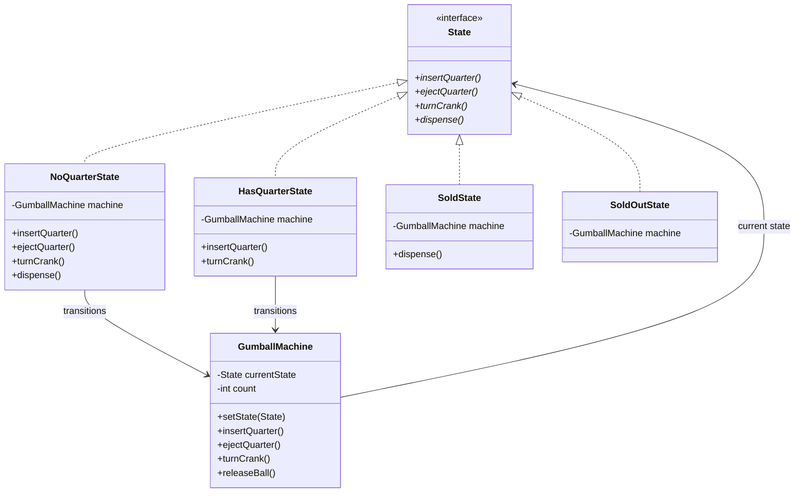

# State Pattern

## Problem Statement

> [!info] Head First Chapter 10 — Gumball Machine

**The Gumball Machine**: A gumball machine has 4 states: `NoQuarter`, `HasQuarter`, `GumballSold`, `OutOfGumballs`. Different actions (insert quarter, turn crank, dispense) behave differently depending on the current state.

**The Naive Approach (BROKEN)**:

```java
// Massive if/else or switch in every method
public void insertQuarter() {
    if (state == NO_QUARTER) { ... }
    else if (state == HAS_QUARTER) { ... }
    else if (state == SOLD) { ... }
    else if (state == SOLD_OUT) { ... }
}
// Repeat for turnCrank(), dispense(), ejectQuarter()...
// Adding a new state means modifying EVERY method!
```

**Why This Fails**: Every method has a giant conditional. Adding a "Winner" state (10% chance of getting 2 gumballs) means modifying every method. Violates Open-Closed Principle.

---

## Key Idea / Design Principle

> **The State Pattern** allows an object to alter its behavior when its internal state changes. The object will appear to change its class.

**In plain English**: Instead of big conditionals, encapsulate each state as a separate class. Each state class handles the actions appropriate for that state. The context delegates to the current state object.

---

## When to Use This Pattern

- When an object's behavior depends on its state and must change at runtime
- When methods have large conditional statements based on the object's state
- Workflow engines, game character states, order processing, vending machines
- When state transitions are complex and need to be explicit

---

## State Machine Diagram

```mermaid
stateDiagram-v2
    [*] --> NoQuarter
    NoQuarter --> HasQuarter: insertQuarter()
    HasQuarter --> NoQuarter: ejectQuarter()
    HasQuarter --> Sold: turnCrank()
    Sold --> NoQuarter: dispense() [count > 0]
    Sold --> SoldOut: dispense() [count == 0]
    SoldOut --> NoQuarter: refill()

    state HasQuarter {
        note right of HasQuarter: 10% chance → Winner state
    }
```

---

## UML Class Diagram



---

## Python Implementation

```python
from abc import ABC, abstractmethod
import random


# ──── State Interface ────

class State(ABC):
    @abstractmethod
    def insert_quarter(self): pass

    @abstractmethod
    def eject_quarter(self): pass

    @abstractmethod
    def turn_crank(self): pass

    @abstractmethod
    def dispense(self): pass


# ──── Concrete States ────

class NoQuarterState(State):
    def __init__(self, machine: 'GumballMachine'):
        self._machine = machine

    def insert_quarter(self):
        print("You inserted a quarter")
        self._machine.set_state(self._machine.has_quarter_state)

    def eject_quarter(self):
        print("You haven't inserted a quarter")

    def turn_crank(self):
        print("You turned, but there's no quarter")

    def dispense(self):
        print("You need to pay first")


class HasQuarterState(State):
    def __init__(self, machine: 'GumballMachine'):
        self._machine = machine

    def insert_quarter(self):
        print("You can't insert another quarter")

    def eject_quarter(self):
        print("Quarter returned")
        self._machine.set_state(self._machine.no_quarter_state)

    def turn_crank(self):
        print("You turned...")
        # 10% chance of WINNER
        if random.randint(1, 10) == 1 and self._machine.count > 1:
            self._machine.set_state(self._machine.winner_state)
        else:
            self._machine.set_state(self._machine.sold_state)

    def dispense(self):
        print("No gumball dispensed")


class SoldState(State):
    def __init__(self, machine: 'GumballMachine'):
        self._machine = machine

    def insert_quarter(self):
        print("Please wait, dispensing gumball")

    def eject_quarter(self):
        print("Sorry, you already turned the crank")

    def turn_crank(self):
        print("Turning twice doesn't get you another gumball")

    def dispense(self):
        self._machine.release_ball()
        if self._machine.count > 0:
            self._machine.set_state(self._machine.no_quarter_state)
        else:
            print("Oops, out of gumballs!")
            self._machine.set_state(self._machine.sold_out_state)


class WinnerState(State):
    def __init__(self, machine: 'GumballMachine'):
        self._machine = machine

    def insert_quarter(self): print("Please wait")
    def eject_quarter(self): print("Sorry, already turning")
    def turn_crank(self): print("Turning twice doesn't help")

    def dispense(self):
        print("🎉 YOU'RE A WINNER! You get two gumballs!")
        self._machine.release_ball()
        if self._machine.count == 0:
            self._machine.set_state(self._machine.sold_out_state)
        else:
            self._machine.release_ball()
            if self._machine.count > 0:
                self._machine.set_state(self._machine.no_quarter_state)
            else:
                self._machine.set_state(self._machine.sold_out_state)


class SoldOutState(State):
    def __init__(self, machine: 'GumballMachine'):
        self._machine = machine

    def insert_quarter(self):
        print("Machine is sold out. Quarter returned.")

    def eject_quarter(self):
        print("No quarter to return")

    def turn_crank(self):
        print("Machine is sold out")

    def dispense(self):
        print("No gumball to dispense")


# ──── Context ────

class GumballMachine:
    def __init__(self, count: int):
        self.no_quarter_state = NoQuarterState(self)
        self.has_quarter_state = HasQuarterState(self)
        self.sold_state = SoldState(self)
        self.sold_out_state = SoldOutState(self)
        self.winner_state = WinnerState(self)

        self.count = count
        self._state: State = self.no_quarter_state if count > 0 else self.sold_out_state

    def set_state(self, state: State):
        self._state = state

    def insert_quarter(self):
        self._state.insert_quarter()

    def eject_quarter(self):
        self._state.eject_quarter()

    def turn_crank(self):
        self._state.turn_crank()
        self._state.dispense()

    def release_ball(self):
        print("A gumball comes rolling out the slot...")
        if self.count > 0:
            self.count -= 1

    def __str__(self):
        return f"GumballMachine [gumballs: {self.count}, state: {type(self._state).__name__}]"


# ──── Client Code ────

if __name__ == "__main__":
    machine = GumballMachine(5)
    print(machine)

    machine.insert_quarter()
    machine.turn_crank()
    print(machine)

    machine.insert_quarter()
    machine.eject_quarter()
    machine.turn_crank()  # No quarter → does nothing

    print(machine)
```

---

## Java Implementation

```java
// ──── State Interface ────

public interface State {
    void insertQuarter();
    void ejectQuarter();
    void turnCrank();
    void dispense();
}

// ──── Concrete State ────

public class NoQuarterState implements State {
    private final GumballMachine machine;

    public NoQuarterState(GumballMachine machine) {
        this.machine = machine;
    }

    @Override
    public void insertQuarter() {
        System.out.println("You inserted a quarter");
        machine.setState(machine.getHasQuarterState());
    }

    @Override public void ejectQuarter() { System.out.println("No quarter inserted"); }
    @Override public void turnCrank() { System.out.println("No quarter, turn denied"); }
    @Override public void dispense() { System.out.println("Pay first"); }
}

// ──── Context ────

public class GumballMachine {
    private final State noQuarterState;
    private final State hasQuarterState;
    private final State soldState;
    private final State soldOutState;
    private State currentState;
    private int count;

    public GumballMachine(int count) {
        noQuarterState = new NoQuarterState(this);
        hasQuarterState = new HasQuarterState(this);
        soldState = new SoldState(this);
        soldOutState = new SoldOutState(this);
        this.count = count;
        currentState = count > 0 ? noQuarterState : soldOutState;
    }

    public void insertQuarter() { currentState.insertQuarter(); }
    public void ejectQuarter() { currentState.ejectQuarter(); }
    public void turnCrank() {
        currentState.turnCrank();
        currentState.dispense();
    }

    public void setState(State state) { this.currentState = state; }
    public void releaseBall() {
        System.out.println("A gumball comes rolling out...");
        if (count > 0) count--;
    }

    // Getters for states
    public State getNoQuarterState() { return noQuarterState; }
    public State getHasQuarterState() { return hasQuarterState; }
    public State getSoldState() { return soldState; }
    public State getSoldOutState() { return soldOutState; }
    public int getCount() { return count; }
}
```

---

## State vs Strategy — Key Difference

| Aspect | State | Strategy |
|--------|-------|----------|
| **Intent** | Change behavior as internal state changes | Choose an algorithm |
| **Who triggers change?** | State objects trigger transitions themselves | Client sets the strategy |
| **Awareness** | Context doesn't know which state it's in | Client selects strategy explicitly |
| **Transitions** | States know about and transition to other states | No transitions |
| **Use case** | Finite state machines, workflows | Pluggable algorithms |

> [!tip] Memory Aid
> **State**: "I change my behavior based on what's happening to me" (automatic, internal)
> **Strategy**: "You tell me which behavior to use" (external, client-driven)

---

## Real-World Examples

| Where | Usage |
|-------|-------|
| **TCP Connection** | `LISTEN`, `ESTABLISHED`, `CLOSED` states |
| **Order Processing** | `Pending → Confirmed → Shipped → Delivered → Returned` |
| **Game Characters** | `Idle → Running → Jumping → Attacking` |
| **Media Players** | `Playing → Paused → Stopped` |
| **Traffic Lights** | `Red → Green → Yellow → Red` |
| **Workflow Engines** | JBPM, Activiti — state-based process flows |

---

## Summary Cheat Sheet

```
State Pattern:
  Problem:  Behavior changes with state; big conditionals
  Solution: Encapsulate each state as a class
  Key:      States manage their own transitions
  Structure:
    Context ──delegates──▶ State (interface)
                              │
                    ┌─────────┼─────────┐
                  StateA   StateB   StateC
                    │→B      │→C      │→A  (transitions)
  Benefits:
    ✓ Open-Closed (add new states without modifying existing)
    ✓ Eliminates large conditionals
    ✓ Makes state transitions explicit
  Costs:
    ✗ More classes (one per state)
    ✗ Overkill for few states
```

---

**Related Patterns:** [[01 - Strategy Pattern]] | [[07 - Command Pattern]] | [[02 - Observer Pattern]]
