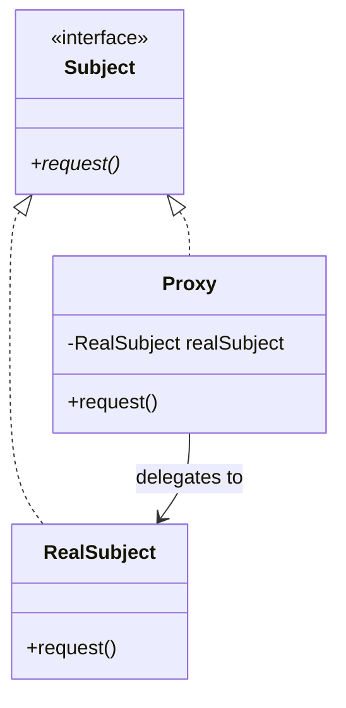

# Proxy Pattern

## Problem Statement

> [!info] Head First Chapter 11 — Gumball Machine Remote Monitor

**The Remote Monitoring Problem**: We need to monitor gumball machine state remotely. The CEO wants a dashboard showing each machine's inventory and state. The machines are across the country — we can't directly access their objects. We need a **proxy** that represents the remote machine locally.

---

## Key Idea / Design Principle

> **The Proxy Pattern** provides a surrogate or placeholder for another object to control access to it.

**Analogy**: A credit card is a proxy for your bank account. It represents your money. The store accesses your funds through the card (proxy) without directly accessing your bank account (real subject).

---

## Types of Proxy

| Type | Purpose | Example |
|------|---------|---------|
| **Remote Proxy** | Represents an object in a different address space | Java RMI, gRPC stubs |
| **Virtual Proxy** | Controls access to expensive-to-create objects | Lazy loading images |
| **Protection Proxy** | Controls access based on permissions | Access control wrappers |
| **Caching Proxy** | Caches results of expensive operations | HTTP caching proxy |
| **Logging Proxy** | Logs requests before forwarding | Audit trail |
| **Smart Reference** | Additional actions when accessed (ref counting) | `shared_ptr` in C++ |

---

## UML Class Diagram



---

## Python Implementation

```python
from abc import ABC, abstractmethod
import time
from typing import Optional, Dict


# ──── Subject Interface ────

class Image(ABC):
    @abstractmethod
    def display(self) -> str:
        pass

    @abstractmethod
    def get_filename(self) -> str:
        pass


# ──── Real Subject (Expensive to create) ────

class HighResImage(Image):
    def __init__(self, filename: str):
        self._filename = filename
        self._load_from_disk()

    def _load_from_disk(self):
        print(f"Loading high-res image '{self._filename}' from disk...")
        time.sleep(0.5)  # Simulating expensive I/O
        print(f"Image '{self._filename}' loaded!")

    def display(self) -> str:
        msg = f"Displaying '{self._filename}'"
        print(msg)
        return msg

    def get_filename(self) -> str:
        return self._filename


# ──── Virtual Proxy (Lazy Loading) ────

class ImageProxy(Image):
    """Defers loading the real image until display() is called"""
    def __init__(self, filename: str):
        self._filename = filename
        self._real_image: Optional[HighResImage] = None

    def display(self) -> str:
        if self._real_image is None:
            self._real_image = HighResImage(self._filename)
        return self._real_image.display()

    def get_filename(self) -> str:
        return self._filename


# ──── Protection Proxy (Access Control) ────

class DatabaseAccess(ABC):
    @abstractmethod
    def read(self, table: str) -> str: pass

    @abstractmethod
    def write(self, table: str, data: str) -> str: pass

    @abstractmethod
    def delete(self, table: str) -> str: pass


class RealDatabaseAccess(DatabaseAccess):
    def read(self, table: str) -> str:
        msg = f"Reading from table '{table}'"
        print(msg)
        return msg

    def write(self, table: str, data: str) -> str:
        msg = f"Writing '{data}' to table '{table}'"
        print(msg)
        return msg

    def delete(self, table: str) -> str:
        msg = f"Deleting from table '{table}'"
        print(msg)
        return msg


class DatabaseProxy(DatabaseAccess):
    """Access control based on user role"""
    ADMIN = "admin"
    USER = "user"
    READONLY = "readonly"

    def __init__(self, real_db: RealDatabaseAccess, user_role: str):
        self._real_db = real_db
        self._user_role = user_role

    def read(self, table: str) -> str:
        # Everyone can read
        return self._real_db.read(table)

    def write(self, table: str, data: str) -> str:
        if self._user_role in (self.ADMIN, self.USER):
            return self._real_db.write(table, data)
        msg = f"ACCESS DENIED: {self._user_role} cannot write"
        print(msg)
        return msg

    def delete(self, table: str) -> str:
        if self._user_role == self.ADMIN:
            return self._real_db.delete(table)
        msg = f"ACCESS DENIED: {self._user_role} cannot delete"
        print(msg)
        return msg


# ──── Caching Proxy ────

class ExpensiveDataService(ABC):
    @abstractmethod
    def get_data(self, key: str) -> str: pass


class RealDataService(ExpensiveDataService):
    def get_data(self, key: str) -> str:
        print(f"  [DB] Expensive query for key '{key}'...")
        time.sleep(0.3)
        return f"data_for_{key}"


class CachingProxy(ExpensiveDataService):
    def __init__(self, service: RealDataService):
        self._service = service
        self._cache: Dict[str, str] = {}

    def get_data(self, key: str) -> str:
        if key not in self._cache:
            print(f"  [CACHE MISS] Fetching '{key}'")
            self._cache[key] = self._service.get_data(key)
        else:
            print(f"  [CACHE HIT] Returning cached '{key}'")
        return self._cache[key]

    def invalidate(self, key: str):
        self._cache.pop(key, None)


# ──── Client Code ────

if __name__ == "__main__":
    # Virtual Proxy — lazy loading
    print("=== Virtual Proxy (Lazy Loading) ===")
    image = ImageProxy("huge_photo.jpg")
    print(f"Proxy created for: {image.get_filename()}")
    print("Image not loaded yet!")
    image.display()  # NOW it loads
    image.display()  # Already loaded, no reload

    # Protection Proxy — access control
    print("\n=== Protection Proxy (Access Control) ===")
    real_db = RealDatabaseAccess()

    admin_db = DatabaseProxy(real_db, DatabaseProxy.ADMIN)
    user_db = DatabaseProxy(real_db, DatabaseProxy.USER)
    readonly_db = DatabaseProxy(real_db, DatabaseProxy.READONLY)

    admin_db.delete("users")     # ✅ Allowed
    user_db.write("posts", "hi") # ✅ Allowed
    readonly_db.write("posts", "x") # ❌ Denied
    readonly_db.delete("users")  # ❌ Denied

    # Caching Proxy
    print("\n=== Caching Proxy ===")
    service = CachingProxy(RealDataService())
    service.get_data("user:1")   # MISS — queries DB
    service.get_data("user:1")   # HIT — from cache
    service.get_data("user:2")   # MISS
    service.invalidate("user:1")
    service.get_data("user:1")   # MISS again
```

---

## Java Implementation

```java
// ──── Subject ────

public interface Image {
    void display();
    String getFilename();
}

// ──── Real Subject ────

public class HighResImage implements Image {
    private final String filename;

    public HighResImage(String filename) {
        this.filename = filename;
        loadFromDisk();
    }

    private void loadFromDisk() {
        System.out.println("Loading '" + filename + "' from disk...");
    }

    public void display() { System.out.println("Displaying '" + filename + "'"); }
    public String getFilename() { return filename; }
}

// ──── Virtual Proxy ────

public class ImageProxy implements Image {
    private final String filename;
    private HighResImage realImage;

    public ImageProxy(String filename) { this.filename = filename; }

    public void display() {
        if (realImage == null) {
            realImage = new HighResImage(filename);  // Lazy load
        }
        realImage.display();
    }

    public String getFilename() { return filename; }
}

// ──── Java Dynamic Proxy (built-in) ────

import java.lang.reflect.*;

public class LoggingInvocationHandler implements InvocationHandler {
    private final Object target;

    public LoggingInvocationHandler(Object target) {
        this.target = target;
    }

    @Override
    public Object invoke(Object proxy, Method method, Object[] args) throws Throwable {
        System.out.println("→ Calling: " + method.getName());
        Object result = method.invoke(target, args);
        System.out.println("← Returned: " + result);
        return result;
    }

    @SuppressWarnings("unchecked")
    public static <T> T create(T target, Class<T> iface) {
        return (T) Proxy.newProxyInstance(
            iface.getClassLoader(),
            new Class[]{iface},
            new LoggingInvocationHandler(target)
        );
    }
}
```

---

## Proxy vs Decorator vs Adapter

| Pattern | Same Interface? | Purpose |
|---------|----------------|---------|
| **Proxy** | ✅ Yes | Control access (lazy load, security, caching) |
| **Decorator** | ✅ Yes | Add behavior |
| **Adapter** | ❌ Different | Convert interface |

> [!tip] Key Distinction
> Proxy and Decorator look structurally identical but differ in **intent**. A Proxy *controls* access. A Decorator *adds* behavior.

---

## Real-World Examples

| Where | Usage |
|-------|-------|
| **Java RMI** | Remote proxy — stubs and skeletons |
| **JPA/Hibernate** | Lazy loading of entity relationships (virtual proxy) |
| **Spring AOP** | CGLib/JDK dynamic proxies for aspect weaving |
| **Python `@property`** | Lazy computation via descriptor protocol |
| **Nginx reverse proxy** | Caching proxy for backend services |
| **gRPC stubs** | Remote proxy for microservice communication |
| **Python `__getattr__`** | Implement proxy behavior dynamically |

---

## Summary Cheat Sheet

```
Proxy Pattern:
  Problem:  Need to control access to an object
  Solution: Provide a surrogate with the same interface
  Types:    Remote, Virtual, Protection, Caching, Logging
  Structure:
    Client ──uses──▶ Proxy ──delegates──▶ RealSubject
                   (same interface as RealSubject)
  Benefits:
    ✓ Control access without changing RealSubject
    ✓ Lazy initialization (virtual proxy)
    ✓ Access control (protection proxy)
    ✓ Transparent to client
  Costs:
    ✗ Added complexity and indirection
    ✗ Possible latency
```

---

**Related Patterns:** [[03 - Decorator Pattern]] | [[08 - Adapter Pattern]] | [[09 - Facade Pattern]]
