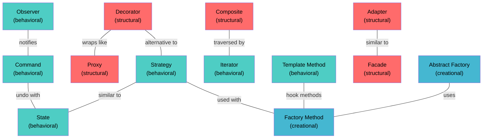

# Design Patterns — Head First Design Patterns

> [!note] About
> All 14 design patterns from **Head First Design Patterns** by Eric Freeman & Elisabeth Robson. Each pattern includes the original book example, OOP principles, UML diagrams, and complete Python & Java implementations.

## Design Principles Covered

| # | Principle | Patterns That Teach It |
|---|-----------|----------------------|
| 1 | Encapsulate what varies | Strategy, State |
| 2 | Favor composition over inheritance | Strategy, Decorator, Observer |
| 3 | Program to interfaces, not implementations | Strategy, Factory, Observer |
| 4 | Strive for loosely coupled designs | Observer, Mediator |
| 5 | Open-Closed Principle | Decorator, Observer |
| 6 | Dependency Inversion Principle | Factory Method, Abstract Factory |
| 7 | Principle of Least Knowledge (Law of Demeter) | Facade |
| 8 | Hollywood Principle ("Don't call us, we'll call you") | Template Method, Observer |
| 9 | Single Responsibility Principle | Iterator, Composite |

## Creational Patterns

| # | Pattern | Intent | Link |
|---|---------|--------|------|
| 4 | Factory Method | Define an interface for creating objects, let subclasses decide | [[04 - Factory Method Pattern]] |
| 5 | Abstract Factory | Create families of related objects without specifying concrete classes | [[05 - Abstract Factory Pattern]] |
| 6 | Singleton | Ensure one instance exists with global access | [[06 - Singleton Pattern]] |

## Structural Patterns

| # | Pattern | Intent | Link |
|---|---------|--------|------|
| 3 | Decorator | Attach additional responsibilities dynamically | [[03 - Decorator Pattern]] |
| 8 | Adapter | Convert an interface to one clients expect | [[08 - Adapter Pattern]] |
| 9 | Facade | Provide a simplified unified interface to a subsystem | [[09 - Facade Pattern]] |
| 12 | Composite | Compose objects into tree structures (part-whole) | [[12 - Composite Pattern]] |
| 14 | Proxy | Provide a surrogate or placeholder for another object | [[14 - Proxy Pattern]] |

## Behavioral Patterns

| # | Pattern | Intent | Link |
|---|---------|--------|------|
| 1 | Strategy | Define a family of algorithms, make them interchangeable | [[01 - Strategy Pattern]] |
| 2 | Observer | One-to-many dependency, notify on state change | [[02 - Observer Pattern]] |
| 7 | Command | Encapsulate a request as an object | [[07 - Command Pattern]] |
| 10 | Template Method | Define algorithm skeleton, defer steps to subclasses | [[10 - Template Method Pattern]] |
| 11 | Iterator | Access elements sequentially without exposing underlying representation | [[11 - Iterator Pattern]] |
| 13 | State | Alter behavior when internal state changes | [[13 - State Pattern]] |

## Pattern Relationships



> [!tip] Color Legend
> 🟢 **Green** = Behavioral | 🔴 **Red** = Structural | 🔵 **Blue** = Creational

---

> [!tip] Dataview Query
> ```dataview
> TABLE pattern, tags
> FROM "Projects/LLD/01-Design-Patterns"
> WHERE type = "design-pattern"
> SORT file.name ASC
> ```
