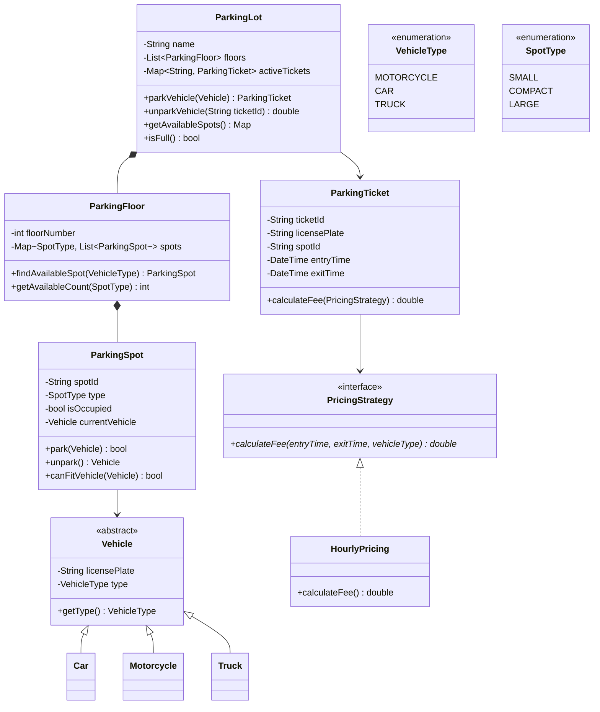
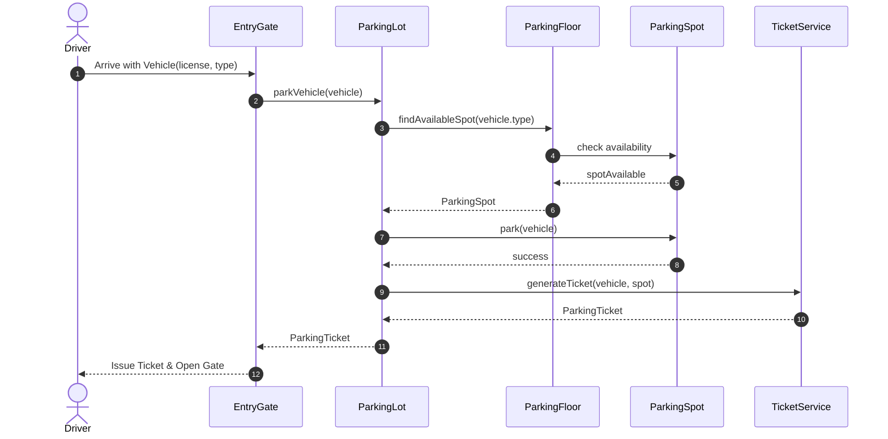

# Design a Parking Lot

## 1. Problem Statement

Design an object-oriented system for a **multi-floor parking lot** that can park different types of vehicles (car, motorcycle, truck). The system should support finding available spots, parking/unparking vehicles, and calculating fees.

> [!note] Why This is Asked
> Parking Lot is the "Two Sum" of LLD — it tests core OOP skills: inheritance, enums, composition, and basic design patterns without overwhelming complexity.

---

## 2. Requirements Clarification

**Candidate:** What types of vehicles do we need to support?
**Interviewer:** Cars, motorcycles, and trucks.

**Candidate:** Do trucks require multiple spots?
**Interviewer:** Yes, trucks need large spots (or multiple compact spots).

**Candidate:** Do we need to calculate parking fees?
**Interviewer:** Yes, hourly-based pricing.

**Candidate:** Multiple floors?
**Interviewer:** Yes.

### Functional Requirements

| # | Requirement |
|---|-------------|
| FR1 | Park a vehicle in the nearest available spot |
| FR2 | Unpark a vehicle and calculate fee |
| FR3 | Support multiple vehicle types (motorcycle, car, truck) |
| FR4 | Support multiple spot sizes (small, compact, large) |
| FR5 | Support multiple floors |
| FR6 | Display available spots per floor/type |
| FR7 | Generate parking ticket on entry |

### Non-Functional Requirements

| # | Requirement |
|---|-------------|
| NFR1 | Thread-safe (concurrent entry/exit) |
| NFR2 | Efficient spot lookup (O(1) or O(log n)) |

---

## 3. Core Use Cases

```
1. Vehicle arrives → System finds a suitable spot → Generate ticket
2. Vehicle leaves → Present ticket → Calculate fee → Release spot
3. Admin checks availability per floor
4. System is full → Reject new vehicles
```

---

## 4. Class Design



### Sequence Flow




---

## 5. Design Patterns Used

| Pattern | Where | Why |
|---------|-------|-----|
| **Strategy** | `PricingStrategy` | Swap pricing algorithms (hourly, daily, weekend) |
| **Factory** | Vehicle/Spot creation | Create vehicles and spots based on type |
| **Singleton** | `ParkingLot` (optional) | Single parking lot instance |
| **Observer** | Display boards | Notify boards when availability changes |

→ See: [[01 - Strategy Pattern]] | [[04 - Factory Method Pattern]]

---

## 6. Key Implementation

### Python

```python
from enum import Enum
from datetime import datetime
from abc import ABC, abstractmethod
from typing import Optional, Dict, List
import uuid
import threading


class VehicleType(Enum):
    MOTORCYCLE = 1
    CAR = 2
    TRUCK = 3


class SpotType(Enum):
    SMALL = 1
    COMPACT = 2
    LARGE = 3


# Vehicle type → compatible spot types
VEHICLE_SPOT_MAPPING = {
    VehicleType.MOTORCYCLE: [SpotType.SMALL, SpotType.COMPACT, SpotType.LARGE],
    VehicleType.CAR: [SpotType.COMPACT, SpotType.LARGE],
    VehicleType.TRUCK: [SpotType.LARGE],
}


class Vehicle:
    def __init__(self, license_plate: str, vehicle_type: VehicleType):
        self.license_plate = license_plate
        self.vehicle_type = vehicle_type


class ParkingSpot:
    def __init__(self, spot_id: str, spot_type: SpotType):
        self.spot_id = spot_id
        self.spot_type = spot_type
        self.is_occupied = False
        self.current_vehicle: Optional[Vehicle] = None
        self._lock = threading.Lock()

    def can_fit(self, vehicle: Vehicle) -> bool:
        return (not self.is_occupied and
                self.spot_type in VEHICLE_SPOT_MAPPING[vehicle.vehicle_type])

    def park(self, vehicle: Vehicle) -> bool:
        with self._lock:
            if not self.can_fit(vehicle):
                return False
            self.is_occupied = True
            self.current_vehicle = vehicle
            return True

    def unpark(self) -> Optional[Vehicle]:
        with self._lock:
            vehicle = self.current_vehicle
            self.is_occupied = False
            self.current_vehicle = None
            return vehicle


class ParkingFloor:
    def __init__(self, floor_number: int, spots: List[ParkingSpot]):
        self.floor_number = floor_number
        self.spots = spots

    def find_available_spot(self, vehicle: Vehicle) -> Optional[ParkingSpot]:
        for spot_type in VEHICLE_SPOT_MAPPING[vehicle.vehicle_type]:
            for spot in self.spots:
                if spot.spot_type == spot_type and spot.can_fit(vehicle):
                    return spot
        return None

    def get_available_count(self, spot_type: SpotType) -> int:
        return sum(1 for s in self.spots
                   if s.spot_type == spot_type and not s.is_occupied)


# ──── Strategy: Pricing ────

class PricingStrategy(ABC):
    @abstractmethod
    def calculate_fee(self, entry: datetime, exit_time: datetime,
                      vehicle_type: VehicleType) -> float:
        pass


class HourlyPricing(PricingStrategy):
    RATES = {
        VehicleType.MOTORCYCLE: 1.0,
        VehicleType.CAR: 2.0,
        VehicleType.TRUCK: 4.0,
    }

    def calculate_fee(self, entry: datetime, exit_time: datetime,
                      vehicle_type: VehicleType) -> float:
        hours = max(1, (exit_time - entry).total_seconds() / 3600)
        return round(hours * self.RATES[vehicle_type], 2)


class ParkingTicket:
    def __init__(self, license_plate: str, spot_id: str):
        self.ticket_id = str(uuid.uuid4())[:8]
        self.license_plate = license_plate
        self.spot_id = spot_id
        self.entry_time = datetime.now()
        self.exit_time: Optional[datetime] = None


class ParkingLot:
    def __init__(self, name: str, floors: List[ParkingFloor],
                 pricing: PricingStrategy):
        self.name = name
        self.floors = floors
        self.pricing = pricing
        self._active_tickets: Dict[str, ParkingTicket] = {}
        self._vehicle_ticket: Dict[str, str] = {}  # license → ticket_id
        self._lock = threading.Lock()

    def park_vehicle(self, vehicle: Vehicle) -> Optional[ParkingTicket]:
        with self._lock:
            for floor in self.floors:
                spot = floor.find_available_spot(vehicle)
                if spot and spot.park(vehicle):
                    ticket = ParkingTicket(vehicle.license_plate, spot.spot_id)
                    self._active_tickets[ticket.ticket_id] = ticket
                    self._vehicle_ticket[vehicle.license_plate] = ticket.ticket_id
                    print(f"✅ Parked {vehicle.license_plate} at {spot.spot_id} "
                          f"| Ticket: {ticket.ticket_id}")
                    return ticket
            print(f"❌ No spot available for {vehicle.license_plate}")
            return None

    def unpark_vehicle(self, ticket_id: str) -> float:
        with self._lock:
            ticket = self._active_tickets.get(ticket_id)
            if not ticket:
                raise ValueError(f"Invalid ticket: {ticket_id}")

            ticket.exit_time = datetime.now()

            # Find and free the spot
            for floor in self.floors:
                for spot in floor.spots:
                    if spot.spot_id == ticket.spot_id:
                        vehicle = spot.unpark()
                        break

            fee = self.pricing.calculate_fee(
                ticket.entry_time, ticket.exit_time,
                vehicle.vehicle_type
            )
            del self._active_tickets[ticket_id]
            del self._vehicle_ticket[ticket.license_plate]

            print(f"🚗 Unparked {ticket.license_plate} | Fee: ${fee:.2f}")
            return fee

    def get_availability(self) -> Dict:
        result = {}
        for floor in self.floors:
            result[f"Floor {floor.floor_number}"] = {
                st.name: floor.get_available_count(st) for st in SpotType
            }
        return result


# ──── Usage ────

if __name__ == "__main__":
    # Create parking lot
    floor1_spots = [
        ParkingSpot(f"1-S{i}", SpotType.SMALL) for i in range(5)
    ] + [
        ParkingSpot(f"1-C{i}", SpotType.COMPACT) for i in range(10)
    ] + [
        ParkingSpot(f"1-L{i}", SpotType.LARGE) for i in range(3)
    ]

    lot = ParkingLot(
        "Downtown Parking",
        [ParkingFloor(1, floor1_spots)],
        HourlyPricing()
    )

    car = Vehicle("ABC-123", VehicleType.CAR)
    bike = Vehicle("BIKE-01", VehicleType.MOTORCYCLE)
    truck = Vehicle("TRUCK-99", VehicleType.TRUCK)

    t1 = lot.park_vehicle(car)
    t2 = lot.park_vehicle(bike)
    t3 = lot.park_vehicle(truck)

    print("\nAvailability:", lot.get_availability())

    if t1:
        lot.unpark_vehicle(t1.ticket_id)
```

### Java

```java
public class ParkingLot {
    private final String name;
    private final List<ParkingFloor> floors;
    private final PricingStrategy pricing;
    private final Map<String, ParkingTicket> activeTickets = new ConcurrentHashMap<>();

    public ParkingLot(String name, List<ParkingFloor> floors, PricingStrategy pricing) {
        this.name = name;
        this.floors = floors;
        this.pricing = pricing;
    }

    public synchronized ParkingTicket parkVehicle(Vehicle vehicle) {
        for (ParkingFloor floor : floors) {
            ParkingSpot spot = floor.findAvailableSpot(vehicle);
            if (spot != null && spot.park(vehicle)) {
                ParkingTicket ticket = new ParkingTicket(
                    vehicle.getLicensePlate(), spot.getSpotId());
                activeTickets.put(ticket.getTicketId(), ticket);
                return ticket;
            }
        }
        return null; // Lot is full
    }

    public synchronized double unparkVehicle(String ticketId) {
        ParkingTicket ticket = activeTickets.remove(ticketId);
        if (ticket == null) throw new IllegalArgumentException("Invalid ticket");
        ticket.setExitTime(LocalDateTime.now());
        // Find and free spot...
        return pricing.calculateFee(ticket.getEntryTime(),
                                     ticket.getExitTime(),
                                     vehicle.getType());
    }
}
```

---

## 7. Thread Safety Considerations

| Concern | Solution |
|---------|----------|
| Concurrent parking | `synchronized` / `Lock` on `parkVehicle()` |
| Spot occupation race | Per-spot lock in `ParkingSpot.park()` |
| Ticket lookup | `ConcurrentHashMap` for active tickets |
| Double parking | Check-and-set atomically |

---

## 8. Extensibility & SOLID

| Principle | How Applied |
|-----------|------------|
| **S** — SRP | `ParkingSpot` manages spots; `PricingStrategy` handles fees; `ParkingLot` orchestrates |
| **O** — OCP | New pricing → new `PricingStrategy` class. New vehicle → new `VehicleType` + mapping |
| **L** — LSP | All `Vehicle` subclasses work wherever `Vehicle` is expected |
| **I** — ISP | Small interfaces: `PricingStrategy` has one method |
| **D** — DIP | `ParkingLot` depends on `PricingStrategy` interface, not `HourlyPricing` |

---

## 9. Follow-up Questions

**Q: How would you handle a multi-level parking lot with elevators?**
A: Add `ParkingFloor` → `Elevator` relationship. Use a strategy for floor selection (nearest floor with availability).

**Q: How would you handle EV charging spots?**
A: Add `EVChargingSpot extends ParkingSpot` with `chargerType` and `startCharging()`. Extend `SpotType` enum.

**Q: How would you handle reservation?**
A: Add `Reservation` class with `reserveSpot(spotId, timeSlot)`. Temporarily mark spots as reserved.

**Q: How would you handle handicapped spots?**
A: Add `SpotType.HANDICAPPED`. Priority allocation for vehicles with handicap permits.

---

## 10. Interview Tips

> [!tip] Time Management
> - **3 min**: Clarify requirements
> - **5 min**: Identify classes (Vehicle, Spot, Floor, Lot, Ticket)
> - **10 min**: Draw class diagram
> - **15 min**: Code ParkingLot.park(), ParkingSpot, PricingStrategy
> - **5 min**: Discuss extensibility, thread safety

---

**Related:** [[Design a Car Rental System]] | [[Design an Elevator System]] | [[01 - Strategy Pattern]] | [[04 - Factory Method Pattern]]
