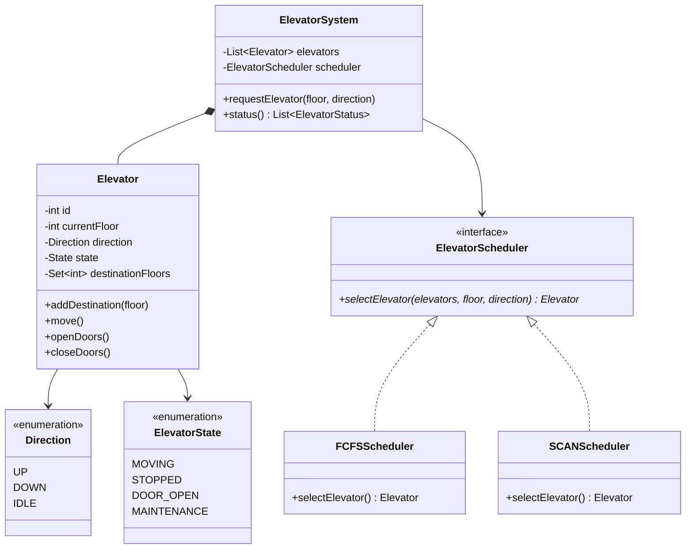

# Design an Elevator System

## 1. Problem Statement

Design an elevator system for a building with multiple elevators and multiple floors. The system should efficiently handle pickup requests and move elevators optimally.

---

## 2. Requirements Clarification

### Functional Requirements

| # | Requirement |
|---|-------------|
| FR1 | Handle up/down requests from any floor |
| FR2 | Handle destination requests from inside elevator |
| FR3 | Support multiple elevators |
| FR4 | Open/close doors at destination |
| FR5 | Display current floor and direction |

### Non-Functional Requirements

| # | Requirement |
|---|-------------|
| NFR1 | Minimize wait time |
| NFR2 | Efficient dispatching (don't send all elevators to one floor) |
| NFR3 | Thread-safe |

---

## 3. Class Design



---

## 4. Design Patterns Used

| Pattern | Where | Why |
|---------|-------|-----|
| **State** | `ElevatorState` (MOVING, STOPPED, DOOR_OPEN) | Behavior changes per state |
| **Strategy** | `ElevatorScheduler` | Swap scheduling algorithms |
| **Observer** | Floor displays | Notify displays of elevator position |

→ See: [[13 - State Pattern]] | [[01 - Strategy Pattern]] | [[02 - Observer Pattern]]

---

## 5. Key Implementation

### Python

```python
from enum import Enum
from typing import List, Set, Optional
import threading
import heapq


class Direction(Enum):
    UP = 1
    DOWN = -1
    IDLE = 0


class ElevatorState(Enum):
    MOVING = "MOVING"
    STOPPED = "STOPPED"
    DOOR_OPEN = "DOOR_OPEN"
    MAINTENANCE = "MAINTENANCE"


class Elevator:
    def __init__(self, elevator_id: int, min_floor: int = 0, max_floor: int = 10):
        self.id = elevator_id
        self.current_floor = 0
        self.direction = Direction.IDLE
        self.state = ElevatorState.STOPPED
        self.min_floor = min_floor
        self.max_floor = max_floor
        self._up_stops: Set[int] = set()
        self._down_stops: Set[int] = set()
        self._lock = threading.Lock()

    def add_destination(self, floor: int):
        with self._lock:
            if floor > self.current_floor:
                self._up_stops.add(floor)
            elif floor < self.current_floor:
                self._down_stops.add(floor)
            else:
                self._open_doors()

    def move(self):
        """Process one step of movement"""
        with self._lock:
            if self.direction == Direction.UP:
                if self._up_stops:
                    self.current_floor += 1
                    if self.current_floor in self._up_stops:
                        self._up_stops.remove(self.current_floor)
                        self._open_doors()
                    if not self._up_stops:
                        self.direction = Direction.DOWN if self._down_stops else Direction.IDLE
                else:
                    self.direction = Direction.DOWN if self._down_stops else Direction.IDLE

            elif self.direction == Direction.DOWN:
                if self._down_stops:
                    self.current_floor -= 1
                    if self.current_floor in self._down_stops:
                        self._down_stops.remove(self.current_floor)
                        self._open_doors()
                    if not self._down_stops:
                        self.direction = Direction.UP if self._up_stops else Direction.IDLE
                else:
                    self.direction = Direction.UP if self._up_stops else Direction.IDLE

            elif self.direction == Direction.IDLE:
                if self._up_stops:
                    self.direction = Direction.UP
                elif self._down_stops:
                    self.direction = Direction.DOWN

    def _open_doors(self):
        self.state = ElevatorState.DOOR_OPEN
        print(f"  Elevator {self.id}: Doors open at floor {self.current_floor}")
        self.state = ElevatorState.STOPPED

    def is_idle(self) -> bool:
        return self.direction == Direction.IDLE

    def distance_to(self, floor: int) -> int:
        return abs(self.current_floor - floor)

    def __repr__(self):
        return (f"Elevator(id={self.id}, floor={self.current_floor}, "
                f"dir={self.direction.name}, up={self._up_stops}, "
                f"down={self._down_stops})")


# ──── Strategy: Scheduling ────

class ElevatorScheduler:
    """Strategy interface for elevator dispatch"""
    def select_elevator(self, elevators: List[Elevator],
                        floor: int, direction: Direction) -> Optional[Elevator]:
        raise NotImplementedError


class NearestElevatorScheduler(ElevatorScheduler):
    """Select the nearest idle or same-direction elevator"""
    def select_elevator(self, elevators: List[Elevator],
                        floor: int, direction: Direction) -> Optional[Elevator]:
        best = None
        best_distance = float('inf')

        for elevator in elevators:
            if elevator.state == ElevatorState.MAINTENANCE:
                continue

            distance = elevator.distance_to(floor)

            # Prefer idle elevators
            if elevator.is_idle() and distance < best_distance:
                best = elevator
                best_distance = distance
            # Or elevators heading toward requested floor
            elif (elevator.direction == direction and
                  ((direction == Direction.UP and elevator.current_floor <= floor) or
                   (direction == Direction.DOWN and elevator.current_floor >= floor))):
                if distance < best_distance:
                    best = elevator
                    best_distance = distance

        # Fallback: any elevator with smallest distance
        if best is None:
            available = [e for e in elevators
                        if e.state != ElevatorState.MAINTENANCE]
            if available:
                best = min(available, key=lambda e: e.distance_to(floor))

        return best


# ──── Controller ────

class ElevatorSystem:
    def __init__(self, num_elevators: int, num_floors: int,
                 scheduler: ElevatorScheduler = None):
        self.elevators = [Elevator(i, 0, num_floors) for i in range(num_elevators)]
        self.scheduler = scheduler or NearestElevatorScheduler()
        self.num_floors = num_floors

    def request_elevator(self, floor: int, direction: Direction):
        elevator = self.scheduler.select_elevator(
            self.elevators, floor, direction
        )
        if elevator:
            elevator.add_destination(floor)
            print(f"📞 Floor {floor} {direction.name} → Elevator {elevator.id} dispatched")
        else:
            print(f"❌ No elevator available for floor {floor}")

    def select_floor(self, elevator_id: int, floor: int):
        """Passenger inside elevator selects a floor"""
        self.elevators[elevator_id].add_destination(floor)
        print(f"🔘 Elevator {elevator_id}: Floor {floor} selected")

    def step(self):
        """Advance all elevators by one step"""
        for elevator in self.elevators:
            elevator.move()

    def status(self):
        for e in self.elevators:
            print(f"  {e}")


# ──── Usage ────

if __name__ == "__main__":
    system = ElevatorSystem(num_elevators=3, num_floors=10)

    system.request_elevator(5, Direction.UP)
    system.request_elevator(3, Direction.DOWN)
    system.request_elevator(7, Direction.DOWN)

    for _ in range(8):
        system.step()

    print("\nStatus:")
    system.status()
```

---

## 6. Scheduling Algorithms

| Algorithm | How It Works | Pros | Cons |
|-----------|-------------|------|------|
| **FCFS** | First come, first served | Simple | Inefficient |
| **Nearest** | Dispatch closest elevator | Low wait time | May starve far floors |
| **SCAN (Elevator)** | Move in one direction, reverse at end | Fair, like disk scheduling | Less optimal for sparse requests |
| **LOOK** | Like SCAN but reverses when no more requests in current direction | Better than SCAN | More complex |

---

## 7. Follow-up Questions

**Q: How to handle peak hours (morning rush)?**
A: Pre-position elevators at lobby. Use zone-based allocation (elevators serve specific floor ranges).

**Q: How to handle emergency mode?**
A: All elevators go to ground floor, doors open. `EmergencyState` overrides all behavior.

**Q: How to handle VIP/express elevators?**
A: Separate elevator pool with restricted floor access. Priority queue for VIP requests.

---

**Related:** [[13 - State Pattern]] | [[01 - Strategy Pattern]] | [[02 - Observer Pattern]]
