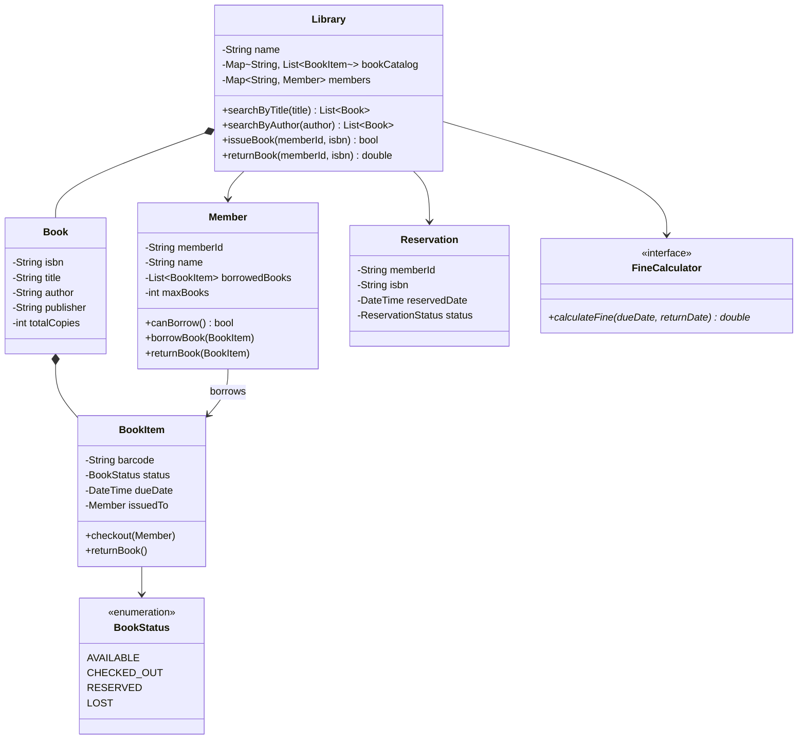

# Design a Library Management System

## 1. Problem Statement

Design a system for a library to manage books, members, borrowing/returning, and reservations.

---

## 2. Requirements

### Functional Requirements

| # | Requirement |
|---|-------------|
| FR1 | Add/remove/search books by title, author, ISBN |
| FR2 | Register/manage library members |
| FR3 | Issue (checkout) and return books |
| FR4 | Reserve books that are currently checked out |
| FR5 | Track overdue books and calculate fines |
| FR6 | Limit number of books a member can borrow (max 5) |

---

## 3. Class Design



---

## 4. Key Implementation (Python)

```python
from enum import Enum
from datetime import datetime, timedelta
from typing import List, Optional, Dict
from collections import defaultdict


class BookStatus(Enum):
    AVAILABLE = "AVAILABLE"
    CHECKED_OUT = "CHECKED_OUT"
    RESERVED = "RESERVED"
    LOST = "LOST"


class Book:
    def __init__(self, isbn: str, title: str, author: str):
        self.isbn = isbn
        self.title = title
        self.author = author


class BookItem:
    def __init__(self, barcode: str, book: Book):
        self.barcode = barcode
        self.book = book
        self.status = BookStatus.AVAILABLE
        self.due_date: Optional[datetime] = None
        self.issued_to: Optional[str] = None

    def checkout(self, member_id: str, loan_days: int = 14):
        self.status = BookStatus.CHECKED_OUT
        self.issued_to = member_id
        self.due_date = datetime.now() + timedelta(days=loan_days)

    def return_book(self):
        self.status = BookStatus.AVAILABLE
        self.issued_to = None
        self.due_date = None

    def is_overdue(self) -> bool:
        return (self.status == BookStatus.CHECKED_OUT and
                self.due_date and datetime.now() > self.due_date)


class Member:
    MAX_BOOKS = 5

    def __init__(self, member_id: str, name: str):
        self.member_id = member_id
        self.name = name
        self.borrowed_books: List[BookItem] = []

    def can_borrow(self) -> bool:
        return len(self.borrowed_books) < self.MAX_BOOKS

    def has_overdue(self) -> bool:
        return any(b.is_overdue() for b in self.borrowed_books)


class Library:
    FINE_PER_DAY = 0.50

    def __init__(self, name: str):
        self.name = name
        self._books: Dict[str, Book] = {}            # isbn → Book
        self._items: Dict[str, List[BookItem]] = defaultdict(list)  # isbn → [BookItem]
        self._members: Dict[str, Member] = {}

    def add_book(self, book: Book, copies: int = 1):
        self._books[book.isbn] = book
        for i in range(copies):
            barcode = f"{book.isbn}-{len(self._items[book.isbn]) + 1}"
            self._items[book.isbn].append(BookItem(barcode, book))

    def register_member(self, member: Member):
        self._members[member.member_id] = member

    def search_by_title(self, title: str) -> List[Book]:
        return [b for b in self._books.values()
                if title.lower() in b.title.lower()]

    def issue_book(self, member_id: str, isbn: str) -> bool:
        member = self._members.get(member_id)
        if not member or not member.can_borrow() or member.has_overdue():
            return False

        for item in self._items.get(isbn, []):
            if item.status == BookStatus.AVAILABLE:
                item.checkout(member_id)
                member.borrowed_books.append(item)
                print(f"✅ '{item.book.title}' issued to {member.name}")
                return True
        print(f"❌ No available copies of ISBN {isbn}")
        return False

    def return_book(self, member_id: str, barcode: str) -> float:
        member = self._members.get(member_id)
        if not member:
            raise ValueError("Invalid member")

        for item in member.borrowed_books:
            if item.barcode == barcode:
                fine = 0.0
                if item.is_overdue():
                    overdue_days = (datetime.now() - item.due_date).days
                    fine = overdue_days * self.FINE_PER_DAY
                item.return_book()
                member.borrowed_books.remove(item)
                print(f"📚 '{item.book.title}' returned. Fine: ${fine:.2f}")
                return fine
        raise ValueError("Book not found in member's borrowed list")
```

---

## 5. Follow-up Questions

**Q: How to handle reservations?** Add a `ReservationQueue` per ISBN. When a book is returned, notify the first person in queue.

**Q: How to handle e-books?** `EBook extends Book` with `downloadLink`. No physical copies — unlimited checkouts with DRM.

**Q: How to handle notifications?** Observer pattern — `Member` subscribes to `Book`, notified when available.

---

**Related:** [[02 - Observer Pattern]] | [[01 - Strategy Pattern]]
