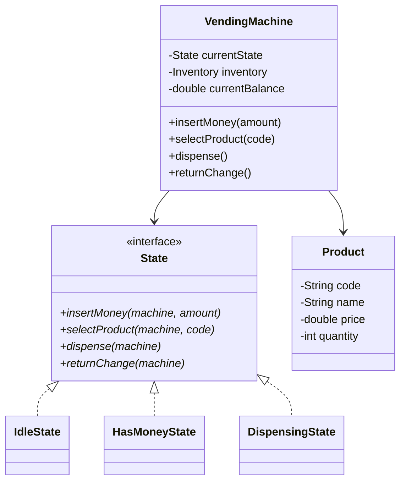

# Design a Vending Machine

## 1. Problem Statement

Design a vending machine that accepts coins, allows product selection, dispenses products, and returns change. The machine has different states (idle, has money, dispensing, out of stock).

---

## 2. Requirements

| # | Requirement |
|---|-------------|
| FR1 | Accept coins (1¢, 5¢, 10¢, 25¢) and bills |
| FR2 | Display products with prices |
| FR3 | Select a product |
| FR4 | Dispense product if sufficient payment |
| FR5 | Return change |
| FR6 | Handle out-of-stock and insufficient funds |

---

## 3. Class Design



---

## 4. Key Implementation (Python)

```python
from enum import Enum
from abc import ABC, abstractmethod
from typing import Dict, Optional


class Product:
    def __init__(self, code: str, name: str, price: float, quantity: int):
        self.code = code
        self.name = name
        self.price = price
        self.quantity = quantity


class State(ABC):
    @abstractmethod
    def insert_money(self, machine: 'VendingMachine', amount: float): pass
    @abstractmethod
    def select_product(self, machine: 'VendingMachine', code: str): pass
    @abstractmethod
    def dispense(self, machine: 'VendingMachine'): pass
    @abstractmethod
    def return_change(self, machine: 'VendingMachine'): pass


class IdleState(State):
    def insert_money(self, machine, amount):
        machine.balance += amount
        print(f"💰 Inserted ${amount:.2f}. Balance: ${machine.balance:.2f}")
        machine.set_state(machine.has_money_state)

    def select_product(self, machine, code):
        print("⚠️ Please insert money first")

    def dispense(self, machine):
        print("⚠️ Please insert money and select a product")

    def return_change(self, machine):
        print("No money to return")


class HasMoneyState(State):
    def insert_money(self, machine, amount):
        machine.balance += amount
        print(f"💰 Added ${amount:.2f}. Balance: ${machine.balance:.2f}")

    def select_product(self, machine, code):
        product = machine.inventory.get(code)
        if not product:
            print(f"❌ Product {code} not found")
            return
        if product.quantity == 0:
            print(f"❌ {product.name} is out of stock")
            return
        if machine.balance < product.price:
            print(f"⚠️ Insufficient funds. Need ${product.price:.2f}, "
                  f"have ${machine.balance:.2f}")
            return

        machine.selected_product = product
        machine.set_state(machine.dispensing_state)
        machine.dispense()

    def dispense(self, machine):
        print("⚠️ Please select a product first")

    def return_change(self, machine):
        change = machine.balance
        machine.balance = 0
        print(f"💵 Returning change: ${change:.2f}")
        machine.set_state(machine.idle_state)


class DispensingState(State):
    def insert_money(self, machine, amount):
        print("⚠️ Please wait, dispensing product")

    def select_product(self, machine, code):
        print("⚠️ Please wait, dispensing product")

    def dispense(self, machine):
        product = machine.selected_product
        product.quantity -= 1
        machine.balance -= product.price
        print(f"🎉 Dispensed: {product.name}")

        if machine.balance > 0:
            print(f"💵 Change: ${machine.balance:.2f}")
            machine.balance = 0

        machine.selected_product = None
        machine.set_state(machine.idle_state)

    def return_change(self, machine):
        print("⚠️ Already dispensing")


class VendingMachine:
    def __init__(self):
        self.idle_state = IdleState()
        self.has_money_state = HasMoneyState()
        self.dispensing_state = DispensingState()
        self._state: State = self.idle_state
        self.balance: float = 0.0
        self.selected_product: Optional[Product] = None
        self.inventory: Dict[str, Product] = {}

    def set_state(self, state: State):
        self._state = state

    def add_product(self, product: Product):
        self.inventory[product.code] = product

    def insert_money(self, amount: float):
        self._state.insert_money(self, amount)

    def select_product(self, code: str):
        self._state.select_product(self, code)

    def dispense(self):
        self._state.dispense(self)

    def return_change(self):
        self._state.return_change(self)


if __name__ == "__main__":
    vm = VendingMachine()
    vm.add_product(Product("A1", "Cola", 1.50, 5))
    vm.add_product(Product("A2", "Chips", 1.00, 3))
    vm.add_product(Product("B1", "Water", 0.75, 10))

    # Normal flow
    vm.insert_money(2.00)
    vm.select_product("A1")  # Dispenses Cola, returns $0.50 change

    # Insufficient funds
    vm.insert_money(0.50)
    vm.select_product("A1")  # Not enough money
    vm.insert_money(1.00)
    vm.select_product("A1")  # Now it works
```

---

## 5. Design Patterns

| Pattern | Usage |
|---------|-------|
| **State** | Machine behavior changes per state (Idle → HasMoney → Dispensing) |
| **Strategy** | Could be used for different payment methods |

→ See: [[13 - State Pattern]]

---

## 6. Follow-up Questions

**Q: How to handle card payments?** Add `PaymentStrategy` interface with `CashPayment` and `CardPayment` implementations.

**Q: How to handle refill/restocking?** Add `AdminState` accessible with a key. Admin can add products and withdraw cash.

**Q: How to handle multiple items per transaction?** Maintain a cart. Dispense all items after final confirmation.

---

**Related:** [[13 - State Pattern]] | [[01 - Strategy Pattern]]
