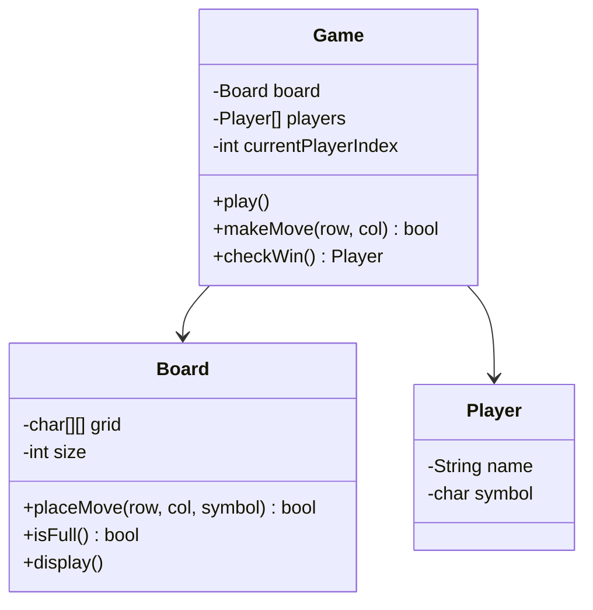

# Design a Tic-Tac-Toe Game

## 1. Problem Statement
Design a Tic-Tac-Toe game for 2 players on an N×N board.

## 2. Requirements
| # | Requirement |
|---|-------------|
| FR1 | Two players take turns placing X and O |
| FR2 | Detect win (row, column, diagonal) |
| FR3 | Detect draw |
| FR4 | Support N×N board |

## 3. Class Design



## 4. Key Implementation (Python)

```python
from typing import Optional

class Player:
    def __init__(self, name: str, symbol: str):
        self.name = name
        self.symbol = symbol

class Board:
    def __init__(self, size: int = 3):
        self.size = size
        self.grid = [[' ' for _ in range(size)] for _ in range(size)]
        self.moves_count = 0
        # O(1) win detection
        self._row_counts = [{} for _ in range(size)]
        self._col_counts = [{} for _ in range(size)]
        self._diag_count = {}
        self._anti_diag_count = {}

    def place_move(self, row: int, col: int, symbol: str) -> bool:
        if not (0 <= row < self.size and 0 <= col < self.size):
            return False
        if self.grid[row][col] != ' ':
            return False
        self.grid[row][col] = symbol
        self.moves_count += 1

        # Update counts for O(1) win check
        self._row_counts[row][symbol] = self._row_counts[row].get(symbol, 0) + 1
        self._col_counts[col][symbol] = self._col_counts[col].get(symbol, 0) + 1
        if row == col:
            self._diag_count[symbol] = self._diag_count.get(symbol, 0) + 1
        if row + col == self.size - 1:
            self._anti_diag_count[symbol] = self._anti_diag_count.get(symbol, 0) + 1
        return True

    def check_winner(self, row: int, col: int, symbol: str) -> bool:
        """O(1) win detection after each move"""
        n = self.size
        if self._row_counts[row].get(symbol, 0) == n:
            return True
        if self._col_counts[col].get(symbol, 0) == n:
            return True
        if row == col and self._diag_count.get(symbol, 0) == n:
            return True
        if row + col == n - 1 and self._anti_diag_count.get(symbol, 0) == n:
            return True
        return False

    def is_full(self) -> bool:
        return self.moves_count == self.size * self.size

    def display(self):
        for i, row in enumerate(self.grid):
            print(' | '.join(row))
            if i < self.size - 1:
                print('-' * (self.size * 4 - 3))

class TicTacToe:
    def __init__(self, size: int = 3):
        self.board = Board(size)
        self.players = [Player("Player 1", "X"), Player("Player 2", "O")]
        self.current = 0

    def make_move(self, row: int, col: int) -> Optional[str]:
        player = self.players[self.current]
        if not self.board.place_move(row, col, player.symbol):
            print("Invalid move, try again")
            return None

        self.board.display()
        print()

        if self.board.check_winner(row, col, player.symbol):
            return f"🎉 {player.name} ({player.symbol}) wins!"
        if self.board.is_full():
            return "🤝 It's a draw!"

        self.current = 1 - self.current
        return None

if __name__ == "__main__":
    game = TicTacToe()
    moves = [(0,0), (1,1), (0,1), (1,0), (0,2)]  # X wins
    for r, c in moves:
        result = game.make_move(r, c)
        if result:
            print(result)
            break
```

## 5. Key Insight — O(1) Win Detection

> [!tip] Interview Gold
> Instead of checking entire rows/cols/diags after each move (O(N)), maintain running counts per row, per column, and per diagonal. A win occurs when any count reaches N. This is the O(1) approach interviewers love.

## 6. Follow-ups
- **N×N board with K-in-a-row?** Sliding window on rows/cols/diags.
- **Multiplayer?** Extend players list, cycle through.
- **AI opponent?** Minimax algorithm with alpha-beta pruning.
- **Online play?** Add `GameServer` with WebSocket communication.

---

**Related:** [[01 - Strategy Pattern]] | [[13 - State Pattern]]
