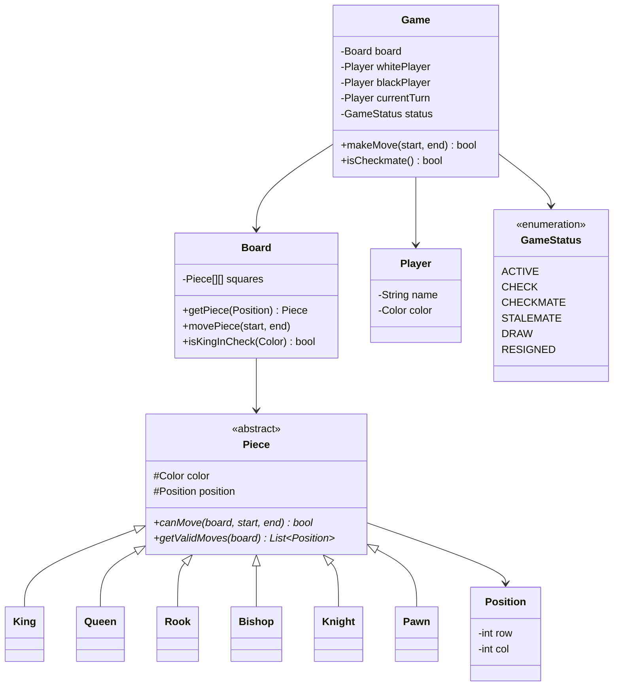

# Design a Chess Game

## 1. Problem Statement
Design an object-oriented chess game supporting all standard rules: piece movements, check, checkmate, castling, en passant, pawn promotion.

## 2. Requirements
| # | Requirement |
|---|-------------|
| FR1 | Standard 8×8 board with all pieces |
| FR2 | Two players alternate turns |
| FR3 | Validate legal moves per piece type |
| FR4 | Detect check, checkmate, stalemate |
| FR5 | Support castling, en passant, pawn promotion |

## 3. Class Design



## 4. Key Implementation (Python)

```python
from abc import ABC, abstractmethod
from enum import Enum
from typing import List, Optional, Tuple

class Color(Enum):
    WHITE = "WHITE"
    BLACK = "BLACK"

class Position:
    def __init__(self, row: int, col: int):
        self.row = row
        self.col = col

    def is_valid(self) -> bool:
        return 0 <= self.row < 8 and 0 <= self.col < 8

    def __eq__(self, other):
        return self.row == other.row and self.col == other.col

class Piece(ABC):
    def __init__(self, color: Color, position: Position):
        self.color = color
        self.position = position
        self.has_moved = False

    @abstractmethod
    def can_move(self, board: 'Board', end: Position) -> bool:
        pass

    @abstractmethod
    def symbol(self) -> str:
        pass

class Knight(Piece):
    def can_move(self, board, end) -> bool:
        dr = abs(end.row - self.position.row)
        dc = abs(end.col - self.position.col)
        if not ((dr == 2 and dc == 1) or (dr == 1 and dc == 2)):
            return False
        target = board.get_piece(end)
        return target is None or target.color != self.color

    def symbol(self): return "♞" if self.color == Color.BLACK else "♘"

class Rook(Piece):
    def can_move(self, board, end) -> bool:
        if self.position.row != end.row and self.position.col != end.col:
            return False  # Must move in straight line
        return board.is_path_clear(self.position, end)

    def symbol(self): return "♜" if self.color == Color.BLACK else "♖"

class Pawn(Piece):
    def can_move(self, board, end) -> bool:
        direction = -1 if self.color == Color.WHITE else 1
        start_row = 6 if self.color == Color.WHITE else 1
        dr = end.row - self.position.row
        dc = end.col - self.position.col

        # Forward one
        if dc == 0 and dr == direction and not board.get_piece(end):
            return True
        # Forward two from start
        if (dc == 0 and dr == 2 * direction and
            self.position.row == start_row and
            not board.get_piece(end) and
            not board.get_piece(Position(self.position.row + direction, self.position.col))):
            return True
        # Diagonal capture
        if abs(dc) == 1 and dr == direction:
            target = board.get_piece(end)
            if target and target.color != self.color:
                return True
        return False

    def symbol(self): return "♟" if self.color == Color.BLACK else "♙"

# Bishop, Queen, King follow similar patterns...

class Board:
    def __init__(self):
        self.grid: List[List[Optional[Piece]]] = [[None]*8 for _ in range(8)]
        self._setup_pieces()

    def _setup_pieces(self):
        # Place pawns
        for col in range(8):
            self.grid[1][col] = Pawn(Color.BLACK, Position(1, col))
            self.grid[6][col] = Pawn(Color.WHITE, Position(6, col))
        # Place rooks, knights, etc. similarly...
        self.grid[0][0] = Rook(Color.BLACK, Position(0, 0))
        self.grid[0][7] = Rook(Color.BLACK, Position(0, 7))
        self.grid[7][0] = Rook(Color.WHITE, Position(7, 0))
        self.grid[7][7] = Rook(Color.WHITE, Position(7, 7))
        self.grid[0][1] = Knight(Color.BLACK, Position(0, 1))
        self.grid[0][6] = Knight(Color.BLACK, Position(0, 6))
        self.grid[7][1] = Knight(Color.WHITE, Position(7, 1))
        self.grid[7][6] = Knight(Color.WHITE, Position(7, 6))

    def get_piece(self, pos: Position) -> Optional[Piece]:
        if pos.is_valid():
            return self.grid[pos.row][pos.col]
        return None

    def move_piece(self, start: Position, end: Position) -> Optional[Piece]:
        piece = self.get_piece(start)
        captured = self.get_piece(end)
        self.grid[end.row][end.col] = piece
        self.grid[start.row][start.col] = None
        piece.position = end
        piece.has_moved = True
        return captured

    def is_path_clear(self, start: Position, end: Position) -> bool:
        dr = 0 if end.row == start.row else (1 if end.row > start.row else -1)
        dc = 0 if end.col == start.col else (1 if end.col > start.col else -1)
        r, c = start.row + dr, start.col + dc
        while (r, c) != (end.row, end.col):
            if self.grid[r][c] is not None:
                return False
            r += dr
            c += dc
        target = self.get_piece(end)
        piece = self.get_piece(start)
        return target is None or target.color != piece.color

class ChessGame:
    def __init__(self):
        self.board = Board()
        self.current_color = Color.WHITE
        self.status = "ACTIVE"

    def make_move(self, start: Tuple[int,int], end: Tuple[int,int]) -> bool:
        s = Position(*start)
        e = Position(*end)
        piece = self.board.get_piece(s)

        if not piece or piece.color != self.current_color:
            print("Invalid: not your piece")
            return False
        if not piece.can_move(self.board, e):
            print("Invalid: illegal move")
            return False

        captured = self.board.move_piece(s, e)
        if captured:
            print(f"Captured {captured.symbol()}")

        self.current_color = (Color.BLACK if self.current_color == Color.WHITE
                              else Color.WHITE)
        return True
```

## 5. Design Patterns
| Pattern | Usage |
|---------|-------|
| **Strategy** | Each `Piece` subclass encapsulates its own movement strategy |
| **State** | `GameStatus` — behavior changes in check vs normal |
| **Command** | For undo/redo move history |

## 6. Follow-ups
- **Undo/Redo?** Command pattern — store `MoveCommand(piece, from, to, captured)`.
- **Chess clock?** Observer pattern — clock notifies game on timeout.
- **Online multiplayer?** Server validates moves; clients send `MoveCommand` via WebSocket.

---

**Related:** [[01 - Strategy Pattern]] | [[13 - State Pattern]] | [[07 - Command Pattern]]
