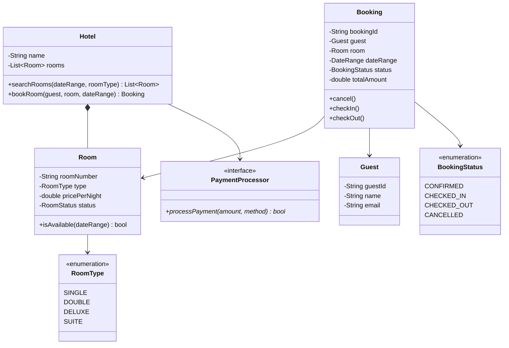
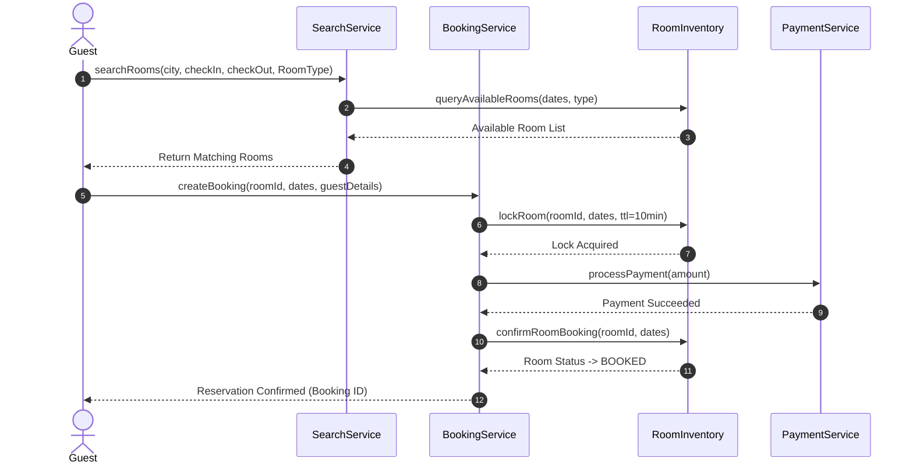

# Design a Hotel Booking System

## 1. Problem Statement
Design a hotel booking system supporting room search, reservation, check-in/check-out, and payment.

## 2. Requirements
| # | Requirement |
|---|-------------|
| FR1 | Search available rooms by date range, room type, price |
| FR2 | Book a room for a date range |
| FR3 | Cancel booking |
| FR4 | Check-in and check-out |
| FR5 | Support multiple room types (single, double, suite) |
| FR6 | Handle payments and invoicing |

## 3. Class Design



### Sequence Flow




## 4. Key Implementation (Python)

```python
from enum import Enum
from datetime import date
from typing import List, Optional, Dict, Tuple
import uuid

class RoomType(Enum):
    SINGLE = ("Single", 100)
    DOUBLE = ("Double", 150)
    DELUXE = ("Deluxe", 250)
    SUITE = ("Suite", 400)

class BookingStatus(Enum):
    CONFIRMED = "CONFIRMED"
    CHECKED_IN = "CHECKED_IN"
    CHECKED_OUT = "CHECKED_OUT"
    CANCELLED = "CANCELLED"

class DateRange:
    def __init__(self, check_in: date, check_out: date):
        self.check_in = check_in
        self.check_out = check_out

    def overlaps(self, other: 'DateRange') -> bool:
        return self.check_in < other.check_out and other.check_in < self.check_out

    @property
    def nights(self) -> int:
        return (self.check_out - self.check_in).days

class Guest:
    def __init__(self, guest_id: str, name: str, email: str):
        self.guest_id = guest_id
        self.name = name
        self.email = email

class Room:
    def __init__(self, room_number: str, room_type: RoomType):
        self.room_number = room_number
        self.room_type = room_type
        self.price_per_night = room_type.value[1]
        self._bookings: List['Booking'] = []

    def is_available(self, date_range: DateRange) -> bool:
        return not any(
            b.date_range.overlaps(date_range)
            for b in self._bookings
            if b.status in (BookingStatus.CONFIRMED, BookingStatus.CHECKED_IN)
        )

class Booking:
    def __init__(self, guest: Guest, room: Room, date_range: DateRange):
        self.booking_id = str(uuid.uuid4())[:8]
        self.guest = guest
        self.room = room
        self.date_range = date_range
        self.status = BookingStatus.CONFIRMED
        self.total_amount = room.price_per_night * date_range.nights

    def cancel(self):
        if self.status == BookingStatus.CONFIRMED:
            self.status = BookingStatus.CANCELLED
            print(f"Booking {self.booking_id} cancelled")

    def check_in(self):
        if self.status == BookingStatus.CONFIRMED:
            self.status = BookingStatus.CHECKED_IN
            print(f"✅ Checked in: Room {self.room.room_number}")

    def check_out(self):
        if self.status == BookingStatus.CHECKED_IN:
            self.status = BookingStatus.CHECKED_OUT
            print(f"🚪 Checked out: Room {self.room.room_number}. Total: ${self.total_amount}")

class Hotel:
    def __init__(self, name: str):
        self.name = name
        self.rooms: List[Room] = []
        self.bookings: Dict[str, Booking] = {}

    def add_room(self, room: Room):
        self.rooms.append(room)

    def search_rooms(self, date_range: DateRange,
                     room_type: Optional[RoomType] = None) -> List[Room]:
        return [r for r in self.rooms
                if r.is_available(date_range) and
                (room_type is None or r.room_type == room_type)]

    def book_room(self, guest: Guest, room: Room, date_range: DateRange) -> Optional[Booking]:
        if not room.is_available(date_range):
            print("Room not available")
            return None
        booking = Booking(guest, room, date_range)
        room._bookings.append(booking)
        self.bookings[booking.booking_id] = booking
        print(f"✅ Booked room {room.room_number} for {guest.name}: "
              f"${booking.total_amount} ({date_range.nights} nights)")
        return booking
```

### Java

```java
package com.lld.hotelbooking;

import java.time.LocalDate;
import java.util.*;
import java.util.concurrent.ConcurrentHashMap;
import java.util.concurrent.locks.ReentrantLock;

enum RoomType { STANDARD, DELUXE, SUITE }
enum BookingStatus { PENDING, CONFIRMED, CANCELLED }

class Room {
    private final String roomId;
    private final RoomType type;
    private final double pricePerNight;

    public Room(String roomId, RoomType type, double pricePerNight) {
        this.roomId = roomId;
        this.type = type;
        this.pricePerNight = pricePerNight;
    }
    public String getRoomId() { return roomId; }
    public RoomType getType() { return type; }
    public double getPricePerNight() { return pricePerNight; }
}

class Booking {
    private final String bookingId;
    private final String userId;
    private final Room room;
    private final LocalDate checkIn;
    private final LocalDate checkOut;
    private BookingStatus status;

    public Booking(String bookingId, String userId, Room room, LocalDate checkIn, LocalDate checkOut) {
        this.bookingId = bookingId;
        this.userId = userId;
        this.room = room;
        this.checkIn = checkIn;
        this.checkOut = checkOut;
        this.status = BookingStatus.PENDING;
    }
    public void confirm() { this.status = BookingStatus.CONFIRMED; }
    public void cancel() { this.status = BookingStatus.CANCELLED; }
    public String getBookingId() { return bookingId; }
    public Room getRoom() { return room; }
    public LocalDate getCheckIn() { return checkIn; }
    public LocalDate getCheckOut() { return checkOut; }
}

public class HotelBookingSystem {
    private final Map<String, Room> rooms = new ConcurrentHashMap<>();
    private final Map<String, List<Booking>> roomBookings = new ConcurrentHashMap<>();
    private final ReentrantLock lock = new ReentrantLock();

    public void addRoom(Room room) {
        rooms.put(room.getRoomId(), room);
        roomBookings.put(room.getRoomId(), new ArrayList<>());
    }

    public List<Room> searchAvailableRooms(LocalDate checkIn, LocalDate checkOut, RoomType type) {
        List<Room> available = new ArrayList<>();
        for (Room room : rooms.values()) {
            if (room.getType() == type && isRoomAvailable(room.getRoomId(), checkIn, checkOut)) {
                available.add(room);
            }
        }
        return available;
    }

    private boolean isRoomAvailable(String roomId, LocalDate checkIn, LocalDate checkOut) {
        List<Booking> bookings = roomBookings.get(roomId);
        if (bookings == null) return true;
        for (Booking b : bookings) {
            if (b.getCheckIn().isBefore(checkOut) && checkIn.isBefore(b.getCheckOut())) {
                return false; // Overlap detected
            }
        }
        return true;
    }

    public Booking bookRoom(String userId, String roomId, LocalDate checkIn, LocalDate checkOut) {
        lock.lock();
        try {
            if (!isRoomAvailable(roomId, checkIn, checkOut)) {
                throw new IllegalStateException("Room not available for selected dates");
            }
            Room room = rooms.get(roomId);
            Booking booking = new Booking(UUID.randomUUID().toString().substring(0, 8), userId, room, checkIn, checkOut);
            booking.confirm();
            roomBookings.get(roomId).add(booking);
            return booking;
        } finally {
            lock.unlock();
        }
    }
}
```


---

## Thread Safety Considerations

| Concern | Solution |
|---|---|
| Concurrent room reservation collision | `ReentrantLock` synchronizes `bookRoom()` to prevent double-booking identical date ranges |
| Date interval overlap checking | Closed-open interval collision check `checkIn < existingCheckOut && existingCheckIn < checkOut` |

## Extensibility & SOLID Principles

| Principle | Architectural Implementation |
|---|---|
| **S** — Single Responsibility | `Room` models physical property; `Booking` models financial reservation; `HotelBookingSystem` coordinates inventory |
| **O** — Open/Closed | Pluggable pricing strategies (Seasonal, Surge, Weekend) can wrap room rates via Strategy pattern |
| **D** — Dependency Inversion | Systems coordinate via abstract reservation interfaces |

---

## 5. Follow-ups
- **Dynamic pricing?** Strategy pattern — `PricingStrategy` (peak, off-peak, holiday).
- **Room service?** Observer pattern — notify housekeeping on checkout.
- **Multi-hotel chain?** Add `HotelChain` with hotel catalog and cross-hotel search.

---

**Related:** [[01 - Strategy Pattern]] | [[02 - Observer Pattern]]
