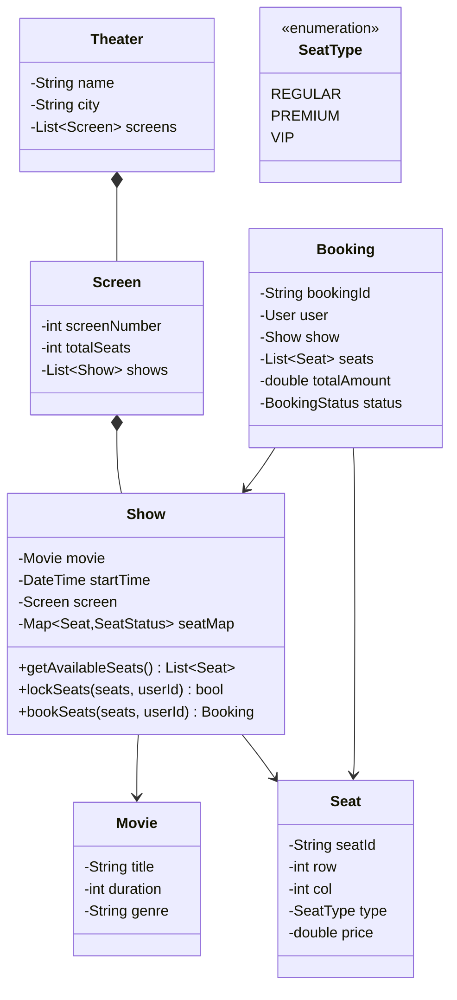

# Design a Movie Ticket Booking System

## 1. Problem Statement
Design a movie ticket booking system (like BookMyShow) supporting show browsing, seat selection, booking, and payment.

## 2. Requirements
| # | Requirement |
|---|-------------|
| FR1 | Browse movies and shows by city, theater, time |
| FR2 | View seat map and select seats |
| FR3 | Temporary seat locking during booking (5 min) |
| FR4 | Process payment and confirm booking |
| FR5 | Cancel booking with refund policy |

## 3. Class Design



## 4. Key Implementation (Python)

```python
from enum import Enum
from datetime import datetime, timedelta
from typing import List, Dict, Optional
import uuid, threading

class SeatStatus(Enum):
    AVAILABLE = "AVAILABLE"
    LOCKED = "LOCKED"
    BOOKED = "BOOKED"

class Seat:
    def __init__(self, seat_id: str, row: int, col: int, price: float):
        self.seat_id = seat_id
        self.row = row
        self.col = col
        self.price = price

class Show:
    LOCK_DURATION = timedelta(minutes=5)

    def __init__(self, movie_title: str, start_time: datetime, seats: List[Seat]):
        self.movie_title = movie_title
        self.start_time = start_time
        self._seat_status: Dict[str, SeatStatus] = {s.seat_id: SeatStatus.AVAILABLE for s in seats}
        self._seat_map: Dict[str, Seat] = {s.seat_id: s for s in seats}
        self._locks: Dict[str, datetime] = {}  # seat_id → lock expiry
        self._lock = threading.Lock()

    def get_available_seats(self) -> List[Seat]:
        self._release_expired_locks()
        return [self._seat_map[sid] for sid, status in self._seat_status.items()
                if status == SeatStatus.AVAILABLE]

    def lock_seats(self, seat_ids: List[str], user_id: str) -> bool:
        with self._lock:
            self._release_expired_locks()
            # Check all seats available
            for sid in seat_ids:
                if self._seat_status.get(sid) != SeatStatus.AVAILABLE:
                    return False
            # Lock all
            expiry = datetime.now() + self.LOCK_DURATION
            for sid in seat_ids:
                self._seat_status[sid] = SeatStatus.LOCKED
                self._locks[sid] = expiry
            return True

    def book_seats(self, seat_ids: List[str]) -> bool:
        with self._lock:
            for sid in seat_ids:
                if self._seat_status.get(sid) != SeatStatus.LOCKED:
                    return False
            for sid in seat_ids:
                self._seat_status[sid] = SeatStatus.BOOKED
                self._locks.pop(sid, None)
            return True

    def _release_expired_locks(self):
        now = datetime.now()
        expired = [sid for sid, exp in self._locks.items() if now > exp]
        for sid in expired:
            self._seat_status[sid] = SeatStatus.AVAILABLE
            del self._locks[sid]

class BookingService:
    def __init__(self):
        self.bookings: Dict[str, dict] = {}

    def create_booking(self, user_id: str, show: Show,
                       seat_ids: List[str]) -> Optional[str]:
        # Step 1: Lock seats
        if not show.lock_seats(seat_ids, user_id):
            print("❌ Seats not available")
            return None

        # Step 2: (Payment would happen here)
        # Step 3: Confirm booking
        if show.book_seats(seat_ids):
            booking_id = str(uuid.uuid4())[:8]
            total = sum(show._seat_map[sid].price for sid in seat_ids)
            self.bookings[booking_id] = {
                "user_id": user_id, "seats": seat_ids, "total": total
            }
            print(f"✅ Booking {booking_id}: {len(seat_ids)} seats, ${total:.2f}")
            return booking_id
        return None
```

## 5. Key Design Decisions

> [!important] Seat Locking
> Temporary seat locking (5 min) is critical to prevent double-booking. This is the most asked follow-up. Use optimistic locking with TTL or distributed locks (Redis SETNX).

## 6. Follow-ups
- **How to handle concurrent bookings?** Distributed locks (Redis), optimistic locking with version numbers.
- **How to handle partial failures?** Saga pattern — if payment fails, release locks.
- **How to handle seat map display?** WebSocket for real-time seat availability updates.

---

**Related:** [[01 - Strategy Pattern]] | [[02 - Observer Pattern]]
