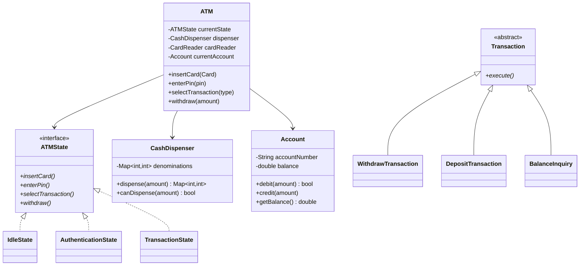

# Design an ATM System

## 1. Problem Statement
Design an ATM system supporting cash withdrawal, deposit, balance inquiry, and fund transfer.

## 2. Requirements
| # | Requirement |
|---|-------------|
| FR1 | Authenticate user via card + PIN |
| FR2 | Check balance |
| FR3 | Withdraw cash (dispense correct denominations) |
| FR4 | Deposit cash/check |
| FR5 | Transfer funds between accounts |
| FR6 | Print receipt |

## 3. Class Design



## 4. Key Implementation (Python)

```python
from enum import Enum
from abc import ABC, abstractmethod
from typing import Dict, Optional

class CashDispenser:
    """Greedy algorithm to dispense minimum bills"""
    def __init__(self):
        self.denominations: Dict[int, int] = {
            100: 100, 50: 200, 20: 500, 10: 1000, 5: 500, 1: 1000
        }

    def can_dispense(self, amount: int) -> bool:
        remaining = amount
        for denom in sorted(self.denominations.keys(), reverse=True):
            count = min(remaining // denom, self.denominations[denom])
            remaining -= count * denom
        return remaining == 0

    def dispense(self, amount: int) -> Dict[int, int]:
        result = {}
        remaining = amount
        for denom in sorted(self.denominations.keys(), reverse=True):
            count = min(remaining // denom, self.denominations[denom])
            if count > 0:
                result[denom] = count
                self.denominations[denom] -= count
                remaining -= count * denom
        return result

class Account:
    def __init__(self, account_number: str, pin: str, balance: float):
        self.account_number = account_number
        self._pin = pin
        self.balance = balance

    def validate_pin(self, pin: str) -> bool:
        return self._pin == pin

    def debit(self, amount: float) -> bool:
        if self.balance >= amount:
            self.balance -= amount
            return True
        return False

    def credit(self, amount: float):
        self.balance += amount

class ATMState(ABC):
    @abstractmethod
    def insert_card(self, atm: 'ATM'): pass
    @abstractmethod
    def enter_pin(self, atm: 'ATM', pin: str): pass
    @abstractmethod
    def withdraw(self, atm: 'ATM', amount: int): pass
    @abstractmethod
    def check_balance(self, atm: 'ATM'): pass

class IdleState(ATMState):
    def insert_card(self, atm):
        print("Card inserted. Please enter PIN.")
        atm.set_state(atm.auth_state)

    def enter_pin(self, atm, pin): print("Insert card first")
    def withdraw(self, atm, amount): print("Insert card first")
    def check_balance(self, atm): print("Insert card first")

class AuthState(ATMState):
    def __init__(self):
        self.attempts = 0

    def insert_card(self, atm): print("Card already inserted")

    def enter_pin(self, atm, pin):
        if atm.current_account.validate_pin(pin):
            print("✅ PIN verified. Select transaction.")
            atm.set_state(atm.transaction_state)
        else:
            self.attempts += 1
            if self.attempts >= 3:
                print("❌ Card blocked after 3 attempts")
                atm.eject_card()
            else:
                print(f"❌ Wrong PIN. {3 - self.attempts} attempts remaining")

    def withdraw(self, atm, amount): print("Enter PIN first")
    def check_balance(self, atm): print("Enter PIN first")

class TransactionState(ATMState):
    def insert_card(self, atm): print("Transaction in progress")
    def enter_pin(self, atm, pin): print("Already authenticated")

    def withdraw(self, atm, amount):
        if not atm.dispenser.can_dispense(amount):
            print("❌ ATM cannot dispense this amount")
            return
        if atm.current_account.debit(amount):
            bills = atm.dispenser.dispense(amount)
            print(f"💵 Dispensing ${amount}: {bills}")
            print(f"Remaining balance: ${atm.current_account.balance:.2f}")
        else:
            print("❌ Insufficient funds")

    def check_balance(self, atm):
        print(f"💰 Balance: ${atm.current_account.balance:.2f}")

class ATM:
    def __init__(self):
        self.idle_state = IdleState()
        self.auth_state = AuthState()
        self.transaction_state = TransactionState()
        self._state = self.idle_state
        self.dispenser = CashDispenser()
        self.current_account: Optional[Account] = None

    def set_state(self, state): self._state = state
    def insert_card(self, account):
        self.current_account = account
        self._state.insert_card(self)
    def enter_pin(self, pin): self._state.enter_pin(self, pin)
    def withdraw(self, amount): self._state.withdraw(self, amount)
    def check_balance(self): self._state.check_balance(self)
    def eject_card(self):
        self.current_account = None
        self.set_state(self.idle_state)
        print("Card ejected")
```

## 5. Key Design Decisions
- **State Pattern** for ATM states (idle → auth → transaction)
- **Strategy** for cash dispensing algorithm (greedy denomination)
- **Chain of Responsibility** for denomination selection

## 6. Follow-ups
- **Multi-currency?** Add `Currency` enum, multi-denomination dispensers per currency.
- **Transaction logging?** Command pattern — each transaction is a command with execute/undo.
- **Daily withdrawal limits?** Add daily limit tracking per account.

---

**Related:** [[13 - State Pattern]] | [[07 - Command Pattern]]
