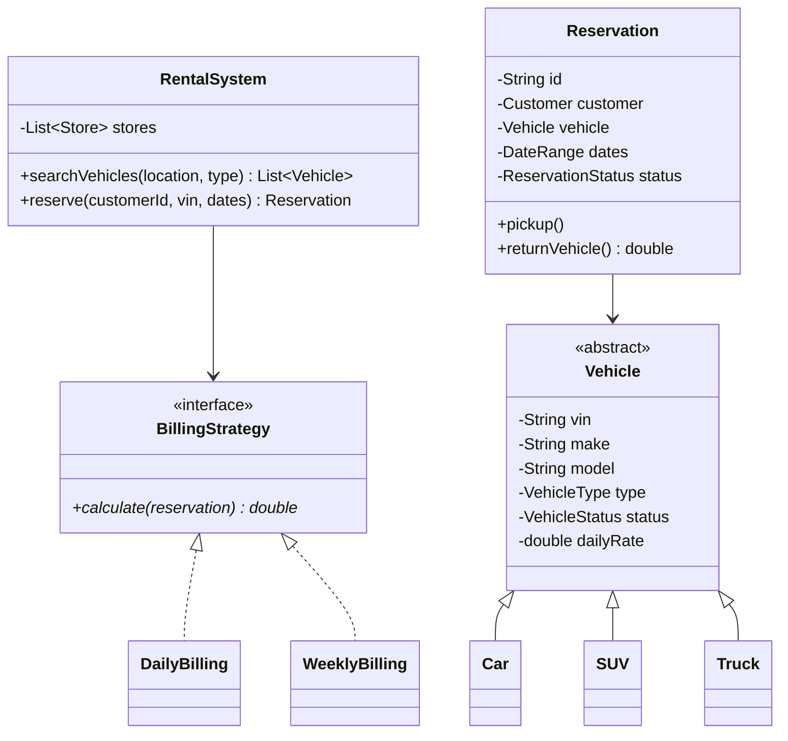

# Design a Car Rental System

## 1. Problem Statement
Design a car rental system supporting vehicle browsing, reservation, pickup, return, and billing with different vehicle types and pricing strategies.

## 2. Class Design



## 3. Key Implementation (Python)

```python
from enum import Enum
from datetime import date
from typing import List, Optional
import uuid

class VehicleType(Enum):
    CAR = "CAR"
    SUV = "SUV"
    TRUCK = "TRUCK"

class VehicleStatus(Enum):
    AVAILABLE = "AVAILABLE"
    RESERVED = "RESERVED"
    RENTED = "RENTED"
    MAINTENANCE = "MAINTENANCE"

class Vehicle:
    def __init__(self, vin: str, make: str, model: str,
                 v_type: VehicleType, daily_rate: float):
        self.vin = vin
        self.make = make
        self.model = model
        self.vehicle_type = v_type
        self.daily_rate = daily_rate
        self.status = VehicleStatus.AVAILABLE

class Reservation:
    def __init__(self, customer_id: str, vehicle: Vehicle,
                 pickup: date, return_date: date):
        self.id = str(uuid.uuid4())[:8]
        self.customer_id = customer_id
        self.vehicle = vehicle
        self.pickup_date = pickup
        self.return_date = return_date
        self.vehicle.status = VehicleStatus.RESERVED

    def pickup(self):
        self.vehicle.status = VehicleStatus.RENTED
        print(f"✅ Picked up {self.vehicle.make} {self.vehicle.model}")

    def return_vehicle(self) -> float:
        self.vehicle.status = VehicleStatus.AVAILABLE
        days = max(1, (self.return_date - self.pickup_date).days)
        total = days * self.vehicle.daily_rate
        print(f"🚗 Returned. Bill: ${total:.2f}")
        return total

class RentalStore:
    def __init__(self, location: str):
        self.location = location
        self.vehicles: List[Vehicle] = []

    def search(self, v_type: Optional[VehicleType] = None) -> List[Vehicle]:
        return [v for v in self.vehicles
                if v.status == VehicleStatus.AVAILABLE and
                (v_type is None or v.vehicle_type == v_type)]

    def reserve(self, customer_id: str, vin: str,
                pickup: date, return_date: date) -> Optional[Reservation]:
        vehicle = next((v for v in self.vehicles
                       if v.vin == vin and v.status == VehicleStatus.AVAILABLE), None)
        if not vehicle:
            return None
        return Reservation(customer_id, vehicle, pickup, return_date)
```

## 4. Design Patterns
| Pattern | Usage |
|---------|-------|
| **Strategy** | `BillingStrategy` — daily, weekly, membership pricing |
| **Factory** | Vehicle creation based on type |
| **Decorator** | Add-ons: insurance, GPS, child seat |

## 5. Follow-up Questions
- **Insurance add-ons?** Decorator pattern — wrap rental with insurance layer.
- **Late return fees?** Extra days × penalty rate in billing strategy.
- **Multi-location drop-off?** Track locations, add surcharge for different return location.
- **Damage assessment?** Add `VehicleInspection` class with pre/post rental comparison.

---

**Related:** [[01 - Strategy Pattern]] | [[03 - Decorator Pattern]]
