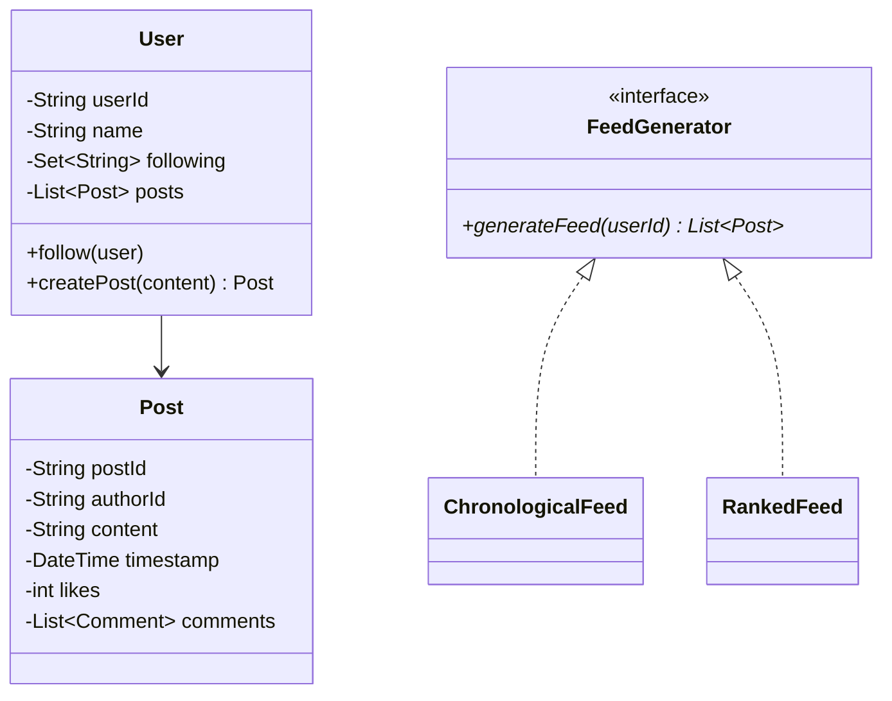
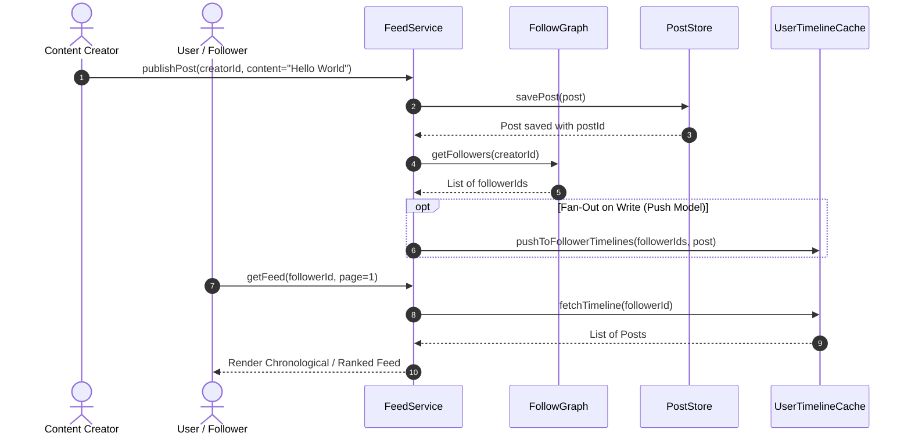

# Design a Social Media Feed

## 1. Problem Statement
Design the feed system for a social media platform — posting, following, and generating personalized feeds.

## 2. Class Design



### Sequence Flow




## 3. Key Implementation (Python)

```python
from datetime import datetime
from typing import List, Set, Dict

class Post:
    def __init__(self, post_id: str, author_id: str, content: str):
        self.post_id = post_id
        self.author_id = author_id
        self.content = content
        self.timestamp = datetime.now()
        self.likes = 0

class User:
    def __init__(self, user_id: str, name: str):
        self.user_id = user_id
        self.name = name
        self.following: Set[str] = set()
        self.posts: List[Post] = []

    def follow(self, other: 'User'):
        self.following.add(other.user_id)

    def create_post(self, content: str) -> Post:
        post = Post(f"p{len(self.posts)}", self.user_id, content)
        self.posts.append(post)
        return post

class FeedService:
    def __init__(self, users: Dict[str, User]):
        self._users = users

    def get_feed(self, user_id: str, limit: int = 20) -> List[Post]:
        user = self._users[user_id]
        posts = []
        for fid in user.following:
            if fid in self._users:
                posts.extend(self._users[fid].posts)
        posts.sort(key=lambda p: p.timestamp, reverse=True)
        return posts[:limit]
```

### Java

```java
package com.lld.socialfeed;

import java.time.Instant;
import java.util.*;
import java.util.concurrent.ConcurrentHashMap;
import java.util.concurrent.CopyOnWriteArraySet;

class Post {
    private final String postId;
    private final String authorId;
    private final String content;
    private final Instant createdAt;

    public Post(String postId, String authorId, String content) {
        this.postId = postId;
        this.authorId = authorId;
        this.content = content;
        this.createdAt = Instant.now();
    }
    public String getPostId() { return postId; }
    public String getAuthorId() { return authorId; }
    public String getContent() { return content; }
    public Instant getCreatedAt() { return createdAt; }
}

public class SocialMediaFeedService {
    private final Map<String, Post> postRepository = new ConcurrentHashMap<>();
    private final Map<String, Set<String>> followees = new ConcurrentHashMap<>(); // userId -> followed userIds
    private final Map<String, List<Post>> userPosts = new ConcurrentHashMap<>();

    public void follow(String followerId, String followeeId) {
        followees.computeIfAbsent(followerId, k -> new CopyOnWriteArraySet<>()).add(followeeId);
    }

    public void unfollow(String followerId, String followeeId) {
        Set<String> set = followees.get(followerId);
        if (set != null) set.remove(followeeId);
    }

    public Post createPost(String authorId, String content) {
        Post post = new Post(UUID.randomUUID().toString().substring(0, 8), authorId, content);
        postRepository.put(post.getPostId(), post);
        userPosts.computeIfAbsent(authorId, k -> Collections.synchronizedList(new ArrayList<>())).add(post);
        return post;
    }

    public List<Post> getNewsFeed(String userId, int limit) {
        Set<String> followedUsers = followees.getOrDefault(userId, Collections.emptySet());
        PriorityQueue<Post> pq = new PriorityQueue<>((a, b) -> b.getCreatedAt().compareTo(a.getCreatedAt()));

        // Add author's own posts
        List<Post> myPosts = userPosts.get(userId);
        if (myPosts != null) pq.addAll(myPosts);

        for (String followeeId : followedUsers) {
            List<Post> posts = userPosts.get(followeeId);
            if (posts != null) pq.addAll(posts);
        }

        List<Post> feed = new ArrayList<>();
        while (!pq.isEmpty() && feed.size() < limit) {
            feed.add(pq.poll());
        }
        return feed;
    }
}
```


## 4. Design Patterns
| Pattern | Usage |
|---------|-------|
| **Strategy** | Feed algorithm — chronological vs ranked |
| **Observer** | Notify followers on new post |
| **Iterator** | Feed pagination |


---

## Thread Safety Considerations

| Concern | Solution |
|---|---|
| Concurrent follow/unfollow | `CopyOnWriteArraySet` prevents ConcurrentModificationException during feed reads |
| High post write volume | Posts appended into `ConcurrentHashMap` with thread-safe list wrappers |

## Extensibility & SOLID Principles

| Principle | Architectural Implementation |
|---|---|
| **S** — Single Responsibility | `FollowGraph` handles relationships; `PostStore` handles persistence; `FeedRanking` handles ordering |
| **O** — Open/Closed | Ranking strategies (Chronological, Affinity, Viral) can be injected via `FeedRankingStrategy` |
| **D** — Dependency Inversion | Feed service depends on abstract interfaces for post storage and ranking |

---

## 5. Follow-ups
- **Feed caching?** Pre-compute feeds for active users (fan-out on write).
- **Algorithmic feed?** Score posts by engagement × recency × relevance.
- **Stories?** Ephemeral content with 24h TTL.

---

**Related:** [[02 - Observer Pattern]] | [[01 - Strategy Pattern]] | [[11 - Iterator Pattern]]
