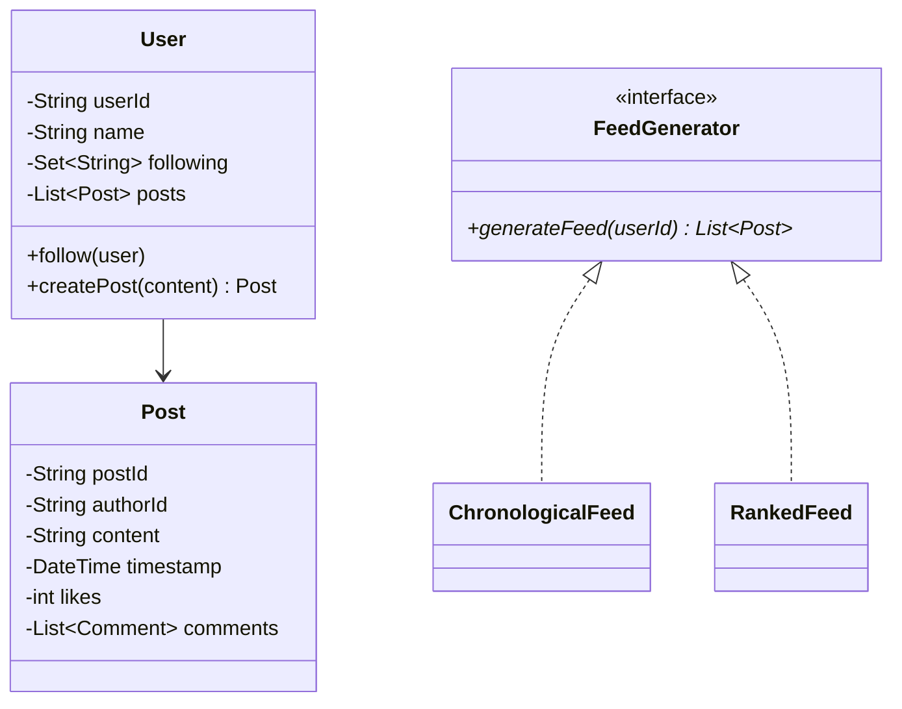

# Design a Social Media Feed

## 1. Problem Statement
Design the feed system for a social media platform — posting, following, and generating personalized feeds.

## 2. Class Design



## 3. Key Implementation (Python)

```python
from datetime import datetime
from typing import List, Set, Dict

class Post:
    def __init__(self, post_id: str, author_id: str, content: str):
        self.post_id = post_id
        self.author_id = author_id
        self.content = content
        self.timestamp = datetime.now()
        self.likes = 0

class User:
    def __init__(self, user_id: str, name: str):
        self.user_id = user_id
        self.name = name
        self.following: Set[str] = set()
        self.posts: List[Post] = []

    def follow(self, other: 'User'):
        self.following.add(other.user_id)

    def create_post(self, content: str) -> Post:
        post = Post(f"p{len(self.posts)}", self.user_id, content)
        self.posts.append(post)
        return post

class FeedService:
    def __init__(self, users: Dict[str, User]):
        self._users = users

    def get_feed(self, user_id: str, limit: int = 20) -> List[Post]:
        user = self._users[user_id]
        posts = []
        for fid in user.following:
            if fid in self._users:
                posts.extend(self._users[fid].posts)
        posts.sort(key=lambda p: p.timestamp, reverse=True)
        return posts[:limit]
```

## 4. Design Patterns
| Pattern | Usage |
|---------|-------|
| **Strategy** | Feed algorithm — chronological vs ranked |
| **Observer** | Notify followers on new post |
| **Iterator** | Feed pagination |

## 5. Follow-ups
- **Feed caching?** Pre-compute feeds for active users (fan-out on write).
- **Algorithmic feed?** Score posts by engagement × recency × relevance.
- **Stories?** Ephemeral content with 24h TTL.

---

**Related:** [[02 - Observer Pattern]] | [[01 - Strategy Pattern]] | [[11 - Iterator Pattern]]
