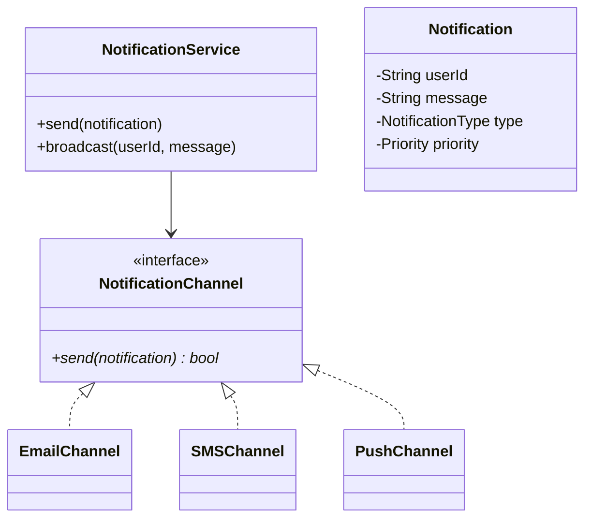
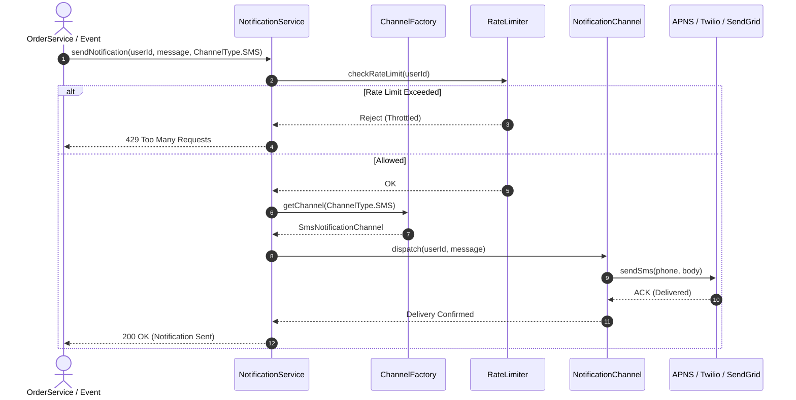

# Design a Notification Service (LLD)

## 1. Problem Statement
Design a notification service supporting multiple channels (email, SMS, push) with templating, priority, and rate limiting.

## 2. Class Design



### Sequence Flow




## 3. Key Implementation (Python)

```python
from abc import ABC, abstractmethod
from enum import Enum
from typing import Dict

class Priority(Enum):
    LOW = 1
    MEDIUM = 2
    HIGH = 3
    URGENT = 4

class NotificationType(Enum):
    EMAIL = "EMAIL"
    SMS = "SMS"
    PUSH = "PUSH"

class Notification:
    def __init__(self, user_id: str, message: str,
                 channel: NotificationType, priority: Priority = Priority.MEDIUM):
        self.user_id = user_id
        self.message = message
        self.channel = channel
        self.priority = priority

class NotificationChannel(ABC):
    @abstractmethod
    def send(self, notification: Notification) -> bool: pass

class EmailChannel(NotificationChannel):
    def send(self, n) -> bool:
        print(f"📧 Email → {n.user_id}: {n.message}")
        return True

class SMSChannel(NotificationChannel):
    def send(self, n) -> bool:
        print(f"📱 SMS → {n.user_id}: {n.message}")
        return True

class PushChannel(NotificationChannel):
    def send(self, n) -> bool:
        print(f"🔔 Push → {n.user_id}: {n.message}")
        return True

class NotificationService:
    def __init__(self):
        self._channels: Dict[NotificationType, NotificationChannel] = {
            NotificationType.EMAIL: EmailChannel(),
            NotificationType.SMS: SMSChannel(),
            NotificationType.PUSH: PushChannel(),
        }

    def send(self, notification: Notification) -> bool:
        channel = self._channels.get(notification.channel)
        return channel.send(notification) if channel else False

    def broadcast(self, user_id: str, message: str):
        for ch_type in NotificationType:
            self.send(Notification(user_id, message, ch_type))
```

### Java

```java
package com.lld.notification;

import java.util.*;
import java.util.concurrent.ConcurrentHashMap;

enum ChannelType { EMAIL, SMS, PUSH }

interface NotificationChannel {
    boolean send(String recipient, String message);
}

class EmailChannel implements NotificationChannel {
    @Override
    public boolean send(String recipient, String message) {
        System.out.printf("[EMAIL] Sent to %s: %s%n", recipient, message);
        return true;
    }
}

class SmsChannel implements NotificationChannel {
    @Override
    public boolean send(String recipient, String message) {
        System.out.printf("[SMS] Sent to %s: %s%n", recipient, message);
        return true;
    }
}

class PushChannel implements NotificationChannel {
    @Override
    public boolean send(String recipient, String message) {
        System.out.printf("[PUSH] Sent to %s: %s%n", recipient, message);
        return true;
    }
}

class NotificationChannelFactory {
    private static final Map<ChannelType, NotificationChannel> channels = new EnumMap<>(ChannelType.class);

    static {
        channels.put(ChannelType.EMAIL, new EmailChannel());
        channels.put(ChannelType.SMS, new SmsChannel());
        channels.put(ChannelType.PUSH, new PushChannel());
    }

    public static NotificationChannel getChannel(ChannelType type) {
        NotificationChannel channel = channels.get(type);
        if (channel == null) throw new IllegalArgumentException("Unsupported channel: " + type);
        return channel;
    }
}

public class NotificationService {
    private final Map<String, Integer> userSendCounts = new ConcurrentHashMap<>();
    private static final int MAX_PER_MINUTE = 5;

    public boolean notifyUser(String userId, String destination, String message, ChannelType type) {
        userSendCounts.merge(userId, 1, Integer::sum);
        if (userSendCounts.get(userId) > MAX_PER_MINUTE) {
            System.out.println("Rate limit exceeded for user: " + userId);
            return false;
        }
        NotificationChannel channel = NotificationChannelFactory.getChannel(type);
        return channel.send(destination, message);
    }
}
```


## 4. Design Patterns
**Strategy** (channel selection) | **Observer** (user preferences) | **Factory** (channel creation) | **Template Method** (notification templates)


---

## Thread Safety Considerations

| Concern | Solution |
|---|---|
| Concurrent sends per user | Atomic rate limit counter increment via `ConcurrentHashMap.merge()` |
| Channel factory thread safety | Pre-instantiated static channel map guarantees thread-safe lock-free lookups |

## Extensibility & SOLID Principles

| Principle | Architectural Implementation |
|---|---|
| **S** — Single Responsibility | Each channel handles its wire protocol; Factory handles creation; Service manages orchestration |
| **O** — Open/Closed | New channel types (WhatsApp, Slack, Webhook) plug-in by implementing `NotificationChannel` |
| **D** — Dependency Inversion | `NotificationService` depends purely on the `NotificationChannel` interface |

---

## 5. Follow-ups
- **Rate limiting?** Per-user per-channel limits per time window.
- **Retry?** Exponential backoff with dead letter queue.
- **User preferences?** Users opt-in/out per notification type per channel.

---

**Related:** [[02 - Observer Pattern]] | [[01 - Strategy Pattern]]
