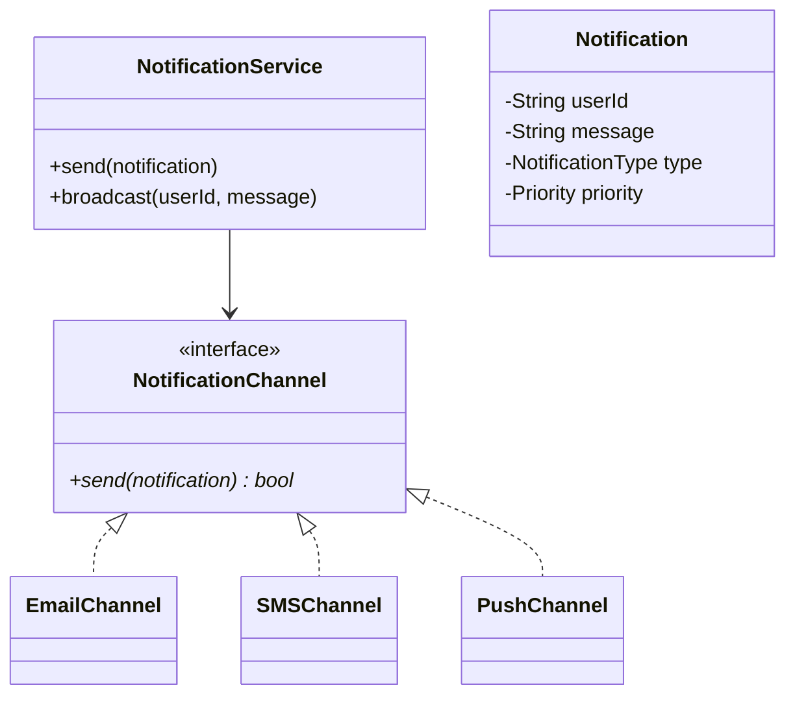

# Design a Notification Service (LLD)

## 1. Problem Statement
Design a notification service supporting multiple channels (email, SMS, push) with templating, priority, and rate limiting.

## 2. Class Design



## 3. Key Implementation (Python)

```python
from abc import ABC, abstractmethod
from enum import Enum
from typing import Dict

class Priority(Enum):
    LOW = 1
    MEDIUM = 2
    HIGH = 3
    URGENT = 4

class NotificationType(Enum):
    EMAIL = "EMAIL"
    SMS = "SMS"
    PUSH = "PUSH"

class Notification:
    def __init__(self, user_id: str, message: str,
                 channel: NotificationType, priority: Priority = Priority.MEDIUM):
        self.user_id = user_id
        self.message = message
        self.channel = channel
        self.priority = priority

class NotificationChannel(ABC):
    @abstractmethod
    def send(self, notification: Notification) -> bool: pass

class EmailChannel(NotificationChannel):
    def send(self, n) -> bool:
        print(f"📧 Email → {n.user_id}: {n.message}")
        return True

class SMSChannel(NotificationChannel):
    def send(self, n) -> bool:
        print(f"📱 SMS → {n.user_id}: {n.message}")
        return True

class PushChannel(NotificationChannel):
    def send(self, n) -> bool:
        print(f"🔔 Push → {n.user_id}: {n.message}")
        return True

class NotificationService:
    def __init__(self):
        self._channels: Dict[NotificationType, NotificationChannel] = {
            NotificationType.EMAIL: EmailChannel(),
            NotificationType.SMS: SMSChannel(),
            NotificationType.PUSH: PushChannel(),
        }

    def send(self, notification: Notification) -> bool:
        channel = self._channels.get(notification.channel)
        return channel.send(notification) if channel else False

    def broadcast(self, user_id: str, message: str):
        for ch_type in NotificationType:
            self.send(Notification(user_id, message, ch_type))
```

## 4. Design Patterns
**Strategy** (channel selection) | **Observer** (user preferences) | **Factory** (channel creation) | **Template Method** (notification templates)

## 5. Follow-ups
- **Rate limiting?** Per-user per-channel limits per time window.
- **Retry?** Exponential backoff with dead letter queue.
- **User preferences?** Users opt-in/out per notification type per channel.

---

**Related:** [[02 - Observer Pattern]] | [[01 - Strategy Pattern]]
