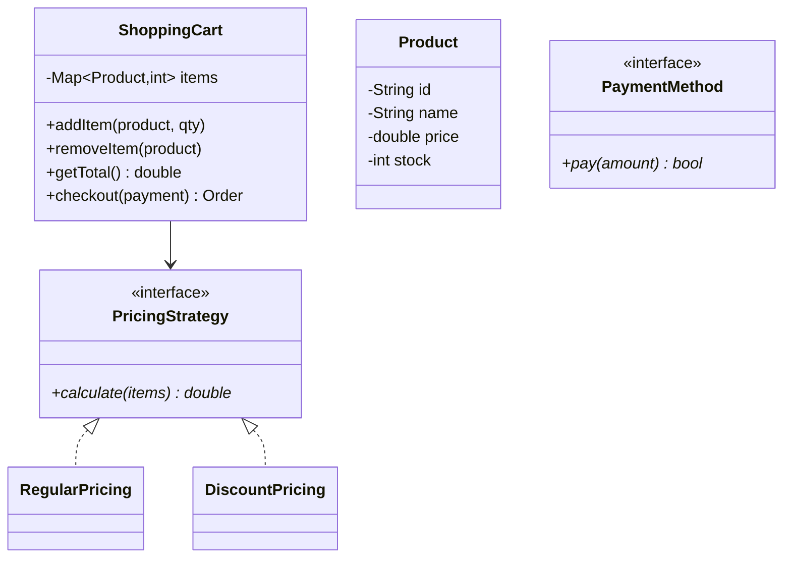

# Design an Online Shopping Cart

## 1. Problem Statement
Design an e-commerce shopping cart with item management, pricing strategies, discounts, and checkout.

## 2. Class Design



## 3. Key Implementation (Python)

```python
from abc import ABC, abstractmethod
from typing import Dict

class Product:
    def __init__(self, pid: str, name: str, price: float, stock: int):
        self.pid = pid
        self.name = name
        self.price = price
        self.stock = stock

class PricingStrategy(ABC):
    @abstractmethod
    def calculate(self, items: Dict[Product, int]) -> float: pass

class RegularPricing(PricingStrategy):
    def calculate(self, items):
        return sum(p.price * q for p, q in items.items())

class PercentDiscount(PricingStrategy):
    def __init__(self, percent: float):
        self.discount = percent / 100
    def calculate(self, items):
        return sum(p.price * q for p, q in items.items()) * (1 - self.discount)

class ShoppingCart:
    def __init__(self, pricing: PricingStrategy = None):
        self.items: Dict[Product, int] = {}
        self.pricing = pricing or RegularPricing()

    def add_item(self, product: Product, qty: int = 1):
        if product.stock < qty:
            print(f"❌ Insufficient stock for {product.name}")
            return
        self.items[product] = self.items.get(product, 0) + qty

    def remove_item(self, product: Product):
        self.items.pop(product, None)

    def get_total(self) -> float:
        return self.pricing.calculate(self.items)

    def checkout(self) -> dict:
        total = self.get_total()
        order = {"items": [(p.name, q) for p, q in self.items.items()], "total": total}
        self.items.clear()
        return order
```

## 4. Patterns: **Strategy** (pricing) | **Decorator** (coupons/add-ons) | **Observer** (price alerts)

## 5. Follow-ups
- **Coupon codes?** Decorator wrapping pricing strategy.
- **Inventory reservation?** Lock stock on add-to-cart with TTL.
- **Wishlist?** Separate collection, move items to cart.

---

**Related:** [[01 - Strategy Pattern]] | [[03 - Decorator Pattern]]
