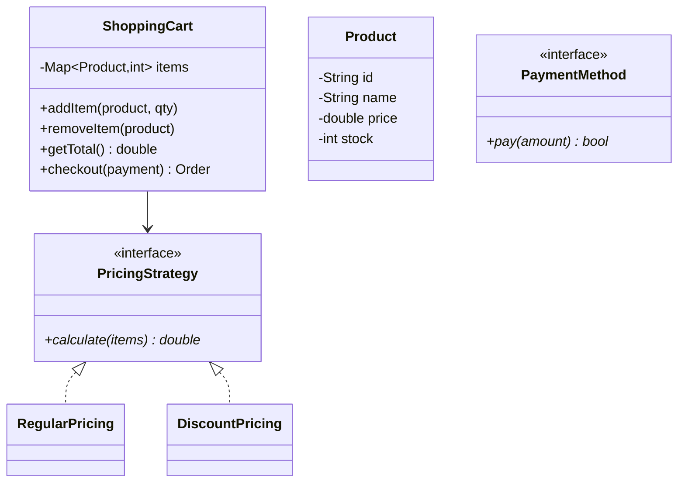
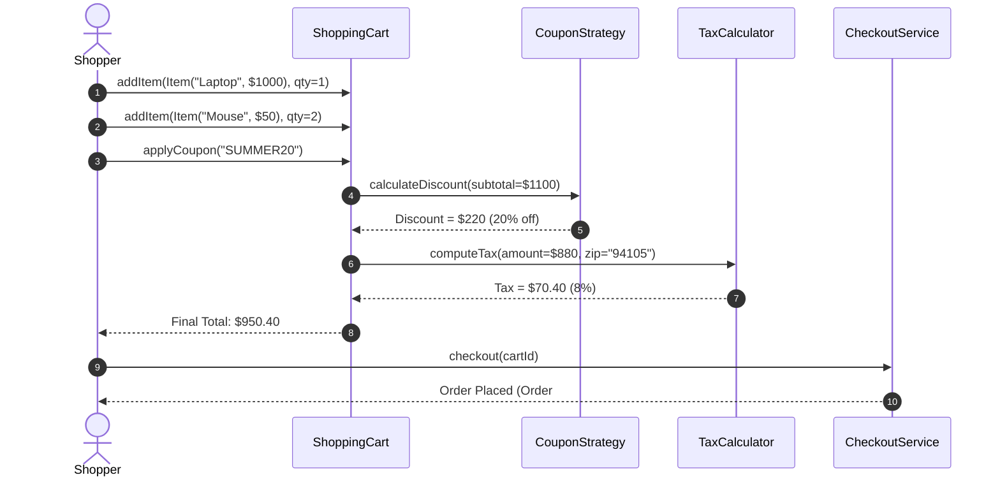

# Design an Online Shopping Cart

## 1. Problem Statement
Design an e-commerce shopping cart with item management, pricing strategies, discounts, and checkout.

## 2. Class Design



### Sequence Flow




## 3. Key Implementation (Python)

```python
from abc import ABC, abstractmethod
from typing import Dict

class Product:
    def __init__(self, pid: str, name: str, price: float, stock: int):
        self.pid = pid
        self.name = name
        self.price = price
        self.stock = stock

class PricingStrategy(ABC):
    @abstractmethod
    def calculate(self, items: Dict[Product, int]) -> float: pass

class RegularPricing(PricingStrategy):
    def calculate(self, items):
        return sum(p.price * q for p, q in items.items())

class PercentDiscount(PricingStrategy):
    def __init__(self, percent: float):
        self.discount = percent / 100
    def calculate(self, items):
        return sum(p.price * q for p, q in items.items()) * (1 - self.discount)

class ShoppingCart:
    def __init__(self, pricing: PricingStrategy = None):
        self.items: Dict[Product, int] = {}
        self.pricing = pricing or RegularPricing()

    def add_item(self, product: Product, qty: int = 1):
        if product.stock < qty:
            print(f"❌ Insufficient stock for {product.name}")
            return
        self.items[product] = self.items.get(product, 0) + qty

    def remove_item(self, product: Product):
        self.items.pop(product, None)

    def get_total(self) -> float:
        return self.pricing.calculate(self.items)

    def checkout(self) -> dict:
        total = self.get_total()
        order = {"items": [(p.name, q) for p, q in self.items.items()], "total": total}
        self.items.clear()
        return order
```

### Java

```java
package com.lld.shoppingcart;

import java.util.*;
import java.util.concurrent.ConcurrentHashMap;

class Item {
    private final String itemId;
    private final String name;
    private final double price;

    public Item(String itemId, String name, double price) {
        this.itemId = itemId;
        this.name = name;
        this.price = price;
    }
    public String getItemId() { return itemId; }
    public String getName() { return name; }
    public double getPrice() { return price; }
}

interface CouponStrategy {
    double applyDiscount(double subtotal);
}

class PercentageDiscount implements CouponStrategy {
    private final double percent;
    public PercentageDiscount(double percent) { this.percent = percent; }
    @Override
    public double applyDiscount(double subtotal) { return subtotal * (percent / 100.0); }
}

class FlatDiscount implements CouponStrategy {
    private final double discountAmount;
    public FlatDiscount(double discountAmount) { this.discountAmount = discountAmount; }
    @Override
    public double applyDiscount(double subtotal) { return Math.min(discountAmount, subtotal); }
}

public class ShoppingCart {
    private final Map<String, Integer> itemQuantities = new ConcurrentHashMap<>();
    private final Map<String, Item> itemCatalog = new ConcurrentHashMap<>();
    private CouponStrategy activeCoupon;

    public synchronized void addItem(Item item, int qty) {
        itemCatalog.put(item.getItemId(), item);
        itemQuantities.merge(item.getItemId(), qty, Integer::sum);
    }

    public synchronized void removeItem(String itemId) {
        itemQuantities.remove(itemId);
    }

    public synchronized void applyCoupon(CouponStrategy coupon) {
        this.activeCoupon = coupon;
    }

    public synchronized double calculateTotal() {
        double subtotal = 0.0;
        for (Map.Entry<String, Integer> entry : itemQuantities.entrySet()) {
            Item item = itemCatalog.get(entry.getKey());
            subtotal += item.getPrice() * entry.getValue();
        }
        double discount = (activeCoupon != null) ? activeCoupon.applyDiscount(subtotal) : 0.0;
        return Math.max(0.0, subtotal - discount);
    }
}
```


## 4. Patterns: **Strategy** (pricing) | **Decorator** (coupons/add-ons) | **Observer** (price alerts)


---

## Thread Safety Considerations

| Concern | Solution |
|---|---|
| Concurrent cart additions | Synchronized methods guarantee cart subtotal calculation matches concurrent modifications |
| Catalog lookup | ConcurrentHashMap maintains concurrent reads for item pricing definitions |

## Extensibility & SOLID Principles

| Principle | Architectural Implementation |
|---|---|
| **S** — Single Responsibility | `ShoppingCart` maintains line items; `CouponStrategy` isolates discount computation algorithms |
| **O** — Open/Closed | New promotions (BOGO, Tiered thresholds) added by implementing `CouponStrategy` without altering Cart |
| **D** — Dependency Inversion | Cart depends on abstract `CouponStrategy` contract |

---

## 5. Follow-ups
- **Coupon codes?** Decorator wrapping pricing strategy.
- **Inventory reservation?** Lock stock on add-to-cart with TTL.
- **Wishlist?** Separate collection, move items to cart.

---

**Related:** [[01 - Strategy Pattern]] | [[03 - Decorator Pattern]]
