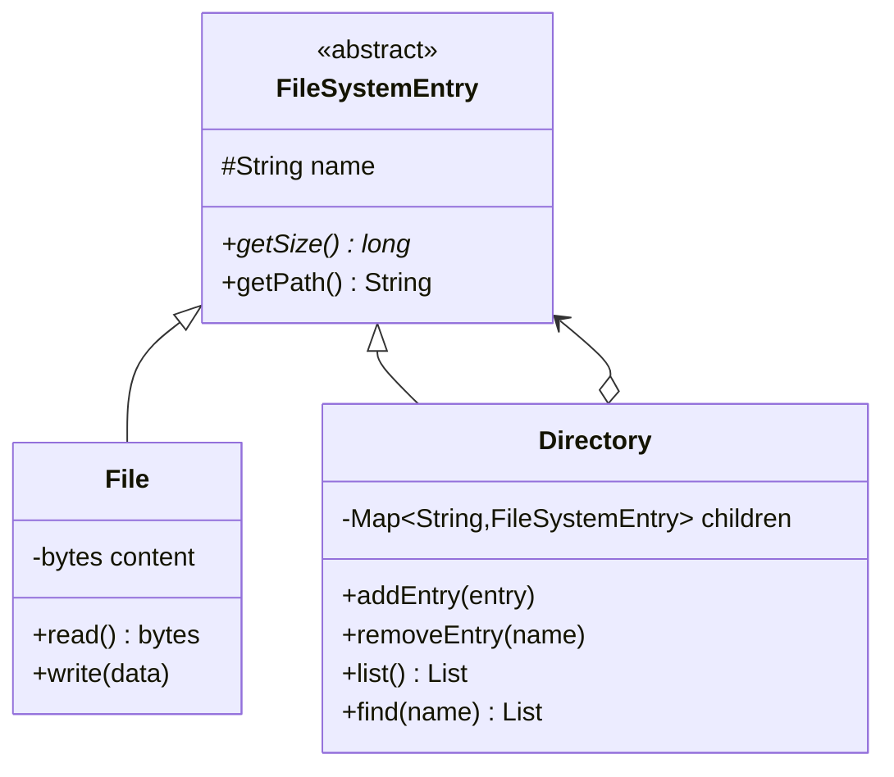

# Design a File System

## 1. Problem Statement
Design an in-memory file system with directories, files, creation, deletion, search, and size calculation.

## 2. Class Design



## 3. Key Implementation (Python)

```python
from abc import ABC, abstractmethod
from typing import Dict, List, Optional

class FileSystemEntry(ABC):
    def __init__(self, name: str, parent=None):
        self.name = name
        self.parent = parent

    @abstractmethod
    def get_size(self) -> int: pass

    def get_path(self) -> str:
        if self.parent is None:
            return '/' + self.name
        return self.parent.get_path() + '/' + self.name

class File(FileSystemEntry):
    def __init__(self, name: str, parent=None):
        super().__init__(name, parent)
        self._content = b''

    def get_size(self) -> int:
        return len(self._content)

    def write(self, data: bytes):
        self._content = data

    def read(self) -> bytes:
        return self._content

class Directory(FileSystemEntry):
    def __init__(self, name: str, parent=None):
        super().__init__(name, parent)
        self._children: Dict[str, FileSystemEntry] = {}

    def get_size(self) -> int:
        return sum(c.get_size() for c in self._children.values())

    def add(self, entry: FileSystemEntry):
        entry.parent = self
        self._children[entry.name] = entry

    def remove(self, name: str):
        self._children.pop(name, None)

    def list_entries(self) -> List[str]:
        return list(self._children.keys())

    def find(self, name: str) -> List[FileSystemEntry]:
        results = []
        for child in self._children.values():
            if child.name == name:
                results.append(child)
            if isinstance(child, Directory):
                results.extend(child.find(name))
        return results

class FileSystem:
    def __init__(self):
        self.root = Directory('')

    def mkdir(self, path: str) -> Directory:
        parts = [p for p in path.split('/') if p]
        current = self.root
        for part in parts:
            entry = current._children.get(part)
            if entry is None:
                new_dir = Directory(part)
                current.add(new_dir)
                current = new_dir
            elif isinstance(entry, Directory):
                current = entry
        return current

    def touch(self, path: str) -> File:
        parts = [p for p in path.split('/') if p]
        directory = self.mkdir('/'.join(parts[:-1]))
        f = File(parts[-1])
        directory.add(f)
        return f
```

## 4. Patterns: **Composite** (files + directories) | **Iterator** (traversal) | **Visitor** (operations)

## 5. Follow-ups
- **Permissions?** `Permission` class with rwx bits per user/group.
- **Symlinks?** `SymLink` pointing to another entry.
- **Disk-backed?** Proxy pattern for lazy content loading.

---

**Related:** [[12 - Composite Pattern]] | [[11 - Iterator Pattern]] | [[14 - Proxy Pattern]]
