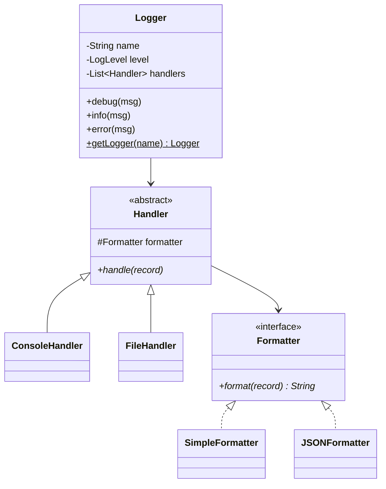

# Design a Logging Framework

## 1. Problem Statement
Design a logging framework like Log4j supporting multiple log levels, output destinations, and formatters.

## 2. Class Design



## 3. Key Implementation (Python)

```python
from enum import IntEnum
from abc import ABC, abstractmethod
from datetime import datetime
import threading, json

class LogLevel(IntEnum):
    DEBUG = 10
    INFO = 20
    WARN = 30
    ERROR = 40
    FATAL = 50

class LogRecord:
    def __init__(self, level: LogLevel, message: str, logger_name: str):
        self.level = level
        self.message = message
        self.logger_name = logger_name
        self.timestamp = datetime.now()
        self.thread = threading.current_thread().name

class Formatter(ABC):
    @abstractmethod
    def format(self, record: LogRecord) -> str: pass

class SimpleFormatter(Formatter):
    def format(self, r):
        return f"[{r.timestamp:%H:%M:%S}] {r.level.name:5} {r.logger_name}: {r.message}"

class JSONFormatter(Formatter):
    def format(self, r):
        return json.dumps({"ts": str(r.timestamp), "level": r.level.name,
                          "logger": r.logger_name, "msg": r.message})

class Handler(ABC):
    def __init__(self, level: LogLevel = LogLevel.DEBUG, formatter: Formatter = None):
        self.level = level
        self.formatter = formatter or SimpleFormatter()

    def handle(self, record: LogRecord):
        if record.level >= self.level:
            self._emit(self.formatter.format(record))

    @abstractmethod
    def _emit(self, formatted: str): pass

class ConsoleHandler(Handler):
    def _emit(self, s): print(s)

class FileHandler(Handler):
    def __init__(self, filename: str, **kwargs):
        super().__init__(**kwargs)
        self.filename = filename
    def _emit(self, s):
        with open(self.filename, 'a') as f:
            f.write(s + '\n')

class Logger:
    _instances = {}
    _lock = threading.Lock()

    def __init__(self, name: str, level: LogLevel = LogLevel.DEBUG):
        self.name = name
        self.level = level
        self.handlers = []

    @classmethod
    def get_logger(cls, name: str) -> 'Logger':
        with cls._lock:
            if name not in cls._instances:
                cls._instances[name] = Logger(name)
            return cls._instances[name]

    def add_handler(self, h: Handler):
        self.handlers.append(h)

    def log(self, level: LogLevel, msg: str):
        if level >= self.level:
            record = LogRecord(level, msg, self.name)
            for h in self.handlers:
                h.handle(record)

    def debug(self, msg): self.log(LogLevel.DEBUG, msg)
    def info(self, msg): self.log(LogLevel.INFO, msg)
    def error(self, msg): self.log(LogLevel.ERROR, msg)
```

## 4. Patterns: **Singleton** (Logger.getLogger) | **Strategy** (formatters) | **Chain of Responsibility** (handler chain)

## 5. Follow-ups
- **Async logging?** Background thread with queue for non-blocking I/O.
- **Log rotation?** RotatingFileHandler with max size & backup count.
- **Structured logging?** JSON formatter with context fields (MDC).

---

**Related:** [[06 - Singleton Pattern]] | [[01 - Strategy Pattern]] | [[03 - Decorator Pattern]]
