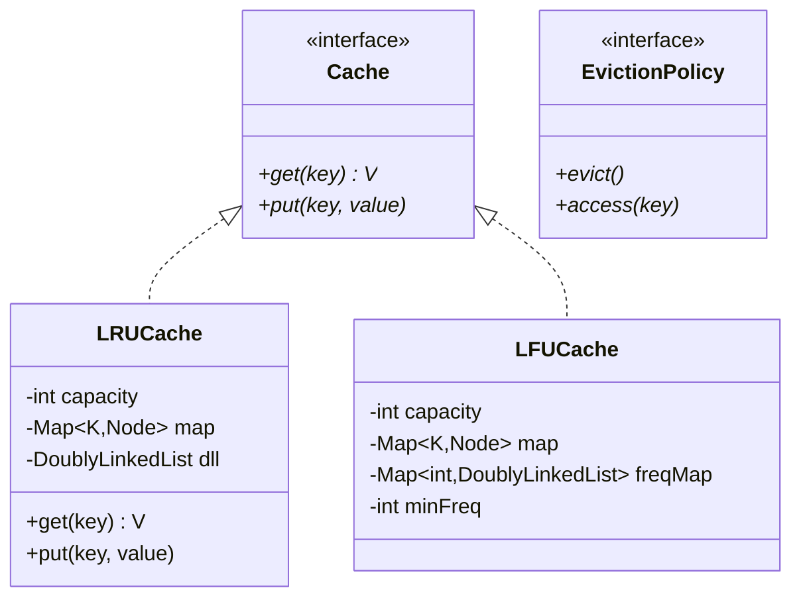
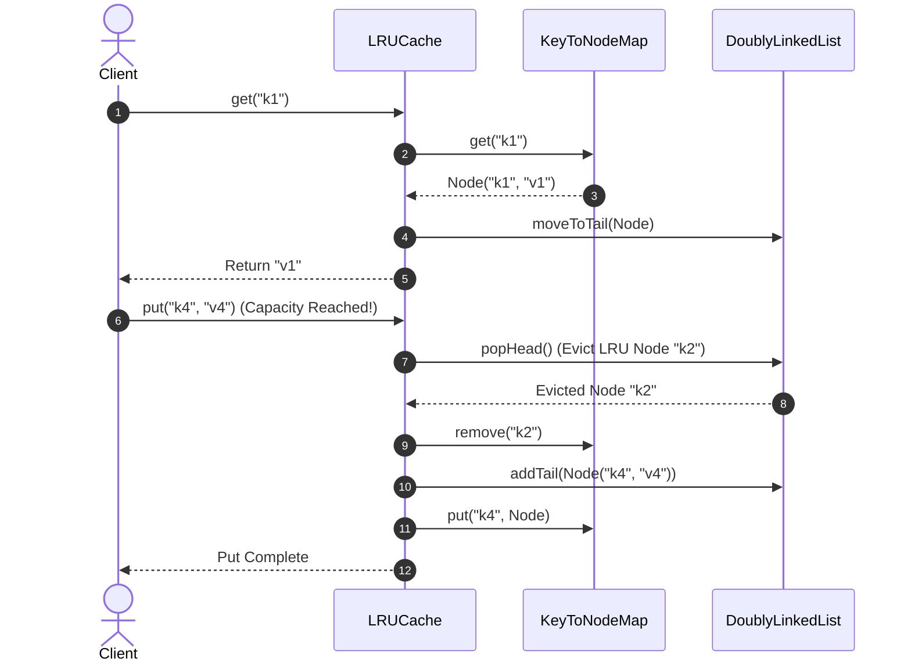

# Design a Cache

## 1. Problem Statement
Design an in-memory cache supporting LRU and LFU eviction policies with get/put operations in O(1) time.

## 2. Class Design



### Sequence Flow




## 3. Key Implementation (Python)

```python
from collections import OrderedDict
from typing import Optional, Any

class LRUCache:
    """LRU Cache using OrderedDict — O(1) get/put"""
    def __init__(self, capacity: int):
        self.capacity = capacity
        self._cache = OrderedDict()

    def get(self, key: str) -> Optional[Any]:
        if key not in self._cache:
            return None
        self._cache.move_to_end(key)  # Mark as recently used
        return self._cache[key]

    def put(self, key: str, value: Any):
        if key in self._cache:
            self._cache.move_to_end(key)
        self._cache[key] = value
        if len(self._cache) > self.capacity:
            self._cache.popitem(last=False)  # Evict LRU

class Node:
    """For custom DLL-based LRU"""
    def __init__(self, key: str, val: Any):
        self.key = key
        self.val = val
        self.prev = None
        self.next = None

class LRUCacheManual:
    """LRU with HashMap + Doubly Linked List"""
    def __init__(self, capacity: int):
        self.capacity = capacity
        self.cache = {}
        self.head = Node('', '')  # Dummy head
        self.tail = Node('', '')  # Dummy tail
        self.head.next = self.tail
        self.tail.prev = self.head

    def _remove(self, node: Node):
        node.prev.next = node.next
        node.next.prev = node.prev

    def _add_to_end(self, node: Node):
        node.prev = self.tail.prev
        node.next = self.tail
        self.tail.prev.next = node
        self.tail.prev = node

    def get(self, key: str) -> Optional[Any]:
        if key not in self.cache:
            return None
        node = self.cache[key]
        self._remove(node)
        self._add_to_end(node)
        return node.val

    def put(self, key: str, value: Any):
        if key in self.cache:
            self._remove(self.cache[key])
        node = Node(key, value)
        self._add_to_end(node)
        self.cache[key] = node
        if len(self.cache) > self.capacity:
            lru = self.head.next
            self._remove(lru)
            del self.cache[lru.key]
```

## 4. Java Implementation

```java
public class LRUCache<K, V> {
    private final int capacity;
    private final Map<K, Node<K, V>> map = new HashMap<>();
    private final Node<K, V> head = new Node<>(null, null);
    private final Node<K, V> tail = new Node<>(null, null);

    public LRUCache(int capacity) {
        this.capacity = capacity;
        head.next = tail;
        tail.prev = head;
    }

    public V get(K key) {
        Node<K, V> node = map.get(key);
        if (node == null) return null;
        moveToEnd(node);
        return node.value;
    }

    public void put(K key, V value) {
        if (map.containsKey(key)) remove(map.get(key));
        Node<K, V> node = new Node<>(key, value);
        addToEnd(node);
        map.put(key, node);
        if (map.size() > capacity) {
            Node<K, V> lru = head.next;
            remove(lru);
            map.remove(lru.key);
        }
    }
}
```

## 5. Complexity
| Operation | LRU | LFU |
|-----------|-----|-----|
| get() | O(1) | O(1) |
| put() | O(1) | O(1) |
| Space | O(capacity) | O(capacity) |


---

## Thread Safety Considerations

| Concern | Solution |
|---|---|
| Concurrent Reads vs Writes | `ReentrantReadWriteLock` allows hundreds of parallel `get()` calls while serializing `put()` and eviction |
| O(1) Eviction Coherency | Map removals and Doubly Linked List node unlink operations are bound inside the same write lock |

## Extensibility & SOLID Principles

| Principle | Architectural Implementation |
|---|---|
| **S** — Single Responsibility | `DoublyLinkedList` handles positional recency; `HashMap` handles constant time index |
| **O** — Open/Closed | Pluggable eviction algorithms (LRU, LFU, FIFO, ARC) implement an `EvictionPolicy` interface |
| **D** — Dependency Inversion | High-level cache facades interact through abstract eviction contracts |

---

## 6. Follow-ups
- **TTL?** Add expiry timestamp per entry, lazy cleanup on access.
- **Thread-safe?** Read-write locks or `ConcurrentHashMap` + `synchronized`.
- **Distributed?** Consistent hashing for partitioning across nodes.

---

**Related:** [[01 - Strategy Pattern]] | [[14 - Proxy Pattern]]
