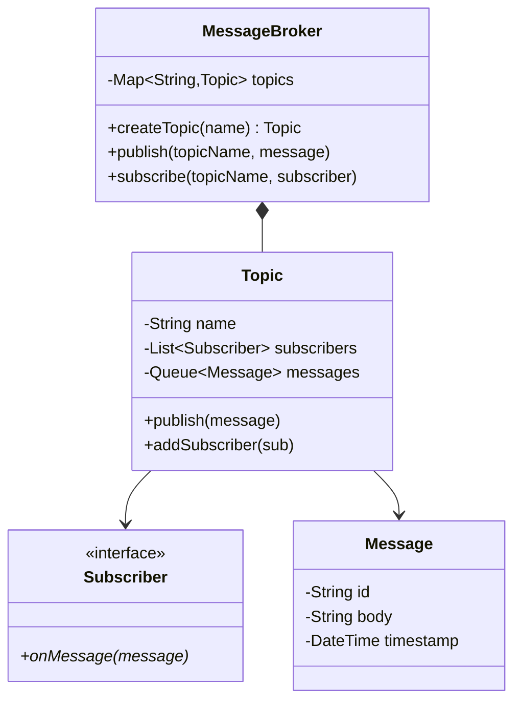
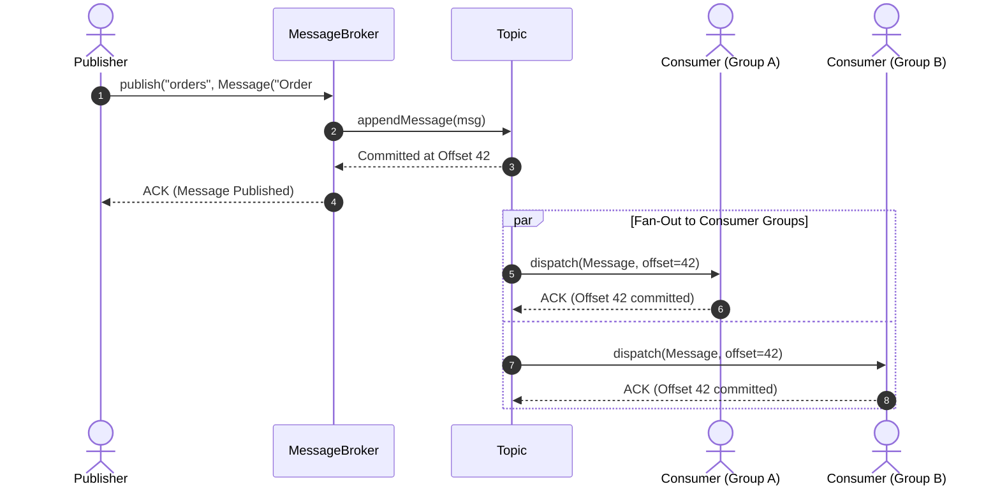

# Design a Pub-Sub Messaging System

## 1. Problem Statement
Design a publish-subscribe messaging system where publishers send messages to topics and subscribers receive them asynchronously.

## 2. Class Design



### Sequence Flow




## 3. Key Implementation (Python)

```python
from abc import ABC, abstractmethod
from typing import Dict, List
from datetime import datetime
from collections import deque
import threading, uuid

class Message:
    def __init__(self, body: str):
        self.id = str(uuid.uuid4())[:8]
        self.body = body
        self.timestamp = datetime.now()

class Subscriber(ABC):
    @abstractmethod
    def on_message(self, topic: str, message: Message): pass

class PrintSubscriber(Subscriber):
    def __init__(self, name: str):
        self.name = name
    def on_message(self, topic: str, message: Message):
        print(f"  [{self.name}] Got from '{topic}': {message.body}")

class Topic:
    def __init__(self, name: str):
        self.name = name
        self._subscribers: List[Subscriber] = []
        self._lock = threading.Lock()

    def subscribe(self, subscriber: Subscriber):
        with self._lock:
            self._subscribers.append(subscriber)

    def unsubscribe(self, subscriber: Subscriber):
        with self._lock:
            self._subscribers.remove(subscriber)

    def publish(self, message: Message):
        with self._lock:
            subs = list(self._subscribers)
        for sub in subs:
            sub.on_message(self.name, message)

class MessageBroker:
    def __init__(self):
        self._topics: Dict[str, Topic] = {}

    def create_topic(self, name: str) -> Topic:
        if name not in self._topics:
            self._topics[name] = Topic(name)
        return self._topics[name]

    def publish(self, topic_name: str, message: Message):
        topic = self._topics.get(topic_name)
        if topic:
            topic.publish(message)

    def subscribe(self, topic_name: str, subscriber: Subscriber):
        topic = self.create_topic(topic_name)
        topic.subscribe(subscriber)

if __name__ == "__main__":
    broker = MessageBroker()
    s1 = PrintSubscriber("Service-A")
    s2 = PrintSubscriber("Service-B")

    broker.subscribe("orders", s1)
    broker.subscribe("orders", s2)
    broker.subscribe("payments", s1)

    broker.publish("orders", Message("Order #123 created"))
    broker.publish("payments", Message("Payment received"))
```

### Java

```java
package com.lld.pubsub;

import java.util.*;
import java.util.concurrent.*;

class Message {
    private final String payload;
    public Message(String payload) { this.payload = payload; }
    public String getPayload() { return payload; }
}

interface Subscriber {
    void onMessage(Message message);
}

class Topic {
    private final String name;
    private final List<Subscriber> subscribers = new CopyOnWriteArrayList<>();
    private final List<Message> messageLog = new CopyOnWriteArrayList<>();

    public Topic(String name) { this.name = name; }
    public void addSubscriber(Subscriber sub) { subscribers.add(sub); }
    public void removeSubscriber(Subscriber sub) { subscribers.remove(sub); }

    public void publish(Message message) {
        messageLog.add(message);
        for (Subscriber sub : subscribers) {
            sub.onMessage(message);
        }
    }
}

public class PubSubSystem {
    private final Map<String, Topic> topics = new ConcurrentHashMap<>();

    public Topic createTopic(String name) {
        return topics.computeIfAbsent(name, Topic::new);
    }

    public void publish(String topicName, Message message) {
        Topic topic = topics.get(topicName);
        if (topic != null) topic.publish(message);
    }
}
```


## 4. Patterns: **Observer** (core pub-sub) | **Strategy** (delivery guarantees)


---

## Thread Safety Considerations

| Concern | Solution |
|---|---|
| Concurrent publication | `CopyOnWriteArrayList` in `Topic` permits message broadcast without locking readers |
| Dynamic subscription | Thread-safe subscriber registrations prevent deadlocks during fan-out loops |

## Extensibility & SOLID Principles

| Principle | Architectural Implementation |
|---|---|
| **S** — Single Responsibility | `Topic` manages subscriber registry; `Broker` manages routing; `Subscriber` handles payload processing |
| **O** — Open/Closed | New subscriber types (WebSocket, Kafka bridge, Logger) subscribe without modifying `Topic` |
| **D** — Dependency Inversion | Publisher and Topic interact through the abstract `Subscriber` interface |

---

## 5. Follow-ups
- **At-most-once vs at-least-once vs exactly-once?** Acknowledgment + dedup.
- **Message persistence?** Write-ahead log for durability.
- **Consumer groups?** Round-robin delivery among group members.
- **Backpressure?** Bounded queue with overflow strategies.

---

**Related:** [[02 - Observer Pattern]] | [[01 - Strategy Pattern]]
