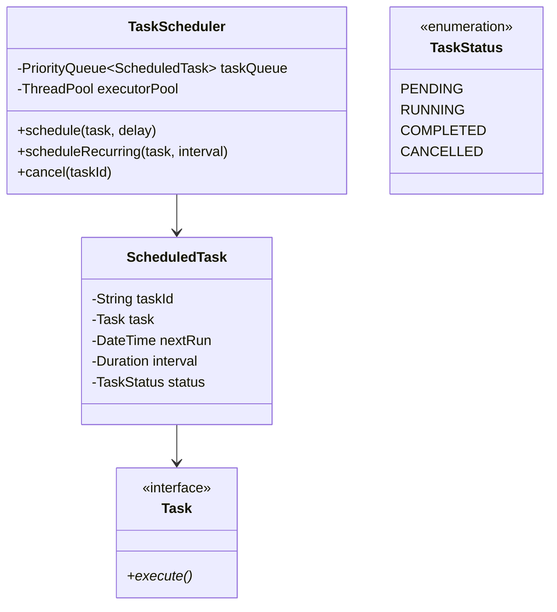

# Design a Task Scheduler

## 1. Problem Statement
Design a task scheduler that supports one-time, recurring, and delayed task execution with priority support.

## 2. Class Design



## 3. Key Implementation (Python)

```python
import heapq, threading, time, uuid
from abc import ABC, abstractmethod
from datetime import datetime, timedelta
from typing import Optional

class Task(ABC):
    @abstractmethod
    def execute(self): pass

class PrintTask(Task):
    def __init__(self, message: str):
        self.message = message
    def execute(self):
        print(f"[{datetime.now():%H:%M:%S}] Executing: {self.message}")

class ScheduledTask:
    def __init__(self, task: Task, run_at: datetime,
                 interval: Optional[timedelta] = None):
        self.task_id = str(uuid.uuid4())[:8]
        self.task = task
        self.next_run = run_at
        self.interval = interval  # None = one-time
        self.cancelled = False

    def __lt__(self, other):
        return self.next_run < other.next_run

class TaskScheduler:
    def __init__(self, max_workers: int = 4):
        self._queue = []  # min-heap by next_run
        self._lock = threading.Lock()
        self._condition = threading.Condition(self._lock)
        self._running = True
        self._worker = threading.Thread(target=self._run, daemon=True)
        self._worker.start()

    def schedule(self, task: Task, delay_seconds: float = 0) -> str:
        run_at = datetime.now() + timedelta(seconds=delay_seconds)
        st = ScheduledTask(task, run_at)
        with self._condition:
            heapq.heappush(self._queue, st)
            self._condition.notify()
        return st.task_id

    def schedule_recurring(self, task: Task, interval_seconds: float) -> str:
        run_at = datetime.now() + timedelta(seconds=interval_seconds)
        st = ScheduledTask(task, run_at, timedelta(seconds=interval_seconds))
        with self._condition:
            heapq.heappush(self._queue, st)
            self._condition.notify()
        return st.task_id

    def _run(self):
        while self._running:
            with self._condition:
                while not self._queue:
                    self._condition.wait()

                st = self._queue[0]
                now = datetime.now()
                if st.next_run > now:
                    wait = (st.next_run - now).total_seconds()
                    self._condition.wait(timeout=wait)
                    continue

                heapq.heappop(self._queue)

            if not st.cancelled:
                st.task.execute()
                if st.interval:
                    st.next_run = datetime.now() + st.interval
                    with self._condition:
                        heapq.heappush(self._queue, st)

    def shutdown(self):
        self._running = False
```

## 4. Patterns: **Command** (Task objects) | **Strategy** (scheduling policies) | **Observer** (task completion callbacks)

## 5. Follow-ups
- **Distributed?** Leader election + shared task queue (Redis/DB).
- **Cron expressions?** Parse cron syntax to compute next run time.
- **Task dependencies?** DAG-based scheduling with topological sort.

---

**Related:** [[07 - Command Pattern]] | [[01 - Strategy Pattern]]
