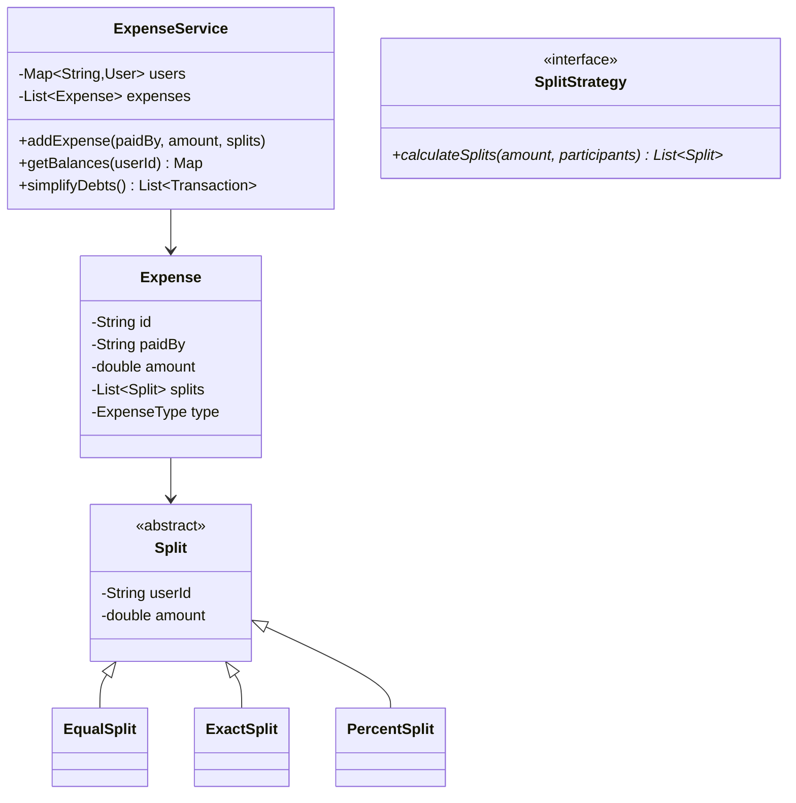

# Design Splitwise

## 1. Problem Statement
Design an expense-sharing application where users can add expenses, split them in different ways, and track who owes whom.

## 2. Class Design



## 3. Key Implementation (Python)

```python
from enum import Enum
from typing import Dict, List, Tuple
from collections import defaultdict
import heapq

class SplitType(Enum):
    EQUAL = "EQUAL"
    EXACT = "EXACT"
    PERCENT = "PERCENT"

class User:
    def __init__(self, user_id: str, name: str):
        self.user_id = user_id
        self.name = name

class Split:
    def __init__(self, user_id: str, amount: float):
        self.user_id = user_id
        self.amount = amount

class Expense:
    def __init__(self, paid_by: str, amount: float, splits: List[Split]):
        self.paid_by = paid_by
        self.amount = amount
        self.splits = splits

class ExpenseService:
    def __init__(self):
        self.users: Dict[str, User] = {}
        # balances[A][B] > 0 means B owes A
        self.balances: Dict[str, Dict[str, float]] = defaultdict(lambda: defaultdict(float))

    def add_user(self, user: User):
        self.users[user.user_id] = user

    def add_expense_equal(self, paid_by: str, amount: float, participants: List[str]):
        share = round(amount / len(participants), 2)
        splits = [Split(uid, share) for uid in participants]
        self._process_expense(paid_by, splits)

    def add_expense_exact(self, paid_by: str, splits: List[Tuple[str, float]]):
        split_objs = [Split(uid, amt) for uid, amt in splits]
        self._process_expense(paid_by, split_objs)

    def _process_expense(self, paid_by: str, splits: List[Split]):
        for split in splits:
            if split.user_id == paid_by:
                continue
            self.balances[paid_by][split.user_id] += split.amount
            self.balances[split.user_id][paid_by] -= split.amount

    def get_balances(self, user_id: str) -> List[str]:
        results = []
        for other_id, amount in self.balances[user_id].items():
            if amount > 0:
                results.append(f"{self.users[other_id].name} owes you ${amount:.2f}")
            elif amount < 0:
                results.append(f"You owe {self.users[other_id].name} ${-amount:.2f}")
        return results

    def simplify_debts(self) -> List[Tuple[str, str, float]]:
        """Minimize number of transactions using greedy approach"""
        net = defaultdict(float)
        for user, others in self.balances.items():
            for other, amount in others.items():
                net[user] += amount

        creditors = []  # (amount, user_id) — positive net
        debtors = []    # (amount, user_id) — negative net
        for user, amount in net.items():
            if amount > 0.01:
                heapq.heappush(creditors, (-amount, user))
            elif amount < -0.01:
                heapq.heappush(debtors, (amount, user))

        transactions = []
        while creditors and debtors:
            credit_amt, creditor = heapq.heappop(creditors)
            debt_amt, debtor = heapq.heappop(debtors)
            settle = min(-credit_amt, -debt_amt)
            transactions.append((debtor, creditor, settle))
            remaining_credit = -credit_amt - settle
            remaining_debt = -debt_amt - settle
            if remaining_credit > 0.01:
                heapq.heappush(creditors, (-remaining_credit, creditor))
            if remaining_debt > 0.01:
                heapq.heappush(debtors, (-remaining_debt, debtor))

        return transactions

if __name__ == "__main__":
    svc = ExpenseService()
    svc.add_user(User("A", "Alice"))
    svc.add_user(User("B", "Bob"))
    svc.add_user(User("C", "Charlie"))

    svc.add_expense_equal("A", 300, ["A", "B", "C"])  # Alice paid, split 3 ways
    svc.add_expense_equal("B", 150, ["A", "B"])        # Bob paid, split 2 ways

    for line in svc.get_balances("A"):
        print(line)

    print("\nSimplified:")
    for debtor, creditor, amt in svc.simplify_debts():
        print(f"  {svc.users[debtor].name} → {svc.users[creditor].name}: ${amt:.2f}")
```

## 4. Key Algorithm: Debt Simplification
Use **greedy approach**: compute net balance per user, then match largest creditor with largest debtor. This minimizes number of transactions.

## 5. Follow-ups
- **Groups?** Group expenses with shared balances.
- **Recurring expenses?** Subscription model with auto-split.
- **Currency conversion?** Strategy pattern for exchange rates.

---

**Related:** [[01 - Strategy Pattern]] | [[02 - Observer Pattern]]
